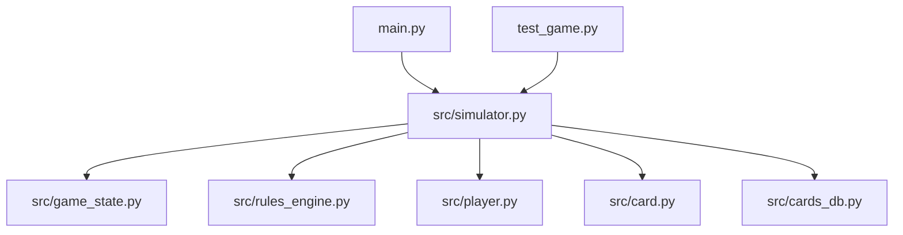
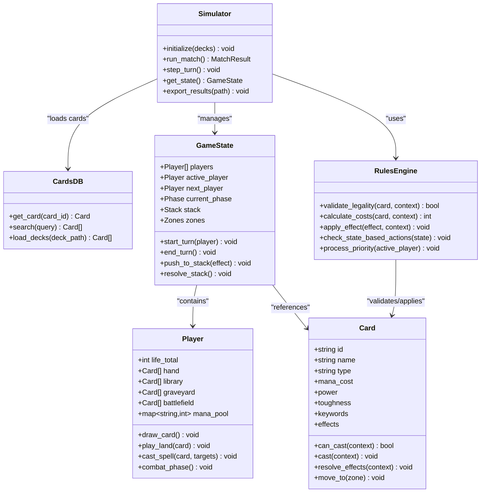
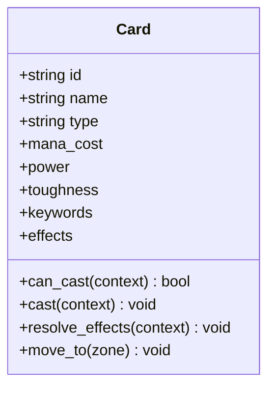
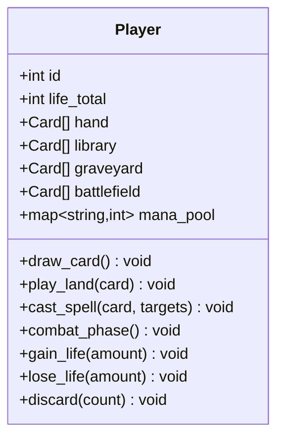
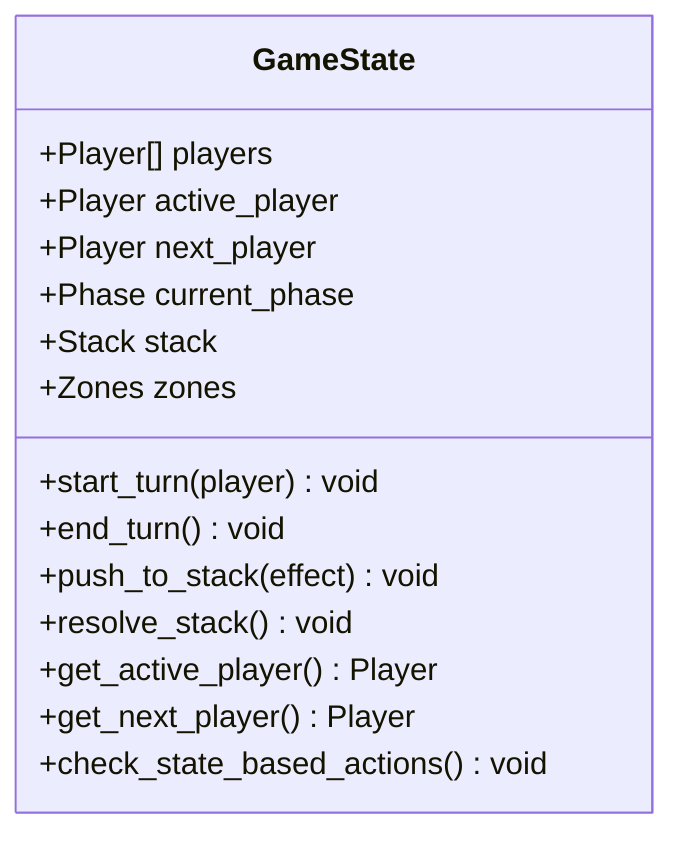
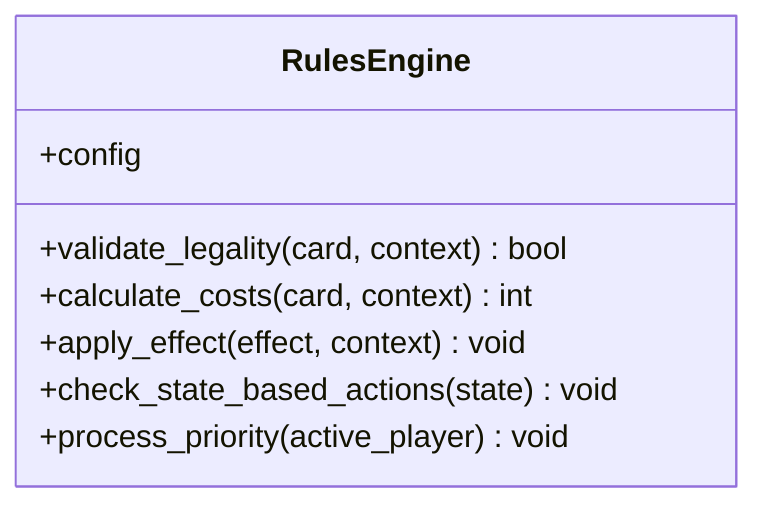
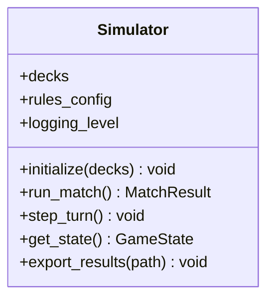
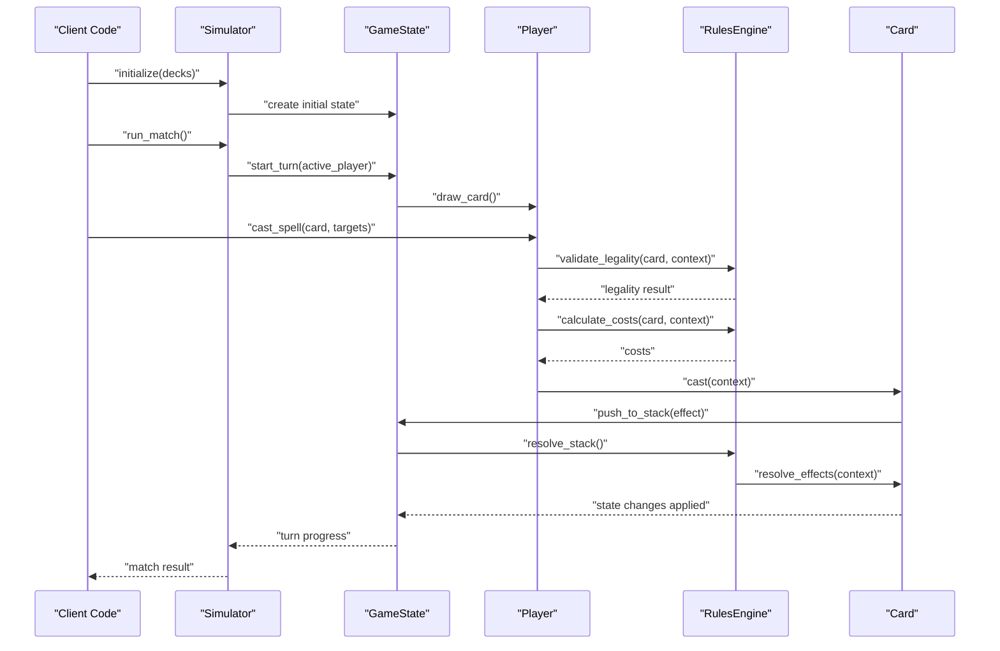
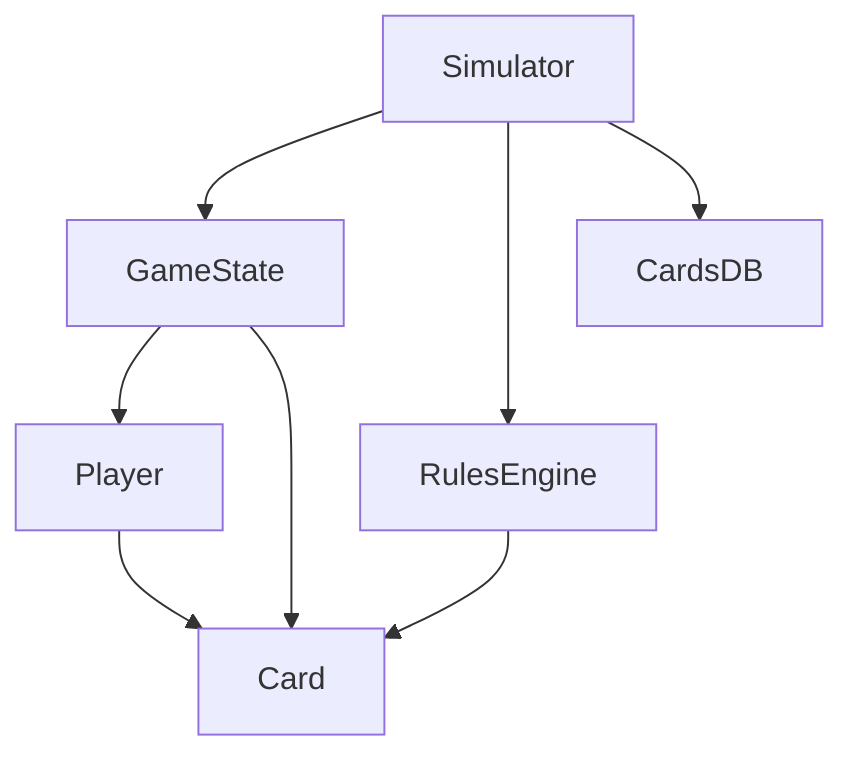

# API Reference

<cite>
**Referenced Files in This Document**
- [card.py](file://simuladorMtg/src/card.py)
- [game_state.py](file://simuladorMtg/src/game_state.py)
- [player.py](file://simuladorMtg/src/player.py)
- [rules_engine.py](file://simuladorMtg/src/rules_engine.py)
- [simulator.py](file://simuladorMtg/src/simulator.py)
- [cards_db.py](file://simuladorMtg/src/cards_db.py)
- [main.py](file://simuladorMtg/main.py)
- [test_game.py](file://simuladorMtg/test_game.py)
</cite>

## Table of Contents
1. [Introduction](#introduction)
2. [Project Structure](#project-structure)
3. [Core Components](#core-components)
4. [Architecture Overview](#architecture-overview)
5. [Detailed Component Analysis](#detailed-component-analysis)
6. [Dependency Analysis](#dependency-analysis)
7. [Performance Considerations](#performance-considerations)
8. [Troubleshooting Guide](#troubleshooting-guide)
9. [Conclusion](#conclusion)
10. [Appendices](#appendices)

## Introduction
This document provides a comprehensive API reference for the MTG Simulator, focusing on public interfaces and usage patterns for core components: Card, GameState, Player, RulesEngine, and Simulator. It explains initialization parameters, method signatures, return values, error handling, configuration options, lifecycle methods, threading considerations, performance implications, and best practices. Where applicable, it includes sequence diagrams to illustrate typical workflows and references to source files for deeper inspection.

## Project Structure
The simulator is organized into a Python package under simuladorMtg with core logic in src/. The main entry point resides at the repository root, and tests are provided to validate behavior.

**Diagram sources**
- [main.py](file://simuladorMtg/main.py)
- [simulator.py](file://simuladorMtg/src/simulator.py)
- [game_state.py](file://simuladorMtg/src/game_state.py)
- [rules_engine.py](file://simuladorMtg/src/rules_engine.py)
- [player.py](file://simuladorMtg/src/player.py)
- [card.py](file://simuladorMtg/src/card.py)
- [cards_db.py](file://simuladorMtg/src/cards_db.py)
- [test_game.py](file://simuladorMtg/test_game.py)

**Section sources**
- [main.py](file://simuladorMtg/main.py)
- [simulator.py](file://simuladorMtg/src/simulator.py)
- [test_game.py](file://simuladorMtg/test_game.py)

## Core Components
This section summarizes the primary classes and their responsibilities within the simulator.

- Card: Represents an individual Magic card with attributes such as name, mana cost, type, power/toughness, keywords, and effects. Provides methods to evaluate costs, apply effects, and manage state transitions across zones.
- Player: Models a player’s game state including life total, hand, library, graveyard, battlefield, command zone, and resources like mana pool. Supports actions like drawing cards, casting spells, playing lands, and managing combat.
- GameState: Encapsulates the global state of a match, including turn structure, phases, stack, priority, active player, and zone management. Coordinates interactions between players and enforces turn-based rules.
- RulesEngine: Implements rule enforcement, legality checks, cost resolution, effect ordering, and state transitions according to Magic rules. Interacts with GameState and Card instances to maintain consistency.
- Simulator: Orchestrates simulation runs, manages decks, initializes games, executes turns, and exposes high-level APIs for running matches and retrieving results. Integrates with CardsDB for card definitions and persists or logs outcomes.

**Section sources**
- [card.py](file://simuladorMtg/src/card.py)
- [player.py](file://simuladorMtg/src/player.py)
- [game_state.py](file://simuladorMtg/src/game_state.py)
- [rules_engine.py](file://simuladorMtg/src/rules_engine.py)
- [simulator.py](file://simuladorMtg/src/simulator.py)
- [cards_db.py](file://simuladorMtg/src/cards_db.py)

## Architecture Overview
The simulator follows a layered architecture where Simulator coordinates gameplay using GameState and RulesEngine, while Player and Card represent domain entities. CardsDB supplies static card data.

**Diagram sources**
- [cards_db.py](file://simuladorMtg/src/cards_db.py)
- [card.py](file://simuladorMtg/src/card.py)
- [player.py](file://simuladorMtg/src/player.py)
- [game_state.py](file://simuladorMtg/src/game_state.py)
- [rules_engine.py](file://simuladorMtg/src/rules_engine.py)
- [simulator.py](file://simuladorMtg/src/simulator.py)

## Detailed Component Analysis

### Card API
Card models a single Magic card and exposes capabilities for casting, effect resolution, and movement between zones.

- Initialization parameters
  - id: Unique identifier for the card definition.
  - name: Display name.
  - type: Card type (creature, instant, sorcery, land, etc.).
  - mana_cost: Numeric or symbolic cost representation.
  - power/toughness: For creatures; defaults may apply for non-creatures.
  - keywords: List of abilities (e.g., flying, trample).
  - effects: Effect descriptors tied to cast/trigger/resolution.

- Public methods
  - can_cast(context): Checks if the card can be legally cast given current GameState and Player state. Returns boolean.
  - cast(context): Initiates casting by pushing onto the stack and preparing for resolution. May raise exceptions for invalid casts.
  - resolve_effects(context): Applies effects during resolution, modifying GameState and Player states.
  - move_to(zone): Transitions the card to a new zone (hand, battlefield, graveyard, exile, etc.), updating ownership and counters.

- Parameters and return values
  - context: GameState snapshot including active player, stack, and zones.
  - Return values: Boolean for legality checks; void for mutations; exceptions for illegal operations.

- Error handling
  - Raises exceptions when casting without sufficient mana, targeting invalid objects, or violating timing restrictions.
  - Validates keyword interactions and effect orderings before applying changes.

- Usage example pattern
  - Validate legality via can_cast, then cast and resolve effects through GameState stack resolution.

**Section sources**
- [card.py](file://simuladorMtg/src/card.py)

#### Class Diagram for Card

**Diagram sources**
- [card.py](file://simuladorMtg/src/card.py)

### Player API
Player encapsulates a participant’s resources and actions.

- Initialization parameters
  - id: Unique player identifier.
  - starting_life: Initial life total.
  - deck_list: Ordered list of cards representing the deck/library.
  - sideboard: Optional additional cards for sideboarding.

- Public methods
  - draw_card(): Draws one card from library to hand; handles empty library conditions.
  - play_land(card): Places a land onto the battlefield; updates mana pool availability.
  - cast_spell(card, targets): Casts a spell by paying costs and pushing onto the stack; validates targets.
  - combat_phase(): Executes combat steps for creatures controlled by this player.
  - gain_life(amount), lose_life(amount): Adjusts life totals and triggers death conditions.
  - discard(count): Moves cards from hand to graveyard.

- Parameters and return values
  - card: Card instance to be played or cast.
  - targets: List of valid targets for spells/abilities.
  - amount: Integer for life adjustments.
  - Returns: None for mutations; raises exceptions for invalid operations.

- Error handling
  - Exceptions raised for insufficient resources, invalid targets, or out-of-turn actions.
  - Guards against negative life totals and library emptiness.

- Usage example pattern
  - Draw cards, play lands, pay costs, cast spells with appropriate targets, and resolve through the stack.

**Section sources**
- [player.py](file://simuladorMtg/src/player.py)

#### Class Diagram for Player

**Diagram sources**
- [player.py](file://simuladorMtg/src/player.py)

### GameState API
GameState represents the overall match state and orchestrates turn flow and stack resolution.

- Initialization parameters
  - players: List of Player instances.
  - starting_phase: Initial phase (e.g., beginning, main, combat).
  - stack: Initial stack container for effects/spells.
  - zones: Mapping of zones to lists of cards.

- Public methods
  - start_turn(player): Begins a new turn for the specified player; resets phases and priorities.
  - end_turn(): Completes the current turn and passes priority to the next player.
  - push_to_stack(effect): Adds an effect or spell to the stack for later resolution.
  - resolve_stack(): Pops and resolves topmost effect, invoking RulesEngine validations.
  - get_active_player(): Returns the current active player.
  - get_next_player(): Returns the next player in turn order.
  - check_state_based_actions(): Enforces global state rules (e.g., lethal damage, empty libraries).

- Parameters and return values
  - effect: Effect object or descriptor to be resolved.
  - player: Player instance for turn initiation.
  - Returns: None for mutations; may raise exceptions for illegal transitions.

- Error handling
  - Validates turn order, phase legality, and stack integrity.
  - Ensures state-based actions do not leave the game in inconsistent states.

- Usage example pattern
  - Initialize GameState with players and zones, start turns, push spells/effects to stack, and resolve them in order.

**Section sources**
- [game_state.py](file://simuladorMtg/src/game_state.py)

#### Class Diagram for GameState

**Diagram sources**
- [game_state.py](file://simuladorMtg/src/game_state.py)

### RulesEngine API
RulesEngine enforces Magic rules, calculates costs, and applies effects consistently.

- Initialization parameters
  - config: Configuration dict for rule strictness, timing windows, and interaction preferences.

- Public methods
  - validate_legality(card, context): Checks if a card can be cast or ability activated given context.
  - calculate_costs(card, context): Computes required mana and other costs.
  - apply_effect(effect, context): Applies effect changes to GameState and Player states.
  - check_state_based_actions(state): Evaluates global state rules and triggers necessary actions.
  - process_priority(active_player): Manages priority passing and action windows.

- Parameters and return values
  - card: Card instance being evaluated.
  - context: GameState snapshot including active player and zones.
  - effect: Effect descriptor to apply.
  - Returns: Boolean for legality; integer for costs; void for application; may raise exceptions.

- Error handling
  - Raises exceptions for illegal moves, missing resources, or invalid targets.
  - Ensures deterministic ordering of effects and consistent state transitions.

- Usage example pattern
  - Use validate_legality before casting; calculate_costs to ensure affordability; apply_effect after successful resolution.

**Section sources**
- [rules_engine.py](file://simuladorMtg/src/rules_engine.py)

#### Class Diagram for RulesEngine

**Diagram sources**
- [rules_engine.py](file://simuladorMtg/src/rules_engine.py)

### Simulator API
Simulator orchestrates match execution, deck loading, and result export.

- Initialization parameters
  - decks: List of deck definitions or paths to load card sets.
  - rules_config: Configuration for RulesEngine behavior.
  - logging_level: Verbosity for simulation logs.

- Public methods
  - initialize(decks): Loads decks, constructs Players, and prepares initial GameState.
  - run_match(): Executes full match until termination condition; returns MatchResult.
  - step_turn(): Advances one turn step-by-step for debugging or incremental runs.
  - get_state(): Returns current GameState snapshot.
  - export_results(path): Saves match outcome and logs to file.

- Parameters and return values
  - decks: Deck specifications or file paths.
  - path: Output file path for results.
  - Returns: MatchResult object containing winner, turns, and key events.

- Error handling
  - Validates deck composition and card availability.
  - Handles unexpected errors during simulation and logs detailed diagnostics.

- Usage example pattern
  - Initialize with decks, run_match(), retrieve state snapshots, and export results for analysis.

**Section sources**
- [simulator.py](file://simuladorMtg/src/simulator.py)

#### Class Diagram for Simulator

**Diagram sources**
- [simulator.py](file://simuladorMtg/src/simulator.py)

### Sequence Diagram: Casting a Spell
This sequence illustrates the typical flow when a Player casts a spell through the Simulator and RulesEngine.

**Diagram sources**
- [simulator.py](file://simuladorMtg/src/simulator.py)
- [game_state.py](file://simuladorMtg/src/game_state.py)
- [player.py](file://simuladorMtg/src/player.py)
- [rules_engine.py](file://simuladorMtg/src/rules_engine.py)
- [card.py](file://simuladorMtg/src/card.py)

## Dependency Analysis
The following diagram shows how components depend on each other and external data sources.

**Diagram sources**
- [simulator.py](file://simuladorMtg/src/simulator.py)
- [game_state.py](file://simuladorMtg/src/game_state.py)
- [player.py](file://simuladorMtg/src/player.py)
- [rules_engine.py](file://simuladorMtg/src/rules_engine.py)
- [card.py](file://simuladorMtg/src/card.py)
- [cards_db.py](file://simuladorMtg/src/cards_db.py)

**Section sources**
- [simulator.py](file://simuladorMtg/src/simulator.py)
- [game_state.py](file://simuladorMtg/src/game_state.py)
- [player.py](file://simuladorMtg/src/player.py)
- [rules_engine.py](file://simuladorMtg/src/rules_engine.py)
- [card.py](file://simuladorMtg/src/card.py)
- [cards_db.py](file://simuladorMtg/src/cards_db.py)

## Performance Considerations
- Stack resolution efficiency: Minimize deep copies of GameState snapshots; pass references where safe to reduce memory overhead.
- Cost calculation caching: Cache computed costs for frequently cast cards within a turn to avoid redundant calculations.
- Effect batching: Group multiple small effects into batched updates to reduce state churn.
- Threading: Avoid concurrent modifications to GameState and Player states; use locks if running parallel simulations.
- I/O optimization: Batch exports and log writes; avoid frequent disk access during hot loops.

[No sources needed since this section provides general guidance]

## Troubleshooting Guide
Common issues and strategies:

- Illegal cast exceptions
  - Cause: Insufficient mana, invalid targets, or wrong timing window.
  - Resolution: Verify RulesEngine.validate_legality and calculate_costs before casting.

- State inconsistency
  - Cause: Effects applied out of order or missing state-based actions.
  - Resolution: Ensure GameState.resolve_stack calls RulesEngine.check_state_based_actions after each resolution.

- Empty library or graveyard errors
  - Cause: Drawing from empty library or discarding beyond hand size.
  - Resolution: Guard operations with checks and handle exceptions gracefully.

- Simulation hangs
  - Cause: Infinite loops in effect resolution or priority processing.
  - Resolution: Add step limits and debug logs; inspect RulesEngine.process_priority.

**Section sources**
- [rules_engine.py](file://simuladorMtg/src/rules_engine.py)
- [game_state.py](file://simuladorMtg/src/game_state.py)
- [player.py](file://simuladorMtg/src/player.py)
- [card.py](file://simuladorMtg/src/card.py)

## Conclusion
The MTG Simulator provides a robust set of APIs for modeling Magic: The Gathering gameplay. By adhering to the documented interfaces, validating legality and costs, and following best practices for state management and performance, developers can build reliable simulations and integrations. Use the provided sequences and diagrams to guide implementation and troubleshooting.

[No sources needed since this section summarizes without analyzing specific files]

## Appendices

### Configuration Options
- RulesEngine config
  - strict_timing: Enforce strict timing windows for spells and abilities.
  - effect_ordering: Deterministic ordering strategy for simultaneous effects.
  - logging_verbosity: Level of detail for internal logs.

- Simulator config
  - max_turns: Upper bound for match length to prevent infinite runs.
  - output_format: Preferred format for exported results (JSON, CSV).
  - seed: Random seed for deterministic shuffling and draws.

**Section sources**
- [rules_engine.py](file://simuladorMtg/src/rules_engine.py)
- [simulator.py](file://simuladorMtg/src/simulator.py)

### Usage Examples
- Basic match run
  - Initialize Simulator with decks, call run_match(), and capture MatchResult.

- Incremental stepping
  - Use step_turn() to advance one turn at a time for debugging or UI-driven play.

- Custom effect application
  - Create effect descriptors and push them via GameState.push_to_stack(); ensure RulesEngine.apply_effect handles them correctly.

**Section sources**
- [simulator.py](file://simuladorMtg/src/simulator.py)
- [game_state.py](file://simuladorMtg/src/game_state.py)
- [rules_engine.py](file://simuladorMtg/src/rules_engine.py)