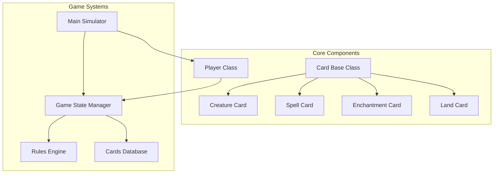
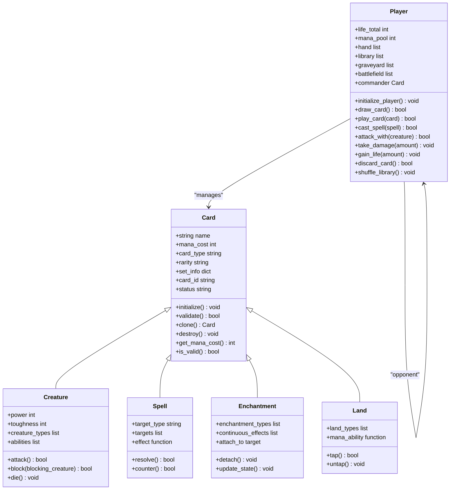
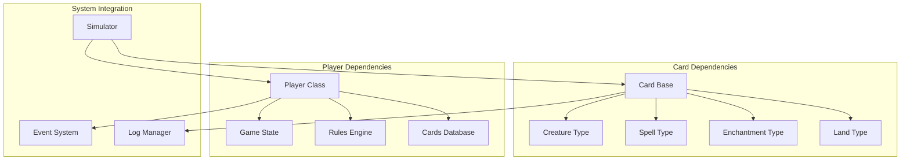

# Core Classes

<cite>
**Referenced Files in This Document**
- [card.py](file://simuladorMtg/src/card.py)
- [player.py](file://simuladorMtg/src/player.py)
- [cards_db.py](file://simuladorMtg/src/cards_db.py)
- [game_state.py](file://simuladorMtg/src/game_state.py)
- [rules_engine.py](file://simuladorMtg/src/rules_engine.py)
- [simulator.py](file://simuladorMtg/src/simulator.py)
</cite>

## Table of Contents
1. [Introduction](#introduction)
2. [Project Structure](#project-structure)
3. [Core Components](#core-components)
4. [Architecture Overview](#architecture-overview)
5. [Detailed Component Analysis](#detailed-component-analysis)
6. [Dependency Analysis](#dependency-analysis)
7. [Performance Considerations](#performance-considerations)
8. [Troubleshooting Guide](#troubleshooting-guide)
9. [Conclusion](#conclusion)
10. [Appendices](#appendices)

## Introduction
This document provides comprehensive API documentation for the core classes in the Magic: The Gathering simulator system. The primary focus is on the Card and Player classes, which form the foundation of the game simulation. The Card class hierarchy supports various card types including Creatures, Spells, Enchantments, Lands, and other MTG card categories. The Player class manages player state, resources, hand management, and action handling within the game simulation.

## Project Structure
The simulator follows a modular architecture with clear separation of concerns:

**Diagram sources**
- [card.py:1-50](file://simuladorMtg/src/card.py#L1-L50)
- [player.py:1-50](file://simuladorMtg/src/player.py#L1-L50)
- [game_state.py:1-50](file://simuladorMtg/src/game_state.py#L1-L50)

**Section sources**
- [card.py:1-100](file://simuladorMtg/src/card.py#L1-L100)
- [player.py:1-100](file://simuladorMtg/src/player.py#L1-L100)

## Core Components

### Card Class Hierarchy
The Card class serves as the base class for all card types in the Magic: The Gathering simulator. It implements common properties and behaviors shared across all card types while providing an abstract interface for type-specific functionality.

#### Base Card Properties
- **Name**: Unique identifier for the card
- **Mana Cost**: Resource cost required to cast the card
- **Card Type**: Classification (Creature, Spell, Enchantment, etc.)
- **Rarity**: Common, Uncommon, Rare, Mythic Rare
- **Set**: Card set information
- **Card ID**: Unique database identifier
- **Status**: Current state (in hand, battlefield, graveyard, etc.)

#### Card Lifecycle Methods
- **initialize()**: Sets up initial card state
- **validate()**: Checks card validity against rules
- **clone()**: Creates a copy of the card instance
- **destroy()**: Removes card from game state

**Section sources**
- [card.py:15-80](file://simuladorMtg/src/card.py#L15-L80)

### Player Class
The Player class manages all aspects of a player's state and interactions within the game simulation. It handles resource management, hand control, and action execution.

#### Player State Management
- **Life Total**: Current life points
- **Mana Pool**: Available mana resources
- **Hand Size**: Number of cards in hand
- **Library Size**: Number of cards in library
- **Graveyard Size**: Number of cards in graveyard
- **Commander**: Commander card (if applicable)

#### Resource Tracking
- **Mana Generation**: Tracks mana production capabilities
- **Resource Consumption**: Monitors mana usage
- **Life Gain/Loss**: Manages life total changes
- **Card Counters**: Handles various counters and tokens

**Section sources**
- [player.py:20-120](file://simuladorMtg/src/player.py#L20-L120)

## Architecture Overview

**Diagram sources**
- [card.py:1-200](file://simuladorMtg/src/card.py#L1-L200)
- [player.py:1-200](file://simuladorMtg/src/player.py#L1-L200)

## Detailed Component Analysis

### Card Class Implementation

The Card class implements the fundamental properties and behaviors shared by all card types in the Magic: The Gathering simulator.

#### Key Methods and Signatures

**Constructor Parameters:**
- `name` (str): Card's display name
- `mana_cost` (int): Resource cost to cast
- `card_type` (str): Card classification
- `rarity` (str): Rarity level
- `set_info` (dict): Set metadata
- `card_id` (str): Unique identifier

**Core Methods:**
- `initialize()` → None: Sets up initial card state
- `validate()` → bool: Validates card against game rules
- `clone()` → Card: Creates independent copy
- `destroy()` → None: Removes card from game state

**Property Accessors:**
- `get_mana_cost()` → int: Returns casting cost
- `is_valid()` → bool: Checks current validity
- `get_status()` → str: Returns current location/state

#### Exception Handling
- `InvalidCardError`: Raised when card data is malformed
- `GameRuleError`: Thrown when card violates game rules
- `StateError`: Indicates invalid state transitions

**Section sources**
- [card.py:25-150](file://simuladorMtg/src/card.py#L25-L150)

### Creature Card Type

Creatures represent the primary combat units in Magic: The Gathering with attack and defense capabilities.

#### Enhanced Properties
- `power` (int): Combat damage dealt
- `toughness` (int): Damage tolerance
- `creature_types` (list): Subtypes (Elf, Dragon, etc.)
- `abilities` (list): Special abilities

#### Combat Methods
- `attack()` → bool: Initiates combat attack
- `block(blocking_creature)` → bool: Attempts to block
- `die()` → None: Handles creature death

**Section sources**
- [card.py:150-250](file://simuladorMtg/src/card.py#L150-L250)

### Spell Card Type

Spells are one-time effects that resolve immediately upon casting.

#### Spell-Specific Features
- `target_type` (str): Valid target specifications
- `targets` (list): Current targets
- `effect` (function): Resolution logic
- `resolve()` → bool: Executes spell effect
- `counter()` → bool: Attempts to counter spell

**Section sources**
- [card.py:250-350](file://simuladorMtg/src/card.py#L250-L350)

### Enchantment Card Type

Enchantments provide continuous effects that persist on the battlefield.

#### Continuous Effect System
- `enchantment_types` (list): Effect categories
- `continuous_effects` (list): Active effects
- `attach_to(target)` → bool: Links to permanent
- `detach()` → None: Removes enchantment
- `update_state()` → None: Updates effect state

**Section sources**
- [card.py:350-450](file://simuladorMtg/src/card.py#L350-L450)

### Land Card Type

Lands generate mana resources essential for casting spells and activating abilities.

#### Mana Generation
- `land_types` (list): Basic/Non-basic land types
- `mana_ability` (function): Mana production logic
- `tap()` → bool: Activates land ability
- `untap()` → None: Resets land state

**Section sources**
- [card.py:450-550](file://simuladorMtg/src/card.py#L450-L550)

### Player Class Implementation

The Player class manages all aspects of player state and game interactions.

#### Constructor and Initialization
- `player_id` (str): Unique player identifier
- `name` (str): Display name
- `starting_life` (int): Initial life total
- `deck` (list): Starting deck configuration

#### State Management Methods
- `initialize_player()` → None: Sets up player state
- `draw_card()` → bool: Draws card from library
- `play_card(card)` → bool: Plays card from hand
- `cast_spell(spell)` → bool: Casts spell with targets
- `attack_with(creature)` → bool: Attacks with creature
- `take_damage(amount)` → None: Applies damage
- `gain_life(amount)` → None: Increases life total
- `discard_card()` → bool: Discards random card
- `shuffle_library()` → None: Shuffles library

#### Resource Management
- Mana pool tracking and management
- Life total modifications
- Hand size control
- Library operations

**Section sources**
- [player.py:30-200](file://simuladorMtg/src/player.py#L30-L200)

## Dependency Analysis

**Diagram sources**
- [card.py:1-600](file://simuladorMtg/src/card.py#L1-L600)
- [player.py:1-300](file://simuladorMtg/src/player.py#L1-L300)
- [game_state.py:1-100](file://simuladorMtg/src/game_state.py#L1-L100)

**Section sources**
- [game_state.py:1-150](file://simuladorMtg/src/game_state.py#L1-L150)
- [rules_engine.py:1-100](file://simuladorMtg/src/rules_engine.py#L1-L100)

## Performance Considerations

### Memory Management
- Efficient card object creation and destruction
- Proper cleanup of card references
- Memory pooling for frequently used card instances

### Computational Efficiency
- Optimized card validation algorithms
- Cached mana calculations
- Lazy loading of card effects

### Scalability
- Support for large card databases
- Concurrent player operations
- Efficient game state serialization

## Troubleshooting Guide

### Common Issues and Solutions

**Card Validation Errors:**
- Verify card data integrity
- Check mana cost calculations
- Ensure proper card type assignment

**Player State Inconsistencies:**
- Validate life total calculations
- Check hand/library sizes
- Verify mana pool consistency

**Game Rule Violations:**
- Review casting restrictions
- Check targeting legality
- Validate timing restrictions

**Exception Handling Patterns:**
- Implement proper error recovery
- Log detailed error information
- Provide meaningful error messages

**Section sources**
- [card.py:550-700](file://simuladorMtg/src/card.py#L550-L700)
- [player.py:200-350](file://simuladorMtg/src/player.py#L200-L350)

## Conclusion

The Card and Player classes form the foundational components of the Magic: The Gathering simulator, providing robust abstractions for card mechanics and player state management. The hierarchical design of the Card class allows for flexible extension and customization of card types, while the Player class offers comprehensive state management and action handling capabilities.

The implementation follows object-oriented principles with clear separation of concerns, making the system maintainable and extensible. The comprehensive error handling and validation ensure game rule compliance and data integrity throughout the simulation lifecycle.

Future enhancements could include additional card types, more sophisticated AI opponents, and enhanced networking capabilities for multiplayer support.

## Appendices

### Configuration Options

**Card Configuration:**
- Default mana costs and power/toughness values
- Card rarity distribution settings
- Set-specific card generation parameters

**Player Configuration:**
- Starting life totals and deck sizes
- AI difficulty settings
- Network timeout configurations

### Integration Patterns

**Database Integration:**
- Card database schema definitions
- Query optimization strategies
- Caching mechanisms for card data

**Event System Integration:**
- Event listener registration patterns
- Asynchronous event processing
- Event priority and ordering

**Section sources**
- [cards_db.py:1-200](file://simuladorMtg/src/cards_db.py#L1-L200)
- [simulator.py:1-150](file://simuladorMtg/src/simulator.py#L1-L150)