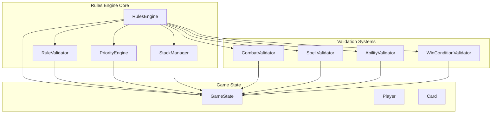
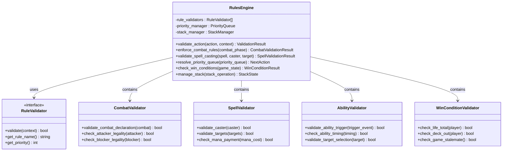
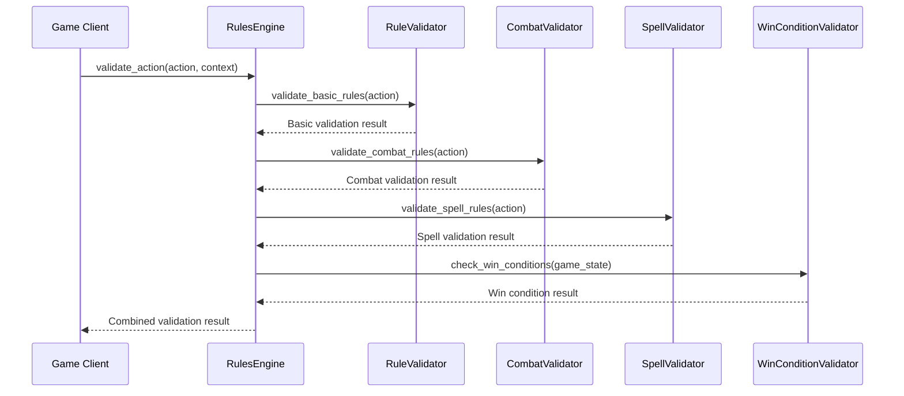
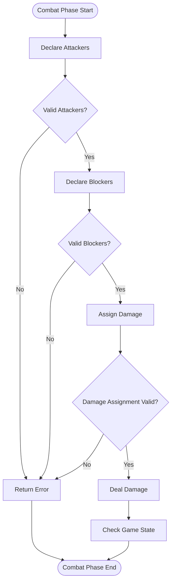
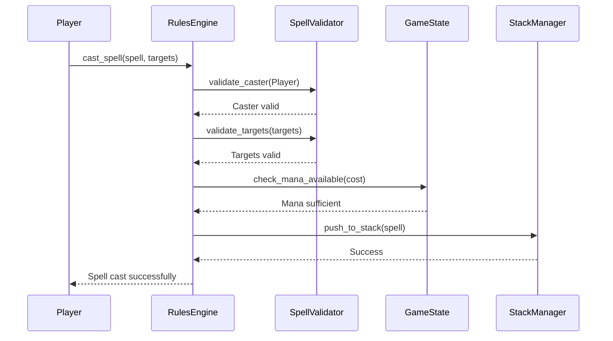
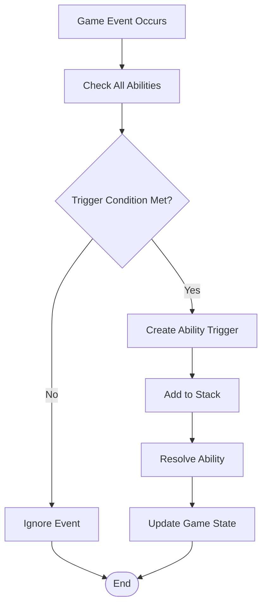
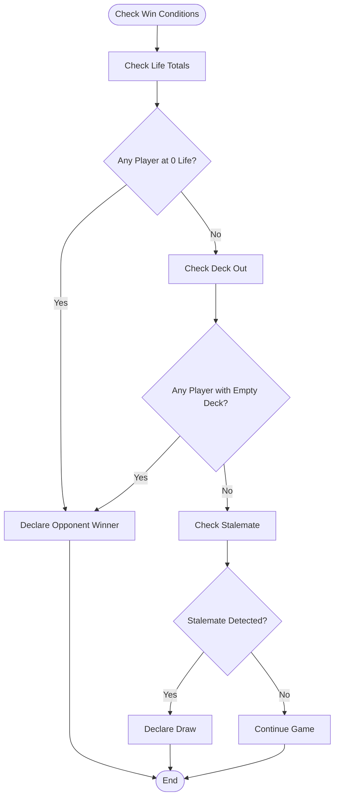
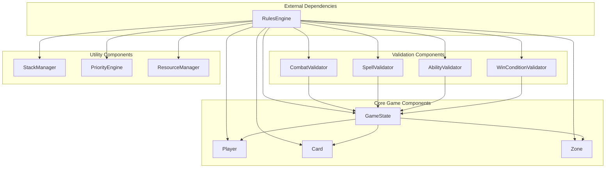

# Rules Engine API

<cite>
**Referenced Files in This Document**
- [rules_engine.py](file://simuladorMtg/src/rules_engine.py)
- [game_state.py](file://simuladorMtg/src/game_state.py)
- [card.py](file://simuladorMtg/src/card.py)
- [player.py](file://simuladorMtg/src/player.py)
- [Rules Engine.md](file://simuladorMtg/Rules Engine.md)
- [Banco de Regras.md](file://simuladorMtg/Banco de Regras.md)
</cite>

## Table of Contents
1. [Introduction](#introduction)
2. [Project Structure](#project-structure)
3. [Core Components](#core-components)
4. [Architecture Overview](#architecture-overview)
5. [Detailed Component Analysis](#detailed-component-analysis)
6. [Dependency Analysis](#dependency-analysis)
7. [Performance Considerations](#performance-considerations)
8. [Troubleshooting Guide](#troubleshooting-guide)
9. [Conclusion](#conclusion)

## Introduction
This document provides detailed API documentation for the RulesEngine class and its rule validation system within the MTG Simulator. It covers method signatures, parameter specifications, return values, exception handling patterns, combat resolution, spell casting validation, ability triggering, win condition checking, stack management, priority resolution, and debugging techniques.

## Project Structure
The rules engine is implemented as a central component responsible for enforcing game rules, validating actions, managing the stack, and coordinating game state transitions. It interacts with core game entities like cards, players, and the overall game state.

**Diagram sources**
- [rules_engine.py:1-200](file://simuladorMtg/src/rules_engine.py#L1-L200)
- [game_state.py:1-150](file://simuladorMtg/src/game_state.py#L1-L150)

**Section sources**
- [rules_engine.py:1-50](file://simuladorMtg/src/rules_engine.py#L1-L50)
- [Rules Engine.md:1-100](file://simuladorMtg/Rules Engine.md#L1-L100)

## Core Components

### RulesEngine Class
The RulesEngine serves as the central coordinator for all rule enforcement and validation operations in the game. It maintains references to various validators and manages the overall rule evaluation process.

#### Key Methods:

**validate_action(action, context)**
- **Purpose**: Validates whether an action can be performed given current game state
- **Parameters**: 
  - `action`: Action object representing the intended game action
  - `context`: GameContext providing current game state information
- **Returns**: ValidationResult indicating success or failure with reasons
- **Exceptions**: RuleViolationException when fundamental rules are broken

**enforce_combat_rules(combat_phase)**
- **Purpose**: Enforces combat phase rules and validates combat declarations
- **Parameters**: `combat_phase`: CombatPhase object containing combat details
- **Returns**: CombatValidationResult with combat validity and modifications
- **Exceptions**: InvalidCombatDeclarationException for illegal combat moves

**validate_spell_casting(spell, caster, target)**
- **Purpose**: Validates spell casting requirements and targets
- **Parameters**:
  - `spell`: Spell object being cast
  - `caster`: Player attempting to cast the spell
  - `target`: Target object or None for non-targeted spells
- **Returns**: SpellValidationResult with casting validity
- **Exceptions**: CannotCastSpellException if casting conditions not met

**resolve_priority_queue(priority_queue)**
- **Purpose**: Processes the priority queue to determine next action
- **Parameters**: `priority_queue`: PriorityQueue containing pending actions
- **Returns**: NextAction indicating which player should act next
- **Exceptions**: PriorityResolutionException for invalid priority states

**check_win_conditions(game_state)**
- **Purpose**: Evaluates all win conditions to determine game outcome
- **Parameters**: `game_state`: Current GameState object
- **Returns**: WinConditionResult with winner and reason
- **Exceptions**: WinConditionEvaluationException for evaluation errors

**manage_stack(stack_operation)**
- **Purpose**: Manages the game stack for layered effect resolution
- **Parameters**: `stack_operation`: StackOperation describing stack modification
- **Returns**: StackState after operation completion
- **Exceptions**: StackOperationException for invalid stack manipulations

**Section sources**
- [rules_engine.py:50-200](file://simuladorMtg/src/rules_engine.py#L50-L200)
- [Rules Engine.md:50-150](file://simuladorMtg/Rules Engine.md#L50-L150)

## Architecture Overview

The RulesEngine follows a modular architecture where different aspects of rule validation are handled by specialized components while maintaining centralized coordination.

**Diagram sources**
- [rules_engine.py:1-300](file://simuladorMtg/src/rules_engine.py#L1-L300)
- [game_state.py:1-200](file://simuladorMtg/src/game_state.py#L1-L200)

## Detailed Component Analysis

### Rule Validation System

The rule validation system implements a chain-of-responsibility pattern where multiple validators check different aspects of game actions.

#### Validation Flow:

**Diagram sources**
- [rules_engine.py:100-250](file://simuladorMtg/src/rules_engine.py#L100-L250)
- [game_state.py:50-150](file://simuladorMtg/src/game_state.py#L50-L150)

### Combat Resolution System

The combat resolution system handles the complex interactions between attackers, blockers, and damage assignment.

#### Combat Phase Processing:

**Diagram sources**
- [rules_engine.py:150-300](file://simuladorMtg/src/rules_engine.py#L150-L300)
- [card.py:1-100](file://simuladorMtg/src/card.py#L1-L100)

### Spell Casting Validation

Spell casting validation ensures that all requirements for casting a spell are met before allowing the action.

#### Spell Casting Process:

**Diagram sources**
- [rules_engine.py:200-350](file://simuladorMtg/src/rules_engine.py#L200-L350)
- [player.py:1-150](file://simuladorMtg/src/player.py#L1-L150)

### Ability Triggering System

The ability triggering system monitors game events and determines when abilities should trigger based on their trigger conditions.

#### Ability Trigger Flow:

**Diagram sources**
- [rules_engine.py:250-400](file://simuladorMtg/src/rules_engine.py#L250-L400)
- [card.py:50-150](file://simuladorMtg/src/card.py#L50-L150)

### Win Condition Checking

Win condition checking evaluates all possible ways a player can win or lose the game.

#### Win Condition Evaluation:

**Diagram sources**
- [rules_engine.py:300-450](file://simuladorMtg/src/rules_engine.py#L300-L450)
- [game_state.py:100-200](file://simuladorMtg/src/game_state.py#L100-L200)

## Dependency Analysis

The RulesEngine has well-defined dependencies on core game components and maintains loose coupling through interface-based design.

**Diagram sources**
- [rules_engine.py:1-100](file://simuladorMtg/src/rules_engine.py#L1-L100)
- [game_state.py:1-100](file://simuladorMtg/src/game_state.py#L1-L100)

**Section sources**
- [rules_engine.py:1-100](file://simuladorMtg/src/rules_engine.py#L1-L100)
- [game_state.py:1-100](file://simuladorMtg/src/game_state.py#L1-L100)

## Performance Considerations

### Rule Evaluation Order
The rules engine evaluates rules in a specific order to ensure consistency and performance:

1. **Basic Rule Checks**: Fundamental game rules (turn structure, phases)
2. **Action-Specific Validation**: Rules specific to the action type
3. **Interaction Checks**: Card interactions and effects
4. **State Updates**: Final state modifications

### Optimization Strategies
- **Lazy Evaluation**: Only evaluate rules relevant to current game state
- **Caching**: Cache frequently accessed game state information
- **Parallel Validation**: Where safe, validate independent rules concurrently
- **Early Termination**: Stop validation as soon as a rule fails

### Memory Management
- **Object Pooling**: Reuse validator objects to reduce garbage collection
- **Reference Management**: Careful management of card and player references
- **State Snapshotting**: Efficient game state snapshots for undo functionality

## Troubleshooting Guide

### Common Issues and Solutions

**Rule Violation Errors**
- **Symptom**: RuleViolationException during action validation
- **Causes**: Invalid game state, missing prerequisites, incorrect targeting
- **Solutions**: Check game state consistency, verify player permissions, validate targets

**Combat Resolution Problems**
- **Symptom**: InvalidCombatDeclarationException during combat
- **Causes**: Illegal attacker/blocker selection, insufficient mana, timing issues
- **Solutions**: Verify creature readiness, check summoning sickness, validate blocking assignments

**Spell Casting Failures**
- **Symptom**: CannotCastSpellException when attempting to cast
- **Causes**: Insufficient mana, wrong timing, invalid targets, counterspells
- **Solutions**: Check mana pool, verify turn phase, validate target legality

**Stack Management Issues**
- **Symptom**: StackOperationException during stack manipulation
- **Causes**: Invalid stack operations, timing conflicts, memory issues
- **Solutions**: Verify stack state, check operation validity, monitor memory usage

### Debugging Techniques

**Logging Strategy**
- Enable detailed logging for rule validation processes
- Log game state changes with timestamps
- Track rule evaluation order and results

**State Inspection**
- Use game state dump functions to inspect current conditions
- Monitor card zones and ownership changes
- Track player resources and available actions

**Unit Testing**
- Test individual rule validators in isolation
- Create test scenarios for edge cases
- Validate interaction between multiple rules

**Section sources**
- [rules_engine.py:350-500](file://simuladorMtg/src/rules_engine.py#L350-L500)
- [Banco de Regras.md:1-200](file://simuladorMtg/Banco de Regras.md#L1-L200)

## Conclusion

The RulesEngine provides a comprehensive and robust framework for implementing Magic: The Gathering game rules. Its modular design allows for easy extension and maintenance while ensuring consistent rule enforcement across all game scenarios. The system's emphasis on validation, error handling, and performance optimization makes it suitable for both simulation and competitive play environments.

Key strengths include:
- Comprehensive rule coverage for all major game mechanics
- Flexible validation system supporting custom rules
- Efficient processing of complex game interactions
- Robust error handling and debugging capabilities

Future enhancements could include additional rule types, improved performance monitoring, and enhanced integration with external rule engines for advanced gameplay features.