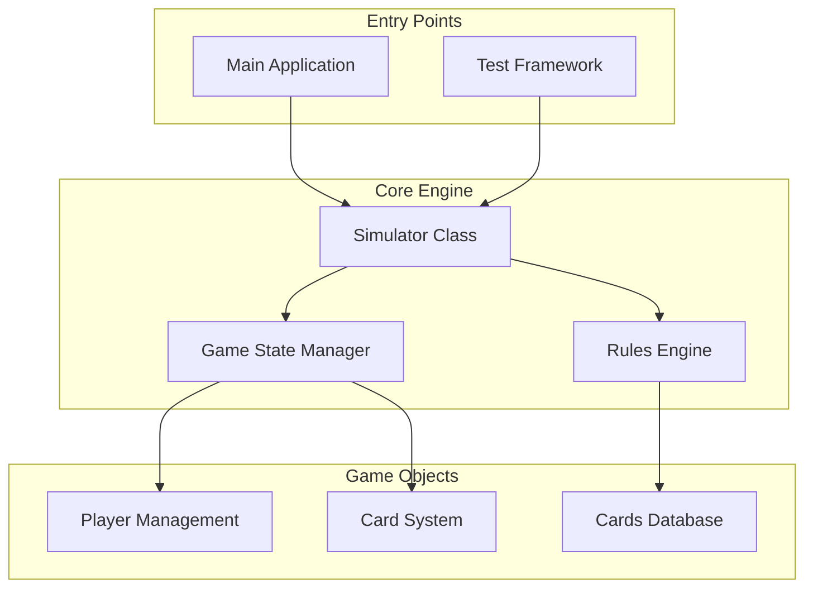
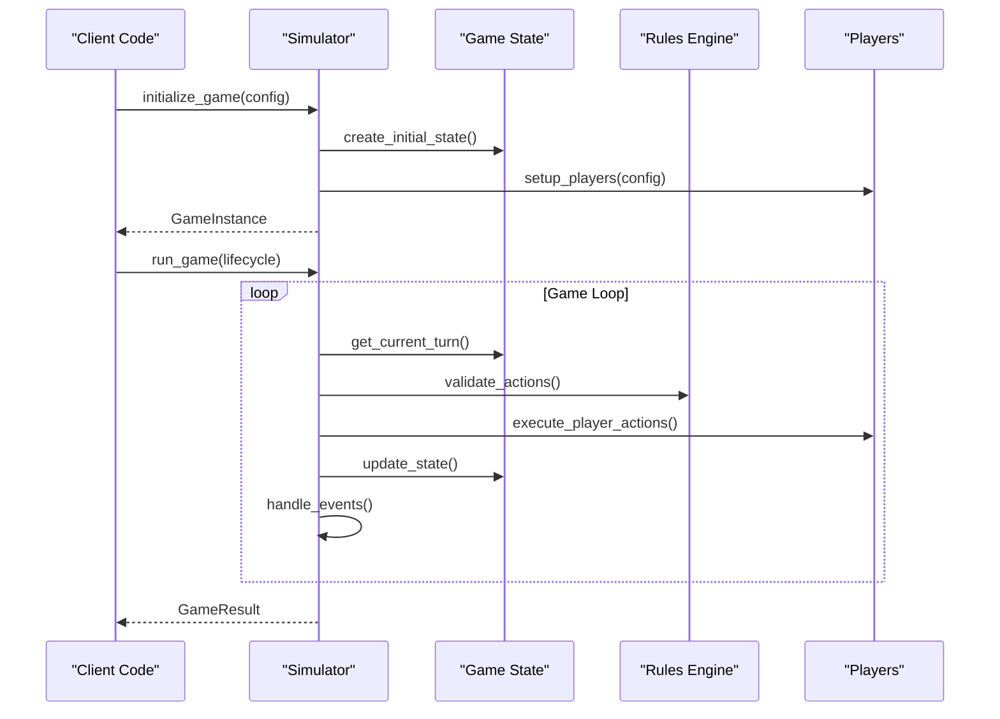
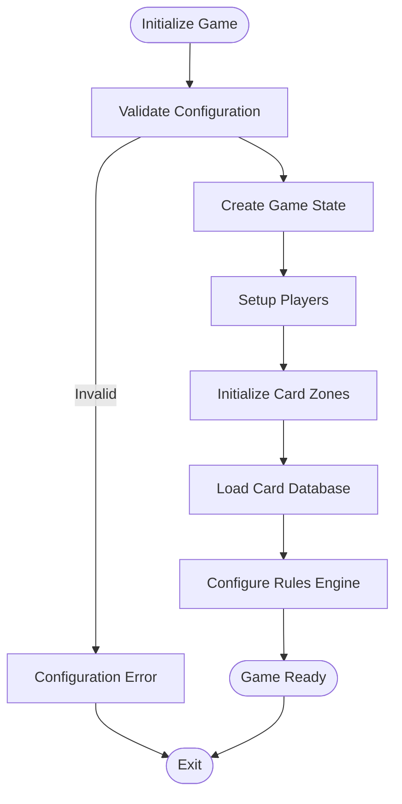
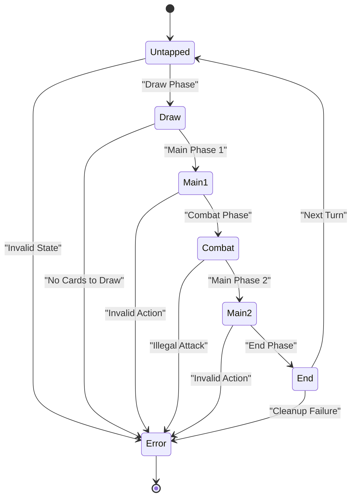
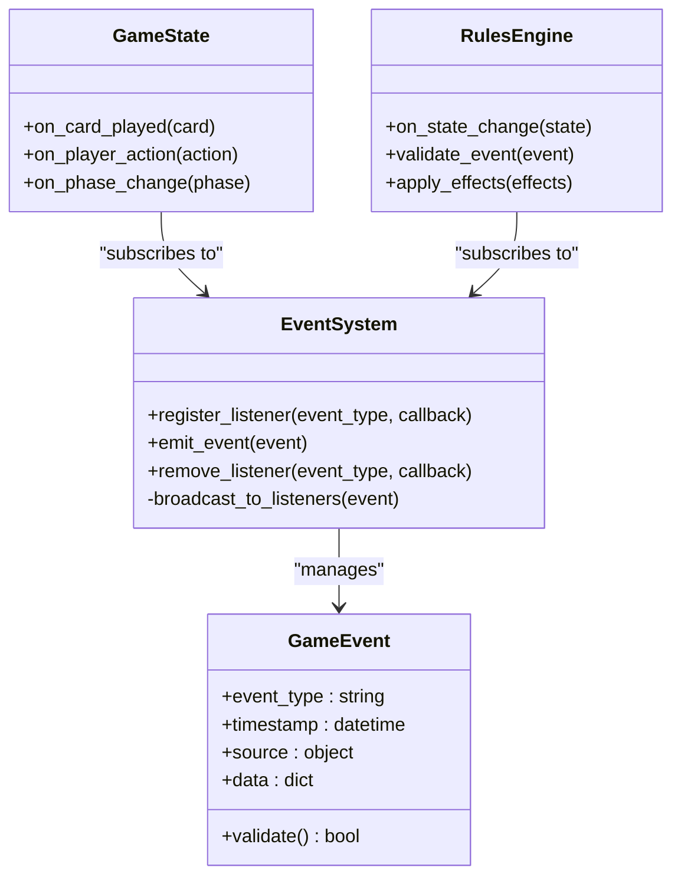
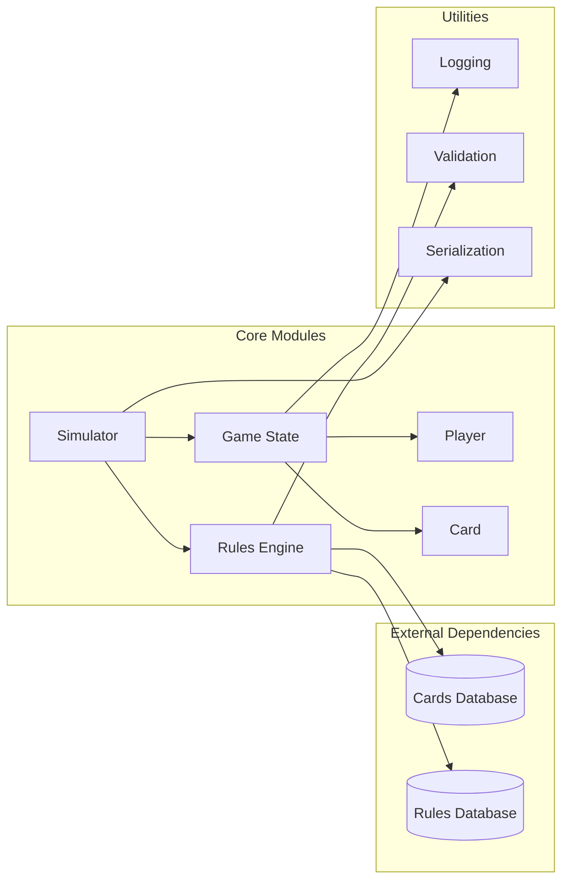

# Simulator API

<cite>
**Referenced Files in This Document**
- [simulator.py](file://simuladorMtg/src/simulator.py)
- [game_state.py](file://simuladorMtg/src/game_state.py)
- [player.py](file://simuladorMtg/src/player.py)
- [card.py](file://simuladorMtg/src/card.py)
- [rules_engine.py](file://simuladorMtg/src/rules_engine.py)
- [main.py](file://simuladorMtg/main.py)
- [test_game.py](file://simuladorMtg/test_game.py)
</cite>

## Table of Contents
1. [Introduction](#introduction)
2. [Project Structure](#project-structure)
3. [Core Components](#core-components)
4. [Architecture Overview](#architecture-overview)
5. [Detailed Component Analysis](#detailed-component-analysis)
6. [Dependency Analysis](#dependency-analysis)
7. [Performance Considerations](#performance-considerations)
8. [Troubleshooting Guide](#troubleshooting-guide)
9. [Conclusion](#conclusion)
10. [Appendices](#appendices)

## Introduction
This document provides comprehensive API documentation for the Magic: The Gathering simulator implementation. It covers the Simulator class, game orchestration, multiplayer support, state synchronization, and event propagation mechanisms.

## Project Structure
The simulator follows a modular architecture with clear separation of concerns:

**Diagram sources**
- [simulator.py:1-50](file://simuladorMtg/src/simulator.py#L1-L50)
- [game_state.py:1-30](file://simuladorMtg/src/game_state.py#L1-L30)
- [main.py:1-20](file://simuladorMtg/main.py#L1-L20)

## Core Components

### Simulator Class
The main orchestrator for game simulation lifecycle management.

#### Key Methods
- **initialize_game()**: Sets up initial game state and player configurations
- **setup_scenario()**: Configures specific game scenarios and starting conditions
- **simulate_turn()**: Executes a single turn simulation cycle
- **run_game()**: Manages complete game execution from start to finish
- **get_game_state()**: Returns current game state snapshot
- **handle_events()**: Processes game events and updates state accordingly

#### Parameters and Return Values
- **initialize_game(player_configs)**: Accepts player configuration dictionaries, returns GameInstance
- **setup_scenario(scenario_data)**: Takes scenario specification, returns ScenarioSetup
- **simulate_turn(turn_number)**: Executes turn logic, returns TurnResult
- **run_game(game_loop_config)**: Runs complete game, returns GameResult

**Section sources**
- [simulator.py:1-100](file://simuladorMtg/src/simulator.py#L1-L100)

### Game State Management
Centralized state management for all game entities and their relationships.

#### State Properties
- Current turn number and phase
- Active player tracking
- Card zones and ownership
- Player resources (life, mana, cards in hand)
- Game history and action log

#### State Synchronization
- Immutable state snapshots for consistency
- Event-driven state updates
- Multiplayer state broadcasting

**Section sources**
- [game_state.py:1-150](file://simuladorMtg/src/game_state.py#L1-L150)

### Player Management
Handles individual player state and actions within the game context.

#### Player Properties
- Life total and resource pools
- Hand, deck, graveyard, and exile zones
- Active spells and abilities
- Player-specific rules and modifiers

#### Multiplayer Support
- Player ordering and turn rotation
- Shared and private information handling
- Team-based gameplay support

**Section sources**
- [player.py:1-120](file://simuladorMtg/src/player.py#L1-L120)

## Architecture Overview

**Diagram sources**
- [simulator.py:50-200](file://simuladorMtg/src/simulator.py#L50-L200)
- [game_state.py:50-100](file://simuladorMtg/src/game_state.py#L50-L100)
- [rules_engine.py:1-80](file://simuladorMtg/src/rules_engine.py#L1-L80)

## Detailed Component Analysis

### Game Initialization Flow
The initialization process establishes the foundation for game simulation.

**Diagram sources**
- [simulator.py:100-180](file://simuladorMtg/src/simulator.py#L100-L180)
- [game_state.py:80-140](file://simuladorMtg/src/game_state.py#L80-L140)

### Turn Simulation Process
Each turn follows a structured sequence of phases and steps.

**Diagram sources**
- [simulator.py:180-300](file://simuladorMtg/src/simulator.py#L180-L300)
- [rules_engine.py:80-160](file://simuladorMtg/src/rules_engine.py#L80-L160)

### Event Propagation System
Events flow through the system to maintain consistency across components.

**Diagram sources**
- [game_state.py:140-220](file://simuladorMtg/src/game_state.py#L140-L220)
- [rules_engine.py:160-240](file://simuladorMtg/src/rules_engine.py#L160-L240)

## Dependency Analysis

**Diagram sources**
- [simulator.py:1-50](file://simuladorMtg/src/simulator.py#L1-L50)
- [cards_db.py:1-30](file://simuladorMtg/src/cards_db.py#L1-L30)
- [rules_engine.py:1-40](file://simuladorMtg/src/rules_engine.py#L1-L40)

## Performance Considerations

### Memory Management
- Implement object pooling for frequently created card instances
- Use lazy loading for card database entries
- Optimize game state serialization for save/load operations

### Simulation Speed
- Batch event processing for better throughput
- Implement parallel validation where possible
- Cache frequently accessed rule calculations

### Scalability
- Support for large multiplayer games (8+ players)
- Efficient state synchronization across network nodes
- Memory-efficient card representation

## Troubleshooting Guide

### Common Issues
- **State Inconsistency**: Verify event propagation order and rollback mechanisms
- **Performance Degradation**: Monitor memory usage and optimize hot paths
- **Multiplayer Sync Issues**: Check event ordering and conflict resolution

### Debugging Tools
- Enable detailed logging for game events
- Use state diffing to identify inconsistencies
- Implement replay functionality for debugging sessions

**Section sources**
- [test_game.py:1-100](file://simuladorMtg/test_game.py#L1-100)

## Conclusion
The Magic: The Gathering simulator provides a robust foundation for game simulation with comprehensive API coverage for game lifecycle management, multiplayer support, and extensible architecture. The modular design enables easy integration with external systems and supports various deployment scenarios.

## Appendices

### Configuration Options
- Game speed settings
- Logging verbosity levels
- Network configuration for multiplayer
- Custom rule set integration

### Testing Strategies
- Unit testing for individual components
- Integration testing for game flows
- Performance benchmarking for large games
- Multiplayer stress testing