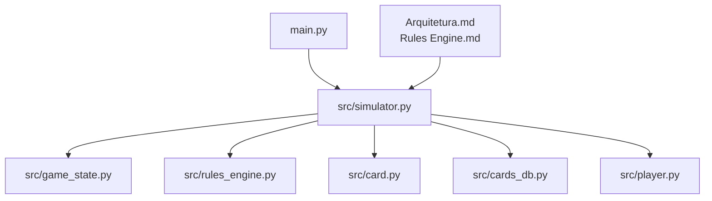
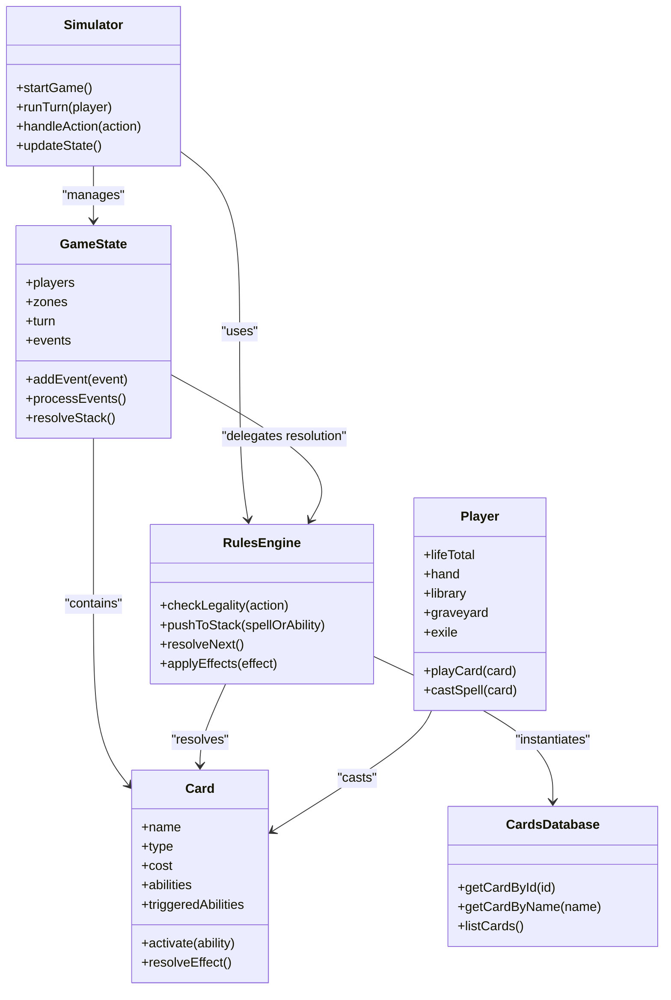
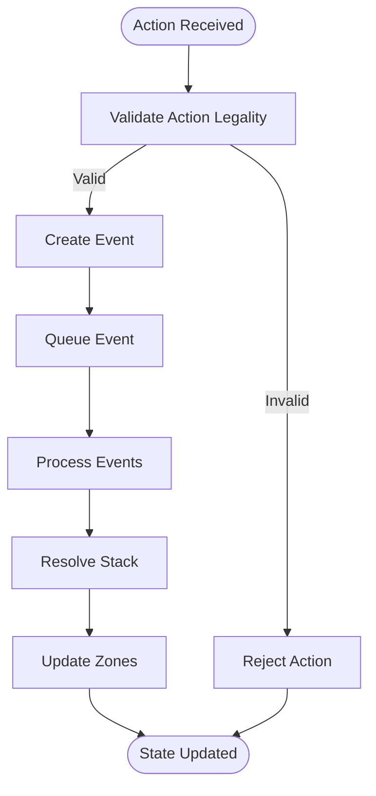
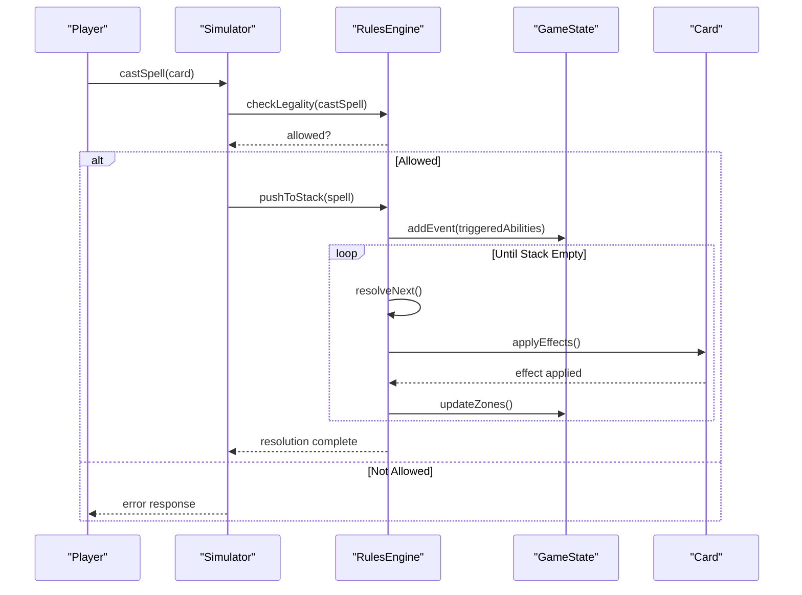
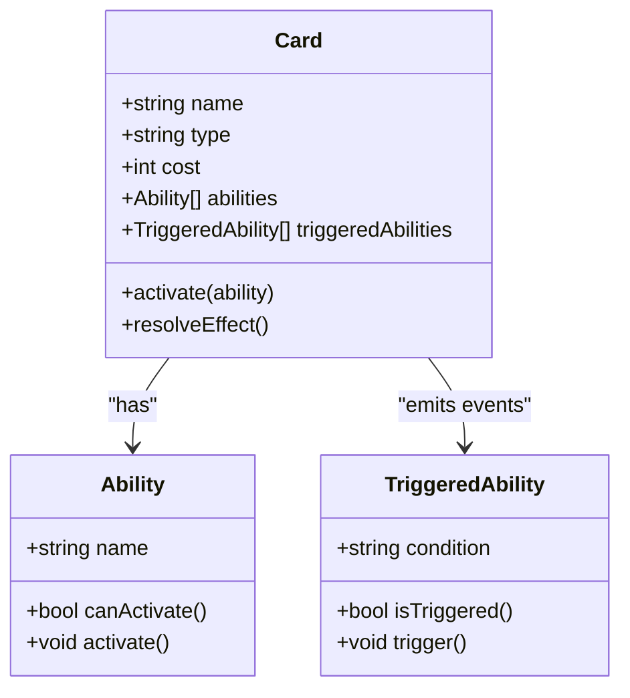
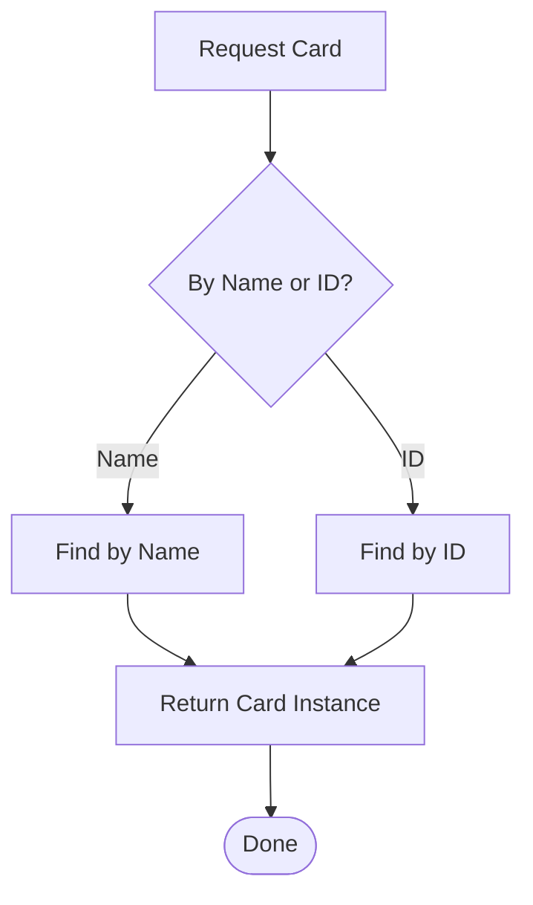
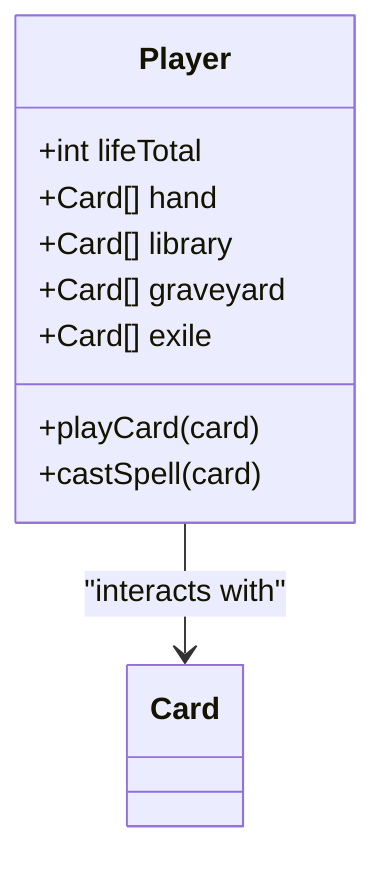
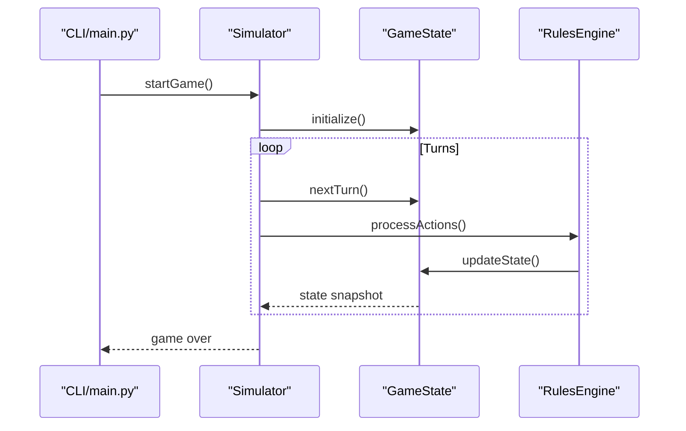
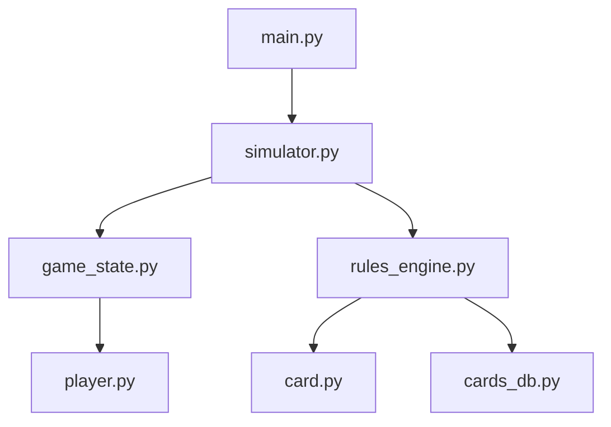

# Architecture Overview

<cite>
**Referenced Files in This Document**
- [main.py](file://simuladorMtg/main.py)
- [simulator.py](file://simuladorMtg/src/simulator.py)
- [game_state.py](file://simuladorMtg/src/game_state.py)
- [rules_engine.py](file://simuladorMtg/src/rules_engine.py)
- [card.py](file://simuladorMtg/src/card.py)
- [cards_db.py](file://simuladorMtg/src/cards_db.py)
- [player.py](file://simuladorMtg/src/player.py)
- [Arquitetura.md](file://simuladorMtg/Arquitetura.md)
- [Rules Engine.md](file://simuladorMtg/Rules Engine.md)
</cite>

## Table of Contents
1. [Introduction](#introduction)
2. [Project Structure](#project-structure)
3. [Core Components](#core-components)
4. [Architecture Overview](#architecture-overview)
5. [Detailed Component Analysis](#detailed-component-analysis)
6. [Dependency Analysis](#dependency-analysis)
7. [Performance Considerations](#performance-considerations)
8. [Troubleshooting Guide](#troubleshooting-guide)
9. [Conclusion](#conclusion)

## Introduction
This document provides a comprehensive architectural overview of the MTG Simulator system. It explains how game state, rules engine, and card systems interact through an event-driven design with a stack-based spell resolution mechanism. The architecture emphasizes separation of concerns between game logic and presentation, leveraging Python’s standard library for portability and simplicity.

## Project Structure
The simulator is organized into a clear separation between core simulation logic (under src), data definitions (cards database), and orchestration (main entry point). Documentation files describe architecture, rules, and domain concepts.

**Diagram sources**
- [main.py:1-20](file://simuladorMtg/main.py#L1-L20)
- [simulator.py:1-50](file://simuladorMtg/src/simulator.py#L1-L50)
- [game_state.py:1-40](file://simuladorMtg/src/game_state.py#L1-L40)
- [rules_engine.py:1-40](file://simuladorMtg/src/rules_engine.py#L1-L40)
- [card.py:1-40](file://simuladorMtg/src/card.py#L1-L40)
- [cards_db.py:1-40](file://simuladorMtg/src/cards_db.py#L1-L40)
- [player.py:1-40](file://simuladorMtg/src/player.py#L1-L40)

**Section sources**
- [Arquitetura.md](file://simuladorMtg/Arquitetura.md)
- [Rules Engine.md](file://simuladorMtg/Rules Engine.md)

## Core Components
- Game State: Centralizes board state, zones, players, and turn progression.
- Rules Engine: Encapsulates Magic: The Gathering rules, priority handling, and resolution order.
- Card System: Defines card types, properties, and ability behaviors.
- Cards Database: Provides lookup and instantiation of cards by name or identifier.
- Player: Represents player-specific state such as life total, hand, and resources.
- Simulator: Orchestrates interactions among components, manages turns, and drives the game loop.

Key responsibilities:
- Game State maintains consistency across zones and tracks events.
- Rules Engine enforces legality checks and resolves spells/abilities on the stack.
- Card System models abilities and effects; Cards Database supplies instances.
- Player encapsulates per-player state and actions.
- Simulator coordinates lifecycle and sequencing.

**Section sources**
- [game_state.py:1-120](file://simuladorMtg/src/game_state.py#L1-L120)
- [rules_engine.py:1-120](file://simuladorMtg/src/rules_engine.py#L1-L120)
- [card.py:1-120](file://simuladorMtg/src/card.py#L1-L120)
- [cards_db.py:1-120](file://simuladorMtg/src/cards_db.py#L1-L120)
- [player.py:1-120](file://simuladorMtg/src/player.py#L1-L120)
- [simulator.py:1-120](file://simuladorMtg/src/simulator.py#L1-L120)

## Architecture Overview
The system follows an event-driven architecture where game actions generate events that propagate through the rules engine and update the game state. Spell and ability resolution uses a stack to manage ordering and interaction.

**Diagram sources**
- [game_state.py:1-120](file://simuladorMtg/src/game_state.py#L1-L120)
- [rules_engine.py:1-120](file://simuladorMtg/src/rules_engine.py#L1-L120)
- [card.py:1-120](file://simuladorMtg/src/card.py#L1-L120)
- [cards_db.py:1-120](file://simuladorMtg/src/cards_db.py#L1-L120)
- [player.py:1-120](file://simuladorMtg/src/player.py#L1-L120)
- [simulator.py:1-120](file://simuladorMtg/src/simulator.py#L1-L120)

## Detailed Component Analysis

### Game State Management
- Maintains global board state, including zones (battlefield, graveyard, library, hand, exile).
- Tracks turn structure and active player.
- Collects and processes events generated by actions and triggered abilities.
- Coordinates stack operations via the rules engine.

**Diagram sources**
- [game_state.py:1-120](file://simuladorMtg/src/game_state.py#L1-L120)
- [rules_engine.py:1-120](file://simuladorMtg/src/rules_engine.py#L1-L120)

**Section sources**
- [game_state.py:1-120](file://simuladorMtg/src/game_state.py#L1-L120)

### Rules Engine and Stack-Based Resolution
- Enforces game rules and legality checks before actions proceed.
- Implements a stack to manage spells and abilities resolution order.
- Applies effects in correct sequence and handles interactions.

**Diagram sources**
- [rules_engine.py:1-120](file://simuladorMtg/src/rules_engine.py#L1-L120)
- [game_state.py:1-120](file://simuladorMtg/src/game_state.py#L1-L120)
- [card.py:1-120](file://simuladorMtg/src/card.py#L1-L120)

**Section sources**
- [rules_engine.py:1-120](file://simuladorMtg/src/rules_engine.py#L1-L120)

### Card System and Abilities
- Models card properties, costs, and abilities.
- Supports triggered abilities that emit events when conditions are met.
- Integrates with the rules engine for effect application.

**Diagram sources**
- [card.py:1-120](file://simuladorMtg/src/card.py#L1-L120)

**Section sources**
- [card.py:1-120](file://simuladorMtg/src/card.py#L1-L120)

### Cards Database
- Provides centralized access to card definitions.
- Supports retrieval by ID or name for consistent instantiation.

**Diagram sources**
- [cards_db.py:1-120](file://simuladorMtg/src/cards_db.py#L1-L120)

**Section sources**
- [cards_db.py:1-120](file://simuladorMtg/src/cards_db.py#L1-L120)

### Player Model
- Encapsulates per-player state: life total, hand, library, graveyard, exile.
- Interfaces with the simulator to perform actions like playing cards and casting spells.

**Diagram sources**
- [player.py:1-120](file://simuladorMtg/src/player.py#L1-L120)

**Section sources**
- [player.py:1-120](file://simuladorMtg/src/player.py#L1-L120)

### Simulator Orchestration
- Entry point for game execution.
- Manages turn flow, action handling, and state updates.
- Coordinates between game state, rules engine, and card systems.

**Diagram sources**
- [main.py:1-20](file://simuladorMtg/main.py#L1-L20)
- [simulator.py:1-120](file://simuladorMtg/src/simulator.py#L1-L120)
- [game_state.py:1-120](file://simuladorMtg/src/game_state.py#L1-L120)
- [rules_engine.py:1-120](file://simuladorMtg/src/rules_engine.py#L1-L120)

**Section sources**
- [main.py:1-20](file://simuladorMtg/main.py#L1-L20)
- [simulator.py:1-120](file://simuladorMtg/src/simulator.py#L1-L120)

## Dependency Analysis
The system exhibits low coupling between components through well-defined interfaces:
- Simulator depends on GameState and RulesEngine but not directly on Card implementations.
- RulesEngine interacts with Card via abstract interfaces, enabling extensibility.
- CardsDatabase is isolated and used only for instantiation.

**Diagram sources**
- [main.py:1-20](file://simuladorMtg/main.py#L1-L20)
- [simulator.py:1-120](file://simuladorMtg/src/simulator.py#L1-L120)
- [game_state.py:1-120](file://simuladorMtg/src/game_state.py#L1-L120)
- [rules_engine.py:1-120](file://simuladorMtg/src/rules_engine.py#L1-L120)
- [card.py:1-120](file://simuladorMtg/src/card.py#L1-L120)
- [cards_db.py:1-120](file://simuladorMtg/src/cards_db.py#L1-L120)
- [player.py:1-120](file://simuladorMtg/src/player.py#L1-L120)

**Section sources**
- [simulator.py:1-120](file://simuladorMtg/src/simulator.py#L1-L120)
- [rules_engine.py:1-120](file://simuladorMtg/src/rules_engine.py#L1-L120)

## Performance Considerations
- Event processing should be optimized to avoid unnecessary object creation during high-frequency triggers.
- Stack resolution can be batched to reduce overhead in complex interactions.
- CardsDatabase lookups should use efficient indexing (e.g., hash maps) for O(1) access.
- Avoid deep recursion in ability chains; prefer iterative resolution where possible.

[No sources needed since this section provides general guidance]

## Troubleshooting Guide
Common issues and resolutions:
- Illegal actions: Ensure RulesEngine legality checks are invoked before state mutations.
- Stack corruption: Verify that all effects properly remove themselves from the stack after resolution.
- Missing card definitions: Confirm CardsDatabase contains required entries and identifiers match.
- Turn progression errors: Check GameState turn counters and active player transitions.

**Section sources**
- [rules_engine.py:1-120](file://simuladorMtg/src/rules_engine.py#L1-L120)
- [game_state.py:1-120](file://simuladorMtg/src/game_state.py#L1-L120)
- [cards_db.py:1-120](file://simuladorMtg/src/cards_db.py#L1-L120)

## Conclusion
The MTG Simulator employs a modular, event-driven architecture with clear separation between game state, rules enforcement, and card modeling. The stack-based resolution ensures accurate interaction handling, while the simulator orchestrates turn management and component coordination. Using Python’s standard library enhances portability and simplifies deployment. Future enhancements may include advanced persistence mechanisms and performance optimizations for large-scale simulations.

[No sources needed since this section summarizes without analyzing specific files]