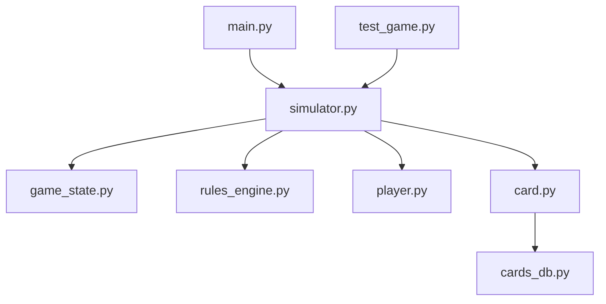
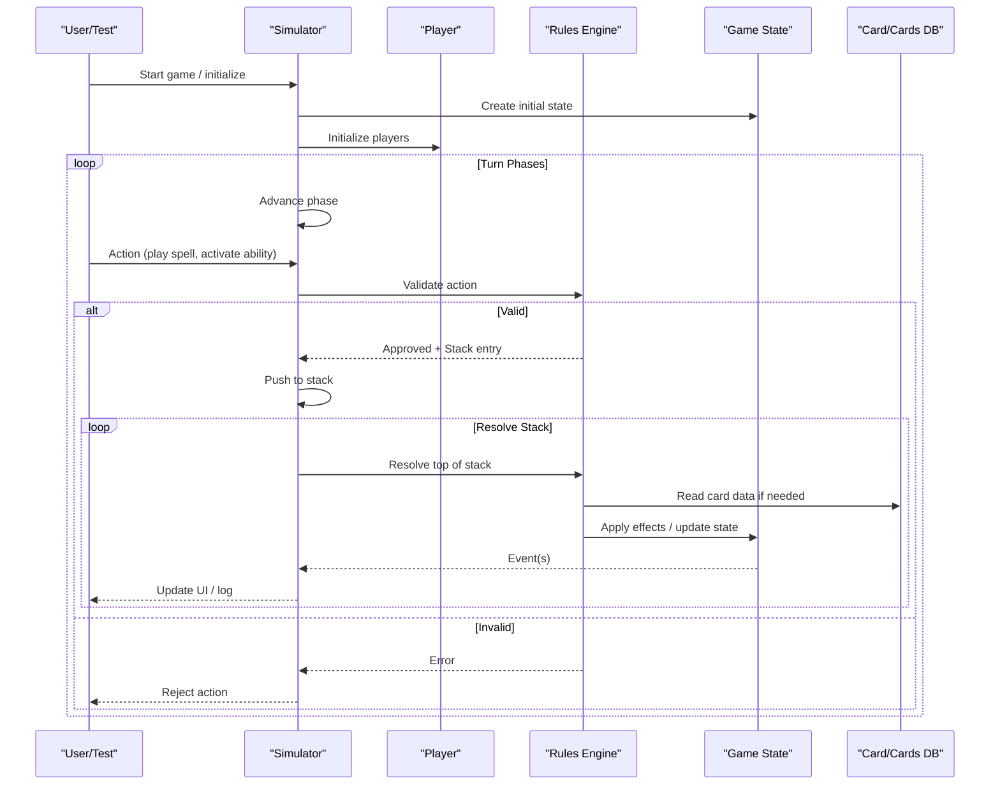
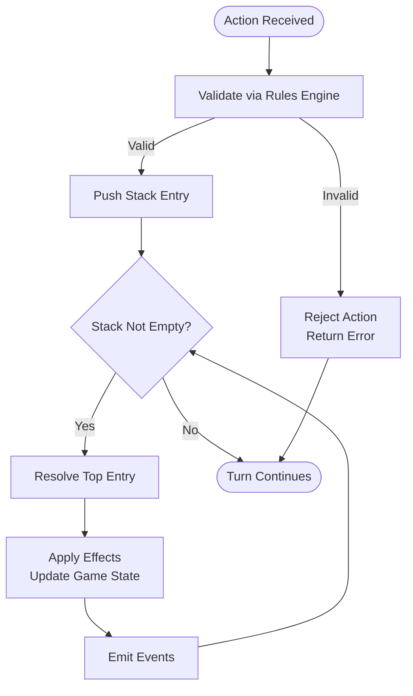
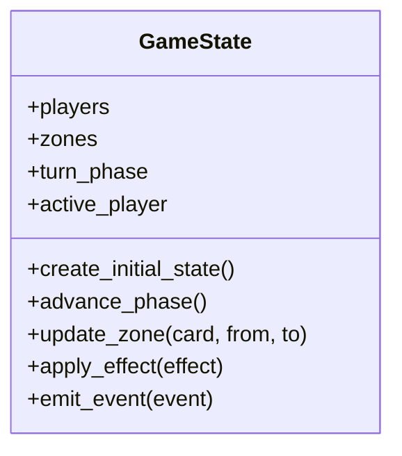
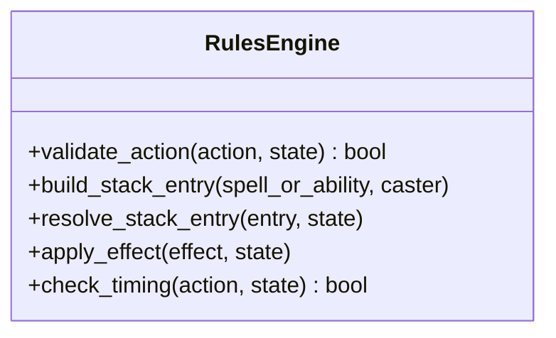
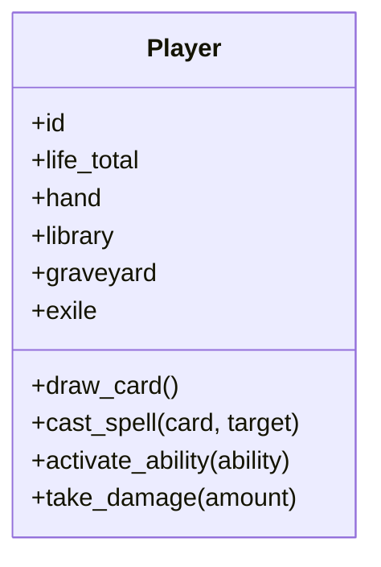
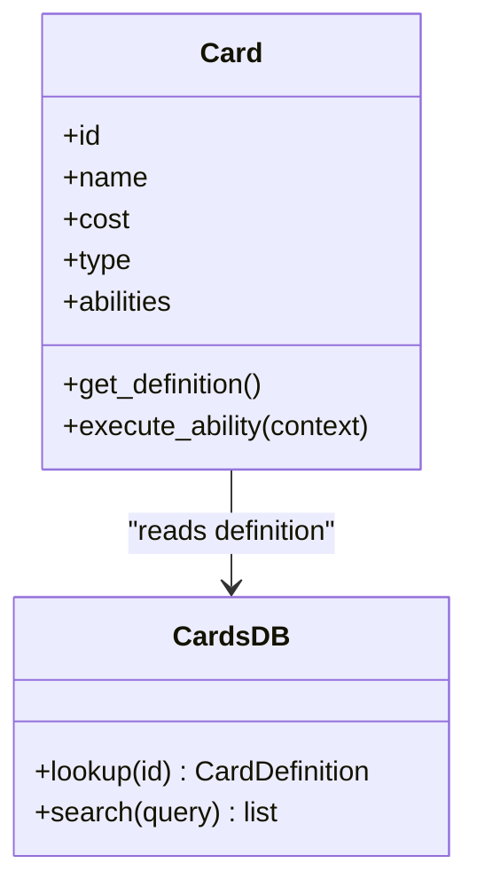
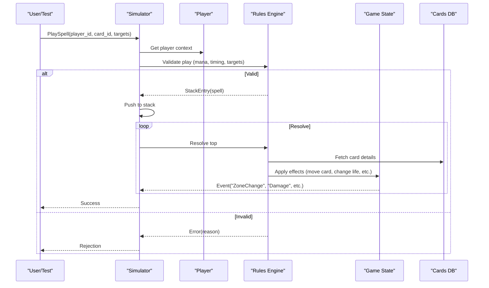
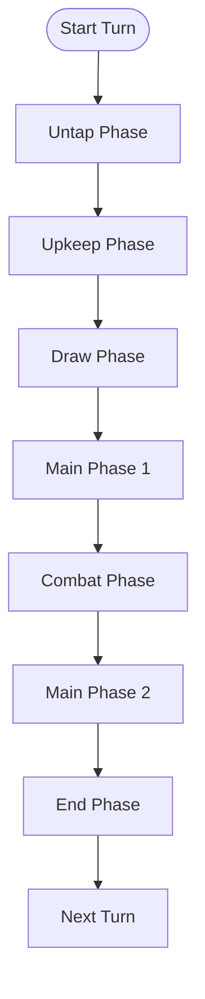
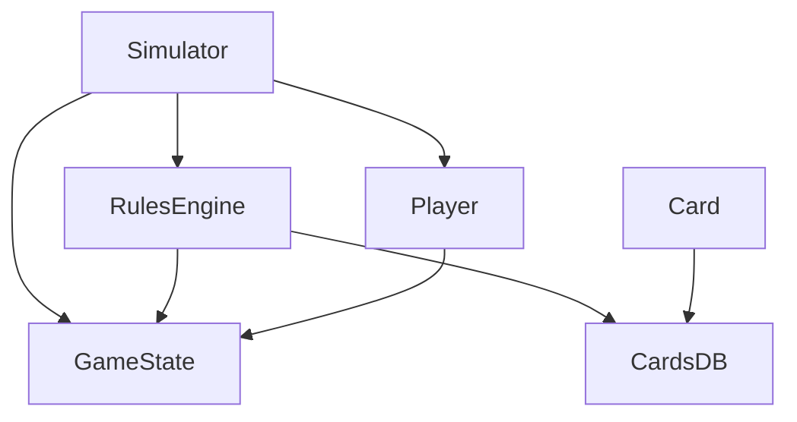

# Component Interactions & Data Flow

<cite>
**Referenced Files in This Document**
- [simulator.py](file://simuladorMtg/src/simulator.py)
- [game_state.py](file://simuladorMtg/src/game_state.py)
- [rules_engine.py](file://simuladorMtg/src/rules_engine.py)
- [player.py](file://simuladorMtg/src/player.py)
- [card.py](file://simuladorMtg/src/card.py)
- [cards_db.py](file://simuladorMtg/src/cards_db.py)
- [main.py](file://simuladorMtg/main.py)
- [test_game.py](file://simuladorMtg/test_game.py)
</cite>

## Table of Contents
1. [Introduction](#introduction)
2. [Project Structure](#project-structure)
3. [Core Components](#core-components)
4. [Architecture Overview](#architecture-overview)
5. [Detailed Component Analysis](#detailed-component-analysis)
6. [Dependency Analysis](#dependency-analysis)
7. [Performance Considerations](#performance-considerations)
8. [Troubleshooting Guide](#troubleshooting-guide)
9. [Conclusion](#conclusion)

## Introduction
This document explains how the MTG Simulator orchestrates communication between game state, rules engine, player management, and card systems. It focuses on data flow from player actions through validation to game state updates, event propagation, stack resolution for spells and abilities, and turn phase transitions. The goal is to make the system understandable for beginners while providing enough technical depth for experienced developers.

## Project Structure
The simulator is organized into a small set of focused modules:
- Entry point and test harness
- Core simulation loop and orchestration
- Game state model and lifecycle
- Rules engine for validation and effects
- Player management
- Card definitions and database

**Diagram sources**
- [main.py](file://simuladorMtg/main.py)
- [simulator.py](file://simuladorMtg/src/simulator.py)
- [game_state.py](file://simuladorMtg/src/game_state.py)
- [rules_engine.py](file://simuladorMtg/src/rules_engine.py)
- [player.py](file://simuladorMtg/src/player.py)
- [card.py](file://simuladorMtg/src/card.py)
- [cards_db.py](file://simuladorMtg/src/cards_db.py)
- [test_game.py](file://simuladorMtg/test_game.py)

**Section sources**
- [main.py](file://simuladorMtg/main.py)
- [simulator.py](file://simuladorMtg/src/simulator.py)
- [game_state.py](file://simuladorMtg/src/game_state.py)
- [rules_engine.py](file://simuladorMtg/src/rules_engine.py)
- [player.py](file://simuladorMtg/src/player.py)
- [card.py](file://simuladorMtg/src/card.py)
- [cards_db.py](file://simuladorMtg/src/cards_db.py)
- [test_game.py](file://simuladorMtg/test_game.py)

## Core Components
- Simulator: Orchestrates the main loop, coordinates turns, manages the stack, and drives events.
- Game State: Holds persistent information such as zones, players, cards, and turn/phase state; exposes methods to mutate state safely.
- Rules Engine: Validates actions, resolves spells and abilities, applies effects, and enforces game rules.
- Player: Represents each participant, including resources, hand, library, graveyard, and decision-making hooks.
- Card: Defines card identity, properties, and behavior templates; interacts with the cards database for static data.
- Cards Database: Centralized repository of card definitions and metadata used by the card system.

Key responsibilities and interactions:
- Player actions are captured and forwarded to the rules engine for validation.
- Validated actions create stack entries that the simulator resolves according to priority and timing rules.
- The game state is updated atomically after successful resolution steps.
- Events are emitted at key points (e.g., zone changes, damage, win/loss conditions) for logging and UI updates.

**Section sources**
- [simulator.py](file://simuladorMtg/src/simulator.py)
- [game_state.py](file://simuladorMtg/src/game_state.py)
- [rules_engine.py](file://simuladorMtg/src/rules_engine.py)
- [player.py](file://simuladorMtg/src/player.py)
- [card.py](file://simuladorMtg/src/card.py)
- [cards_db.py](file://simuladorMtg/src/cards_db.py)

## Architecture Overview
At runtime, the simulator drives a turn-based loop. Each turn progresses through phases where players can take actions. Actions are validated by the rules engine, then placed onto the stack. The stack resolves in reverse order, applying effects and updating game state. Events propagate to observers for logging or UI updates.

**Diagram sources**
- [simulator.py](file://simuladorMtg/src/simulator.py)
- [rules_engine.py](file://simuladorMtg/src/rules_engine.py)
- [game_state.py](file://simuladorMtg/src/game_state.py)
- [player.py](file://simuladorMtg/src/player.py)
- [card.py](file://simuladorMtg/src/card.py)
- [cards_db.py](file://simuladorMtg/src/cards_db.py)

## Detailed Component Analysis

### Simulator Orchestration
Responsibilities:
- Initializes game state and players
- Manages turn/phase progression
- Accepts player actions and delegates validation
- Maintains and resolves the stack
- Emits and dispatches events

Data flow highlights:
- Actions enter via simulator API
- Validation returns either an error or a stack entry
- Resolution calls rules engine to apply effects and mutate game state
- Events bubble up to callers for logging or UI updates

**Diagram sources**
- [simulator.py](file://simuladorMtg/src/simulator.py)
- [rules_engine.py](file://simuladorMtg/src/rules_engine.py)
- [game_state.py](file://simuladorMtg/src/game_state.py)

**Section sources**
- [simulator.py](file://simuladorMtg/src/simulator.py)

### Game State Model
Responsibilities:
- Tracks zones (battlefield, library, graveyard, exile, command, etc.)
- Stores player objects and their resources
- Manages turn/phase counters and active player
- Provides safe mutation methods to maintain consistency

Consistency mechanisms:
- Atomic updates within resolution steps
- Invariant checks before and after mutations
- Event emission to signal state changes

**Diagram sources**
- [game_state.py](file://simuladorMtg/src/game_state.py)

**Section sources**
- [game_state.py](file://simuladorMtg/src/game_state.py)

### Rules Engine
Responsibilities:
- Validates actions against current game state and rules
- Creates stack entries for spells and abilities
- Resolves stack entries by applying effects and handling dependencies
- Enforces timing restrictions and priority

Error handling:
- Returns structured errors for invalid actions
- Propagates exceptions for unexpected states
- Ensures rollback or no-op when validation fails

**Diagram sources**
- [rules_engine.py](file://simuladorMtg/src/rules_engine.py)

**Section sources**
- [rules_engine.py](file://simuladorMtg/src/rules_engine.py)

### Player Management
Responsibilities:
- Represents each player’s resources, hands, libraries, and other zones
- Exposes methods to perform legal actions (e.g., draw, cast, attack)
- Integrates with rules engine to validate decisions

State synchronization:
- Player state changes are reflected in game state via centralized methods
- Events capture player-specific changes (life total, deck count, etc.)

**Diagram sources**
- [player.py](file://simuladorMtg/src/player.py)

**Section sources**
- [player.py](file://simuladorMtg/src/player.py)

### Card System and Database
Responsibilities:
- Card defines identity, cost, type, and behavior hooks
- Cards database provides static definitions and lookup utilities
- Card behaviors interact with rules engine during resolution

Integration patterns:
- Card instances reference definitions from the database
- During resolution, rules engine reads card properties to compute effects

**Diagram sources**
- [card.py](file://simuladorMtg/src/card.py)
- [cards_db.py](file://simuladorMtg/src/cards_db.py)

**Section sources**
- [card.py](file://simuladorMtg/src/card.py)
- [cards_db.py](file://simuladorMtg/src/cards_db.py)

### Sequence: Casting a Spell
End-to-end flow from user input to state update:

**Diagram sources**
- [simulator.py](file://simuladorMtg/src/simulator.py)
- [rules_engine.py](file://simuladorMtg/src/rules_engine.py)
- [game_state.py](file://simuladorMtg/src/game_state.py)
- [player.py](file://simuladorMtg/src/player.py)
- [card.py](file://simuladorMtg/src/card.py)
- [cards_db.py](file://simuladorMtg/src/cards_db.py)

**Section sources**
- [simulator.py](file://simuladorMtg/src/simulator.py)
- [rules_engine.py](file://simuladorMtg/src/rules_engine.py)
- [game_state.py](file://simuladorMtg/src/game_state.py)
- [player.py](file://simuladorMtg/src/player.py)
- [card.py](file://simuladorMtg/src/card.py)
- [cards_db.py](file://simuladorMtg/src/cards_db.py)

### Flow: Turn Phase Transitions
Phase progression triggers state changes and opportunities for actions:

During each phase:
- Simulator advances phase counters
- Rules engine may trigger phase-based abilities
- Game state emits events for UI/log updates

**Diagram sources**
- [simulator.py](file://simuladorMtg/src/simulator.py)
- [game_state.py](file://simuladorMtg/src/game_state.py)

**Section sources**
- [simulator.py](file://simuladorMtg/src/simulator.py)
- [game_state.py](file://simuladorMtg/src/game_state.py)

## Dependency Analysis
The simulator depends on game state, rules engine, player, and card subsystems. The rules engine depends on game state and card definitions. Player interacts with game state and rules engine. Card references the cards database.

**Diagram sources**
- [simulator.py](file://simuladorMtg/src/simulator.py)
- [game_state.py](file://simuladorMtg/src/game_state.py)
- [rules_engine.py](file://simuladorMtg/src/rules_engine.py)
- [player.py](file://simuladorMtg/src/player.py)
- [card.py](file://simuladorMtg/src/card.py)
- [cards_db.py](file://simuladorMtg/src/cards_db.py)

**Section sources**
- [simulator.py](file://simuladorMtg/src/simulator.py)
- [game_state.py](file://simuladorMtg/src/game_state.py)
- [rules_engine.py](file://simuladorMtg/src/rules_engine.py)
- [player.py](file://simuladorMtg/src/player.py)
- [card.py](file://simuladorMtg/src/card.py)
- [cards_db.py](file://simuladorMtg/src/cards_db.py)

## Performance Considerations
- Minimize repeated lookups in the cards database by caching frequently accessed definitions.
- Batch game state updates during stack resolution to reduce event overhead.
- Avoid deep copies of large structures; prefer immutable snapshots where appropriate.
- Use efficient data structures for zones (e.g., sets for quick membership checks).
- Defer expensive computations until resolution time and cache results when safe.

[No sources needed since this section provides general guidance]

## Troubleshooting Guide
Common issues and strategies:
- Invalid actions: Ensure rules engine validates mana, timing, and targeting constraints before pushing to stack.
- Stack inconsistencies: Verify that only one entry resolves at a time and that effects do not mutate the stack mid-resolution.
- State drift: Confirm that all mutations go through game state methods and emit consistent events.
- Player state mismatches: Cross-check player zone counts and resources after each resolution step.
- Exception propagation: Catch and wrap low-level exceptions with domain-specific errors to aid debugging.

Practical checks:
- Assert invariants after phase transitions and major effects.
- Log every event with context (action, source, targets, result).
- Provide clear error messages indicating which rule was violated.

**Section sources**
- [rules_engine.py](file://simuladorMtg/src/rules_engine.py)
- [game_state.py](file://simuladorMtg/src/game_state.py)
- [simulator.py](file://simuladorMtg/src/simulator.py)

## Conclusion
The MTG Simulator coordinates player actions, rules validation, stack resolution, and game state updates through well-defined component boundaries. By centralizing validation in the rules engine and mutations in game state, the system maintains consistency and clarity. Events provide a robust mechanism for observability and UI integration. Following the patterns outlined here will help extend functionality while preserving correctness and performance.