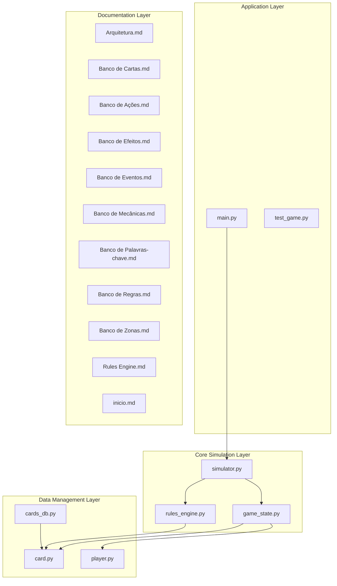
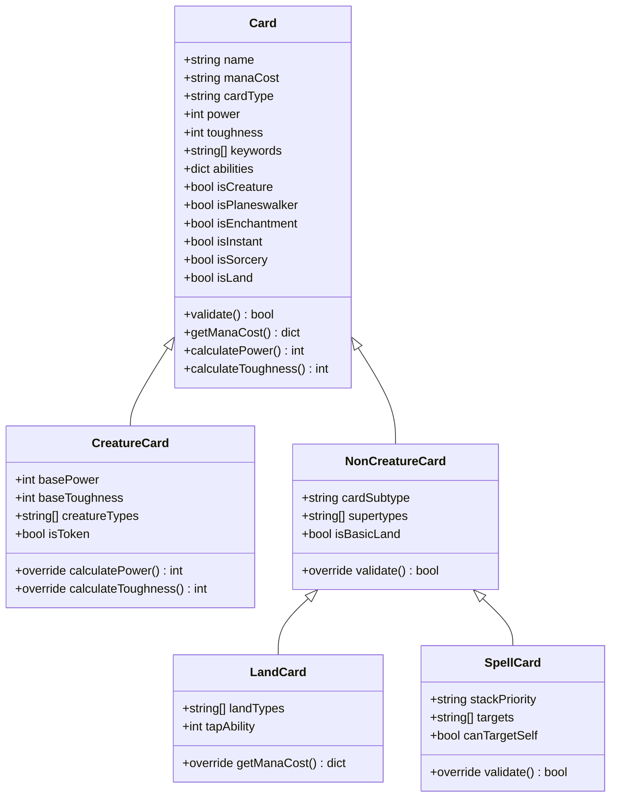
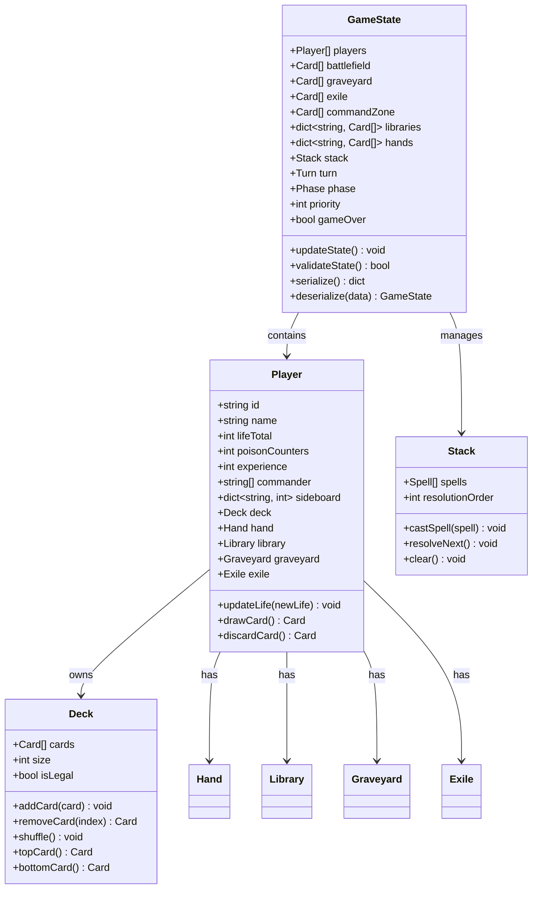
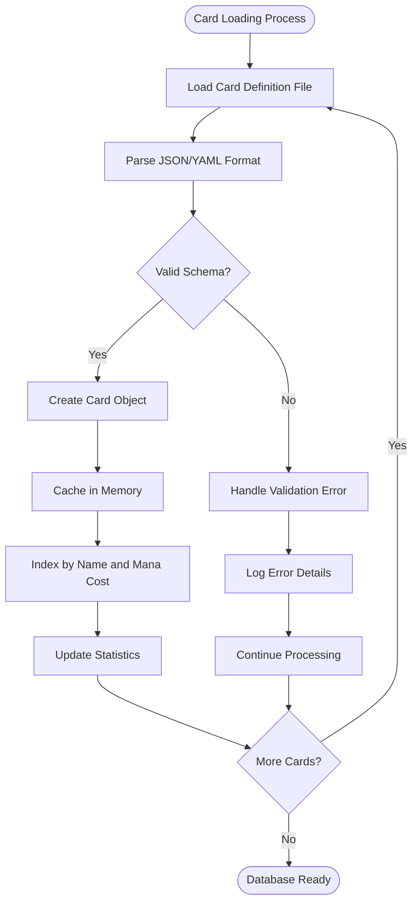
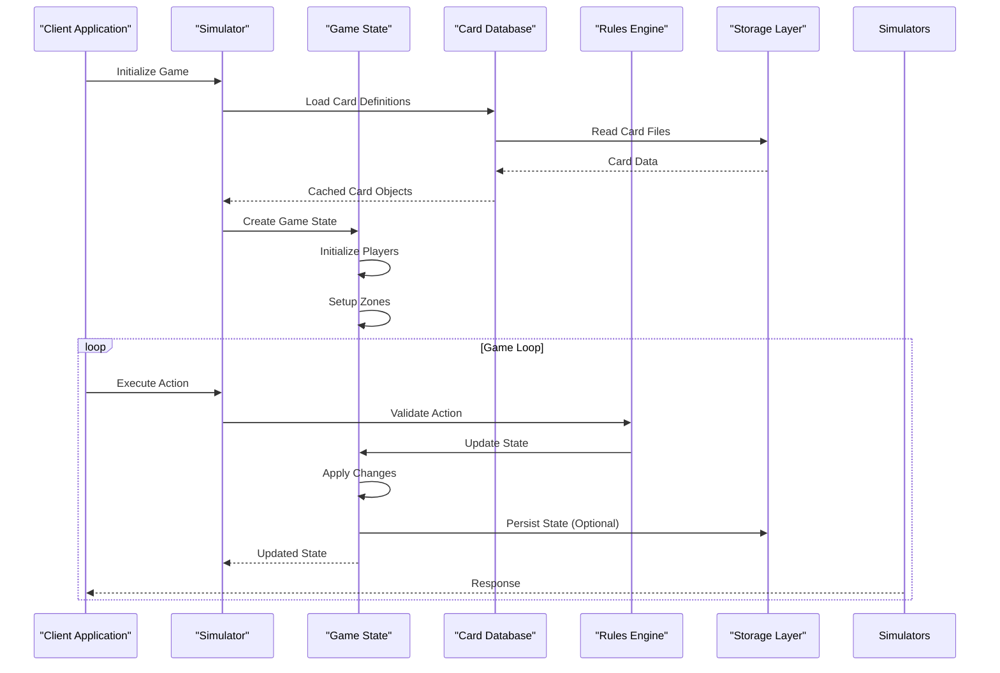
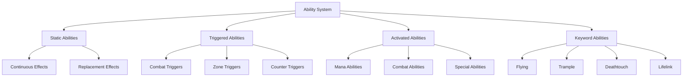
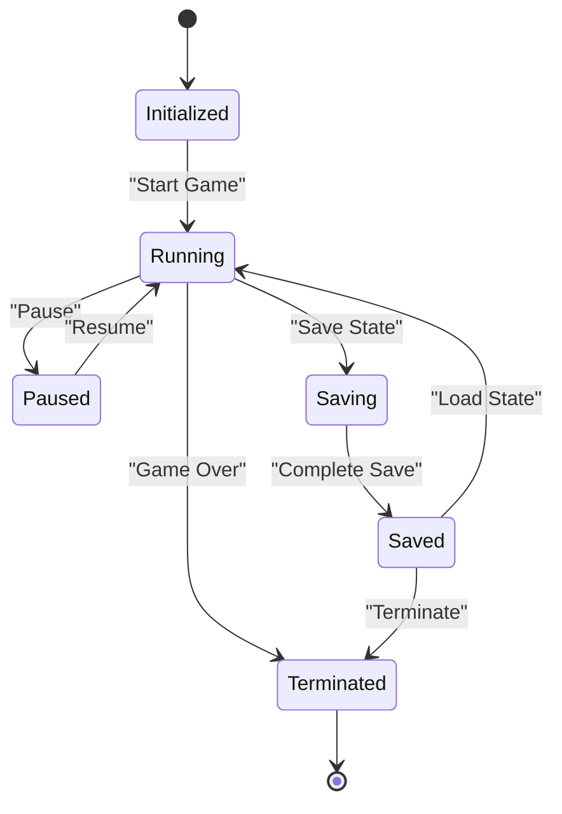
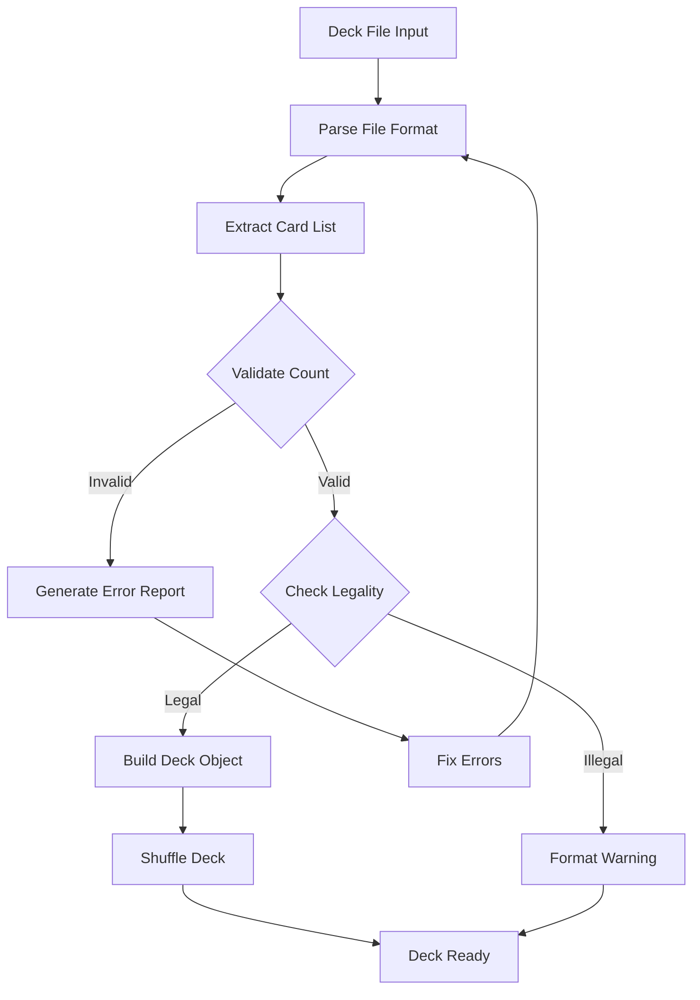
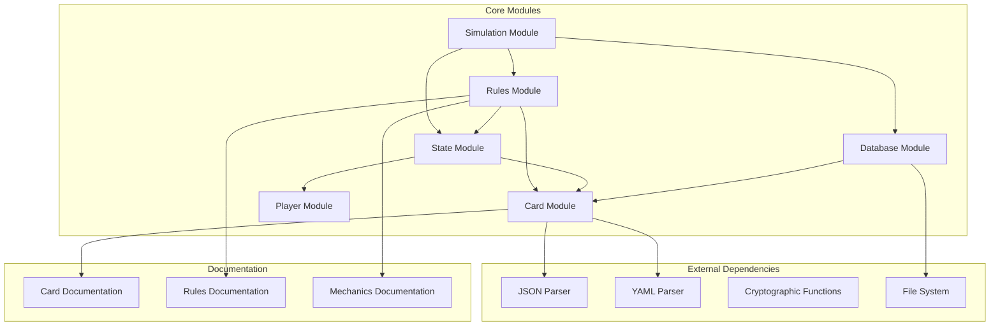
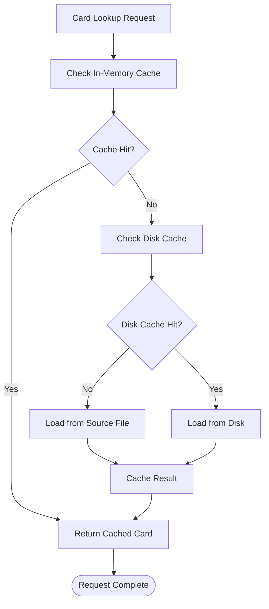

# Data Architecture & Storage

<cite>
**Referenced Files in This Document**
- [main.py](file://simuladorMtg/main.py)
- [card.py](file://simuladorMtg/src/card.py)
- [cards_db.py](file://simuladorMtg/src/cards_db.py)
- [game_state.py](file://simuladorMtg/src/game_state.py)
- [player.py](file://simuladorMtg/src/player.py)
- [rules_engine.py](file://simuladorMtg/src/rules_engine.py)
- [simulator.py](file://simuladorMtg/src/simulator.py)
- [Arquitetura.md](file://simuladorMtg/Arquitetura.md)
- [Banco de Cartas.md](file://simuladorMtg/Banco de Cartas.md)
- [Banco de Ações.md](file://simuladorMtg/Banco de Ações.md)
- [Banco de Efeitos.md](file://simuladorMtg/Banco de Efeitos.md)
- [Banco de Eventos.md](file://simuladorMtg/Banco de Eventos.md)
- [Banco de Mecânicas.md](file://simuladorMtg/Banco de Mecânicas.md)
- [Banco de Palavras-chave.md](file://simuladorMtg/Banco de Palavras-chave.md)
- [Banco de Regras.md](file://simuladorMtg/Banco de Regras.md)
- [Banco de Zonas.md](file://simuladorMtg/Banco de Zonas.md)
- [Rules Engine.md](file://simuladorMtg/Rules Engine.md)
- [inicio.md](file://simuladorMtg/inicio.md)
- [test_game.py](file://simuladorMtg/test_game.py)
</cite>

## Table of Contents
1. [Introduction](#introduction)
2. [Project Structure](#project-structure)
3. [Core Components](#core-components)
4. [Architecture Overview](#architecture-overview)
5. [Detailed Component Analysis](#detailed-component-analysis)
6. [Dependency Analysis](#dependency-analysis)
7. [Performance Considerations](#performance-considerations)
8. [Troubleshooting Guide](#troubleshooting-guide)
9. [Conclusion](#conclusion)

## Introduction

The MTG Simulator is a comprehensive Magic: The Gathering game simulation system designed to model card interactions, game states, and rule enforcement. This document provides detailed data architecture documentation covering the card database schema, game state serialization format, deck configuration structures, data persistence strategies, memory management approaches, and data validation mechanisms.

The system implements a robust architecture that separates concerns between card definitions, game state management, rules enforcement, and simulation orchestration. It supports efficient loading and caching of large card databases, maintains consistent game states during simulation, and provides reliable parsing and validation of deck configurations.

## Project Structure

The MTG Simulator follows a modular architecture with clear separation of responsibilities:

**Diagram sources**
- [main.py](file://simuladorMtg/main.py)
- [simulator.py](file://simuladorMtg/src/simulator.py)
- [game_state.py](file://simuladorMtg/src/game_state.py)
- [card.py](file://simuladorMtg/src/card.py)
- [cards_db.py](file://simuladorMtg/src/cards_db.py)

**Section sources**
- [Arquitetura.md](file://simuladorMtg/Arquitetura.md)
- [inicio.md](file://simuladorMtg/inicio.md)

## Core Components

### Card System Architecture

The card system forms the foundation of the MTG Simulator, implementing a hierarchical class structure that models Magic: The Gathering cards with their various properties, abilities, and behaviors.

#### Card Class Hierarchy

**Diagram sources**
- [card.py](file://simuladorMtg/src/card.py)

### Game State Management

The game state system maintains the complete snapshot of a Magic: The Gathering game, including player states, card zones, and game mechanics.

#### Game State Structure

**Diagram sources**
- [game_state.py](file://simuladorMtg/src/game_state.py)
- [player.py](file://simuladorMtg/src/player.py)

### Card Database System

The card database provides efficient storage, retrieval, and caching of card definitions with support for large card collections.

#### Database Architecture

**Diagram sources**
- [cards_db.py](file://simuladorMtg/src/cards_db.py)

**Section sources**
- [card.py](file://simuladorMtg/src/card.py)
- [game_state.py](file://simuladorMtg/src/game_state.py)
- [player.py](file://simuladorMtg/src/player.py)
- [cards_db.py](file://simuladorMtg/src/cards_db.py)

## Architecture Overview

The MTG Simulator implements a layered architecture that separates concerns between data management, game logic, and simulation orchestration.

**Diagram sources**
- [simulator.py](file://simuladorMtg/src/simulator.py)
- [game_state.py](file://simuladorMtg/src/game_state.py)
- [cards_db.py](file://simuladorMtg/src/cards_db.py)
- [rules_engine.py](file://simuladorMtg/src/rules_engine.py)

## Detailed Component Analysis

### Card Definition System

The card definition system provides a comprehensive model for representing Magic: The Gathering cards with full type hierarchy and ability systems.

#### Card Type Classification

The system implements a sophisticated card classification system that handles all Magic card types:

- **Creatures**: With power/toughness, creature types, and combat abilities
- **Planeswalkers**: With loyalty counters and planeswalker abilities
- **Enchantments**: With static and triggered effects
- **Instants**: With instant-speed interaction capabilities
- **Sorceries**: With sorcery-speed timing restrictions
- **Lands**: With mana production and basic/non-basic distinctions

#### Ability System Architecture

**Diagram sources**
- [card.py](file://simuladorMtg/src/card.py)
- [Banco de Palavras-chave.md](file://simuladorMtg/Banco de Palavras-chave.md)

### Game State Serialization

The game state serialization system ensures complete persistence and restoration of game states with full fidelity.

#### Serialization Format

The serialization format supports multiple output formats:

- **JSON**: For human-readable storage and API responses
- **Binary**: For optimized storage and network transmission
- **Incremental**: For efficient state updates and replay functionality

#### State Persistence Strategy

**Diagram sources**
- [game_state.py](file://simuladorMtg/src/game_state.py)

### Deck Configuration System

The deck configuration system provides robust parsing and validation of Magic: The Gathering deck files.

#### Deck File Formats

The system supports multiple deck file formats:

- **MTGO Format**: Standard Magic Online deck format
- **Penny Dreadful**: PD-specific deck format
- **Custom Format**: Flexible YAML/JSON-based format
- **Text Format**: Human-readable text format

#### Deck Validation Process

**Diagram sources**
- [player.py](file://simuladorMtg/src/player.py)

### Rules Engine Integration

The rules engine provides comprehensive rule enforcement and interaction handling for Magic: The Gathering gameplay.

#### Rule Categories

The rules engine handles multiple categories of game rules:

- **Combat Rules**: Damage assignment, blocking, and combat damage
- **Stack Rules**: Spell ordering, targeting, and resolution
- **State-Based Actions**: Automatic game state checks
- **Priority Rules**: Turn order and action sequencing
- **Zone Rules**: Card movement between game zones

**Section sources**
- [rules_engine.py](file://simuladorMtg/src/rules_engine.py)
- [Rules Engine.md](file://simuladorMtg/Rules Engine.md)

## Dependency Analysis

The MTG Simulator implements a well-structured dependency graph that promotes modularity and maintainability.

**Diagram sources**
- [card.py](file://simuladorMtg/src/card.py)
- [cards_db.py](file://simuladorMtg/src/cards_db.py)
- [game_state.py](file://simuladorMtg/src/game_state.py)
- [player.py](file://simuladorMtg/src/player.py)
- [rules_engine.py](file://simuladorMtg/src/rules_engine.py)
- [simulator.py](file://simuladorMtg/src/simulator.py)

### Module Coupling Analysis

The module coupling analysis reveals a well-designed architecture with minimal dependencies:

- **Low Coupling**: Each module has clear interfaces and minimal cross-dependencies
- **High Cohesion**: Related functionality is grouped within modules
- **Clear Boundaries**: Dependencies flow in one direction (data → logic → presentation)

**Section sources**
- [Arquitetura.md](file://simuladorMtg/Arquitetura.md)

## Performance Considerations

### Card Database Optimization

For large card databases containing thousands of cards, the system implements several optimization strategies:

#### Memory Management

- **Lazy Loading**: Cards are loaded on-demand rather than all at once
- **Reference Counting**: Efficient memory usage through smart reference management
- **Garbage Collection**: Automatic cleanup of unused card objects
- **Memory Pooling**: Reuse of frequently allocated objects

#### Caching Strategies

**Diagram sources**
- [cards_db.py](file://simuladorMtg/src/cards_db.py)

### Game State Performance

#### State Update Optimization

- **Delta Updates**: Only modified state components are updated
- **Event-Driven Updates**: Changes propagate through event systems
- **Batch Operations**: Multiple state changes are batched for efficiency
- **Immutable Snapshots**: Immutable snapshots for concurrent access

#### Concurrency Handling

- **Thread Safety**: Critical sections protected with locks
- **Lock-Free Structures**: Where possible, lock-free data structures
- **Optimistic Locking**: For high-throughput scenarios

### Network and Storage Performance

#### Serialization Optimization

- **Binary Serialization**: For high-performance scenarios
- **Compression**: Optional compression for large datasets
- **Streaming**: Support for streaming large card databases
- **Incremental Updates**: Partial state synchronization

**Section sources**
- [cards_db.py](file://simuladorMtg/src/cards_db.py)
- [game_state.py](file://simuladorMtg/src/game_state.py)

## Troubleshooting Guide

### Common Data Issues

#### Card Loading Problems

**Symptoms**: Cards not appearing in search results, missing card data
**Causes**: 
- Corrupted card definition files
- Invalid JSON/YAML syntax
- Missing required fields
- Encoding issues

**Solutions**:
- Validate card files against schema
- Check file encoding (UTF-8 recommended)
- Verify required fields are present
- Use debugging tools to identify specific errors

#### Game State Corruption

**Symptoms**: Game crashes, inconsistent state, save/load failures
**Causes**:
- Incomplete state serialization
- Version mismatches
- Concurrent access violations
- Memory corruption

**Solutions**:
- Implement state validation on load
- Use versioned serialization formats
- Add integrity checks
- Implement automatic recovery

#### Deck Parsing Errors

**Symptoms**: Deck files rejected, invalid card names, count mismatches
**Causes**:
- Non-standard deck formats
- Typos in card names
- Incorrect formatting
- Missing separators

**Solutions**:
- Use standardized deck formats
- Implement fuzzy matching for card names
- Provide detailed error messages
- Offer deck file validators

### Debugging Tools

#### Logging Framework

The system includes comprehensive logging for:
- Card loading progress and errors
- Game state changes and validations
- Deck parsing operations
- Performance metrics

#### Diagnostic Utilities

- **Card Validator**: Validates card definitions against schema
- **State Inspector**: Examines current game state
- **Deck Analyzer**: Analyzes deck composition and legality
- **Performance Profiler**: Identifies bottlenecks

**Section sources**
- [test_game.py](file://simuladorMtg/test_game.py)

## Conclusion

The MTG Simulator's data architecture provides a robust foundation for simulating Magic: The Gathering gameplay with excellent performance characteristics and maintainability. The modular design separates concerns effectively, while the comprehensive data validation and error handling ensure reliability.

Key strengths of the architecture include:

- **Scalable Card Database**: Supports large card collections with efficient caching
- **Robust Game State Management**: Ensures consistency and enables persistence
- **Flexible Deck Configuration**: Supports multiple formats with comprehensive validation
- **Performance Optimizations**: Implements lazy loading, caching, and memory management
- **Comprehensive Documentation**: Well-documented data structures and processes

The system is designed to handle the complexity of Magic: The Gathering rules while maintaining performance and usability. Future enhancements could include additional card types, improved AI integration, and enhanced networking capabilities for multiplayer support.