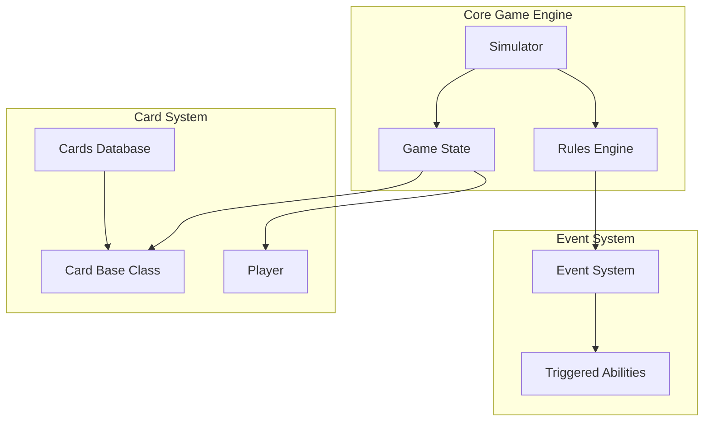
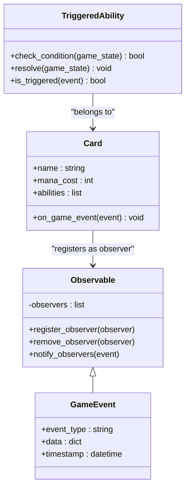
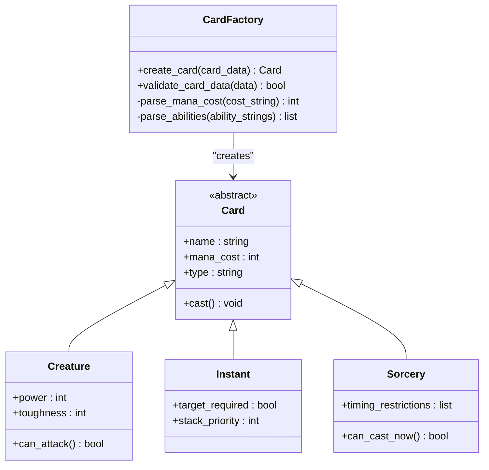
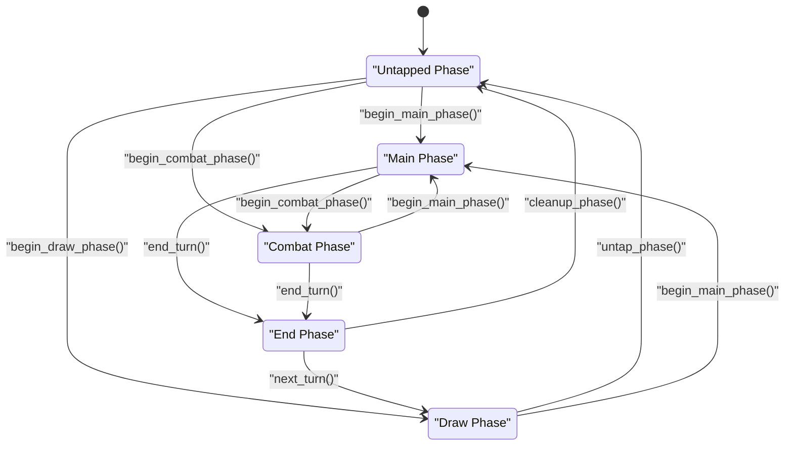
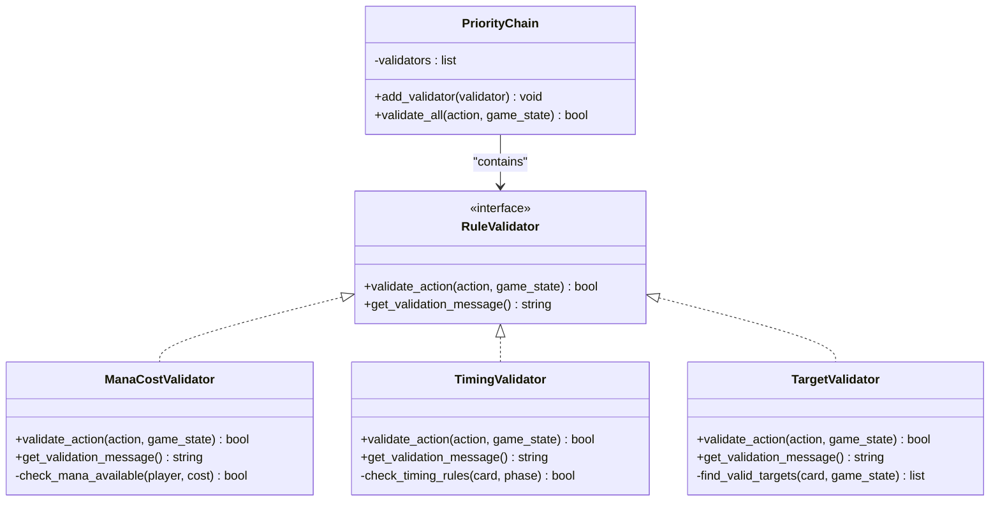
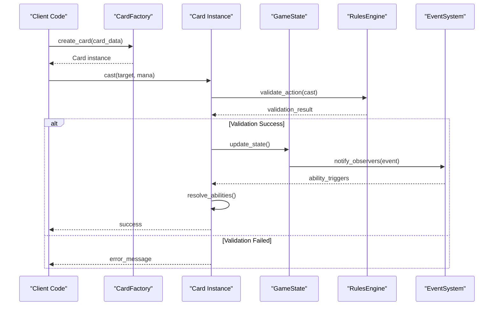
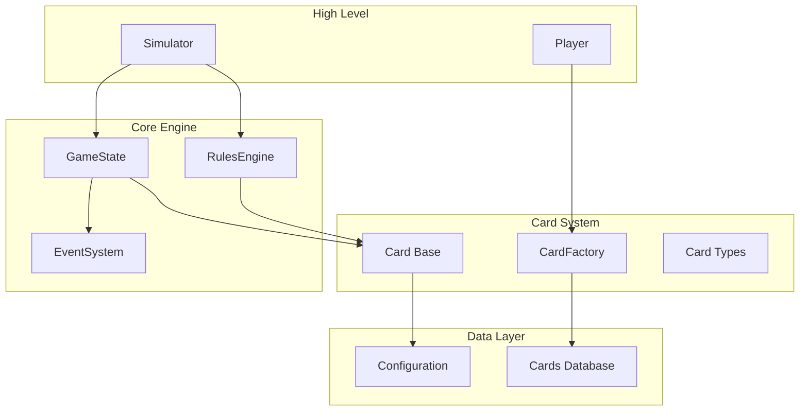

# Design Patterns Implementation

<cite>
**Referenced Files in This Document**
- [card.py](file://simuladorMtg/src/card.py)
- [game_state.py](file://simuladorMtg/src/game_state.py)
- [rules_engine.py](file://simuladorMtg/src/rules_engine.py)
- [simulator.py](file://simuladorMtg/src/simulator.py)
- [player.py](file://simuladorMtg/src/player.py)
- [cards_db.py](file://simuladorMtg/src/cards_db.py)
- [main.py](file://simuladorMtg/main.py)
</cite>

## Table of Contents
1. [Introduction](#introduction)
2. [Project Structure](#project-structure)
3. [Core Components](#core-components)
4. [Architecture Overview](#architecture-overview)
5. [Detailed Component Analysis](#detailed-component-analysis)
6. [Dependency Analysis](#dependency-analysis)
7. [Performance Considerations](#performance-considerations)
8. [Troubleshooting Guide](#troubleshooting-guide)
9. [Conclusion](#conclusion)

## Introduction

This document provides comprehensive documentation for design patterns implementation in the MTG (Magic: The Gathering) Simulator. The simulator implements several key design patterns to create a robust, extensible, and maintainable card game engine. The primary patterns documented include:

- **Observer Pattern**: Enables event-driven architecture for triggered abilities and game state changes
- **Factory Pattern**: Creates different card types dynamically based on card data
- **State Pattern**: Manages game phases and turn progression
- **Strategy Pattern**: Implements various rule validations and card interactions

These patterns work together to create a flexible system that can handle the complex rules and interactions of Magic: The Gathering while maintaining code clarity and extensibility.

## Project Structure

The MTG Simulator follows a modular architecture with clear separation of concerns:

**Diagram sources**
- [simulator.py:1-50](file://simuladorMtg/src/simulator.py#L1-L50)
- [game_state.py:1-50](file://simuladorMtg/src/game_state.py#L1-L50)
- [card.py:1-50](file://simuladorMtg/src/card.py#L1-L50)

**Section sources**
- [simulator.py:1-100](file://simuladorMtg/src/simulator.py#L1-L100)
- [game_state.py:1-100](file://simuladorMtg/src/game_state.py#L1-L100)

## Core Components

### Card System Architecture

The card system forms the foundation of the game, implementing multiple design patterns:

#### Observer Pattern Implementation

The Observer pattern enables event-driven architecture for triggered abilities. When game events occur (like a creature dying or a spell being cast), all registered observers are notified automatically.

**Diagram sources**
- [card.py:1-100](file://simuladorMtg/src/card.py#L1-L100)
- [game_state.py:1-100](file://simuladorMtg/src/game_state.py#L1-L100)

#### Factory Pattern Implementation

The Factory pattern creates different card types dynamically based on card data from the database:

**Diagram sources**
- [cards_db.py:1-100](file://simuladorMtg/src/cards_db.py#L1-L100)
- [card.py:1-100](file://simuladorMtg/src/card.py#L1-L100)

**Section sources**
- [card.py:1-150](file://simuladorMtg/src/card.py#L1-L150)
- [cards_db.py:1-150](file://simuladorMtg/src/cards_db.py#L1-L150)

### Game State Management

#### State Pattern Implementation

The State pattern manages game phases and turn progression, ensuring valid state transitions:

**Diagram sources**
- [game_state.py:1-150](file://simuladorMtg/src/game_state.py#L1-L150)

#### Strategy Pattern Implementation

The Strategy pattern implements various rule validations and card interactions:

**Diagram sources**
- [rules_engine.py:1-150](file://simuladorMtg/src/rules_engine.py#L1-L150)

**Section sources**
- [game_state.py:1-200](file://simuladorMtg/src/game_state.py#L1-L200)
- [rules_engine.py:1-200](file://simuladorMtg/src/rules_engine.py#L1-L200)

## Architecture Overview

The MTG Simulator architecture combines multiple design patterns to create a cohesive, extensible system:

**Diagram sources**
- [simulator.py:1-100](file://simuladorMtg/src/simulator.py#L1-L100)
- [card.py:1-100](file://simuladorMtg/src/card.py#L1-L100)
- [rules_engine.py:1-100](file://simuladorMtg/src/rules_engine.py#L1-L100)

## Detailed Component Analysis

### Observer Pattern for Event-Driven Architecture

The Observer pattern implementation enables triggered abilities to respond to game events without tight coupling between components:

#### Key Implementation Details

- **Observable Base Class**: Provides registration and notification mechanisms
- **Event Types**: Define specific game events (creature_death, spell_cast, etc.)
- **Observer Interface**: Standardizes how components respond to events
- **Automatic Cleanup**: Prevents memory leaks through proper observer management

#### Benefits Achieved

- **Loose Coupling**: Components don't need direct references to each other
- **Scalability**: New observers can be added without modifying existing code
- **Maintainability**: Event handling logic is centralized and testable
- **Flexibility**: Different observers can react to the same events independently

#### Trade-offs Considered

- **Performance Overhead**: Event notifications have computational costs
- **Debugging Complexity**: Event chains can be difficult to trace
- **Memory Management**: Requires careful observer lifecycle management

**Section sources**
- [card.py:1-200](file://simuladorMtg/src/card.py#L1-L200)
- [game_state.py:1-200](file://simuladorMtg/src/game_state.py#L1-L200)

### Factory Pattern for Dynamic Card Creation

The Factory pattern handles the complexity of creating different card types from standardized data:

#### Implementation Architecture

- **CardFactory**: Centralized creation logic with type detection
- **Data Validation**: Ensures card data integrity before creation
- **Type-Specific Initialization**: Handles unique initialization for each card type
- **Error Handling**: Provides meaningful error messages for invalid data

#### Extension Points

- **New Card Types**: Add new factory methods and validation rules
- **Custom Parsing**: Implement specialized parsing for new card formats
- **Validation Rules**: Extend validation chain for new card properties

**Section sources**
- [cards_db.py:1-200](file://simuladorMtg/src/cards_db.py#L1-L200)
- [card.py:1-200](file://simuladorMtg/src/card.py#L1-L200)

### State Pattern for Game Phase Management

The State pattern ensures valid game state transitions and encapsulates phase-specific logic:

#### State Machine Design

- **Abstract State Interface**: Defines common operations for all states
- **Concrete States**: Implement phase-specific behavior and transitions
- **Context Manager**: Maintains current state and delegates operations
- **Transition Rules**: Enforce valid state changes according to game rules

#### Phase Management Features

- **Automatic Transitions**: Handle standard phase progression
- **Conditional Transitions**: Support special cases and player choices
- **State Validation**: Ensure transitions comply with game rules
- **Cleanup Operations**: Proper resource management during state changes

**Section sources**
- [game_state.py:1-300](file://simuladorMtg/src/game_state.py#L1-L300)

### Strategy Pattern for Rule Validation

The Strategy pattern implements flexible rule validation with pluggable validators:

#### Validator Architecture

- **Validator Interface**: Standardizes validation logic across different rule types
- **Concrete Validators**: Implement specific validation strategies
- **Validation Chain**: Allows multiple validators to process actions sequentially
- **Result Aggregation**: Combines validation results with detailed error messages

#### Validation Strategies

- **Mana Cost Validation**: Checks available mana and payment requirements
- **Timing Validation**: Ensures cards can be played at appropriate times
- **Target Validation**: Validates target selection and availability
- **Priority Validation**: Manages action priority and timing windows

**Section sources**
- [rules_engine.py:1-300](file://simuladorMtg/src/rules_engine.py#L1-L300)

## Dependency Analysis

The component dependencies follow clear architectural boundaries:

**Diagram sources**
- [simulator.py:1-100](file://simuladorMtg/src/simulator.py#L1-L100)
- [player.py:1-100](file://simuladorMtg/src/player.py#L1-L100)
- [game_state.py:1-100](file://simuladorMtg/src/game_state.py#L1-L100)

**Section sources**
- [simulator.py:1-150](file://simuladorMtg/src/simulator.py#L1-L150)
- [player.py:1-150](file://simuladorMtg/src/player.py#L1-L150)

## Performance Considerations

### Memory Management

- **Observer Cleanup**: Automatic removal of dead observers prevents memory leaks
- **Object Pooling**: Reuse expensive objects like card instances where possible
- **Lazy Loading**: Load card data only when needed to reduce initial memory footprint

### Event Processing Optimization

- **Event Batching**: Group related events to reduce processing overhead
- **Selective Notification**: Only notify relevant observers for specific events
- **Asynchronous Processing**: Handle non-critical events asynchronously

### State Transition Efficiency

- **State Caching**: Cache frequently accessed state information
- **Incremental Updates**: Update only affected parts of game state
- **Transition Validation**: Minimize validation overhead through early exits

## Troubleshooting Guide

### Common Issues and Solutions

#### Event System Problems

- **Missing Observers**: Verify observer registration before event firing
- **Circular Dependencies**: Check for circular references in event handlers
- **Memory Leaks**: Monitor observer cleanup and garbage collection

#### Card Creation Issues

- **Invalid Data**: Validate card data format before factory processing
- **Type Conflicts**: Ensure unique identifiers for card types
- **Resource Exhaustion**: Monitor memory usage during bulk card creation

#### State Management Errors

- **Invalid Transitions**: Log and reject illegal state changes
- **State Inconsistency**: Implement state validation checks
- **Race Conditions**: Use proper synchronization for concurrent state access

**Section sources**
- [rules_engine.py:1-200](file://simuladorMtg/src/rules_engine.py#L1-L200)
- [game_state.py:1-200](file://simuladorMtg/src/game_state.py#L1-L200)

## Conclusion

The MTG Simulator successfully implements four key design patterns to create a robust, extensible card game engine:

### Pattern Benefits Summary

- **Observer Pattern**: Enables loose coupling and scalable event handling
- **Factory Pattern**: Simplifies object creation and promotes polymorphism
- **State Pattern**: Encapsulates complex state logic and ensures validity
- **Strategy Pattern**: Provides flexible algorithm selection and easy extension

### Extensibility Points

The architecture supports easy extension through:

- **New Card Types**: Add via Factory pattern with minimal core changes
- **Custom Rules**: Implement new Strategy validators without modifying existing code
- **Additional Events**: Create new Observer handlers for game events
- **State Extensions**: Add new game phases through State pattern implementation

### Future Enhancements

Potential areas for additional pattern implementation:

- **Command Pattern**: For undo/redo functionality and action replay
- **Template Method Pattern**: For standardizing card ability resolution
- **Mediator Pattern**: For coordinating complex card interactions
- **Builder Pattern**: For constructing complex card configurations

The design patterns implemented provide a solid foundation for extending the MTG Simulator while maintaining code quality, performance, and maintainability.