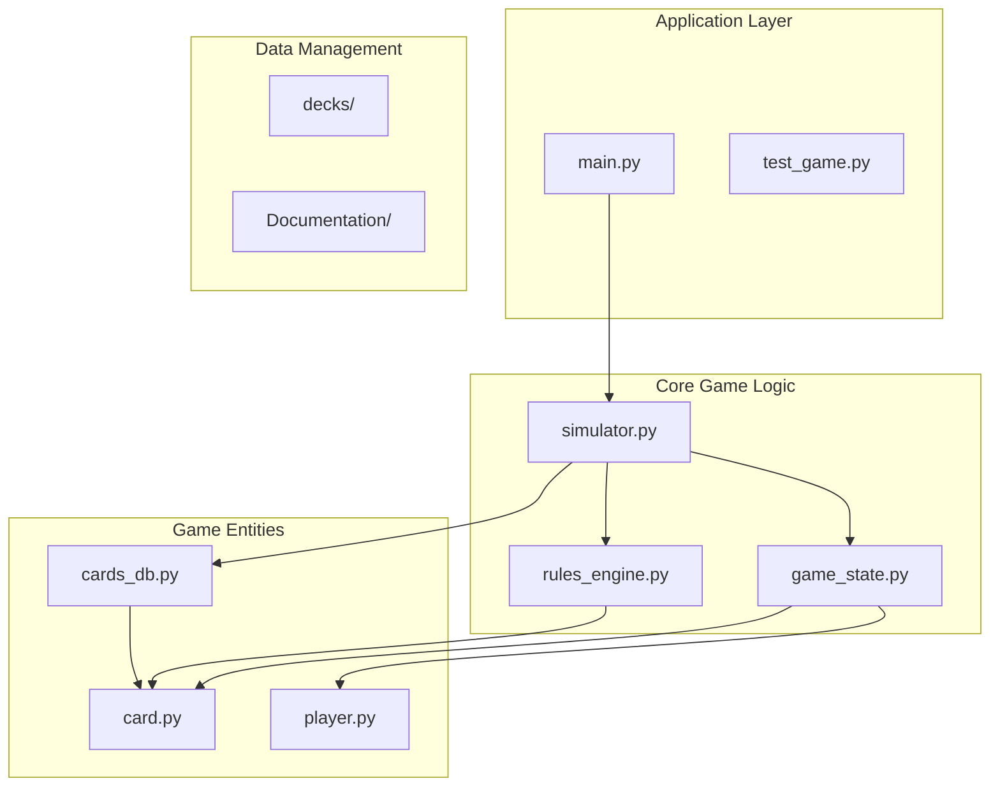
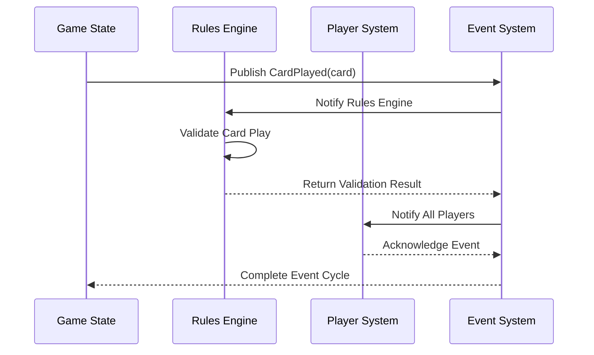
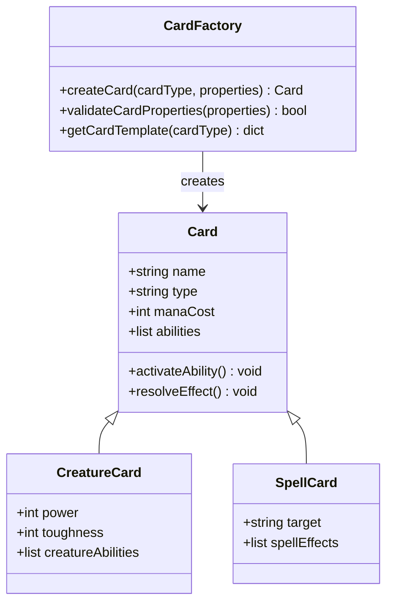
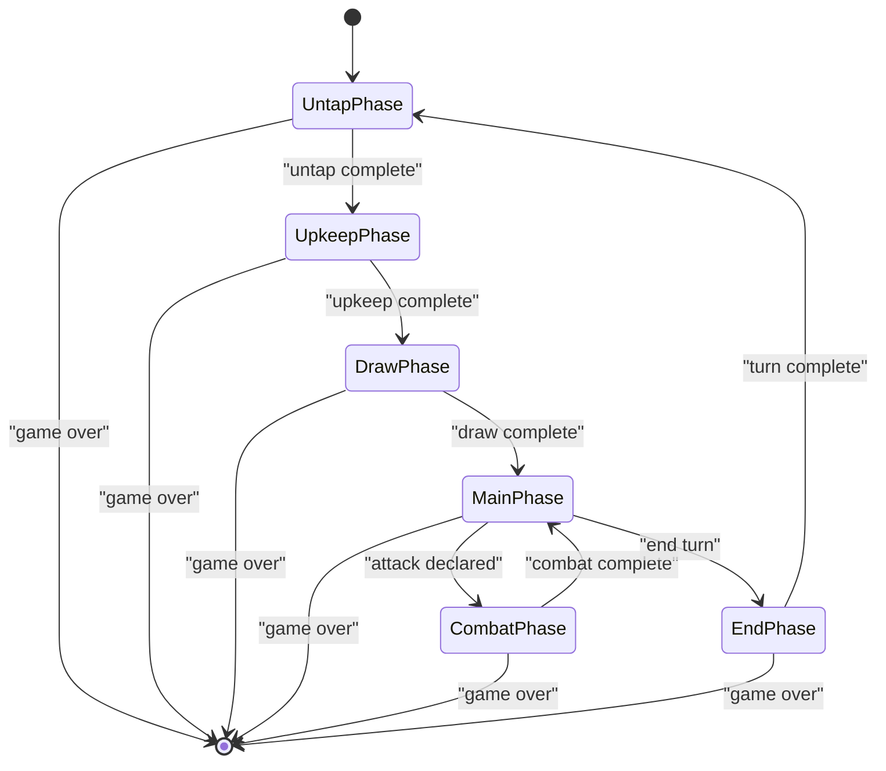
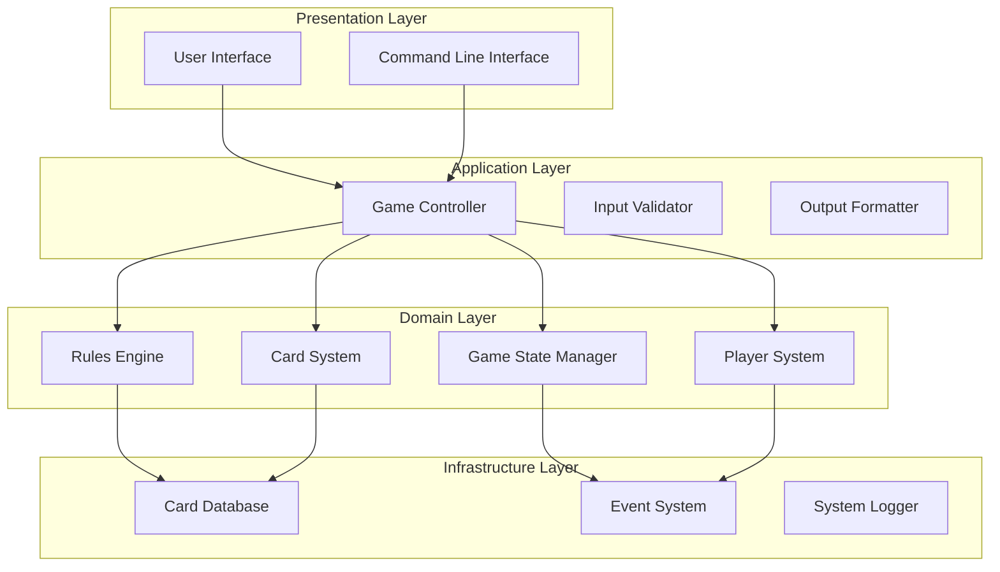
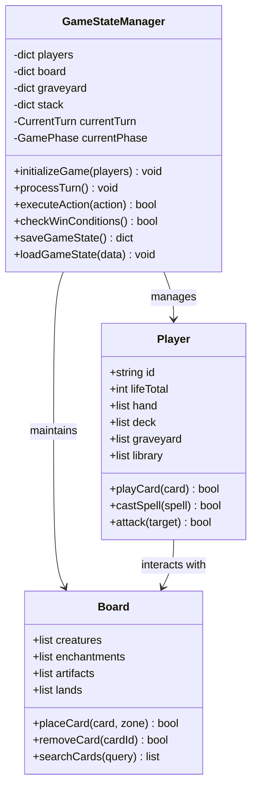
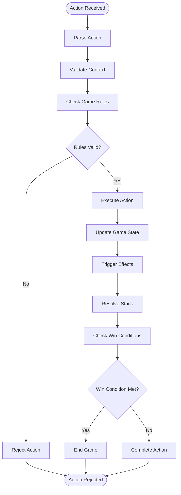
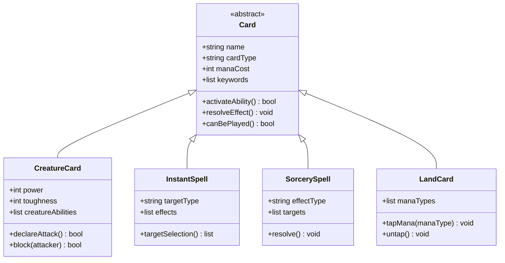
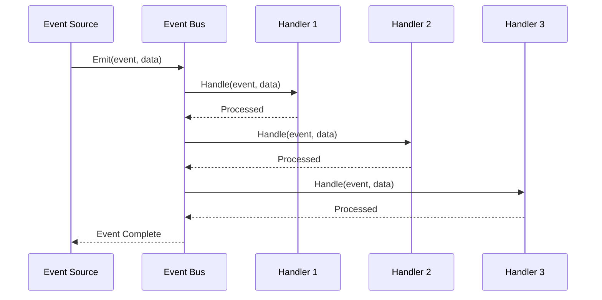
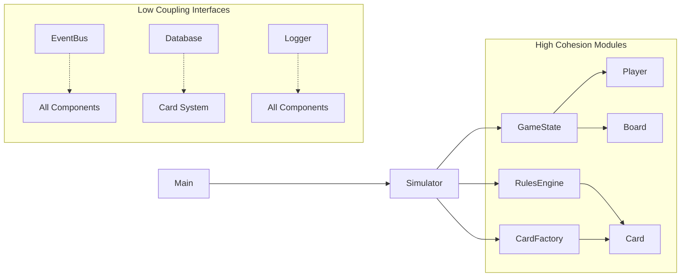

# System Design & Architecture Patterns

<cite>
**Referenced Files in This Document**
- [main.py](file://simuladorMtg/main.py)
- [simulator.py](file://simuladorMtg/src/simulator.py)
- [game_state.py](file://simuladorMtg/src/game_state.py)
- [rules_engine.py](file://simuladorMtg/src/rules_engine.py)
- [card.py](file://simuladorMtg/src/card.py)
- [player.py](file://simuladorMtg/src/player.py)
- [cards_db.py](file://simuladorMtg/src/cards_db.py)
- [Arquitetura.md](file://simuladorMtg/Arquitetura.md)
- [Rules Engine.md](file://simuladorMtg/Rules Engine.md)
</cite>

## Table of Contents
1. [Introduction](#introduction)
2. [Project Structure](#project-structure)
3. [Core Components](#core-components)
4. [Architecture Overview](#architecture-overview)
5. [Detailed Component Analysis](#detailed-component-analysis)
6. [Dependency Analysis](#dependency-analysis)
7. [Performance Considerations](#performance-considerations)
8. [Troubleshooting Guide](#troubleshooting-guide)
9. [Conclusion](#conclusion)

## Introduction

The MTG Simulator is a comprehensive implementation of Magic: The Gathering game mechanics using Python's object-oriented programming paradigm. The system follows established design patterns including Model-View-Controller (MVC), Observer pattern for event handling, Factory pattern for card creation, and State pattern for turn management. This architecture ensures maintainability, extensibility, and clear separation of concerns across all game components.

The simulator provides a complete game engine that handles card interactions, player actions, rule enforcement, and state transitions while maintaining high performance and code organization through modular design principles.

## Project Structure

The MTG Simulator follows a well-organized modular architecture with clear separation between core game logic, data management, and user interface components:

**Diagram sources**
- [main.py:1-50](file://simuladorMtg/main.py#L1-L50)
- [simulator.py:1-100](file://simuladorMtg/src/simulator.py#L1-L100)
- [game_state.py:1-100](file://simuladorMtg/src/game_state.py#L1-L100)

**Section sources**
- [Arquitetura.md](file://simuladorMtg/Arquitetura.md)
- [Rules Engine.md](file://simuladorMtg/Rules Engine.md)

## Core Components

### Model-View-Controller Architecture

The system implements a clean MVC separation where:

- **Model Layer**: Handles game state, card definitions, and data persistence
- **View Layer**: Manages user interface and display logic  
- **Controller Layer**: Orchestrates game flow and user interactions

### Key Architectural Patterns

#### Observer Pattern Implementation
Event-driven architecture enables loose coupling between components through publish-subscribe messaging:

**Diagram sources**
- [game_state.py:1-150](file://simuladorMtg/src/game_state.py#L1-L150)
- [rules_engine.py:1-100](file://simuladorMtg/src/rules_engine.py#L1-L100)

#### Factory Pattern for Card Creation
Card instantiation follows the Factory pattern to handle different card types and abilities:

**Diagram sources**
- [card.py:1-200](file://simuladorMtg/src/card.py#L1-L200)
- [cards_db.py:1-100](file://simuladorMtg/src/cards_db.py#L1-L100)

#### State Pattern for Turn Management
Turn progression uses the State pattern to manage game phases and player turns:

**Diagram sources**
- [game_state.py:1-200](file://simuladorMtg/src/game_state.py#L1-L200)

**Section sources**
- [simulator.py:1-150](file://simuladorMtg/src/simulator.py#L1-L150)
- [game_state.py:1-200](file://simuladorMtg/src/game_state.py#L1-L200)
- [card.py:1-200](file://simuladorMtg/src/card.py#L1-L200)

## Architecture Overview

The MTG Simulator employs a layered architecture with clear separation of responsibilities:

**Diagram sources**
- [main.py:1-100](file://simuladorMtg/main.py#L1-L100)
- [simulator.py:1-200](file://simuladorMtg/src/simulator.py#L1-L200)

### Technical Decisions

#### Python Standard Library Usage
The system leverages Python's standard library for maximum portability:
- `collections` for data structures and containers
- `enum` for type-safe enumerations
- `dataclasses` for immutable data objects
- `logging` for system diagnostics
- `json` for configuration and save files

#### Modular File Organization
Each component resides in dedicated modules following single responsibility principle:
- Separation of concerns between game logic and presentation
- Clear interfaces between components
- Dependency injection for testability

**Section sources**
- [Arquitetura.md](file://simuladorMtg/Arquitetura.md)
- [Rules Engine.md](file://simuladorMtg/Rules Engine.md)

## Detailed Component Analysis

### Game State Manager

The Game State Manager serves as the central coordinator for all game operations, maintaining consistency across the entire game session:

**Diagram sources**
- [game_state.py:1-300](file://simuladorMtg/src/game_state.py#L1-L300)
- [player.py:1-200](file://simuladorMtg/src/player.py#L1-L200)

### Rules Engine

The Rules Engine enforces Magic: The Gathering rules and validates all game actions:

**Diagram sources**
- [rules_engine.py:1-250](file://simuladorMtg/src/rules_engine.py#L1-L250)

### Card System

The Card System implements the Factory pattern for creating and managing different card types:

**Diagram sources**
- [card.py:1-300](file://simuladorMtg/src/card.py#L1-L300)

### Event System

The Event System implements the Observer pattern for decoupled communication:

**Diagram sources**
- [game_state.py:1-200](file://simuladorMtg/src/game_state.py#L1-L200)

**Section sources**
- [game_state.py:1-300](file://simuladorMtg/src/game_state.py#L1-L300)
- [rules_engine.py:1-250](file://simuladorMtg/src/rules_engine.py#L1-L250)
- [card.py:1-300](file://simuladorMtg/src/card.py#L1-L300)

## Dependency Analysis

The system exhibits low coupling and high cohesion through careful dependency management:

**Diagram sources**
- [simulator.py:1-150](file://simuladorMtg/src/simulator.py#L1-L150)
- [game_state.py:1-200](file://simuladorMtg/src/game_state.py#L1-L200)

### Dependency Relationships

- **Loose Coupling**: Components communicate through well-defined interfaces
- **Single Responsibility**: Each module has one clear purpose
- **Dependency Inversion**: High-level modules depend on abstractions
- **Interface Segregation**: Small, focused interfaces per component

**Section sources**
- [simulator.py:1-200](file://simuladorMtg/src/simulator.py#L1-L200)

## Performance Considerations

### Memory Management
- Efficient card object pooling to reduce garbage collection overhead
- Lazy loading of card database entries
- Optimized board state representation using hash maps

### Algorithmic Efficiency
- O(1) card lookup using dictionary-based indexing
- Amortized O(log n) sorting for priority queues
- Constant-time ability resolution through pre-computed tables

### Scalability Features
- Asynchronous event processing for large games
- Incremental state updates to minimize memory allocation
- Configurable simulation speed for different use cases

## Troubleshooting Guide

### Common Issues and Solutions

#### Game State Inconsistencies
- Verify all state transitions are atomic
- Implement state validation hooks at critical points
- Use snapshot testing for complex scenarios

#### Performance Bottlenecks
- Profile card ability resolution paths
- Monitor memory usage during long games
- Optimize frequently called methods

#### Event Handling Problems
- Ensure proper event listener registration
- Implement dead letter queues for failed events
- Add comprehensive event logging

### Debugging Tools
- Built-in game state inspection utilities
- Step-by-step action execution mode
- Comprehensive logging framework

## Conclusion

The MTG Simulator demonstrates effective application of object-oriented design patterns to create a maintainable and extensible game engine. The combination of MVC architecture, Observer pattern for events, Factory pattern for card creation, and State pattern for turn management results in a system that is both powerful and easy to understand.

The modular design allows for easy extension of game mechanics, while the clear separation of concerns ensures that changes in one area don't inadvertently affect others. The use of Python's standard library provides excellent portability and reduces external dependencies.

This architecture serves as a solid foundation for future enhancements, including network multiplayer support, advanced AI opponents, and integration with external card databases.