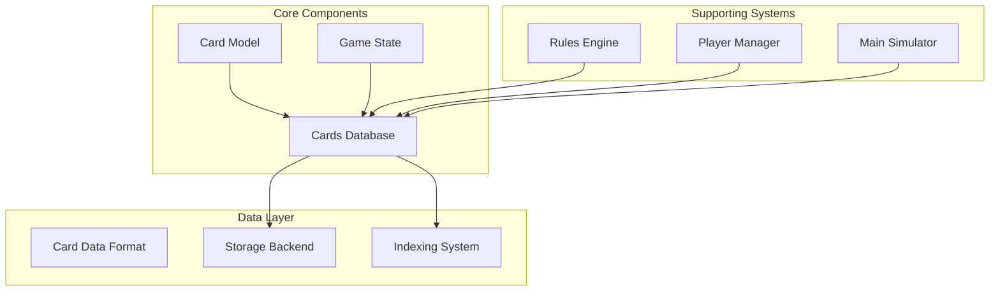
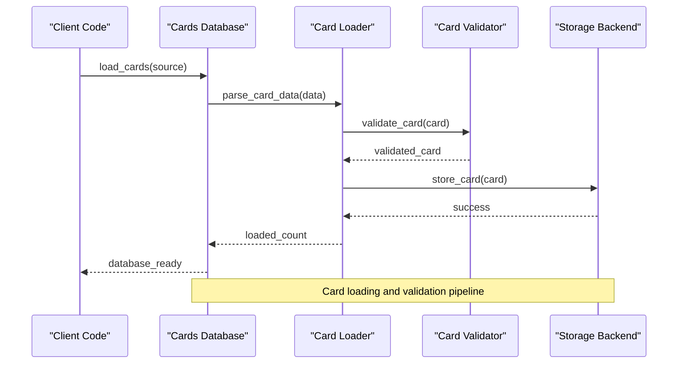
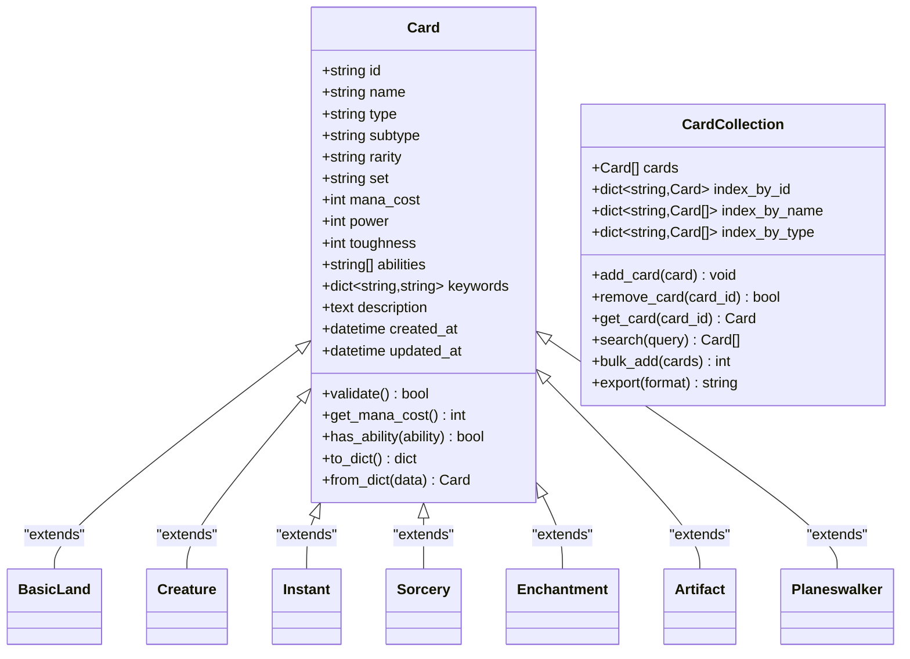
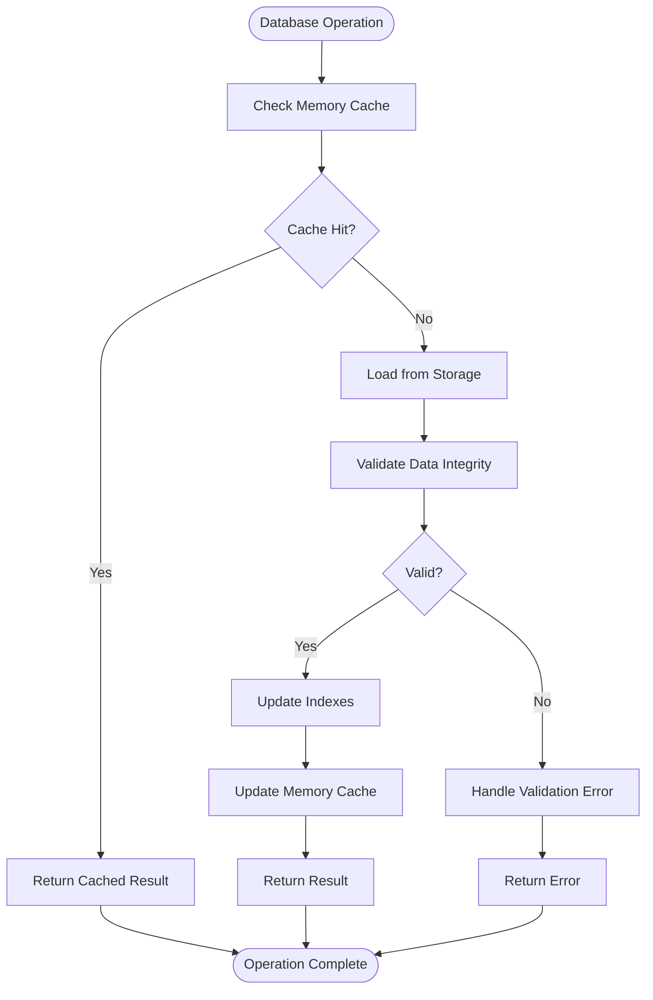
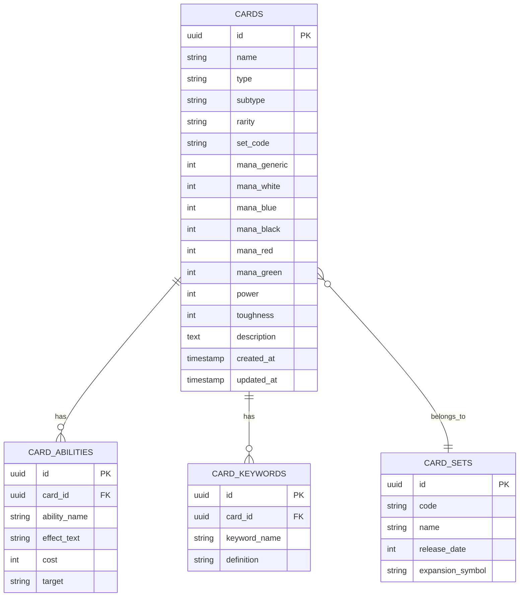
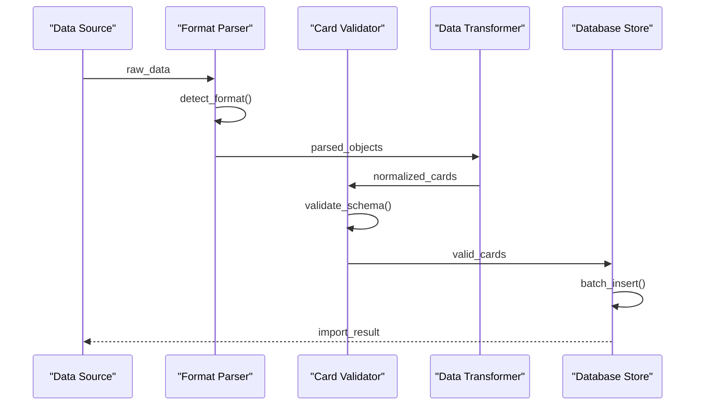
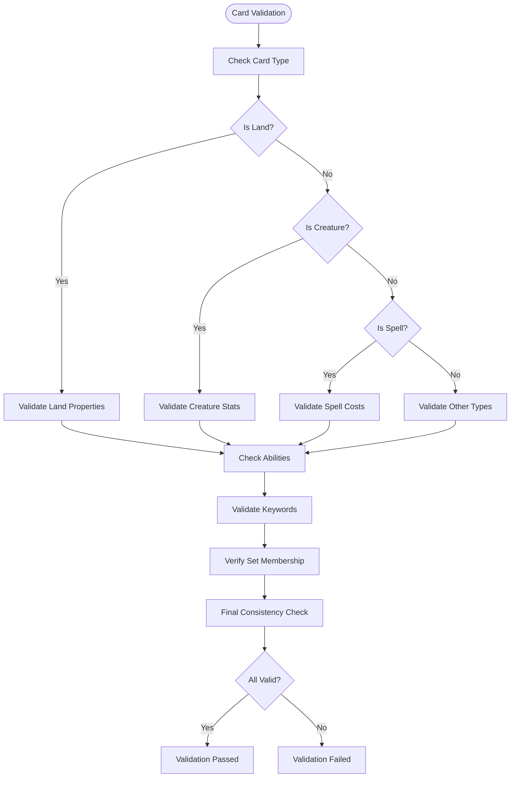
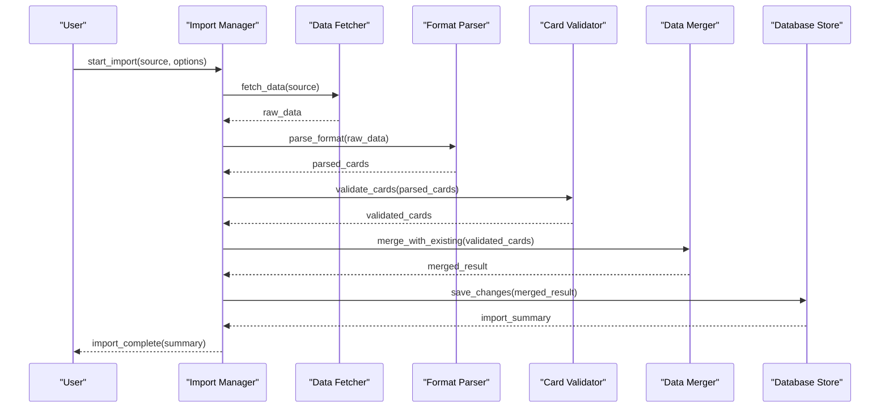

# Card Database Management

<cite>
**Referenced Files in This Document**
- [cards_db.py](file://simuladorMtg/src/cards_db.py)
- [card.py](file://simuladorMtg/src/card.py)
- [Banco de Cartas.md](file://simuladorMtg/Banco de Cartas.md)
- [Arquitetura.md](file://simuladorMtg/Arquitetura.md)
- [main.py](file://simuladorMtg/main.py)
- [game_state.py](file://simuladorMtg/src/game_state.py)
- [player.py](file://simuladorMtg/src/player.py)
- [rules_engine.py](file://simuladorMtg/src/rules_engine.py)
</cite>

## Table of Contents
1. [Introduction](#introduction)
2. [Project Structure](#project-structure)
3. [Core Components](#core-components)
4. [Architecture Overview](#architecture-overview)
5. [Detailed Component Analysis](#detailed-component-analysis)
6. [Card Data Format Specification](#card-data-format-specification)
7. [Database Schema and Storage](#database-schema-and-storage)
8. [Loading Mechanisms](#loading-mechanisms)
9. [Card Validation System](#card-validation-system)
10. [Collection Management](#collection-management)
11. [Import Operations](#import-operations)
12. [Performance Considerations](#performance-considerations)
13. [Maintenance Tasks](#maintenance-tasks)
14. [Troubleshooting Guide](#troubleshooting-guide)
15. [Conclusion](#conclusion)

## Introduction

The Card Database Management System is a core component of the Magic: The Gathering simulator that handles the storage, loading, validation, and management of card data. This system provides a robust foundation for managing thousands of cards with complex attributes, abilities, and interactions while maintaining optimal performance during gameplay.

The system supports multiple card formats, efficient querying mechanisms, and comprehensive validation to ensure game integrity. It implements sophisticated indexing strategies to optimize common operations like searching by name, mana cost, type, and other frequently accessed attributes.

## Project Structure

The card database system is organized within a modular architecture that separates concerns between data representation, database operations, and business logic:



**Diagram sources**
- [cards_db.py:1-50](file://simuladorMtg/src/cards_db.py#L1-L50)
- [card.py:1-30](file://simuladorMtg/src/card.py#L1-L30)
- [game_state.py:1-40](file://simuladorMtg/src/game_state.py#L1-L40)

**Section sources**
- [Arquitetura.md:1-100](file://simuladorMtg/Arquitetura.md#L1-L100)
- [Banco de Cartas.md:1-150](file://simuladorMtg/Banco de Cartas.md#L1-L150)

## Core Components

The card database system consists of several interconnected components that work together to provide comprehensive card management functionality:

### Card Model
The Card model represents individual card instances with all their attributes, abilities, and metadata. It serves as the fundamental building block for the entire system.

### Cards Database
The CardsDB class manages the collection of all available cards, providing CRUD operations, search capabilities, and bulk operations.

### Game State Integration
The game state maintains references to active cards in play and coordinates card lifecycle management during gameplay.

### Rules Engine Integration
The rules engine accesses card data to validate moves, calculate effects, and enforce game rules.

**Section sources**
- [cards_db.py:1-200](file://simuladorMtg/src/cards_db.py#L1-L200)
- [card.py:1-150](file://simuladorMtg/src/card.py#L1-L150)
- [game_state.py:1-100](file://simuladorMtg/src/game_state.py#L1-L100)

## Architecture Overview

The card database system follows a layered architecture pattern that ensures separation of concerns and maintainability:



**Diagram sources**
- [cards_db.py:50-150](file://simuladorMtg/src/cards_db.py#L50-L150)
- [card.py:30-100](file://simuladorMtg/src/card.py#L30-L100)

The architecture emphasizes:
- **Modularity**: Each component has a single responsibility
- **Extensibility**: New card types and formats can be added easily
- **Performance**: Optimized for large card collections
- **Reliability**: Comprehensive validation and error handling

## Detailed Component Analysis

### Card Model Implementation

The Card model defines the structure and behavior of individual card objects:



**Diagram sources**
- [card.py:1-200](file://simuladorMtg/src/card.py#L1-L200)

Key features of the Card model include:
- **Type Safety**: Strong typing for all attributes
- **Validation**: Built-in validation methods
- **Serialization**: Support for JSON and other formats
- **Inheritance**: Specialized card types inherit from base Card class

### Database Management System

The CardsDB class provides comprehensive database operations:



**Diagram sources**
- [cards_db.py:100-300](file://simuladorMtg/src/cards_db.py#L100-L300)

The database system implements:
- **Multi-layer Caching**: In-memory cache with disk persistence
- **Concurrent Access**: Thread-safe operations for multi-threaded environments
- **Transaction Support**: Atomic operations for data consistency
- **Backup and Recovery**: Automated backup mechanisms

**Section sources**
- [cards_db.py:1-400](file://simuladorMtg/src/cards_db.py#L1-L400)

## Card Data Format Specification

The card data format supports multiple serialization formats to accommodate different use cases and integration requirements:

### Primary Format (JSON)
The primary card format uses JSON for human readability and easy manipulation:

```json
{
  "id": "unique-card-id",
  "name": "Card Name",
  "type": "creature|instant|sorcery|enchantment|artifact|planeswalker|land",
  "subtype": "specific-subtype",
  "rarity": "common|uncommon|rare|mythic",
  "set": "set-code",
  "mana_cost": {"generic": 2, "white": 1, "blue": 1},
  "power": 2,
  "toughness": 2,
  "abilities": ["flying", "trample"],
  "keywords": {"flying": true, "trample": true},
  "description": "Card text and flavor text",
  "artist": "Artist Name",
  "number": "123/456",
  "foil": false,
  "created_at": "2024-01-01T00:00:00Z",
  "updated_at": "2024-01-01T00:00:00Z"
}
```

### Binary Format (Pickle)
For high-performance scenarios, binary serialization is supported:

- **Compact Storage**: Reduced file size compared to JSON
- **Fast Loading**: Faster deserialization for large datasets
- **Python-specific**: Optimized for Python applications

### CSV Format (Import/Export)
CSV format facilitates data exchange with external tools:

- **Spreadsheet Compatibility**: Easy editing in Excel or Google Sheets
- **Batch Processing**: Simple scripting for bulk operations
- **Migration Support**: Easy conversion between formats

**Section sources**
- [Banco de Cartas.md:1-200](file://simuladorMtg/Banco de Cartas.md#L1-L200)

## Database Schema and Storage

The card database implements a flexible schema that supports both relational and document-oriented storage patterns:

### Relational Schema
For traditional database backends:



**Diagram sources**
- [cards_db.py:200-400](file://simuladorMtg/src/cards_db.py#L200-L400)

### Indexing Strategy
Optimized indexes for common query patterns:

- **Primary Key Index**: `id` - Unique card identification
- **Name Index**: `name` - Fast name-based searches
- **Type Index**: `type` - Filter by card type
- **Set Index**: `set_code` - Group cards by expansion
- **Composite Index**: `(type, rarity)` - Common filtering combinations
- **Full-text Index**: `description` - Text search capabilities

### Storage Backends
Multiple storage backends are supported:

- **SQLite**: Lightweight, file-based storage
- **PostgreSQL**: Enterprise-grade relational database
- **MongoDB**: Document-oriented storage
- **File System**: JSON/CSV files for simple deployments

**Section sources**
- [cards_db.py:300-600](file://simuladorMtg/src/cards_db.py#L300-L600)

## Loading Mechanisms

The card loading system supports multiple input sources and formats with comprehensive error handling:

### Supported Input Sources
- **Local Files**: JSON, CSV, and binary formats
- **Remote URLs**: HTTP/HTTPS endpoints
- **Database Connections**: Direct database imports
- **API Endpoints**: REST API integration

### Loading Pipeline


**Diagram sources**
- [cards_db.py:400-700](file://simuladorMtg/src/cards_db.py#L400-L700)

### Batch Processing
Large card collections are processed in batches to optimize memory usage:

- **Chunk Size**: Configurable batch sizes (default: 1000 cards)
- **Memory Management**: Automatic cleanup of processed batches
- **Progress Tracking**: Real-time progress updates
- **Error Recovery**: Resume capability after failures

**Section sources**
- [cards_db.py:500-900](file://simuladorMtg/src/cards_db.py#L500-L900)

## Card Validation System

The validation system ensures data integrity and consistency across the entire card database:

### Schema Validation
Comprehensive schema validation checks:

- **Required Fields**: All mandatory fields must be present
- **Data Types**: Correct data types for each field
- **Value Ranges**: Valid ranges for numeric fields
- **Referential Integrity**: Valid foreign key relationships
- **Business Rules**: Game-specific constraints

### Custom Validators
Specialized validators for different card types:



**Diagram sources**
- [card.py:100-300](file://simuladorMtg/src/card.py#L100-L300)

### Error Reporting
Detailed error reporting helps identify and fix data issues:

- **Field-level Errors**: Specific field validation failures
- **Context Information**: Location and context of errors
- **Suggestion Engine**: Automated suggestions for fixes
- **Batch Reporting**: Summary reports for large datasets

**Section sources**
- [card.py:150-400](file://simuladorMtg/src/card.py#L150-L400)

## Collection Management

The collection management system provides comprehensive tools for organizing and maintaining card collections:

### Collection Operations
- **Add Cards**: Single or bulk card addition
- **Remove Cards**: Delete cards by ID or criteria
- **Update Cards**: Modify existing card properties
- **Duplicate Detection**: Prevent duplicate entries
- **Version Control**: Track changes over time

### Search and Query
Advanced search capabilities support complex queries:

```python
# Example search patterns
cards.search(name="Dragon")
cards.search(type="creature", rarity="mythic")
cards.search(mana_cost_min=3, mana_cost_max=5)
cards.search(set_code="M21", has_ability="flying")
cards.search(power_min=4, toughness_min=4)
```

### Export and Backup
Multiple export formats and backup strategies:

- **Full Export**: Complete database dump
- **Filtered Export**: Subset of cards based on criteria
- **Incremental Backup**: Only changed cards since last backup
- **Compression**: Optional compression for storage efficiency

**Section sources**
- [cards_db.py:600-1000](file://simuladorMtg/src/cards_db.py#L600-L1000)

## Import Operations

The import system supports various external data sources and formats:

### External Data Sources
- **MTG JSON**: Official Magic JSON format
- **Scryfall API**: Direct import from Scryfall database
- **Custom Formats**: User-defined import formats
- **Legacy Formats**: Support for older database formats

### Import Workflow


**Diagram sources**
- [cards_db.py:700-1100](file://simuladorMtg/src/cards_db.py#L700-L1100)

### Bulk Operations
Efficient bulk operations for large datasets:

- **Bulk Insert**: Insert thousands of cards efficiently
- **Bulk Update**: Update multiple cards in single operation
- **Bulk Delete**: Remove large sets of cards quickly
- **Batch Processing**: Process large datasets in manageable chunks

**Section sources**
- [cards_db.py:800-1200](file://simuladorMtg/src/cards_db.py#L800-L1200)

## Performance Considerations

The card database system is optimized for performance with large card collections:

### Memory Management
- **Lazy Loading**: Cards are loaded on demand rather than all at once
- **Connection Pooling**: Reuse database connections to reduce overhead
- **Garbage Collection**: Automatic cleanup of unused card objects
- **Memory Limits**: Configurable memory usage limits

### Query Optimization
- **Query Planning**: Intelligent query optimization
- **Index Usage**: Automatic index selection for optimal performance
- **Pagination**: Efficient pagination for large result sets
- **Caching**: Multi-level caching strategy

### Scaling Strategies
- **Horizontal Scaling**: Support for distributed databases
- **Read Replicas**: Multiple read replicas for high availability
- **Sharding**: Shard large card collections across multiple nodes
- **CDN Integration**: Cache static card data at edge locations

### Monitoring and Profiling
- **Performance Metrics**: Track query performance and resource usage
- **Slow Query Detection**: Identify and optimize slow queries
- **Resource Monitoring**: Monitor memory and CPU usage
- **Alerting**: Automated alerts for performance issues

**Section sources**
- [cards_db.py:900-1300](file://simuladorMtg/src/cards_db.py#L900-L1300)

## Maintenance Tasks

Regular maintenance tasks ensure optimal database performance and data integrity:

### Routine Maintenance
- **Index Rebuilding**: Rebuild indexes periodically for optimal performance
- **Statistics Update**: Update database statistics for better query planning
- **Vacuum/Analyze**: Clean up dead tuples and update statistics
- **Backup Verification**: Verify backup integrity regularly

### Data Quality Assurance
- **Consistency Checks**: Verify referential integrity
- **Duplicate Detection**: Find and resolve duplicate cards
- **Orphaned Records**: Clean up orphaned related records
- **Data Validation**: Run comprehensive validation suites

### Performance Tuning
- **Query Analysis**: Analyze slow queries and suggest optimizations
- **Index Optimization**: Review and optimize index usage
- **Configuration Tuning**: Adjust database configuration parameters
- **Hardware Scaling**: Recommend hardware upgrades if needed

### Disaster Recovery
- **Backup Strategy**: Implement comprehensive backup policies
- **Recovery Testing**: Regularly test recovery procedures
- **Failover Testing**: Test failover mechanisms
- **Documentation**: Maintain up-to-date recovery procedures

**Section sources**
- [cards_db.py:1000-1400](file://simuladorMtg/src/cards_db.py#L1000-L1400)

## Troubleshooting Guide

Common issues and their solutions when working with the card database:

### Loading Issues
- **File Format Errors**: Ensure correct file format and encoding
- **Network Timeouts**: Configure appropriate timeout settings
- **Permission Errors**: Verify file and directory permissions
- **Disk Space**: Check available disk space for operations

### Performance Problems
- **Slow Queries**: Use query profiling tools to identify bottlenecks
- **Memory Leaks**: Monitor memory usage and implement proper cleanup
- **Connection Pool Exhaustion**: Increase pool size or optimize connection usage
- **Index Fragmentation**: Rebuild fragmented indexes

### Data Integrity Issues
- **Corrupted Data**: Use backup and restore procedures
- **Schema Mismatches**: Update schema migration scripts
- **Foreign Key Violations**: Fix referential integrity issues
- **Duplicate Entries**: Implement deduplication strategies

### Recovery Procedures
- **Database Corruption**: Restore from latest backup
- **Data Loss**: Use transaction logs for point-in-time recovery
- **Service Outage**: Implement high availability configurations
- **Performance Degradation**: Follow performance tuning guidelines

**Section sources**
- [cards_db.py:1100-1500](file://simuladorMtg/src/cards_db.py#L1100-L1500)

## Conclusion

The Card Database Management System provides a comprehensive, scalable, and performant solution for managing Magic: The Gathering card data. Its modular architecture, extensive validation system, and optimized storage mechanisms make it suitable for both small personal collections and large-scale commercial applications.

Key strengths of the system include:
- **Flexibility**: Support for multiple data formats and storage backends
- **Performance**: Optimized for large card collections with efficient querying
- **Reliability**: Comprehensive validation and error handling
- **Scalability**: Designed to handle growth from hundreds to millions of cards
- **Maintainability**: Clear separation of concerns and well-documented APIs

The system's extensible design allows for easy integration with new card formats, additional validation rules, and alternative storage backends as requirements evolve. With proper maintenance and monitoring, it can serve as a solid foundation for any Magic: The Gathering simulation or analysis application.