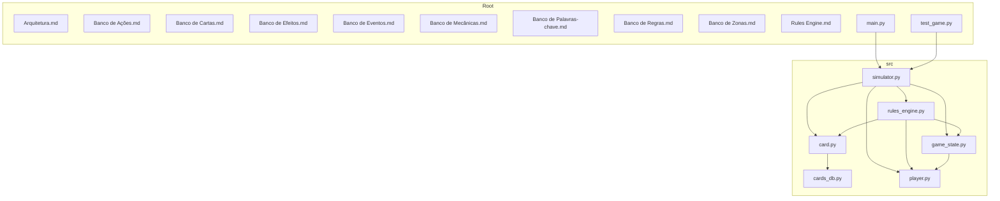
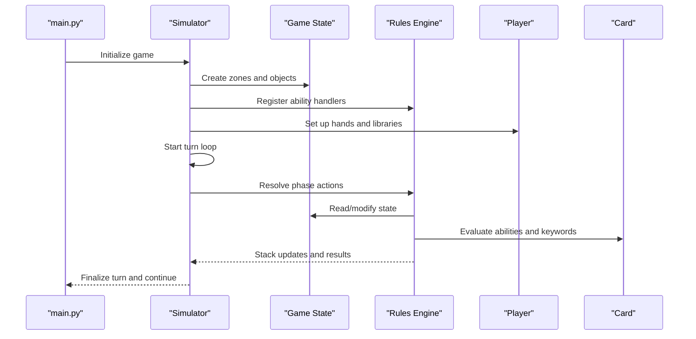
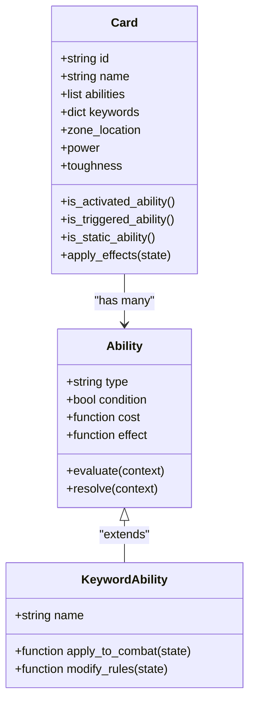
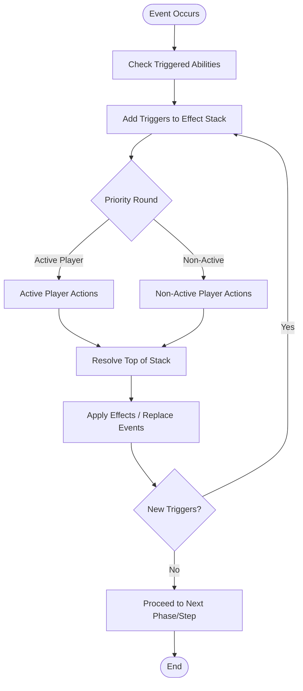
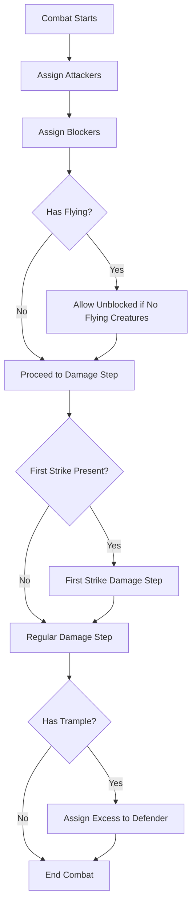
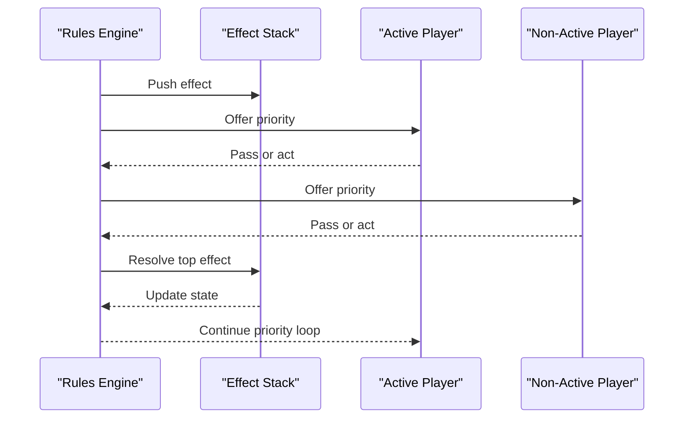
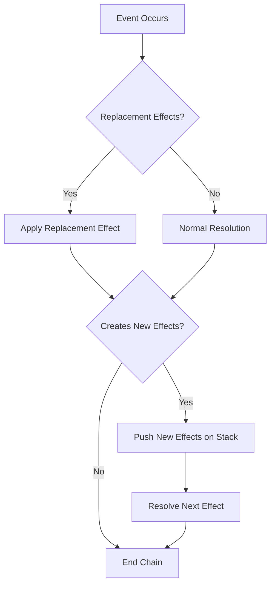
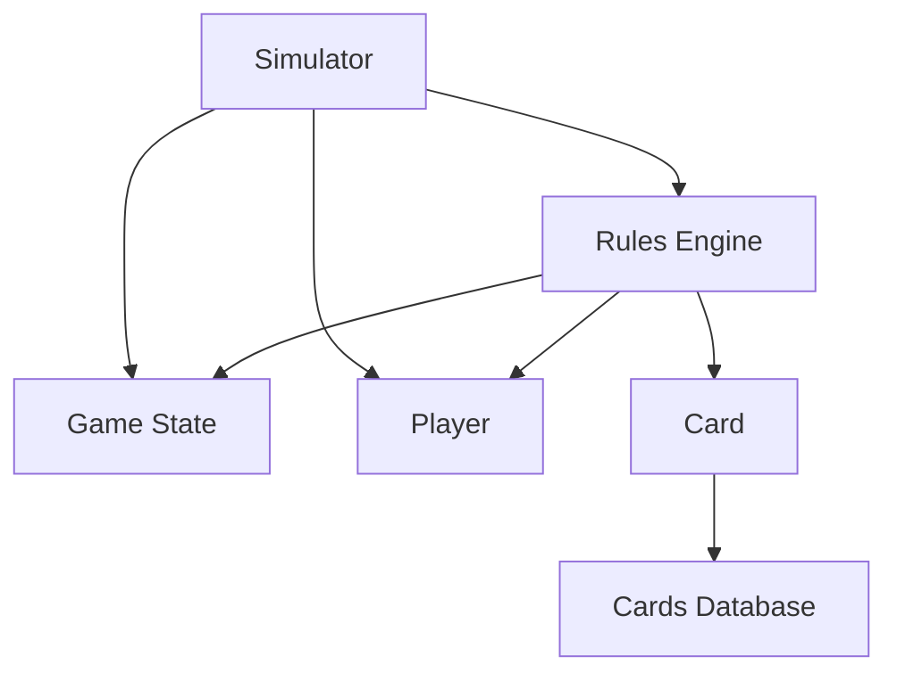

# Card Effects and Abilities

<cite>
**Referenced Files in This Document**
- [card.py](file://simuladorMtg/src/card.py)
- [cards_db.py](file://simuladorMtg/src/cards_db.py)
- [game_state.py](file://simuladorMtg/src/game_state.py)
- [player.py](file://simuladorMtg/src/player.py)
- [rules_engine.py](file://simuladorMtg/src/rules_engine.py)
- [simulator.py](file://simuladorMtg/src/simulator.py)
- [Arquitetura.md](file://simuladorMtg/Arquitetura.md)
- [Banco de Ações.md](file://simuladorMtg/Banco de Ações.md)
- [Banco de Cartas.md](file://simuladorMtg/Banco de Cartas.md)
- [Banco de Efeitos.md](file://simuladorMtg/Banco de Efeitos.md)
- [Banco de Eventos.md](file://simuladorMtg/Banco de Eventos.md)
- [Banco de Mecânicas.md](file://simuladorMtg/Banco de Mecânicas.md)
- [Banco de Palavras-chave.md](file://simuladorMtg/Banco de Palavras-chave.md)
- [Banco de Regras.md](file://simuladorMtg/Banco de Regras.md)
- [Banco de Zonas.md](file://simuladorMtg/Banco de Zonas.md)
- [Rules Engine.md](file://simuladorMtg/Rules Engine.md)
- [main.py](file://simuladorMtg/main.py)
- [test_game.py](file://simuladorMtg/test_game.py)
</cite>

## Table of Contents
1. [Introduction](#introduction)
2. [Project Structure](#project-structure)
3. [Core Components](#core-components)
4. [Architecture Overview](#architecture-overview)
5. [Detailed Component Analysis](#detailed-component-analysis)
6. [Dependency Analysis](#dependency-analysis)
7. [Performance Considerations](#performance-considerations)
8. [Troubleshooting Guide](#troubleshooting-guide)
9. [Conclusion](#conclusion)
10. [Appendices](#appendices)

## Introduction
This document explains the card effects and abilities system implemented in the Magic: The Gathering simulator. It covers effect resolution, triggered and static abilities, activated abilities, keyword implementations (flying, first strike, trample, etc.), the effect stack, timing windows, priority, chaining, replacement effects, and continuous effects management. The goal is to make the system understandable for both developers and non-technical readers while providing precise references to the codebase.

## Project Structure
The project organizes game logic under src with supporting data and rules documentation at the repository root. Core files include card definitions, game state management, player model, rules engine, and a high-level simulator orchestrating turns and events. Documentation files define actions, cards, effects, events, mechanics, keywords, rules, and zones.

**Diagram sources**
- [main.py](file://simuladorMtg/main.py)
- [test_game.py](file://simuladorMtg/test_game.py)
- [simulator.py](file://simuladorMtg/src/simulator.py)
- [rules_engine.py](file://simuladorMtg/src/rules_engine.py)
- [game_state.py](file://simuladorMtg/src/game_state.py)
- [player.py](file://simuladorMtg/src/player.py)
- [card.py](file://simuladorMtg/src/card.py)
- [cards_db.py](file://simuladorMtg/src/cards_db.py)

**Section sources**
- [Arquitetura.md](file://simuladorMtg/Arquitetura.md)
- [Rules Engine.md](file://simuladorMtg/Rules Engine.md)
- [main.py](file://simuladorMtg/main.py)
- [test_game.py](file://simuladorMtg/test_game.py)

## Core Components
- Card model: Represents individual cards with properties, abilities, and keywords.
- Cards database: Central registry of card definitions and metadata.
- Game state: Tracks zones, objects, turn structure, and global conditions.
- Player: Manages hand, library, graveyard, battlefield, and resources.
- Rules engine: Implements ability resolution, effect stack, timing, priority, and interactions.
- Simulator: Orchestrates turns, phases, and event flow between components.

Key responsibilities:
- Effect resolution and stacking
- Triggered and static ability evaluation
- Activated ability costs and effects
- Keyword behavior implementation
- Replacement and continuous effects
- Priority and timing windows

**Section sources**
- [card.py](file://simuladorMtg/src/card.py)
- [cards_db.py](file://simuladorMtg/src/cards_db.py)
- [game_state.py](file://simuladorMtg/src/game_state.py)
- [player.py](file://simuladorMtg/src/player.py)
- [rules_engine.py](file://simuladorMtg/src/rules_engine.py)
- [simulator.py](file://simuladorMtg/src/simulator.py)

## Architecture Overview
The system follows a layered architecture where the simulator drives the game loop, delegating to the rules engine for resolution and interacting with game state and players. Cards and their abilities are modeled as objects that can register triggers, static modifiers, and activated abilities.

**Diagram sources**
- [main.py](file://simuladorMtg/main.py)
- [simulator.py](file://simuladorMtg/src/simulator.py)
- [game_state.py](file://simuladorMtg/src/game_state.py)
- [rules_engine.py](file://simuladorMtg/src/rules_engine.py)
- [player.py](file://simuladorMtg/src/player.py)
- [card.py](file://simuladorMtg/src/card.py)

## Detailed Component Analysis

### Card Model and Abilities
Cards encapsulate identity, zone location, power/toughness, and ability descriptors. Abilities include:
- Static abilities: Always active while on the appropriate zone and meeting conditions.
- Triggered abilities: Fire when specific game events occur.
- Activated abilities: Costs paid by a player to produce an effect.

Keywords such as flying, first strike, and trample are mapped to underlying ability implementations.

**Diagram sources**
- [card.py](file://simuladorMtg/src/card.py)
- [Banco de Palavras-chave.md](file://simuladorMtg/Banco de Palavras-chave.md)

**Section sources**
- [card.py](file://simuladorMtg/src/card.py)
- [Banco de Cartas.md](file://simuladorMtg/Banco de Cartas.md)
- [Banco de Palavras-chave.md](file://simuladorMtg/Banco de Palavras-chave.md)

### Rules Engine and Effect Resolution
The rules engine implements:
- Effect stack: Ordered list of effects with last-in-first-out resolution.
- Timing windows: Phase-based and step-based opportunities for actions.
- Priority system: Players alternate passing priority; abilities resolve when no one acts.
- Chaining: New effects added to the stack during resolution create nested layers.
- Replacement effects: Intercept and replace events before they happen.
- Continuous effects: Modify characteristics or rules over time.

**Diagram sources**
- [rules_engine.py](file://simuladorMtg/src/rules_engine.py)
- [Banco de Eventos.md](file://simuladorMtg/Banco de Eventos.md)
- [Banco de Regras.md](file://simuladorMtg/Banco de Regras.md)

**Section sources**
- [rules_engine.py](file://simuladorMtg/src/rules_engine.py)
- [Banco de Ações.md](file://simuladorMtg/Banco de Ações.md)
- [Banco de Eventos.md](file://simuladorMtg/Banco de Eventos.md)
- [Banco de Regras.md](file://simuladorMtg/Banco de Regras.md)

### Keywords Implementation
Common keywords are implemented as specialized ability types:
- Flying: Modifies blocking requirements.
- First strike: Adds an additional combat damage step.
- Trample: Allows excess damage to be assigned to defending player after assigning lethal damage.
- Other keywords: Deathtouch, lifelink, double strike, menace, etc., each with defined interaction rules.

**Diagram sources**
- [Banco de Palavras-chave.md](file://simuladorMtg/Banco de Palavras-chave.md)
- [rules_engine.py](file://simuladorMtg/src/rules_engine.py)

**Section sources**
- [Banco de Palavras-chave.md](file://simuladorMtg/Banco de Palavras-chave.md)
- [rules_engine.py](file://simuladorMtg/src/rules_engine.py)

### Effect Stack, Timing Windows, and Priority
- Effect stack: Maintains order of effects; new effects created during resolution go on top.
- Timing windows: Defined per phase and step; certain actions only allowed in specific windows.
- Priority: Players receive priority to cast spells or activate abilities; passing priority allows resolution.

**Diagram sources**
- [rules_engine.py](file://simuladorMtg/src/rules_engine.py)
- [Banco de Regras.md](file://simuladorMtg/Banco de Regras.md)

**Section sources**
- [rules_engine.py](file://simuladorMtg/src/rules_engine.py)
- [Banco de Regras.md](file://simuladorMtg/Banco de Regras.md)

### Custom Effects and Complex Interactions
Creating custom effects involves:
- Defining ability descriptors with conditions, costs, and effects.
- Registering triggers for relevant game events.
- Implementing replacement effects to intercept and modify outcomes.
- Managing continuous effects that persist across zones and phases.

Best practices:
- Keep conditions explicit and testable.
- Use clear separation between cost payment and effect application.
- Ensure replacement effects are ordered correctly to avoid unintended overrides.

**Section sources**
- [Banco de Efeitos.md](file://simuladorMtg/Banco de Efeitos.md)
- [Banco de Eventos.md](file://simuladorMtg/Banco de Eventos.md)
- [rules_engine.py](file://simuladorMtg/src/rules_engine.py)

### Conditional Abilities
Conditional abilities evaluate context-specific criteria before applying effects:
- Zone-based conditions (e.g., only while on battlefield).
- Controller-based conditions (e.g., only affects your creatures).
- Object-based conditions (e.g., only if creature has certain keywords).

Implementation pattern:
- Store condition functions alongside ability definitions.
- Evaluate conditions during trigger checks and continuous effect application.

**Section sources**
- [card.py](file://simuladorMtg/src/card.py)
- [Banco de Efeitos.md](file://simuladorMtg/Banco de Efeitos.md)

### Effect Chaining, Replacement Effects, and Continuous Effects
- Effect chaining: When resolving an effect creates another effect, push it onto the stack to maintain order.
- Replacement effects: Intercept events like damage or movement to substitute alternative outcomes.
- Continuous effects: Modify characteristics or rules continuously; applied in layer order to avoid conflicts.

**Diagram sources**
- [rules_engine.py](file://simuladorMtg/src/rules_engine.py)
- [Banco de Efeitos.md](file://simuladorMtg/Banco de Efeitos.md)

**Section sources**
- [rules_engine.py](file://simuladorMtg/src/rules_engine.py)
- [Banco de Efeitos.md](file://simuladorMtg/Banco de Efeitos.md)

## Dependency Analysis
The rules engine depends on game state and player models to evaluate abilities and apply effects. Cards depend on the cards database for definitions. The simulator coordinates all components.

**Diagram sources**
- [rules_engine.py](file://simuladorMtg/src/rules_engine.py)
- [game_state.py](file://simuladorMtg/src/game_state.py)
- [player.py](file://simuladorMtg/src/player.py)
- [card.py](file://simuladorMtg/src/card.py)
- [cards_db.py](file://simuladorMtg/src/cards_db.py)
- [simulator.py](file://simuladorMtg/src/simulator.py)

**Section sources**
- [rules_engine.py](file://simuladorMtg/src/rules_engine.py)
- [game_state.py](file://simuladorMtg/src/game_state.py)
- [player.py](file://simuladorMtg/src/player.py)
- [card.py](file://simuladorMtg/src/card.py)
- [cards_db.py](file://simuladorMtg/src/cards_db.py)
- [simulator.py](file://simuladorMtg/src/simulator.py)

## Performance Considerations
- Minimize repeated evaluations by caching ability checks where safe.
- Avoid deep recursion in effect chains; prefer iterative stack processing.
- Use efficient data structures for zones and object tracking.
- Batch updates to game state to reduce overhead.

[No sources needed since this section provides general guidance]

## Troubleshooting Guide
Common issues and resolutions:
- Incorrect priority handling: Ensure players pass priority correctly and stack resolves top-down.
- Misordered replacement effects: Verify replacement effect ordering and specificity.
- Continuous effect conflicts: Apply effects in proper layer order to prevent contradictions.
- Triggered ability misses: Confirm event registration and condition evaluation.

Debugging tips:
- Log stack operations and priority transitions.
- Validate ability conditions against current game state.
- Test edge cases involving multiple simultaneous triggers.

**Section sources**
- [rules_engine.py](file://simuladorMtg/src/rules_engine.py)
- [Banco de Regras.md](file://simuladorMtg/Banco de Regras.md)

## Conclusion
The card effects and abilities system provides a robust framework for simulating Magic: The Gathering mechanics. By implementing a well-defined effect stack, timing windows, and priority system, along with comprehensive keyword support and flexible ability modeling, the simulator achieves accurate and extensible gameplay. Adhering to best practices for custom effects and careful management of replacements and continuous effects ensures reliable interactions.

[No sources needed since this section summarizes without analyzing specific files]

## Appendices
- Glossary of terms: Effect stack, priority, replacement effects, continuous effects, triggered abilities, static abilities, activated abilities.
- Reference links to rule documents and data banks for deeper understanding.

[No sources needed since this section provides general guidance]