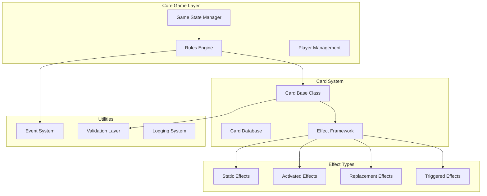
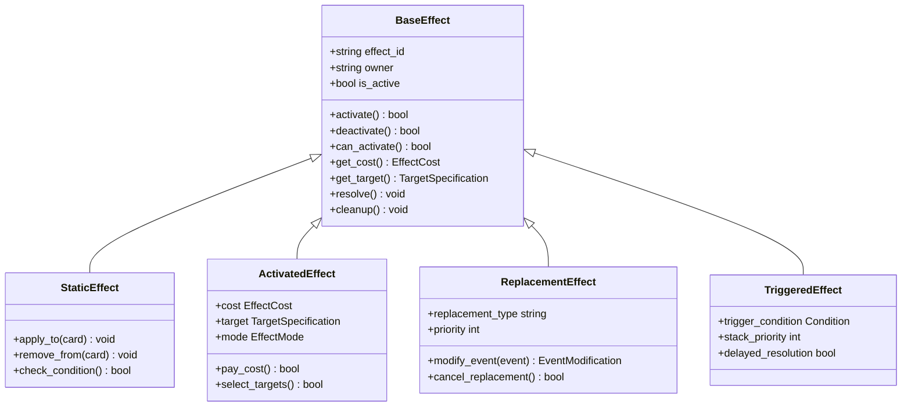
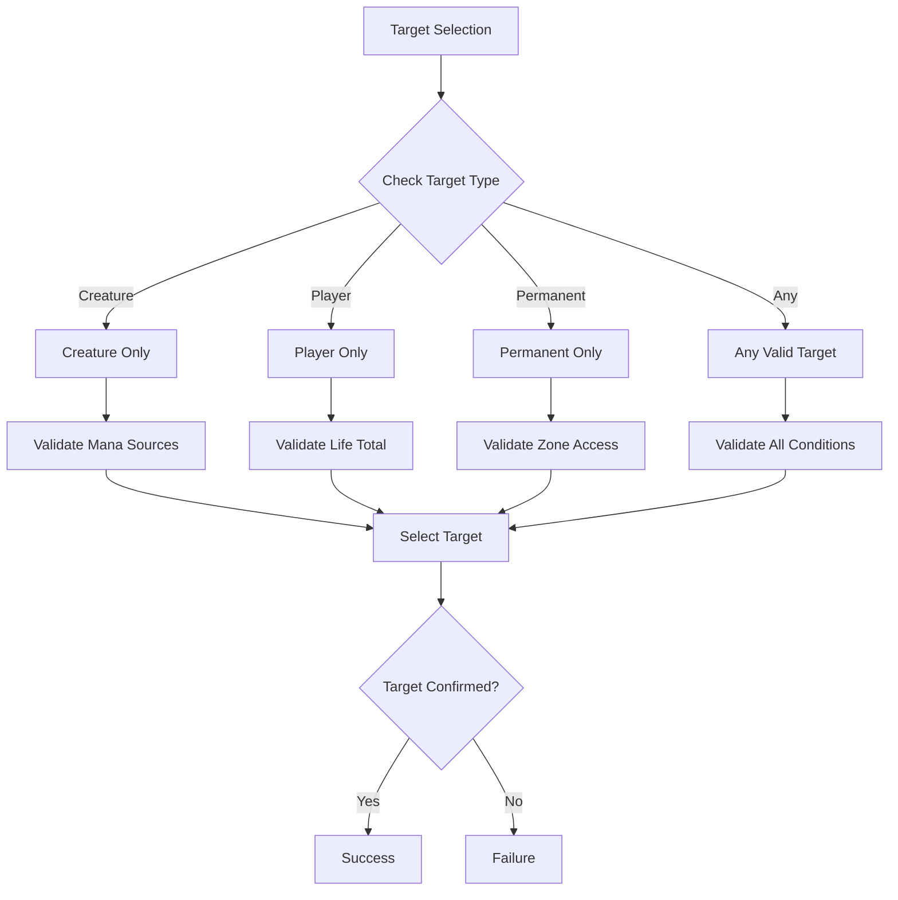
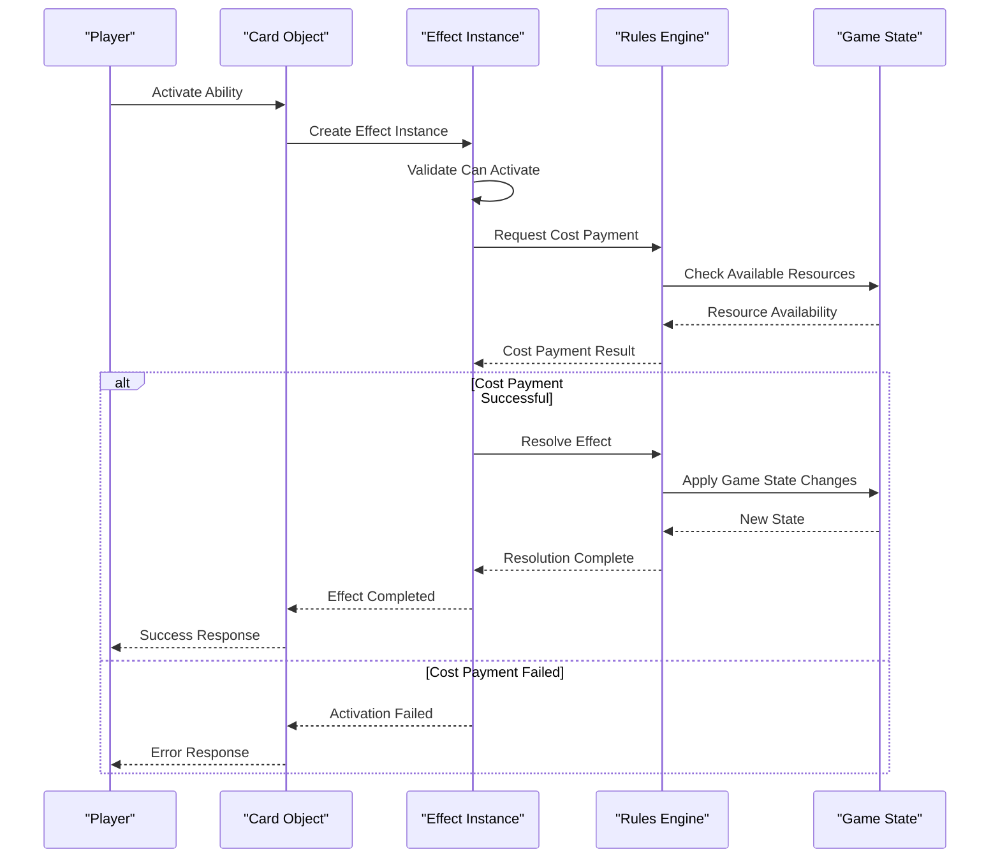
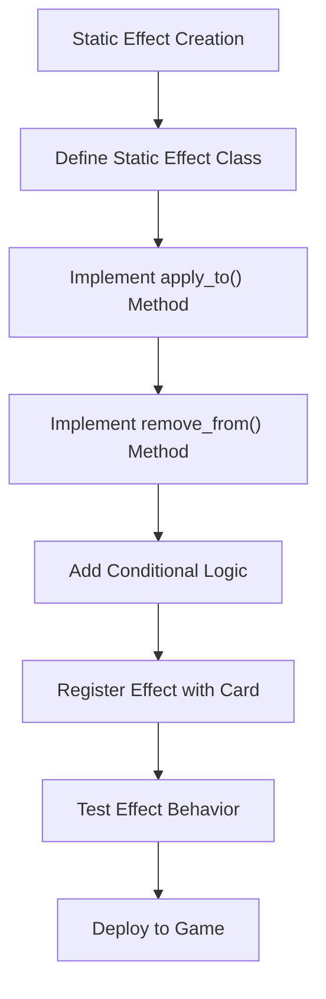
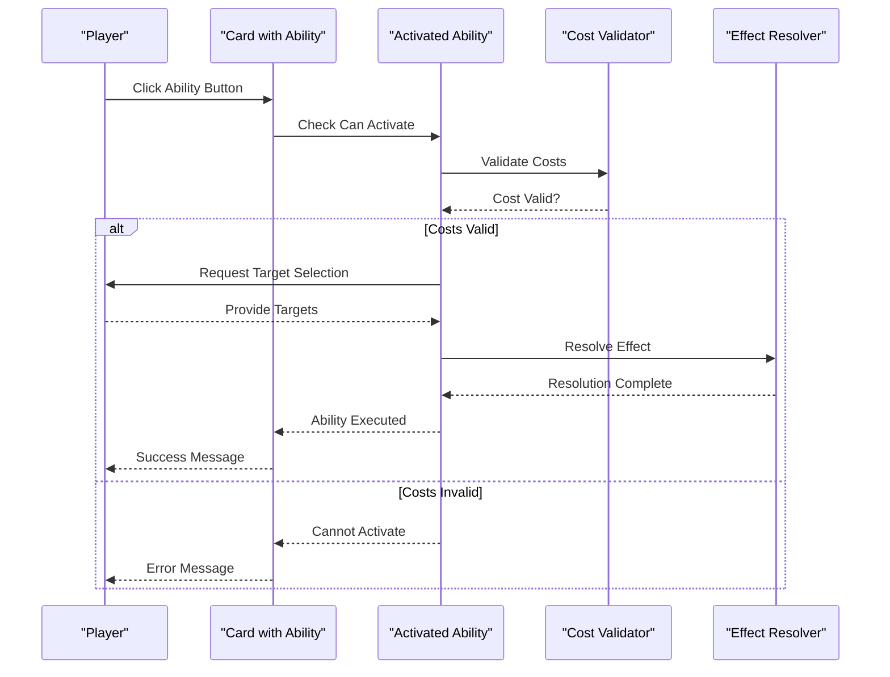
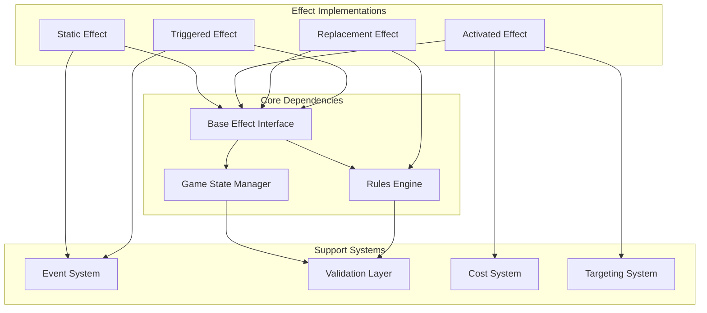
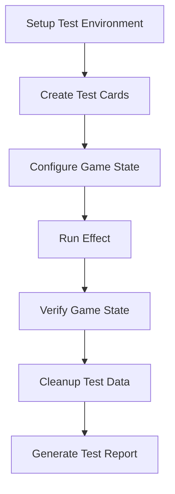

# Custom Effect Creation

<cite>
**Referenced Files in This Document**
- [card.py](file://simuladorMtg/src/card.py)
- [rules_engine.py](file://simuladorMtg/src/rules_engine.py)
- [game_state.py](file://simuladorMtg/src/game_state.py)
- [Banco de Efeitos.md](file://simuladorMtg/Banco de Efeitos.md)
- [Arquitetura.md](file://simuladorMtg/Arquitetura.md)
</cite>

## Table of Contents
1. [Introduction](#introduction)
2. [Project Structure](#project-structure)
3. [Core Components](#core-components)
4. [Architecture Overview](#architecture-overview)
5. [Detailed Component Analysis](#detailed-component-analysis)
6. [Dependency Analysis](#dependency-analysis)
7. [Performance Considerations](#performance-considerations)
8. [Troubleshooting Guide](#troubleshooting-guide)
9. [Conclusion](#conclusion)
10. [Appendices](#appendices)

## Introduction

This document provides comprehensive guidance for creating custom card effects and abilities in the MTG simulator. It covers the complete effect class hierarchy, base interfaces, and implementation patterns for different effect types including static abilities, activated abilities, and replacement effects. The guide includes step-by-step instructions for implementing new effect types, handling parameters, managing game state changes, and integrating with the rules engine.

## Project Structure

The MTG simulator follows a modular architecture where card effects are implemented through a well-defined class hierarchy. The core components include:

- **Card System**: Handles card definitions, properties, and effect attachments
- **Rules Engine**: Manages game state transitions and effect resolution
- **Game State**: Tracks current game conditions and player interactions
- **Effect Framework**: Provides base classes and interfaces for different effect types



**Diagram sources**
- [Arquitetura.md](file://simuladorMtg/Arquitetura.md)
- [Banco de Efeitos.md](file://simuladorMtg/Banco de Efeitos.md)

**Section sources**
- [Arquitetura.md](file://simuladorMtg/Arquitetura.md)
- [Banco de Efeitos.md](file://simuladorMtg/Banco de Efeitos.md)

## Core Components

### Effect Base Interface

All custom effects must implement the base effect interface, which defines the common contract for effect execution:



**Diagram sources**
- [card.py](file://simuladorMtg/src/card.py)
- [rules_engine.py](file://simuladorMtg/src/rules_engine.py)

### Effect Cost System

The cost system handles various types of costs that effects may require:

| Cost Type | Description | Examples |
|-----------|-------------|----------|
| Mana Cost | Generic mana payment | {2}{U}, {R}{R} |
| Life Cost | Life payment | Pay 2 life |
| Sacrifice Cost | Permanent sacrifice | Sacrifice creature |
| Tap Cost | Permanent tapping | Tap permanent |
| Discard Cost | Card discard | Discard card |
| Exile Cost | Card exile | Exile card from hand |

### Target Specification System

Targets define what an effect can affect:



**Diagram sources**
- [card.py](file://simuladorMtg/src/card.py)
- [game_state.py](file://simuladorMtg/src/game_state.py)

**Section sources**
- [card.py](file://simuladorMtg/src/card.py)
- [game_state.py](file://simuladorMtg/src/game_state.py)

## Architecture Overview

The effect system follows a layered architecture that separates concerns between effect definition, validation, and resolution:



**Diagram sources**
- [rules_engine.py](file://simuladorMtg/src/rules_engine.py)
- [game_state.py](file://simuladorMtg/src/game_state.py)

## Detailed Component Analysis

### Static Abilities Implementation

Static abilities are continuous effects that modify game rules or card properties while they're active:

#### Step-by-Step Implementation Guide

1. **Create the Static Effect Class**:
   - Extend the base `StaticEffect` class
   - Implement the `apply_to()` method for applying modifications
   - Implement the `remove_from()` method for cleanup
   - Override `check_condition()` for conditional effects

2. **Define Effect Properties**:
   - Set up effect modifiers (power/toughness changes, type changes, etc.)
   - Configure zone restrictions (battlefield only, graveyard, etc.)
   - Define timing restrictions (only during combat, etc.)

3. **Register the Effect**:
   - Add the effect to the card's ability list
   - Configure activation costs if applicable
   - Set up target specifications



**Diagram sources**
- [card.py](file://simuladorMtg/src/card.py)

#### Example: Power/Toughness Modifier

A static effect that modifies creature power and toughness:

- **Effect Definition**: Create a class extending `StaticEffect`
- **Application Logic**: Modify creature stats in `apply_to()`
- **Cleanup Logic**: Restore original values in `remove_from()`
- **Condition Checking**: Verify creature type and zone in `check_condition()`

### Activated Abilities Implementation

Activated abilities require player input and resource payment:

#### Implementation Steps

1. **Create Activated Effect Class**:
   - Extend `ActivatedEffect` base class
   - Define cost structure (mana, sacrifices, taps)
   - Implement target selection logic
   - Code the main effect resolution

2. **Configure Activation Requirements**:
   - Set up timing restrictions
   - Define targeting rules
   - Implement cost validation

3. **Handle Resolution**:
   - Process cost payment
   - Execute effect logic
   - Manage game state updates



**Diagram sources**
- [rules_engine.py](file://simuladorMtg/src/rules_engine.py)

#### Example: Creature Destruction Effect

An activated ability that destroys target creature:

- **Cost**: {1}{R} mana plus tap the source
- **Target**: Any creature on the battlefield
- **Effect**: Destroy target creature
- **Resolution**: Remove creature from battlefield, trigger death triggers

### Replacement Effects Implementation

Replacement effects modify how events occur rather than responding to them:

#### Key Concepts

- **Priority System**: Replacement effects have priority order
- **Event Modification**: Change event parameters before resolution
- **Cancellation**: Some effects can cancel replacements

#### Implementation Pattern

1. **Create Replacement Effect Class**:
   - Extend `ReplacementEffect` base class
   - Implement `modify_event()` method
   - Set appropriate priority level

2. **Define Replacement Logic**:
   - Specify which events to intercept
   - Determine modification rules
   - Handle edge cases

```mermaid
stateDiagram-v2
[*] --> EventOccurrence
EventOccurrence --> CheckReplacements["Check Replacement Effects"]
CheckReplacements --> HasReplacement{"Has Replacement?"}
HasReplacement --> |Yes| ApplyReplacement["Apply Replacement"]
HasReplacement --> |No| OriginalEvent["Execute Original Event"]
ApplyReplacement --> ModifiedEvent["Execute Modified Event"]
ModifiedEvent --> [*]
OriginalEvent --> [*]
```

**Diagram sources**
- [rules_engine.py](file://simuladorMtg/src/rules_engine.py)

#### Example: Damage Prevention Effect

A replacement effect that prevents damage:

- **Trigger**: When damage would be dealt
- **Modification**: Reduce damage by specified amount
- **Priority**: High priority to prevent other effects
- **Stack Interaction**: Interacts with damage prevention spells

**Section sources**
- [card.py](file://simuladorMtg/src/card.py)
- [rules_engine.py](file://simuladorMtg/src/rules_engine.py)
- [game_state.py](file://simuladorMtg/src/game_state.py)

## Dependency Analysis

The effect system has clear dependency relationships that ensure proper separation of concerns:



**Diagram sources**
- [Arquitetura.md](file://simuladorMtg/Arquitetura.md)

### Circular Dependency Prevention

The architecture prevents circular dependencies through:

- **Interface-based design**: Effects depend on interfaces, not implementations
- **Event-driven communication**: Loose coupling through event system
- **Layered architecture**: Clear separation between layers
- **Dependency injection**: Services provided through constructors

**Section sources**
- [Arquitetura.md](file://simuladorMtg/Arquitetura.md)

## Performance Considerations

### Memory Management

- **Effect Pooling**: Reuse effect instances where possible
- **Lazy Loading**: Load effect data only when needed
- **Garbage Collection**: Proper cleanup of temporary objects
- **Memory Leaks**: Monitor long-running effects for memory retention

### Execution Optimization

- **Batch Processing**: Group similar effect resolutions
- **Caching**: Cache frequently accessed game state information
- **Early Exit**: Fail fast on invalid activations
- **Parallel Processing**: Independent effects can resolve concurrently

### Scaling Considerations

- **Effect Limits**: Implement reasonable limits per turn/player
- **Queue Management**: Efficient handling of large effect queues
- **State Compression**: Optimize game state storage
- **Network Sync**: Efficient synchronization in multiplayer scenarios

## Troubleshooting Guide

### Common Issues and Solutions

#### Effect Not Applying

**Symptoms**: 
- Effect doesn't modify game state
- No visible changes after activation
- Errors in effect resolution logs

**Debugging Steps**:
1. Check effect activation conditions
2. Verify cost payment success
3. Validate target selection
4. Review effect resolution order

#### Performance Problems

**Symptoms**:
- Slow effect resolution
- High memory usage
- Game freezes during complex turns

**Solutions**:
1. Profile effect execution time
2. Identify memory leaks
3. Optimize expensive operations
4. Implement effect batching

#### State Inconsistencies

**Symptoms**:
- Game state desynchronization
- Incorrect card properties
- Wrong player resources

**Investigation**:
1. Check state update atomicity
2. Verify event ordering
3. Review concurrent access patterns
4. Validate rollback mechanisms

### Debug Tools

#### Logging System

Implement comprehensive logging for effect debugging:

- **Activation Logs**: Track when effects activate
- **Resolution Logs**: Record effect execution steps
- **State Logs**: Monitor game state changes
- **Error Logs**: Capture exceptions and failures

#### Testing Framework

Unit testing strategies for effects:



**Section sources**
- [test_game.py](file://simuladorMtg/test_game.py)

## Conclusion

Creating custom card effects in the MTG simulator requires understanding the effect class hierarchy, base interfaces, and implementation patterns. By following the guidelines in this document, developers can create robust, efficient, and maintainable effects that integrate seamlessly with the rules engine.

Key takeaways:

- **Use the base effect interfaces** for consistent behavior
- **Implement proper error handling** for edge cases
- **Follow performance best practices** for smooth gameplay
- **Test thoroughly** to ensure correct behavior
- **Document effects clearly** for maintainability

The modular architecture of the effect system allows for easy extension and customization while maintaining stability and performance.

## Appendices

### A. Effect Implementation Checklist

- [ ] Extend appropriate base effect class
- [ ] Implement required methods
- [ ] Handle all edge cases
- [ ] Add comprehensive logging
- [ ] Write unit tests
- [ ] Document effect behavior
- [ ] Test integration with rules engine
- [ ] Verify performance characteristics

### B. Common Effect Patterns

#### Conditional Effects
- Check conditions before application
- Handle condition changes dynamically
- Clean up when conditions become false

#### Delayed Effects
- Queue effects for future resolution
- Handle cancellation scenarios
- Manage effect lifecycle properly

#### Multi-target Effects
- Support multiple valid targets
- Handle partial target failure
- Ensure atomic resolution

### C. Integration Guidelines

- Follow established naming conventions
- Use existing utility functions
- Integrate with event system properly
- Respect game state boundaries
- Handle concurrent access safely