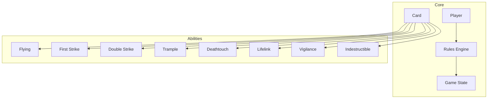
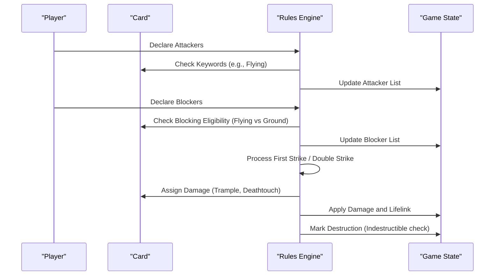
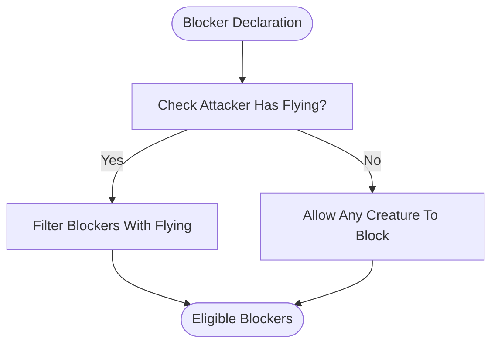
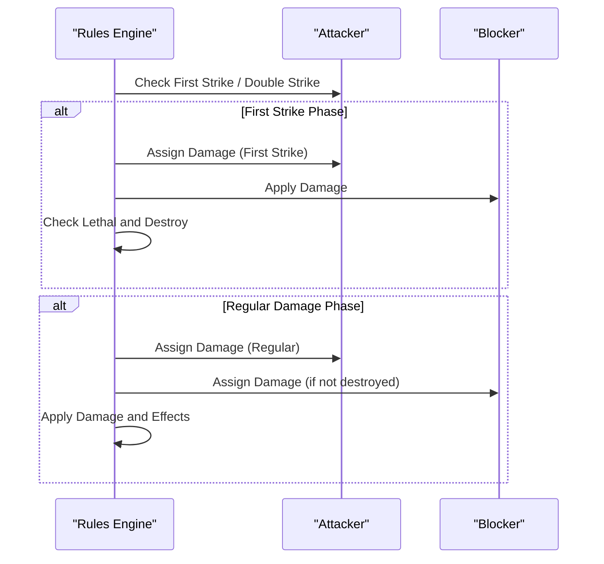
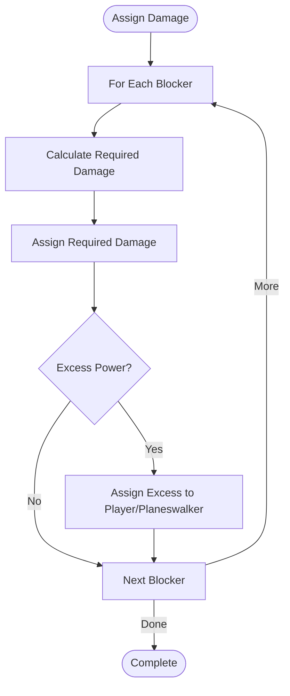
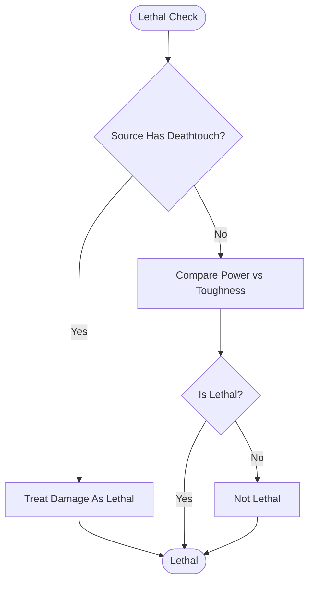
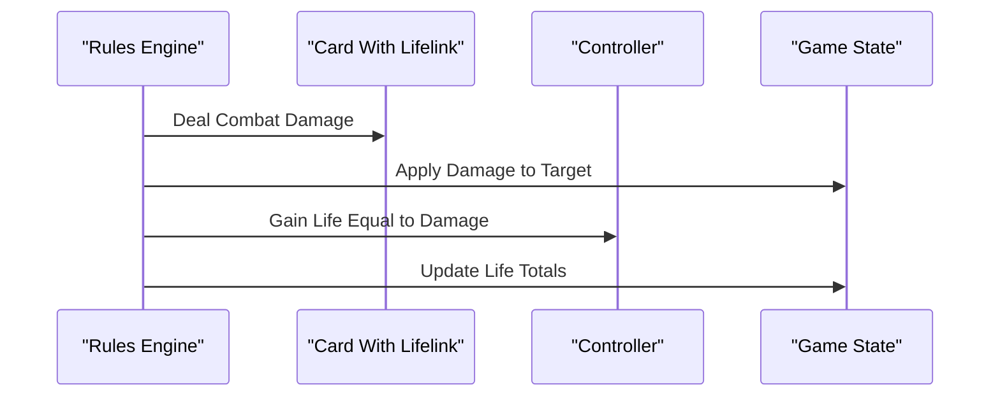
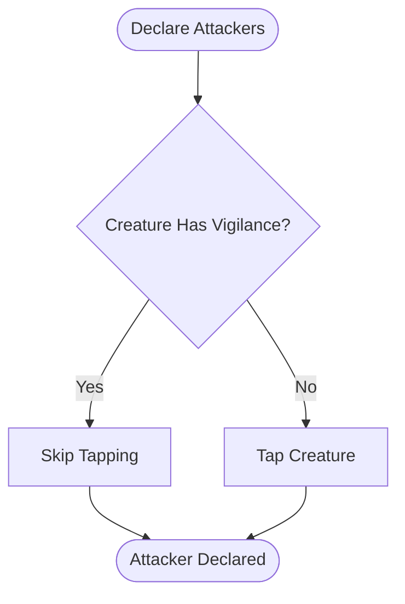
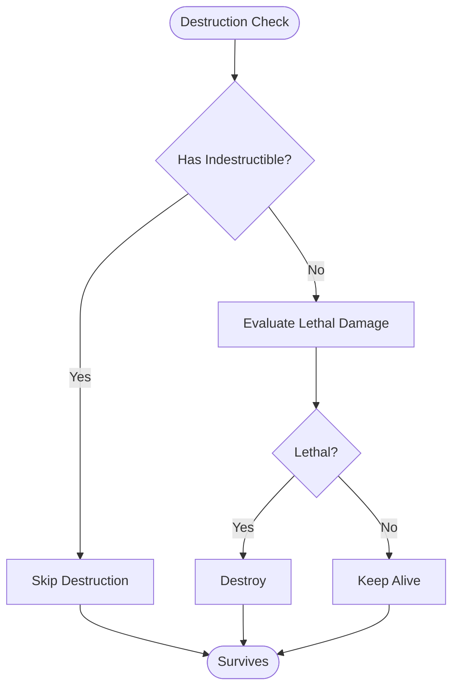
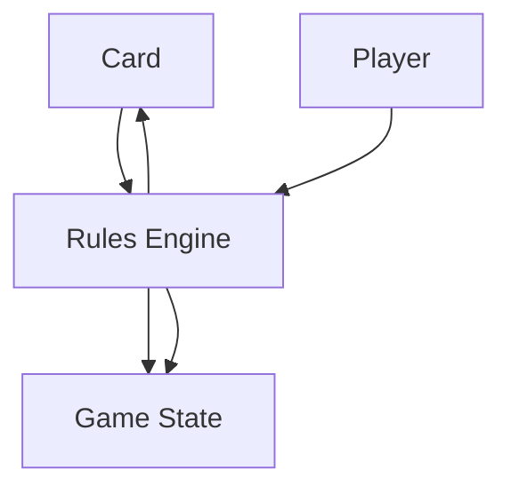

# Keyword Abilities

<cite>
**Referenced Files in This Document**
- [card.py](file://simuladorMtg/src/card.py)
- [rules_engine.py](file://simuladorMtg/src/rules_engine.py)
- [game_state.py](file://simuladorMtg/src/game_state.py)
- [player.py](file://simuladorMtg/src/player.py)
- [Banco de Palavras-chave.md](file://simuladorMtg/Banco de Palavras-chave.md)
- [Banco de Regras.md](file://simuladorMtg/Banco de Regras.md)
</cite>

## Table of Contents
1. [Introduction](#introduction)
2. [Project Structure](#project-structure)
3. [Core Components](#core-components)
4. [Architecture Overview](#architecture-overview)
5. [Detailed Component Analysis](#detailed-component-analysis)
6. [Dependency Analysis](#dependency-analysis)
7. [Performance Considerations](#performance-considerations)
8. [Troubleshooting Guide](#troubleshooting-guide)
9. [Conclusion](#conclusion)

## Introduction
This document explains how keyword abilities are implemented in the simulator, focusing on combat-related keywords such as flying, first strike, double strike, trample, deathtouch, lifelink, vigilance, and indestructible. It describes how each keyword modifies card behavior, interacts during combat, and affects game state. It also covers stacking rules, interaction order, and integration points with the combat system.

## Project Structure
The keyword system is integrated into the core simulation components:
- Card model defines abilities and properties
- Rules engine implements resolution logic for keywords
- Game state tracks combat steps, damage assignment, and effects
- Player interactions drive actions and responses



**Diagram sources**
- [card.py](file://simuladorMtg/src/card.py)
- [rules_engine.py](file://simuladorMtg/src/rules_engine.py)
- [game_state.py](file://simuladorMtg/src/game_state.py)
- [player.py](file://simuladorMtg/src/player.py)

**Section sources**
- [card.py](file://simuladorMtg/src/card.py)
- [rules_engine.py](file://simuladorMtg/src/rules_engine.py)
- [game_state.py](file://simuladorMtg/src/game_state.py)
- [player.py](file://simuladorMtg/src/player.py)

## Core Components
- Card: Holds ability flags and attributes; provides methods to query keyword presence and modify behavior during combat.
- Rules Engine: Encapsulates combat step processing, damage assignment, and keyword resolution order.
- Game State: Tracks current phase/step, attackers/blockers, damage markers, and life totals.
- Player: Initiates attacks, declares blockers, and responds to effects.

Key responsibilities:
- Ability registration and lookup
- Combat step sequencing
- Damage calculation and assignment
- Life gain and loss handling
- State transitions after combat

**Section sources**
- [card.py](file://simuladorMtg/src/card.py)
- [rules_engine.py](file://simuladorMtg/src/rules_engine.py)
- [game_state.py](file://simuladorMtg/src/game_state.py)
- [player.py](file://simuladorMtg/src/player.py)

## Architecture Overview
The keyword system follows a layered approach:
- Card layer exposes keyword capabilities via flags or capability objects
- Rules engine applies keywords during specific phases (declare attackers, declare blockers, combat damage)
- Game state records changes (damage, life totals, destruction markers)
- Player actions trigger rule evaluations



**Diagram sources**
- [rules_engine.py](file://simuladorMtg/src/rules_engine.py)
- [card.py](file://simuladorMtg/src/card.py)
- [game_state.py](file://simuladorMtg/src/game_state.py)

## Detailed Component Analysis

### Flying
- Behavior: Only creatures with flying can block or be blocked by other flying creatures unless the blocker has an ability allowing it to interact with flyers.
- Combat impact: Blocks only against flyers if both have flying; otherwise non-flying cannot block flyers.
- Implementation pattern:
  - Card stores a boolean flag or capability object for flying
  - During blocker declaration, rules engine filters eligible blockers using flying checks
- Integration points:
  - Blocker eligibility validation
  - Targeting restrictions for spells/effects referencing “creature” vs “flying creature”



**Diagram sources**
- [rules_engine.py](file://simuladorMtg/src/rules_engine.py)
- [card.py](file://simuladorMtg/src/card.py)

**Section sources**
- [card.py](file://simuladorMtg/src/card.py)
- [rules_engine.py](file://simuladorMtg/src/rules_engine.py)

### First Strike and Double Strike
- Behavior:
  - First strike: Deals combat damage in a separate early damage step; regular damage occurs later.
  - Double strike: Deals damage in both first strike and regular damage steps.
- Combat impact:
  - Early damage may destroy blockers before they deal damage back
  - Order matters when assigning damage and checking lethal
- Implementation pattern:
  - Rules engine splits combat damage into two phases
  - Cards with first strike or double strike participate accordingly
- Integration points:
  - Damage assignment loop runs twice when applicable
  - State updates occur between phases (destruction, removal)



**Diagram sources**
- [rules_engine.py](file://simuladorMtg/src/rules_engine.py)
- [card.py](file://simuladorMtg/src/card.py)

**Section sources**
- [rules_engine.py](file://simuladorMtg/src/rules_engine.py)
- [card.py](file://simuladorMtg/src/card.py)

### Trample
- Behavior: Excess damage from an attacker with trample may be assigned to the defending player or planeswalker once all required damage is assigned to blocking creatures.
- Combat impact:
  - Requires minimum lethal damage to each blocker before excess can be trampled
  - Interaction with toughness, indestructible, and damage prevention
- Implementation pattern:
  - Damage assignment algorithm calculates required damage per blocker
  - Remaining power is assigned to player/planeswalker
- Integration points:
  - Damage assignment routine must respect trample ordering
  - Checks for indestructible and replacement effects



**Diagram sources**
- [rules_engine.py](file://simuladorMtg/src/rules_engine.py)
- [card.py](file://simuladorMtg/src/card.py)

**Section sources**
- [rules_engine.py](file://simuladorMtg/src/rules_engine.py)
- [card.py](file://simuladorMtg/src/card.py)

### Deathtouch
- Behavior: Any amount of damage dealt by a source with deathtouch is considered lethal to creatures.
- Combat impact:
  - Simplifies lethal checks; even 1 damage destroys a creature regardless of toughness
  - Interacts with indestructible and damage prevention
- Implementation pattern:
  - Damage assignment treats deathtouch sources as having sufficient power for lethality
  - Lethal check uses deathtouch flag instead of raw power/toughness comparison
- Integration points:
  - Lethal determination routine
  - Replacement effects and prevention modifiers



**Diagram sources**
- [rules_engine.py](file://simuladorMtg/src/rules_engine.py)
- [card.py](file://simuladorMtg/src/card.py)

**Section sources**
- [rules_engine.py](file://simuladorMtg/src/rules_engine.py)
- [card.py](file://simuladorMtg/src/card.py)

### Lifelink
- Behavior: Damage dealt by a source with lifelink causes its controller to gain that much life simultaneously.
- Combat impact:
  - Life gain occurs at the same time as damage application
  - No priority window; immediate effect
- Implementation pattern:
  - Damage application routine triggers life gain for the controller
  - Ensures atomicity of damage and life change
- Integration points:
  - Damage assignment and application pipeline
  - Event logging and state consistency



**Diagram sources**
- [rules_engine.py](file://simuladorMtg/src/rules_engine.py)
- [game_state.py](file://simuladorMtg/src/game_state.py)
- [card.py](file://simuladorMtg/src/card.py)

**Section sources**
- [rules_engine.py](file://simuladorMtg/src/rules_engine.py)
- [game_state.py](file://simuladorMtg/src/game_state.py)
- [card.py](file://simuladorMtg/src/card.py)

### Vigilance
- Behavior: Creatures with vigilance do not tap when attacking.
- Combat impact:
  - Tapping status remains unchanged after declaring attackers
  - Allows repeated use of tapped abilities without re-tapping
- Implementation pattern:
  - Attacker declaration skips tapping for vigilant creatures
  - State tracking reflects untapped status post-attack
- Integration points:
  - Attacker declaration routine
  - Tap/untap management



**Diagram sources**
- [rules_engine.py](file://simuladorMtg/src/rules_engine.py)
- [card.py](file://simuladorMtg/src/card.py)

**Section sources**
- [rules_engine.py](file://simuladorMtg/src/rules_engine.py)
- [card.py](file://simuladorMtg/src/card.py)

### Indestructible
- Behavior: Creatures with indestructible cannot be destroyed by destruction effects or lethal damage.
- Combat impact:
  - Survives lethal damage and “destroy” effects
  - Still affected by damage reduction, exile, sacrifice, and toughness-based death
- Implementation pattern:
  - Destruction checks skip creatures with indestructible
  - Lethal damage does not cause destruction for these creatures
- Integration points:
  - Destruction evaluation pipeline
  - State cleanup after combat damage



**Diagram sources**
- [rules_engine.py](file://simuladorMtg/src/rules_engine.py)
- [card.py](file://simuladorMtg/src/card.py)

**Section sources**
- [rules_engine.py](file://simuladorMtg/src/rules_engine.py)
- [card.py](file://simuladorMtg/src/card.py)

### Stacking Rules and Priority Resolution
- Stacking:
  - Multiple instances of the same keyword generally do not stack (e.g., multiple flying instances have no additional effect)
  - Some keywords interact additively (e.g., lifelink amounts sum across sources)
- Priority order:
  - Declare attackers -> declare blockers -> first strike damage -> regular damage -> end of combat
  - Within each step, simultaneous events resolve together; state-based actions follow
- Interaction examples:
  - Trample + deathtouch: assign minimum lethal to each blocker, excess to player
  - First strike + lifelink: life gained immediately after first strike damage
  - Indestructible + trample: trample still applies; creature survives lethal damage

```mermaid
sequenceDiagram
participant R as "Rules Engine"
participant S as "State"
R->>S : Step "Declare Attackers"
R->>S : Step "Declare Blockers"
R->>S : Step "First Strike Damage"
R->>S : Step "Regular Damage"
R->>S : Step "End of Combat"
Note over R,S : Simultaneous events grouped; state checks after each step
```

**Diagram sources**
- [rules_engine.py](file://simuladorMtg/src/rules_engine.py)
- [game_state.py](file://simuladorMtg/src/game_state.py)

**Section sources**
- [rules_engine.py](file://simuladorMtg/src/rules_engine.py)
- [game_state.py](file://simuladorMtg/src/game_state.py)

## Dependency Analysis
Keywords depend on:
- Card capability flags or objects
- Rules engine’s combat step processor
- Game state’s damage and life tracking
- Player action triggers



**Diagram sources**
- [card.py](file://simuladorMtg/src/card.py)
- [rules_engine.py](file://simuladorMtg/src/rules_engine.py)
- [game_state.py](file://simuladorMtg/src/game_state.py)
- [player.py](file://simuladorMtg/src/player.py)

**Section sources**
- [card.py](file://simuladorMtg/src/card.py)
- [rules_engine.py](file://simuladorMtg/src/rules_engine.py)
- [game_state.py](file://simuladorMtg/src/game_state.py)
- [player.py](file://simuladorMtg/src/player.py)

## Performance Considerations
- Minimize redundant keyword checks by caching capability results where safe
- Batch damage assignments to reduce state updates
- Avoid deep recursion in damage assignment loops
- Use efficient data structures for attacker/blocker lists

[No sources needed since this section provides general guidance]

## Troubleshooting Guide
Common issues and resolutions:
- Incorrect blocking eligibility: verify flying checks and relevant abilities
- Unexpected destruction: confirm indestructible and damage prevention interactions
- Life gain timing: ensure lifelink applies simultaneously with damage
- First strike anomalies: validate two-phase damage processing and state updates

**Section sources**
- [rules_engine.py](file://simuladorMtg/src/rules_engine.py)
- [game_state.py](file://simuladorMtg/src/game_state.py)
- [card.py](file://simuladorMtg/src/card.py)

## Conclusion
The keyword system integrates tightly with the card model, rules engine, and game state to simulate accurate Magic: The Gathering combat mechanics. Proper implementation ensures correct behavior for flying, first strike, double strike, trample, deathtouch, lifelink, vigilance, and indestructible, while respecting stacking rules and priority resolution order.

[No sources needed since this section summarizes without analyzing specific files]