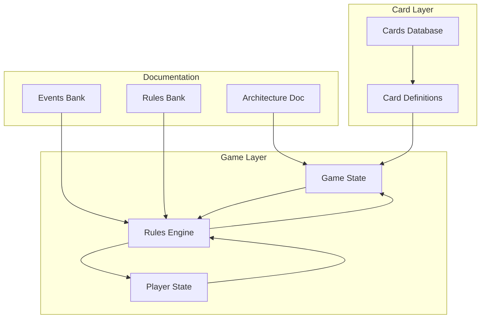
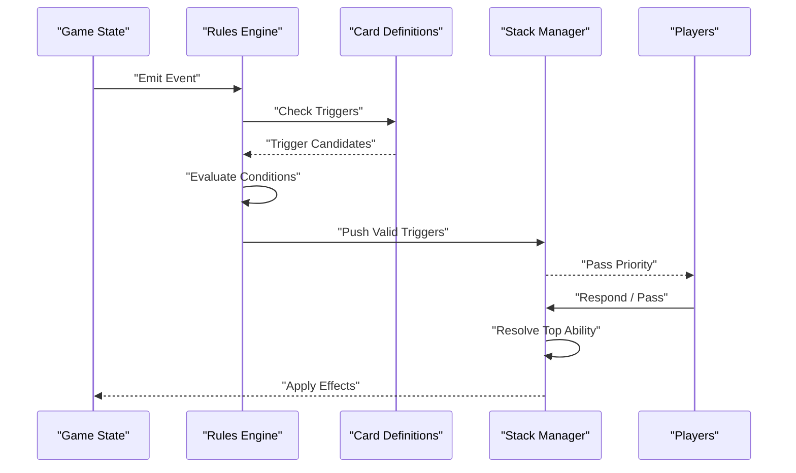
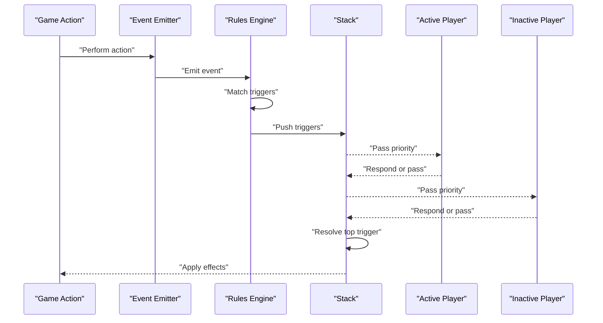
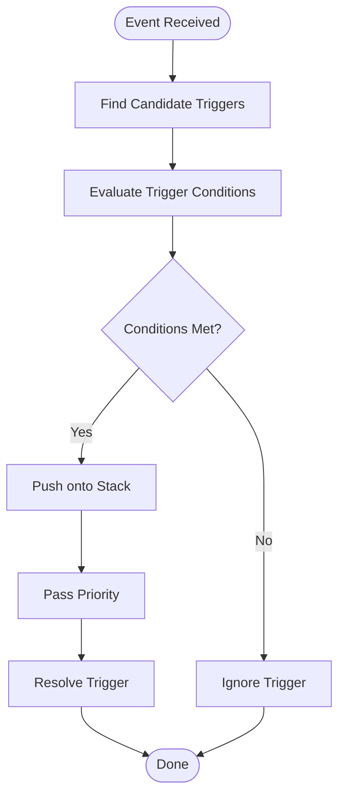
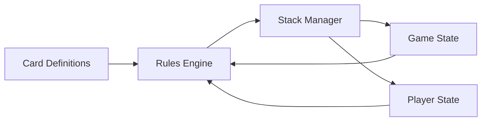

# Triggered Abilities

<cite>
**Referenced Files in This Document**
- [main.py](file://simuladorMtg/main.py)
- [game_state.py](file://simuladorMtg/src/game_state.py)
- [rules_engine.py](file://simuladorMtg/src/rules_engine.py)
- [card.py](file://simuladorMtg/src/card.py)
- [player.py](file://simuladorMtg/src/player.py)
- [Banco de Eventos.md](file://simuladorMtg/Banco de Eventos.md)
- [Banco de Regras.md](file://simuladorMtg/Banco de Regras.md)
- [Arquitetura.md](file://simuladorMtg/Arquitetura.md)
</cite>

## Table of Contents
1. [Introduction](#introduction)
2. [Project Structure](#project-structure)
3. [Core Components](#core-components)
4. [Architecture Overview](#architecture-overview)
5. [Detailed Component Analysis](#detailed-component-analysis)
6. [Dependency Analysis](#dependency-analysis)
7. [Performance Considerations](#performance-considerations)
8. [Troubleshooting Guide](#troubleshooting-guide)
9. [Conclusion](#conclusion)
10. [Appendices](#appendices)

## Introduction
This document explains the triggered abilities system in the MTG simulator, focusing on how events are detected, when triggers fire, and how they resolve through the stack. It covers trigger types (“when”, “whenever”, “at”, “as”), event propagation, conditional triggers, ability chaining, priority, and resolution order for simultaneous triggers. The goal is to make the system understandable for both developers and non-technical readers while remaining grounded in the repository’s implementation.

## Project Structure
The triggered abilities system spans several core modules:
- Game state management tracks zones, objects, and the stack.
- Rules engine evaluates game rules and processes events and triggers.
- Card definitions include keywords and effect logic that can generate events or respond to them.
- Player state manages control, priorities, and actions.
- Documentation files define events, rules, and architecture context.

**Diagram sources**
- [game_state.py](file://simuladorMtg/src/game_state.py)
- [rules_engine.py](file://simuladorMtg/src/rules_engine.py)
- [card.py](file://simuladorMtg/src/card.py)
- [player.py](file://simuladorMtg/src/player.py)
- [Banco de Eventos.md](file://simuladorMtg/Banco de Eventos.md)
- [Banco de Regras.md](file://simuladorMtg/Banco de Regras.md)
- [Arquitetura.md](file://simuladorMtg/Arquitetura.md)

**Section sources**
- [main.py](file://simuladorMtg/main.py)
- [Arquitetura.md](file://simuladorMtg/Arquitetura.md)

## Core Components
- Event System: Defines discrete game events (e.g., a card leaving the battlefield, damage dealt, spells resolving). Events carry context such as source, target, and zone changes.
- Triggered Abilities: Attach to cards or effects with conditions and timing markers (“when”, “whenever”, “at”, “as”). They monitor specific events and add themselves to the stack when conditions match.
- Stack and Priority: The stack holds triggered abilities and other actions; players receive priority to respond before resolution. Resolution follows last-in-first-out ordering.
- Rules Engine: Evaluates conditions, applies timing windows, and enforces priority and resolution order.

Key responsibilities:
- Detecting events and matching them against registered triggers.
- Validating trigger conditions at the appropriate time window.
- Pushing valid triggers onto the stack and managing their resolution.
- Ensuring correct priority passing between players.

**Section sources**
- [Banco de Eventos.md](file://simuladorMtg/Banco de Eventos.md)
- [Banco de Regras.md](file://simuladorMtg/Banco de Regras.md)
- [rules_engine.py](file://simuladorMtg/src/rules_engine.py)
- [game_state.py](file://simuladorMtg/src/game_state.py)

## Architecture Overview
The triggered abilities system integrates with the event pipeline and stack management:

**Diagram sources**
- [rules_engine.py](file://simuladorMtg/src/rules_engine.py)
- [game_state.py](file://simuladorMtg/src/game_state.py)
- [card.py](file://simuladorMtg/src/card.py)

## Detailed Component Analysis

### Event Detection Mechanism
- Events are emitted by game actions (spells, abilities, state changes).
- The rules engine listens for these events and consults card definitions for registered triggers.
- Each trigger specifies an event type and optional qualifiers (source, target, zone).

Implementation highlights:
- Event emission occurs within game state transitions.
- Trigger registration is tied to card metadata and keywords.
- Matching filters ensure only relevant triggers are considered.

**Section sources**
- [Banco de Eventos.md](file://simuladorMtg/Banco de Eventos.md)
- [rules_engine.py](file://simuladorMtg/src/rules_engine.py)
- [card.py](file://simuladorMtg/src/card.py)

### Trigger Types: “when”, “whenever”, “at”, “as”
- “when” and “whenever”: Typically indicate reactive triggers upon an event occurring. In many implementations, they are functionally equivalent; differences may be stylistic or tied to rule nuances.
- “at”: Often denotes timing-based triggers (e.g., beginning of step, end of turn) rather than event-driven ones.
- “as”: Usually indicates replacement-style behavior or immediate adjustments during an event, sometimes overlapping with replacement effects.

Behavioral notes:
- Timing windows determine when conditions are evaluated.
- Some triggers may be one-time checks; others persist across multiple events until removed.

**Section sources**
- [Banco de Regras.md](file://simuladorMtg/Banco de Regras.md)
- [rules_engine.py](file://simuladorMtg/src/rules_engine.py)

### Relationship Between Triggered Abilities and the Event System
- Events propagate through the game state, triggering rules engine evaluation.
- Triggered abilities subscribe to specific events and conditions.
- When matched, abilities are queued onto the stack for later resolution.

Propagation flow:
- Game action -> Event emission -> Rules engine scan -> Condition evaluation -> Stack push -> Priority pass -> Resolution.

**Section sources**
- [game_state.py](file://simuladorMtg/src/game_state.py)
- [rules_engine.py](file://simuladorMtg/src/rules_engine.py)

### Implementing Complex Triggered Abilities
Patterns:
- Conditional triggers: Use predicates that check current game state (e.g., controller’s life total, number of creatures).
- Ability chaining: One trigger’s resolution creates another event, which can spawn additional triggers.
- Persistent vs. one-shot triggers: Decide whether a trigger remains active after firing or is consumed.

Guidelines:
- Keep condition checks efficient and deterministic.
- Avoid infinite loops by ensuring chain termination conditions.
- Clearly define timing windows to prevent ambiguous resolutions.

**Section sources**
- [rules_engine.py](file://simuladorMtg/src/rules_engine.py)
- [card.py](file://simuladorMtg/src/card.py)

### Trigger Priority, Stack Management, and Resolution Order
- Stack management: Last-in-first-out; newly pushed triggers resolve before older ones.
- Priority: After each action or event, the active player receives priority; then the inactive player can respond.
- Simultaneous triggers: If multiple triggers would trigger simultaneously, the active player chooses the order in which they are placed on the stack.

Resolution steps:
- Evaluate all pending triggers.
- Place them on the stack according to priority rules.
- Resolve top-of-stack first, applying effects and potentially generating new events/triggers.

**Section sources**
- [Banco de Regras.md](file://simuladorMtg/Banco de Regras.md)
- [rules_engine.py](file://simuladorMtg/src/rules_engine.py)
- [game_state.py](file://simuladorMtg/src/game_state.py)

### Sequence Diagram: Triggered Ability Resolution

**Diagram sources**
- [rules_engine.py](file://simuladorMtg/src/rules_engine.py)
- [game_state.py](file://simuladorMtg/src/game_state.py)

### Flowchart: Conditional Trigger Evaluation

**Diagram sources**
- [rules_engine.py](file://simuladorMtg/src/rules_engine.py)

## Dependency Analysis
The triggered abilities system depends on cohesive interaction between game state, rules engine, and card definitions.

**Diagram sources**
- [card.py](file://simuladorMtg/src/card.py)
- [game_state.py](file://simuladorMtg/src/game_state.py)
- [player.py](file://simuladorMtg/src/player.py)
- [rules_engine.py](file://simuladorMtg/src/rules_engine.py)

**Section sources**
- [card.py](file://simuladorMtg/src/card.py)
- [game_state.py](file://simuladorMtg/src/game_state.py)
- [player.py](file://simuladorMtg/src/player.py)
- [rules_engine.py](file://simuladorMtg/src/rules_engine.py)

## Performance Considerations
- Efficient event matching: Index triggers by event type and key qualifiers to reduce scanning overhead.
- Condition caching: Cache expensive predicate results where safe to avoid repeated evaluations.
- Limit recursion depth: Guard against deep chains of triggered abilities causing performance degradation.
- Batch processing: Group simultaneous triggers to minimize redundant stack operations.

[No sources needed since this section provides general guidance]

## Troubleshooting Guide
Common issues and remedies:
- Missed triggers: Verify event emission points and trigger registration paths.
- Incorrect resolution order: Ensure proper priority passing and stack placement rules.
- Infinite chains: Add termination checks and maximum iteration limits.
- Ambiguous timing: Clarify “at” vs “when/whenever” usage and enforce strict timing windows.

Debugging tips:
- Log event emissions and trigger matches.
- Inspect stack contents before and after priority passes.
- Validate condition predicates with unit tests covering edge cases.

**Section sources**
- [rules_engine.py](file://simuladorMtg/src/rules_engine.py)
- [Banco de Regras.md](file://simuladorMtg/Banco de Regras.md)

## Conclusion
The triggered abilities system hinges on precise event detection, robust condition evaluation, and disciplined stack management. By aligning trigger types with clear timing windows and enforcing priority and resolution order, the simulator achieves predictable and fair gameplay. Careful design of complex triggers and chaining ensures scalability without sacrificing performance.

[No sources needed since this section summarizes without analyzing specific files]

## Appendices

### Appendix A: Trigger Type Reference
- “when” / “whenever”: Reactive triggers upon specified events.
- “at”: Timing-based triggers aligned with game phases or steps.
- “as”: Replacement or immediate adjustment behaviors during events.

**Section sources**
- [Banco de Regras.md](file://simuladorMtg/Banco de Regras.md)

### Appendix B: Example Scenarios
- Conditional trigger: A creature gains +1/+1 whenever you gain life, but only if your life total is even.
- Ability chaining: A spell deals damage, triggering a “when damaged” ability that draws a card, which itself triggers a “when drawing” ability.
- Simultaneous triggers: Multiple creatures die in combat; active player orders their death triggers on the stack.

[No sources needed since this section provides conceptual examples]