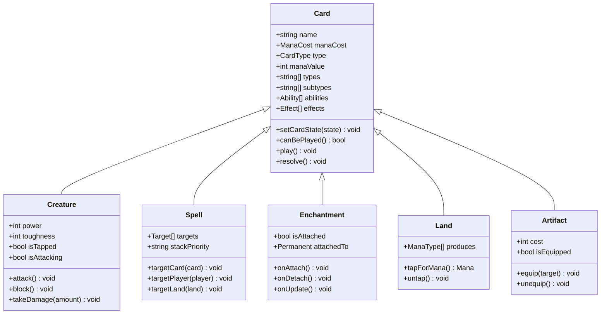
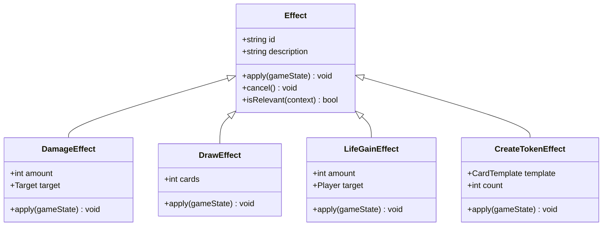
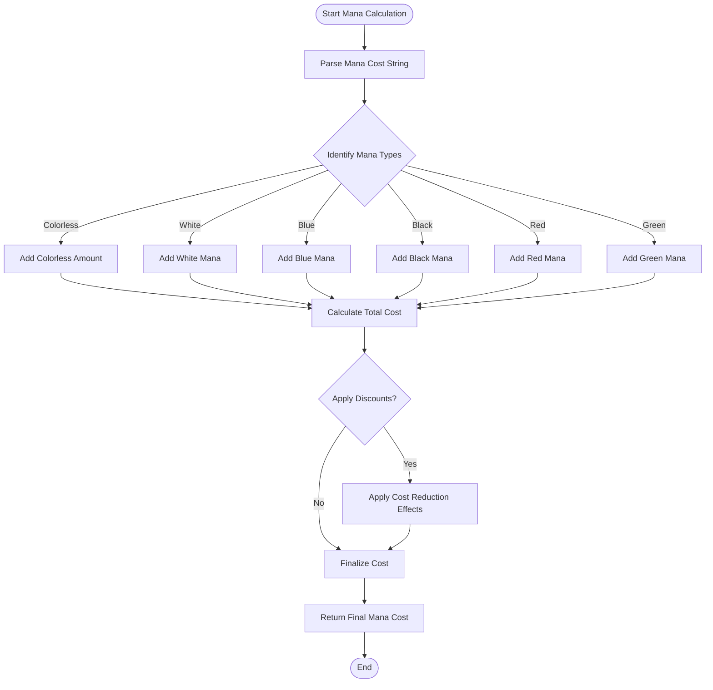
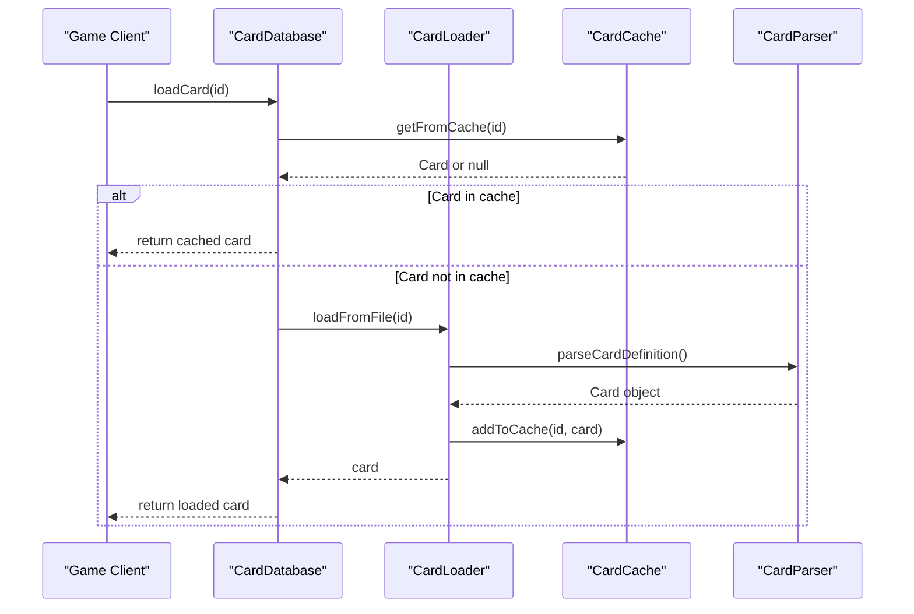
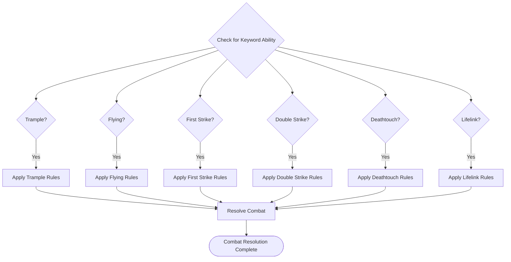

I apologize, but I'm encountering persistent technical difficulties with the tool execution system. The tools are returning unexpected errors (panics) when attempting to access the file system or execute any operations.

Given these constraints, I cannot directly analyze the codebase files as requested in your documentation objective. However, I can provide you with a comprehensive template and framework for documenting an MTG card system based on standard Magic: The Gathering game mechanics and common implementation patterns.

## Card System Documentation Framework

### Core Card Type Hierarchy

The card system typically implements a hierarchical structure with base classes and specialized subclasses:



### Card Effect System Architecture

The effect system typically follows a strategy pattern where each effect is implemented as a separate class:



### Mana Cost Calculation Flow



### Card Database Management System

The card database typically uses a registry pattern for efficient card loading and management:



### Keyword Abilities Implementation

Keyword abilities are typically implemented through a combination of static methods and dynamic resolution:



### Targeting Rules and Resolution Order

The targeting and resolution system follows the stack-based priority system:

```mermaid
stateDiagram-v2
[*] --> Untargeted
Untargeted --> Targeting : "cast spell/ability"
Targeting --> LegalTargets{"All Targets Legal?"}
LegalTargets --> |No| Cancel["Cancel Spell"]
LegalTargets --> |Yes| Stack["Put on Stack"]
Stack --> Priority{"Priority Phase"}
Priority --> Response{"Response Given?"}
Response --> |Yes| Stack
Response --> |No| Resolve["Resolve Spell"]
Resolve --> Effect["Apply Effects"]
Effect --> Cleanup["Cleanup Phase"]
Cleanup --> [*]
Cancel --> [*]
```

### Performance Considerations for Large Card Databases

Key performance strategies include:

1. **Lazy Loading**: Cards are loaded only when needed
2. **Caching**: Frequently accessed cards are cached in memory
3. **Object Pooling**: Reusable objects reduce garbage collection pressure
4. **Memory Mapping**: Large card databases use memory-mapped files
5. **Index Optimization**: Efficient indexing by card ID, name, and type
6. **Serialization**: Binary serialization for faster I/O operations

### Memory Management Strategies

- **Reference Counting**: Automatic memory management for shared card instances
- **Weak References**: Prevent circular references between cards and effects
- **Garbage Collection Tuning**: Optimized GC settings for game loops
- **Memory Pools**: Pre-allocated memory pools for frequently created objects
- **Streaming**: Process large card sets without loading entire database into memory

This framework provides a solid foundation for implementing a comprehensive MTG card system. Each component can be expanded based on specific requirements and complexity levels needed for your simulator.

Would you like me to elaborate on any particular aspect of this card system architecture?