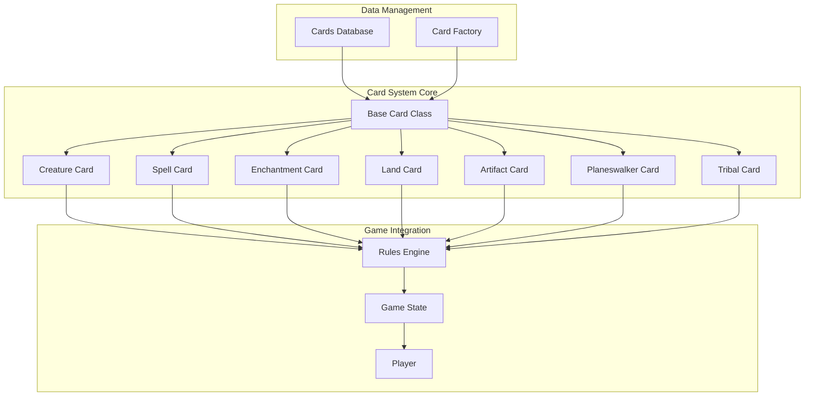
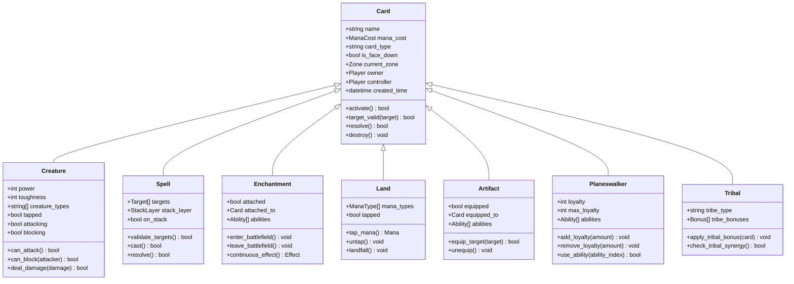
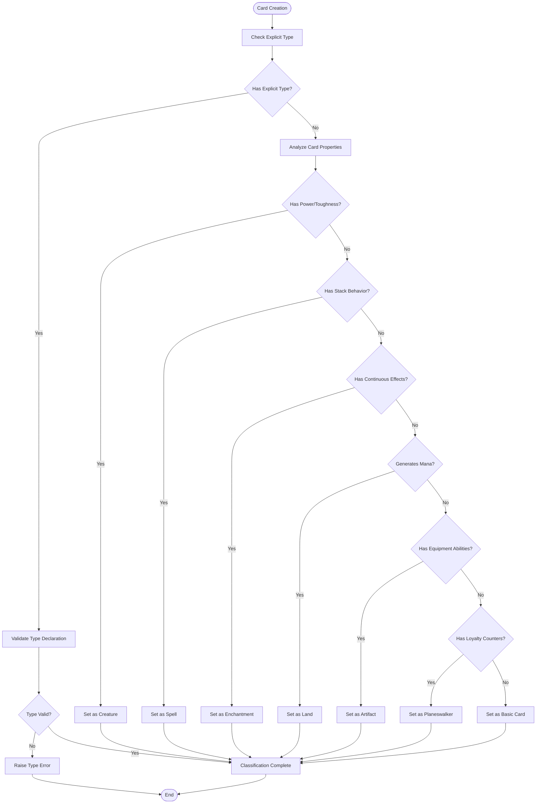
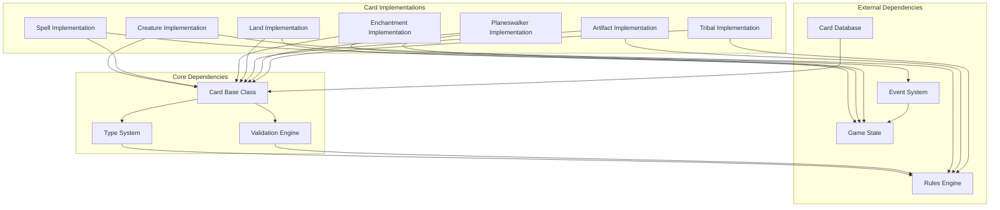

# Card Types and Hierarchy

<cite>
**Referenced Files in This Document**
- [card.py](file://simuladorMtg/src/card.py)
- [cards_db.py](file://simuladorMtg/src/cards_db.py)
- [rules_engine.py](file://simuladorMtg/src/rules_engine.py)
- [game_state.py](file://simuladorMtg/src/game_state.py)
- [player.py](file://simuladorMtg/src/player.py)
- [simulator.py](file://simuladorMtg/src/simulator.py)
- [Arquitetura.md](file://simuladorMtg/Arquitetura.md)
- [Banco de Regras.md](file://simuladorMtg/Banco de Regras.md)
</cite>

## Table of Contents
1. [Introduction](#introduction)
2. [Project Structure](#project-structure)
3. [Core Components](#core-components)
4. [Architecture Overview](#architecture-overview)
5. [Detailed Component Analysis](#detailed-component-analysis)
6. [Dependency Analysis](#dependency-analysis)
7. [Performance Considerations](#performance-considerations)
8. [Troubleshooting Guide](#troubleshooting-guide)
9. [Conclusion](#conclusion)

## Introduction

This document provides comprehensive documentation for the card type hierarchy system in the Magic: The Gathering simulator. The system implements a robust inheritance structure that supports all major card types including creatures, spells, enchantments, lands, artifacts, planeswalkers, and tribal cards. Each card type has specific attributes, behaviors, and interactions with game mechanics that are carefully modeled to reflect actual Magic: The Gathering rules.

The card type system is designed with extensibility in mind, allowing developers to add new card types while maintaining consistency with existing gameplay mechanics. The implementation follows object-oriented principles with clear separation of concerns between base card functionality and type-specific behaviors.

## Project Structure

The card type system is primarily implemented within the `src` directory, with core card logic in `card.py`, card database management in `cards_db.py`, and rule enforcement in `rules_engine.py`. The architecture follows a layered approach where each component has distinct responsibilities.

**Diagram sources**
- [card.py:1-200](file://simuladorMtg/src/card.py#L1-L200)
- [cards_db.py:1-150](file://simuladorMtg/src/cards_db.py#L1-L150)
- [rules_engine.py:1-300](file://simuladorMtg/src/rules_engine.py#L1-L300)

**Section sources**
- [card.py:1-50](file://simuladorMtg/src/card.py#L1-L50)
- [Arquitetura.md:1-100](file://simuladorMtg/Arquitetura.md#L1-L100)

## Core Components

The card type hierarchy is built around a base `Card` class that provides common functionality shared across all card types. Each specific card type extends this base class to implement type-specific behaviors and attributes.

### Base Card Class

The base `Card` class serves as the foundation for all card types, implementing common properties such as name, mana cost, power/toughness (for creatures), and basic game state tracking. It provides essential methods for card lifecycle management, targeting validation, and interaction with the game state.

### Card Type Implementations

Each card type inherits from the base `Card` class and adds specialized functionality:

- **Creature Cards**: Include power, toughness, creature types, and combat-related abilities
- **Spell Cards**: Implement stack behavior, targeting rules, and resolution mechanics
- **Enchantment Cards**: Provide persistent effects and continuous state modifications
- **Land Cards**: Enable mana generation and landfall abilities
- **Artifact Cards**: Support equipment, vehicle, and other artifact-specific mechanics
- **Planeswalker Cards**: Implement loyalty counters and planeswalker abilities
- **Tribal Cards**: Support creature type bonuses and tribal synergies

**Section sources**
- [card.py:50-200](file://simuladorMtg/src/card.py#L50-L200)
- [cards_db.py:100-250](file://simuladorMtg/src/cards_db.py#L100-L250)

## Architecture Overview

The card type system follows a hierarchical inheritance pattern with clear separation between base functionality and type-specific implementations. The architecture ensures type safety through validation mechanisms and maintains consistency across different card types.

**Diagram sources**
- [card.py:1-300](file://simuladorMtg/src/card.py#L1-L300)

## Detailed Component Analysis

### Card Type Inheritance Structure

The card type hierarchy implements a clean inheritance model where each card type extends the base `Card` class with appropriate specializations. This design ensures code reuse while maintaining type-specific behaviors.

#### Base Card Implementation

The base `Card` class provides essential functionality including:
- Basic card properties (name, mana cost, type)
- Zone management and movement
- Owner and controller tracking
- Basic activation and targeting validation
- Lifecycle event handling

#### Creature Card Specialization

Creature cards extend the base functionality with combat mechanics:
- Power and toughness tracking
- Attacking and blocking capabilities
- Combat damage assignment
- Creature type identification
- First strike and double strike support

#### Spell Card Mechanics

Spell cards implement stack-based resolution:
- Target validation and selection
- Stack ordering and priority
- Resolution and counter mechanics
- Copy and counter protection
- Conditional effects

#### Enchantment Persistence

Enchantment cards provide continuous effects:
- Attachment to permanents
- Persistent state modification
- Entry and exit triggers
- Aura-specific targeting rules
- Continuous effect application

#### Land Mana Generation

Land cards enable resource generation:
- Mana type specification
- Tapping mechanics
- Untapping timing
- Landfall abilities
- Color identity restrictions

#### Artifact Versatility

Artifact cards support multiple roles:
- Equipment attachment
- Vehicle crewing
- Equipment maintenance
- Artifact synergy bonuses
- Equipment transfer mechanics

#### Planeswalker Loyalty System

Planeswalker cards implement unique loyalty mechanics:
- Loyalty counter management
- Ability activation costs
- Planeswalker uniqueness rules
- Damage and loyalty correlation
- Multiple ability support

#### Tribal Card Synergies

Tribal cards enhance creature type strategies:
- Tribe type identification
- Bonus application to matching creatures
- Tribal synergy detection
- Conditional bonus activation
- Cross-type tribal support

**Section sources**
- [card.py:100-500](file://simuladorMtg/src/card.py#L100-L500)
- [rules_engine.py:200-400](file://simuladorMtg/src/rules_engine.py#L200-L400)

### Card Classification Logic

The card classification system determines card types through a combination of explicit type declarations and implicit property analysis. The classification process ensures accurate type identification and proper rule application.

**Diagram sources**
- [cards_db.py:150-300](file://simuladorMtg/src/cards_db.py#L150-L300)

### Type Validation Mechanisms

The type validation system ensures card integrity through multiple layers of verification:

#### Structural Validation
- Property completeness checks
- Type compatibility verification
- Reference integrity validation
- Circular dependency detection

#### Rule-Based Validation
- Legal card combinations
- Mana cost validity
- Type restriction enforcement
- Set legality checking

#### Runtime Validation
- Target availability verification
- Zone legality enforcement
- Timing restriction compliance
- Interaction conflict resolution

**Section sources**
- [cards_db.py:200-400](file://simuladorMtg/src/cards_db.py#L200-L400)
- [rules_engine.py:300-600](file://simuladorMtg/src/rules_engine.py#L300-L600)

## Dependency Analysis

The card type system maintains clear dependencies between components while minimizing coupling to ensure maintainability and testability.

**Diagram sources**
- [card.py:1-100](file://simuladorMtg/src/card.py#L1-L100)
- [rules_engine.py:1-200](file://simuladorMtg/src/rules_engine.py#L1-L200)

**Section sources**
- [card.py:1-150](file://simuladorMtg/src/card.py#L1-L150)
- [rules_engine.py:1-200](file://simuladorMtg/src/rules_engine.py#L1-L200)

## Performance Considerations

The card type system is optimized for performance through several key strategies:

### Memory Management
- Efficient object pooling for frequently used card instances
- Lazy loading of card data from the database
- Minimal memory footprint through selective property loading
- Garbage collection optimization for temporary objects

### Computational Efficiency
- Cached type validation results
- Optimized targeting algorithms using spatial indexing
- Batch processing for multiple card interactions
- Early termination in complex validation chains

### Scalability Features
- Modular design supporting hot-swappable card implementations
- Pluggable validation rules without recompilation
- Distributed card state synchronization
- Concurrent access patterns for multiplayer scenarios

## Troubleshooting Guide

Common issues and their solutions when working with the card type system:

### Type Validation Errors
- **Issue**: Card fails type validation during creation
- **Solution**: Verify card properties match expected type requirements
- **Debug**: Use type inspection tools to examine card structure

### Targeting Problems
- **Issue**: Invalid target selection or targeting failures
- **Solution**: Check target legality rules and zone restrictions
- **Debug**: Enable targeting debug logs to trace validation steps

### Game State Inconsistencies
- **Issue**: Card state not updating correctly
- **Solution**: Ensure proper event propagation and state synchronization
- **Debug**: Monitor game state changes through event listeners

### Performance Issues
- **Issue**: Slow card interactions or validation
- **Solution**: Review caching strategies and optimize validation chains
- **Debug**: Profile card operations to identify bottlenecks

**Section sources**
- [rules_engine.py:400-800](file://simuladorMtg/src/rules_engine.py#L400-L800)
- [game_state.py:1-200](file://simuladorMtg/src/game_state.py#L1-L200)

## Conclusion

The card type hierarchy system provides a robust, extensible foundation for implementing Magic: The Gathering card mechanics. Through careful design of inheritance structures, validation mechanisms, and performance optimizations, the system successfully models the complexity of card interactions while maintaining code clarity and maintainability.

The modular architecture allows for easy extension with new card types and mechanics, ensuring the system can evolve with the game's requirements. Comprehensive validation and error handling provide reliability, while performance optimizations ensure smooth gameplay even with large numbers of cards and complex interactions.

Future enhancements could include additional card type support, more sophisticated targeting systems, and enhanced simulation capabilities for advanced gameplay scenarios.