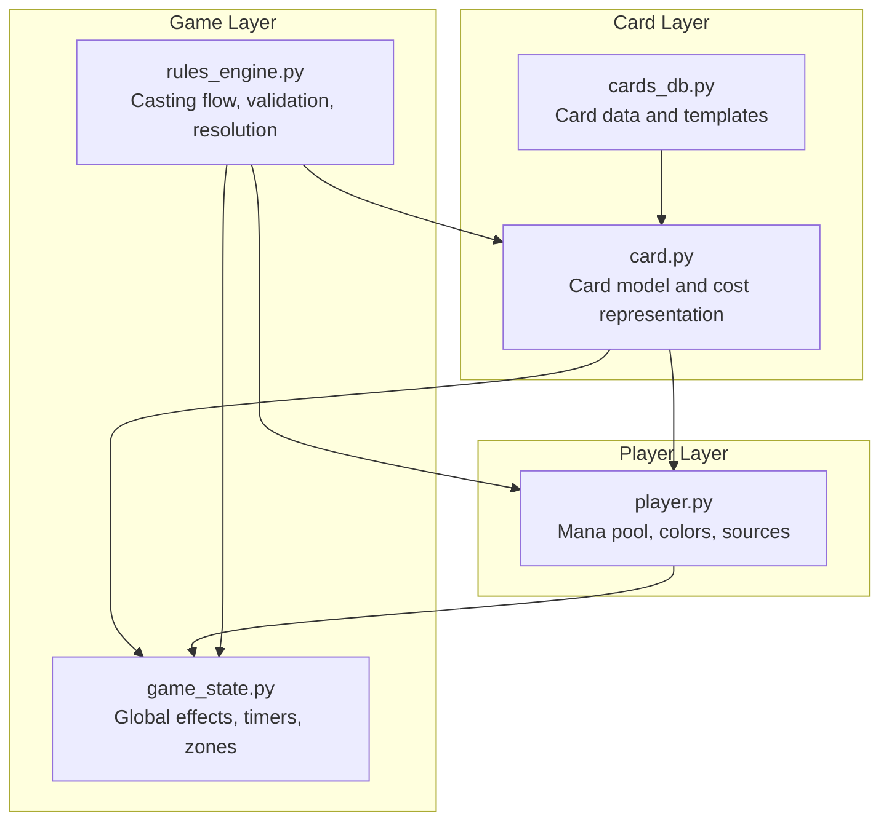
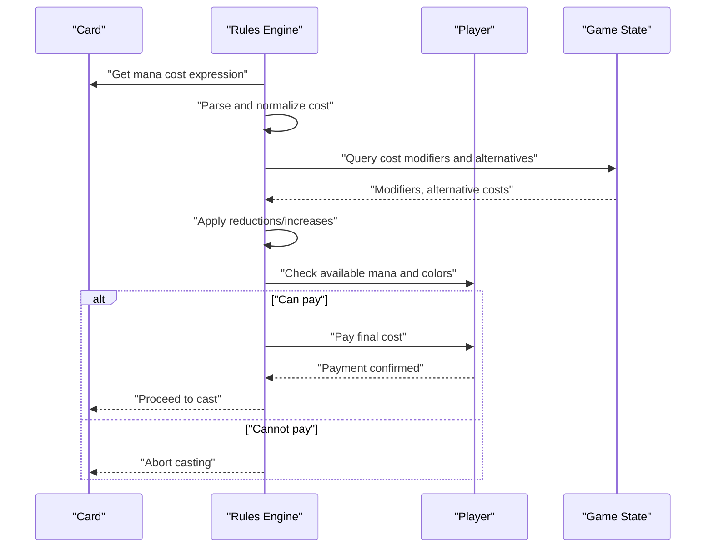
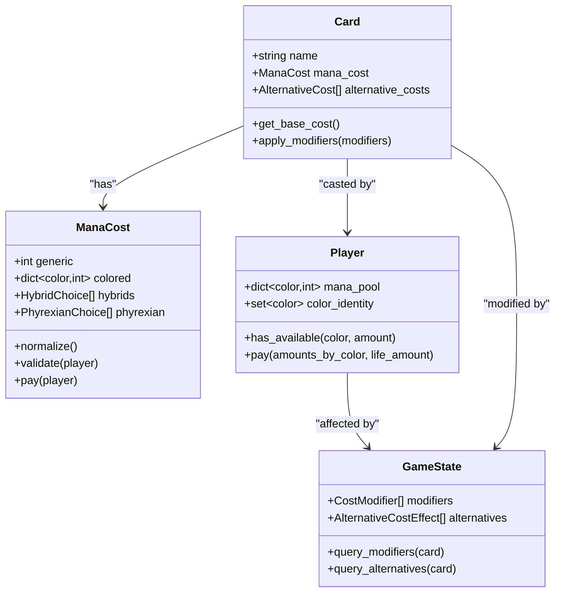
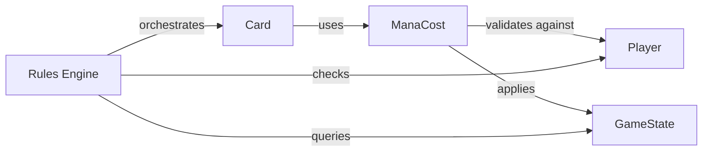

# Mana Cost Calculation

<cite>
**Referenced Files in This Document**
- [card.py](file://simuladorMtg/src/card.py)
- [player.py](file://simuladorMtg/src/player.py)
- [game_state.py](file://simuladorMtg/src/game_state.py)
- [rules_engine.py](file://simuladorMtg/src/rules_engine.py)
- [cards_db.py](file://simuladorMtg/src/cards_db.py)
- [Banco de Cartas.md](file://simuladorMtg/Banco de Cartas.md)
- [Banco de Regras.md](file://simuladorMtg/Banco de Regras.md)
- [Arquitetura.md](file://simuladorMtg/Arquitetura.md)
</cite>

## Table of Contents
1. [Introduction](#introduction)
2. [Project Structure](#project-structure)
3. [Core Components](#core-components)
4. [Architecture Overview](#architecture-overview)
5. [Detailed Component Analysis](#detailed-component-analysis)
6. [Dependency Analysis](#dependency-analysis)
7. [Performance Considerations](#performance-considerations)
8. [Troubleshooting Guide](#troubleshooting-guide)
9. [Conclusion](#conclusion)

## Introduction
This document explains the mana cost calculation system for cards in the MTG simulator. It covers how mana costs are parsed, validated, and calculated when casting spells, how the mana pool is managed, color restrictions, cost reduction modifiers, alternative costs, hybrid costs, phyrexian mana, and interactions with player resources. It also includes performance considerations and caching strategies to keep cost calculations efficient during gameplay.

## Project Structure
The mana cost system spans several core modules:
- Card definitions and cost representation live in the card module and card database.
- Player resource management (mana pool, colors, available sources) lives in the player module.
- Game state tracks global effects that modify costs and available alternatives.
- The rules engine orchestrates validation and resolution of casting, including cost payment and replacement/modification effects.

**Diagram sources**
- [card.py](file://simuladorMtg/src/card.py)
- [player.py](file://simuladorMtg/src/player.py)
- [game_state.py](file://simuladorMtg/src/game_state.py)
- [rules_engine.py](file://simuladorMtg/src/rules_engine.py)
- [cards_db.py](file://simuladorMtg/src/cards_db.py)

**Section sources**
- [Arquitetura.md](file://simuladorMtg/Arquitetura.md)

## Core Components
- Card cost model: Represents a spell’s mana cost, including generic, colored, hybrid, and phyrexian components, as well as alternative cost flags and cost modifiers.
- Player resources: Tracks each player’s mana pool by color, available land sources, and color identity constraints.
- Game state: Holds global cost modifiers, alternative cost effects, and replacement effects that influence casting.
- Rules engine: Implements the casting sequence, cost calculation, validation against player resources, and payment execution.

Key responsibilities:
- Parsing and normalizing mana cost expressions into structured components.
- Validating color requirements and availability.
- Applying cost reductions, increases, and alternative costs.
- Managing mana pool allocation and release on failure or success.
- Enforcing color restrictions and hybrid/phyrexian behavior.

**Section sources**
- [card.py](file://simuladorMtg/src/card.py)
- [player.py](file://simuladorMtg/src/player.py)
- [game_state.py](file://simuladorMtg/src/game_state.py)
- [rules_engine.py](file://simuladorMtg/src/rules_engine.py)

## Architecture Overview
The mana cost calculation follows a layered approach:
- Input: A card with a defined mana cost expression.
- Normalization: Convert the expression into a canonical form (generic, colored, hybrid, phyrexian).
- Modifier application: Apply global and local cost modifications from game state and effects.
- Validation: Check if the player can pay the final cost given their mana pool and sources.
- Payment: Deduct from the mana pool and finalize casting.

**Diagram sources**
- [rules_engine.py](file://simuladorMtg/src/rules_engine.py)
- [card.py](file://simuladorMtg/src/card.py)
- [player.py](file://simuladorMtg/src/player.py)
- [game_state.py](file://simuladorMtg/src/game_state.py)

## Detailed Component Analysis

### Mana Cost Parsing and Representation
Mana costs are represented as a collection of components:
- Generic mana: Numeric amounts not tied to color.
- Colored mana: Specific colors required.
- Hybrid mana: Choices between two colors or generic/color combinations.
- Phyrexian mana: Costs payable with life instead of specific colored mana.

Parsing steps:
- Tokenize the cost string into symbols.
- Group symbols into components with type and quantity.
- Normalize hybrid and phyrexian entries into explicit choice sets.

Validation steps:
- Ensure all components have non-negative quantities.
- Resolve hybrid choices deterministically based on context or preferences.
- Flag phyrexian components for life-payment options.

Complex examples:
- Mixed generic and colored components.
- Multiple hybrid symbols requiring consistent color selection across the cost.
- Phyrexian variants allowing life payment for specific colors.

**Section sources**
- [card.py](file://simuladorMtg/src/card.py)
- [Banco de Cartas.md](file://simuladorMtg/Banco de Cartas.md)

### Player Mana Pool and Color Restrictions
The player manages:
- Mana pool per color (white, blue, black, red, green).
- Available sources (lands, artifacts, abilities) that produce colored or generic mana.
- Color identity constraints that restrict which colors can be used.

Payment logic:
- Match required colored mana to available pools.
- Allow generic mana to satisfy any color requirement where permitted.
- For hybrid costs, choose one color option and ensure it is available.
- For phyrexian costs, allow life payment as an alternative to colored mana.

Color restriction enforcement:
- Reject payments that violate color identity or source limitations.
- Validate that chosen hybrid options align with available sources.

**Section sources**
- [player.py](file://simuladorMtg/src/player.py)

### Cost Modifiers and Alternative Costs
Cost modifiers include:
- Global reductions or increases applied by game state effects.
- Local reductions tied to specific card types or conditions.
- Replacement effects that change how a cost is paid (e.g., paying life instead of mana).

Alternative costs:
- Provide different ways to pay the same spell (e.g., exile-based costs, flashback).
- Must be mutually exclusive with the original cost unless explicitly allowed.

Application order:
- Start with base cost.
- Apply alternative cost selection if present.
- Apply reductions and increases in a defined order to avoid ambiguity.
- Finalize the payable cost for validation and payment.

**Section sources**
- [game_state.py](file://simuladorMtg/src/game_state.py)
- [rules_engine.py](file://simuladorMtg/src/rules_engine.py)
- [Banco de Regras.md](file://simuladorMtg/Banco de Regras.md)

### Casting Flow and Validation
The rules engine coordinates:
- Retrieving the card’s cost expression.
- Normalizing and resolving hybrid/phyrexian choices.
- Querying game state for modifiers and alternatives.
- Validating against player resources.
- Executing payment and proceeding to cast.

Error handling:
- If validation fails, abort casting and return an error indicating insufficient resources or invalid color choice.
- If payment succeeds, proceed to put the card onto the stack and resolve its effects.

**Section sources**
- [rules_engine.py](file://simuladorMtg/src/rules_engine.py)

### Data Models and Relationships

**Diagram sources**
- [card.py](file://simuladorMtg/src/card.py)
- [player.py](file://simuladorMtg/src/player.py)
- [game_state.py](file://simuladorMtg/src/game_state.py)

## Dependency Analysis
Mana cost calculation depends on:
- Card definitions for base costs and alternatives.
- Player resources for availability checks and payment.
- Game state for modifiers and alternative cost effects.
- Rules engine for orchestration and validation.

Potential coupling issues:
- Overly tight coupling between card cost parsing and payment logic can hinder testing and optimization.
- Global modifiers must be queried efficiently to avoid repeated lookups.

Mitigations:
- Separate parsing, normalization, and payment phases.
- Cache modifier results per turn or effect lifecycle.

**Diagram sources**
- [card.py](file://simuladorMtg/src/card.py)
- [player.py](file://simuladorMtg/src/player.py)
- [game_state.py](file://simuladorMtg/src/game_state.py)
- [rules_engine.py](file://simuladorMtg/src/rules_engine.py)

**Section sources**
- [rules_engine.py](file://simuladorMtg/src/rules_engine.py)
- [game_state.py](file://simuladorMtg/src/game_state.py)

## Performance Considerations
Optimization strategies:
- Parse and normalize mana costs once per card instance; cache normalized forms.
- Memoize cost modifier queries keyed by card and current effect set.
- Precompute hybrid choice sets when possible to reduce branching during validation.
- Use incremental mana pool checks rather than full re-validation on every step.
- Batch payment operations to minimize object churn.

Caching strategies:
- Cache normalized ManaCost objects per card template.
- Cache effective cost after applying modifiers for the current turn.
- Invalidate caches when global effects change or at phase boundaries.

[No sources needed since this section provides general guidance]

## Troubleshooting Guide
Common issues and resolutions:
- Insufficient mana: Verify player’s mana pool and sources; check color identity constraints.
- Invalid hybrid choice: Ensure the selected color matches available sources and card legality.
- Phyrexian payment errors: Confirm life payment is allowed and sufficient; validate color-specific phyrexian rules.
- Modifier conflicts: Review order of application; ensure reductions do not exceed base cost unless explicitly permitted.

Debugging tips:
- Log normalized cost components before validation.
- Print available mana by color and life total when payment fails.
- Trace modifier application order to identify unexpected increases or reductions.

**Section sources**
- [rules_engine.py](file://simuladorMtg/src/rules_engine.py)
- [player.py](file://simuladorMtg/src/player.py)

## Conclusion
The mana cost calculation system integrates card definitions, player resources, and game state modifiers to determine whether a spell can be cast. By separating parsing, normalization, modification, validation, and payment, the system remains maintainable and performant. Proper caching and clear error handling ensure smooth gameplay even with complex costs like hybrid and phyrexian mana. Continuous refinement of modifier application order and resource checks will further improve accuracy and efficiency.