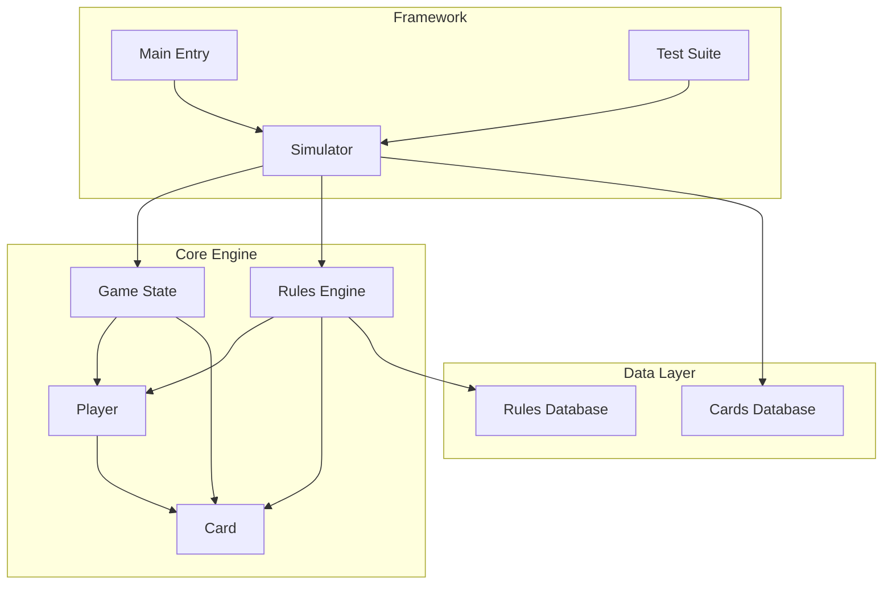
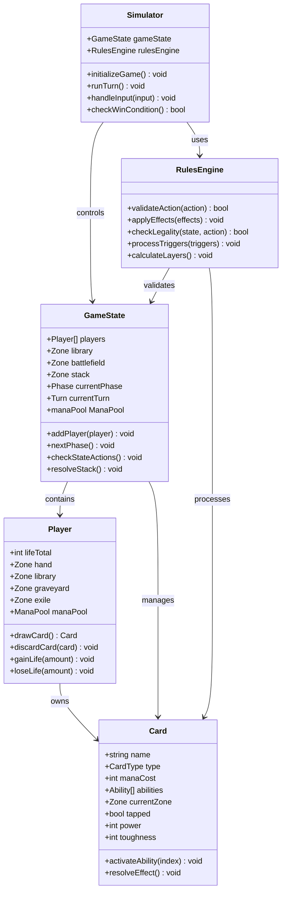
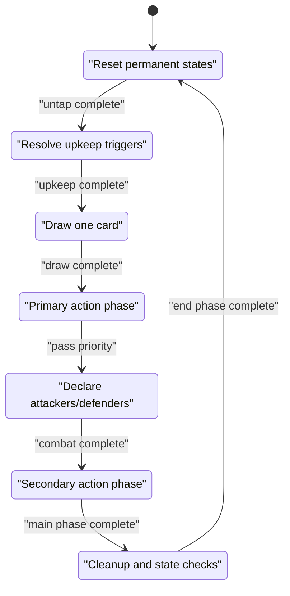
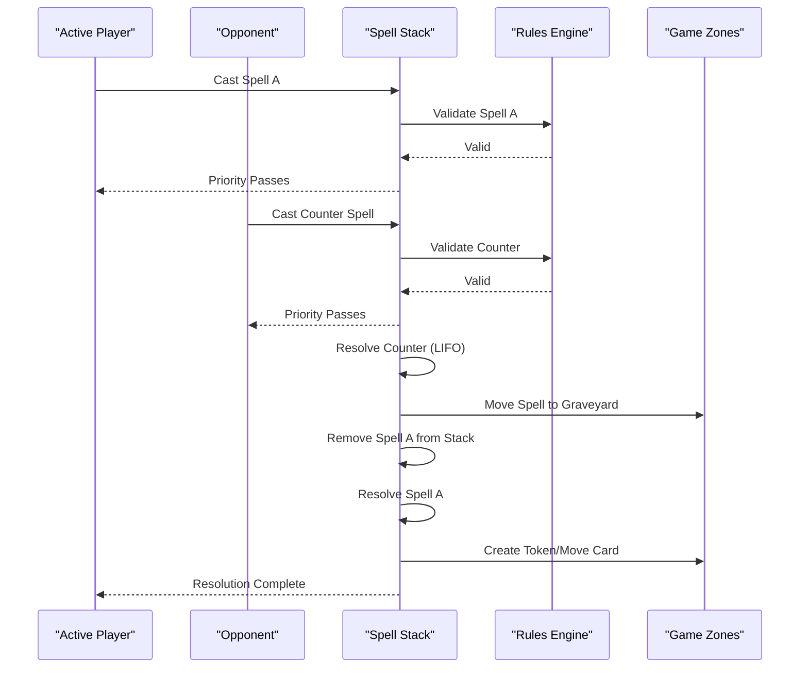
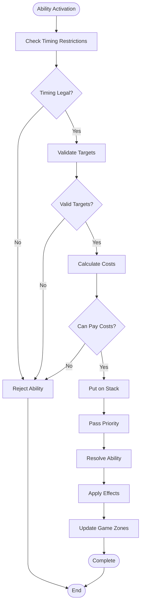
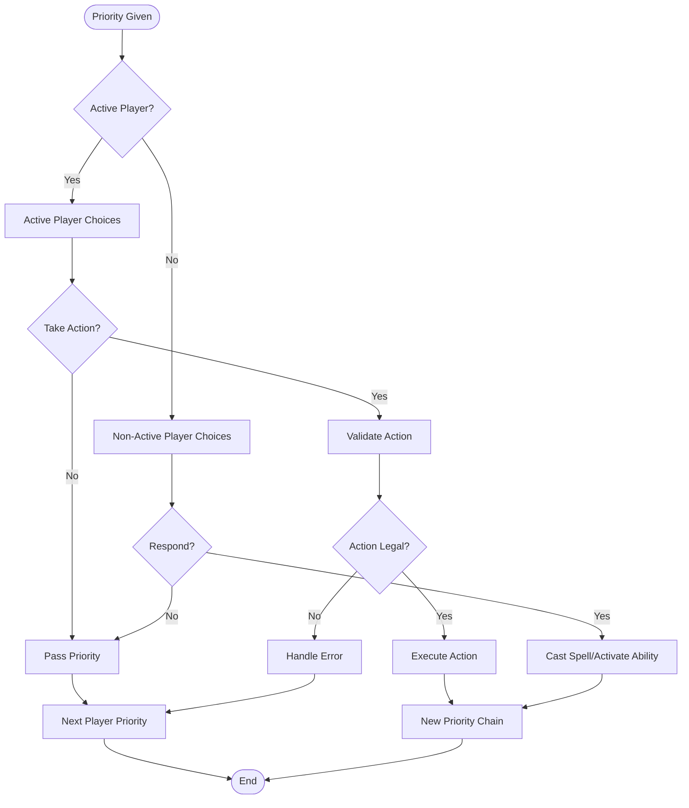
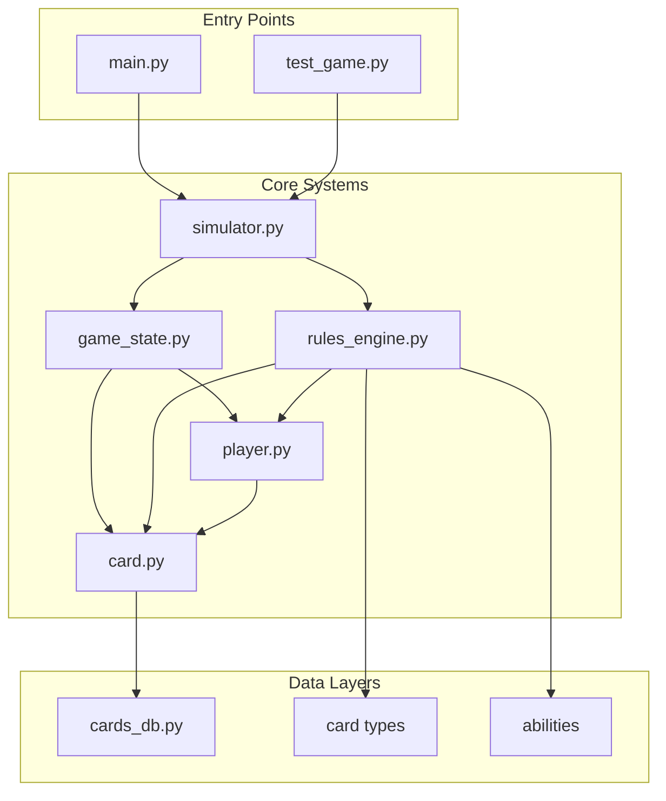

# Core Game Engine

<cite>
**Referenced Files in This Document**
- [game_state.py](file://simuladorMtg/src/game_state.py)
- [rules_engine.py](file://simuladorMtg/src/rules_engine.py)
- [player.py](file://simuladorMtg/src/player.py)
- [simulator.py](file://simuladorMtg/src/simulator.py)
- [card.py](file://simuladorMtg/src/card.py)
- [main.py](file://simuladorMtg/main.py)
- [test_game.py](file://simuladorMtg/test_game.py)
</cite>

## Table of Contents
1. [Introduction](#introduction)
2. [Project Structure](#project-structure)
3. [Core Components](#core-components)
4. [Architecture Overview](#architecture-overview)
5. [Detailed Component Analysis](#detailed-component-analysis)
6. [Dependency Analysis](#dependency-analysis)
7. [Performance Considerations](#performance-considerations)
8. [Troubleshooting Guide](#troubleshooting-guide)
9. [Conclusion](#conclusion)

## Introduction

This document provides comprehensive documentation for the core game engine components of the Magic: The Gathering simulator. The system implements a complete MTG game simulation with proper state management, rules enforcement, and player interaction. The engine follows official Magic: The Gathering Comprehensive Rules while providing a flexible framework for card interactions and game flow control.

The core engine consists of several interconnected systems:
- **Game State Management**: Handles zone tracking, turn phases, and resource management
- **Rules Engine**: Implements official Magic rules, priority system, and action validation
- **Player Management**: Manages life totals, hand management, and multiplayer support
- **Card System**: Defines card properties, abilities, and interactions
- **Simulation Framework**: Orchestrates game flow and event handling

## Project Structure

The codebase follows a modular architecture with clear separation of concerns:

**Diagram sources**
- [simulator.py](file://simuladorMtg/src/simulator.py)
- [game_state.py](file://simuladorMtg/src/game_state.py)
- [rules_engine.py](file://simuladorMtg/src/rules_engine.py)
- [player.py](file://simuladorMtg/src/player.py)
- [card.py](file://simuladorMtg/src/card.py)

**Section sources**
- [simulator.py](file://simuladorMtg/src/simulator.py)
- [main.py](file://simuladorMtg/main.py)

## Core Components

### Game State Management System

The game state system manages the complete state of a Magic game, including:

#### Zone Tracking
- **Library**: Player's deck with cards ordered for drawing
- **Hand**: Cards currently held by players
- **Battlefield**: Permanent cards in play (creatures, artifacts, enchantments, lands)
- **Graveyard**: Discarded or destroyed cards
- **Exile**: Cards removed from the game temporarily or permanently
- **Stack**: Spells and abilities waiting to resolve

#### Turn Phase Management
The game progresses through standard Magic phases:
1. **Untap Phase**: Permanent states are reset
2. **Upkeep Phase**: Triggered abilities resolve
3. **Draw Phase**: Players draw cards
4. **Main Phase 1**: Primary action phase
5. **Combat Phase**: Attack and defense resolution
6. **Main Phase 2**: Secondary action phase
7. **End Phase**: Cleanup and state-based actions

#### Resource Management
- **Mana Pool**: Temporary mana available for spending
- **Life Totals**: Player health tracking
- **Card Counters**: Various counters on permanents
- **Damage Tracking**: Damage marked on permanents and players

**Section sources**
- [game_state.py](file://simuladorMtg/src/game_state.py)

### Rules Engine Implementation

The rules engine enforces official Magic: The Gathering Comprehensive Rules:

#### Priority System
- **Active Player Priority**: Current player gets first priority
- **Non-Active Player Priority**: Other players respond
- **Stack Resolution**: Last-in-first-out order
- **State-Based Actions**: Automatic checks and effects

#### Action Validation
- **Legal Play Checks**: Validates if an action is legal
- **Targeting Rules**: Ensures valid targets exist
- **Timing Restrictions**: Enforces when actions can occur
- **Cost Payment**: Validates ability to pay costs

#### Rule Enforcement
- **Layer System**: Applies continuous effects in correct order
- **Triggered Abilities**: Manages when abilities trigger
- **Replacement Effects**: Modifies how events occur
- **Intervention Effects**: Prevents certain events

**Section sources**
- [rules_engine.py](file://simuladorMtg/src/rules_engine.py)

### Player Management System

Players manage their resources and make decisions throughout the game:

#### Life Total Management
- **Starting Life**: Typically 40 in multiplayer, 20 in two-player
- **Life Gain/Loss**: Dynamic adjustment during gameplay
- **Death Condition**: Life total reaches 0 or less
- **Tie Conditions**: Special rules for tied games

#### Hand Management
- **Hand Size Limits**: Maximum hand size equals current turn number
- **Discard Mechanics**: Forced discards and voluntary discards
- **Card Drawing**: From library, effects, or other zones
- **Card Visibility**: Hidden vs. revealed information

#### Multiplayer Support
- **Turn Order**: Clockwise rotation
- **Attack Targets**: Multiple opponents possible
- **Shared Team Rules**: Optional team mechanics
- **Information Sharing**: Controlled information flow

**Section sources**
- [player.py](file://simuladorMtg/src/player.py)

## Architecture Overview

The game engine follows a layered architecture pattern with clear separation between game logic, rules enforcement, and presentation:

**Diagram sources**
- [game_state.py](file://simuladorMtg/src/game_state.py)
- [rules_engine.py](file://simuladorMtg/src/rules_engine.py)
- [player.py](file://simuladorMtg/src/player.py)
- [card.py](file://simuladorMtg/src/card.py)
- [simulator.py](file://simuladorMtg/src/simulator.py)

## Detailed Component Analysis

### Game State Transitions

The game state transitions follow the standard Magic turn structure:

**Diagram sources**
- [game_state.py](file://simuladorMtg/src/game_state.py)

### Stack Resolution Flow

The stack manages spell and ability resolution in last-in-first-out order:

**Diagram sources**
- [rules_engine.py](file://simuladorMtg/src/rules_engine.py)
- [game_state.py](file://simuladorMtg/src/game_state.py)

### Card Ability Processing

Card abilities follow a complex resolution hierarchy:

**Diagram sources**
- [card.py](file://simuladorMtg/src/card.py)
- [rules_engine.py](file://simuladorMtg/src/rules_engine.py)

### Player Decision Flow

Player decision-making follows structured priority chains:

**Diagram sources**
- [player.py](file://simuladorMtg/src/player.py)
- [rules_engine.py](file://simuladorMtg/src/rules_engine.py)

## Dependency Analysis

The core components have well-defined dependencies that maintain system integrity:

**Diagram sources**
- [simulator.py](file://simuladorMtg/src/simulator.py)
- [game_state.py](file://simuladorMtg/src/game_state.py)
- [rules_engine.py](file://simuladorMtg/src/rules_engine.py)
- [player.py](file://simuladorMtg/src/player.py)
- [card.py](file://simuladorMtg/src/card.py)

### Key Dependency Relationships

1. **Simulator → Game State**: Controls overall game flow and state transitions
2. **Game State → Player/Card**: Manages collections and relationships
3. **Rules Engine → All Components**: Validates and enforces rules across all systems
4. **Player → Card**: Owns and controls card instances
5. **Card → Database**: References card definitions and properties

**Section sources**
- [simulator.py](file://simuladorMtg/src/simulator.py)
- [game_state.py](file://simuladorMtg/src/game_state.py)

## Performance Considerations

### Memory Management
- **Object Pooling**: Reuse expensive objects like card instances
- **Zone Optimization**: Efficient data structures for large libraries
- **Event Batching**: Process multiple events in single passes
- **Lazy Evaluation**: Calculate values only when needed

### Computational Efficiency
- **Rule Caching**: Cache frequently checked rule results
- **Incremental Updates**: Only update affected game state portions
- **Parallel Processing**: Independent calculations run concurrently
- **Early Termination**: Stop processing when outcome is determined

### Scalability Factors
- **Multiplayer Scaling**: O(n²) complexity for n-player interactions
- **Large Libraries**: Binary search for card lookup operations
- **Stack Depth**: Monitor and optimize deep recursion scenarios
- **Memory Leaks**: Regular cleanup of temporary objects

## Troubleshooting Guide

### Common Issues and Solutions

#### Game State Inconsistencies
- **Symptom**: Cards in wrong zones or invalid states
- **Cause**: Improper zone transitions or missing cleanup
- **Solution**: Implement comprehensive state validation and automatic cleanup

#### Rules Violations
- **Symptom**: Illegal actions accepted or legal actions rejected
- **Cause**: Incorrect rule implementation or timing errors
- **Solution**: Add comprehensive rule validation and detailed error logging

#### Performance Problems
- **Symptom**: Slow gameplay or memory leaks
- **Cause**: Inefficient algorithms or object accumulation
- **Solution**: Profile code paths and implement caching strategies

#### Multiplayer Issues
- **Symptom**: Incorrect turn order or information leakage
- **Cause**: Flawed priority system or information hiding
- **Solution**: Implement strict information boundaries and turn management

### Debugging Techniques
- **State Snapshots**: Take periodic snapshots of game state
- **Action Logging**: Record all player actions and system responses
- **Rule Verification**: Cross-check game state against known rules
- **Performance Profiling**: Identify bottlenecks in critical paths

**Section sources**
- [test_game.py](file://simuladorMtg/test_game.py)

## Conclusion

The Magic: The Gathering simulator implements a comprehensive game engine with proper state management, rules enforcement, and player interaction systems. The modular architecture allows for easy extension and maintenance while ensuring accurate simulation of official Magic rules.

Key strengths of the implementation include:
- **Accurate Rules**: Faithful implementation of Magic Comprehensive Rules
- **Scalable Design**: Modular components that can be extended independently
- **Robust State Management**: Comprehensive game state tracking and validation
- **Flexible Player System**: Support for various multiplayer formats

Future improvements could include:
- Enhanced AI capabilities for computer players
- Network multiplayer support
- Advanced visualization and replay systems
- Expanded card database and rule coverage

The engine provides a solid foundation for both educational purposes and competitive simulation, maintaining the spirit and complexity of Magic: The Gathering gameplay while offering programmable interfaces for customization and analysis.