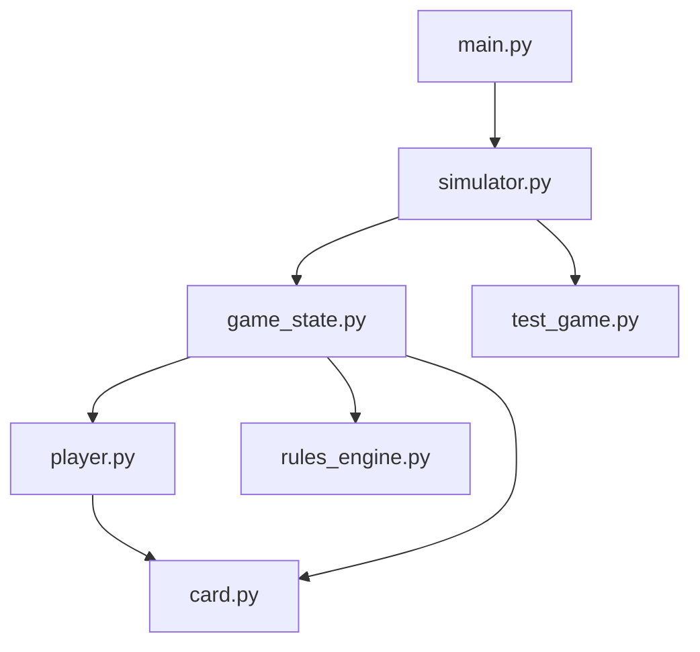
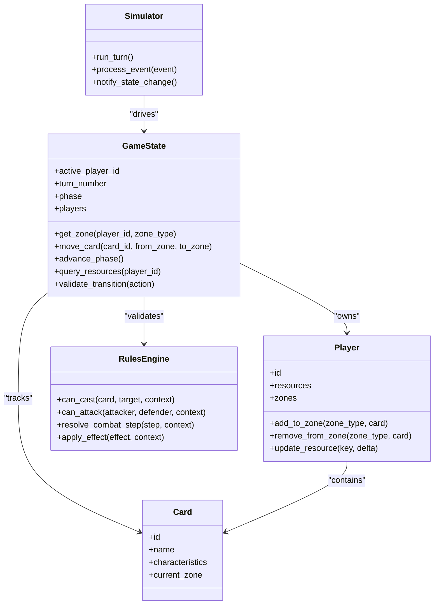
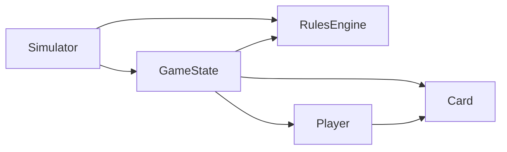
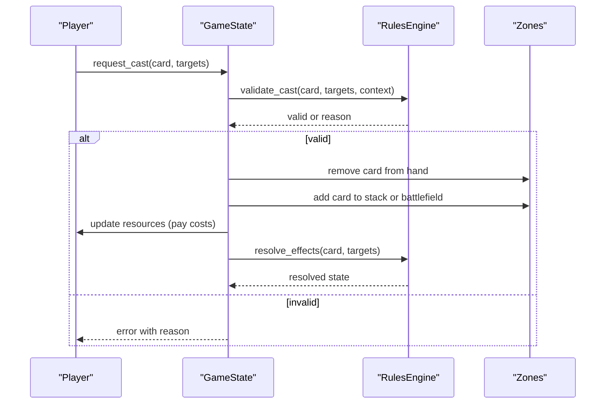
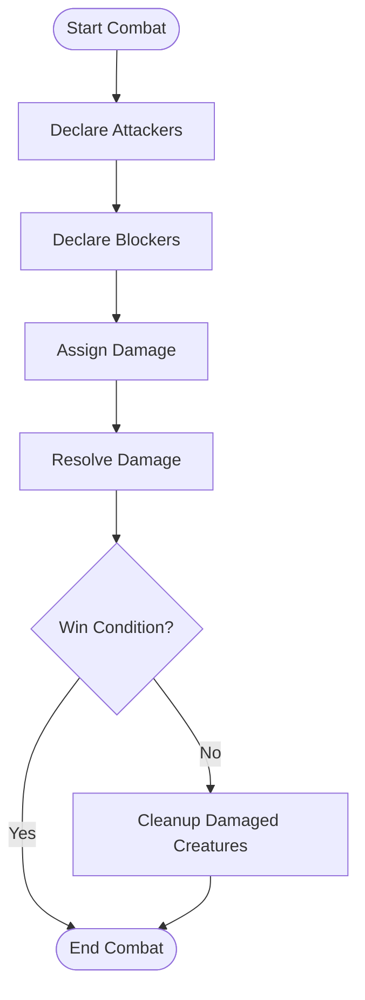
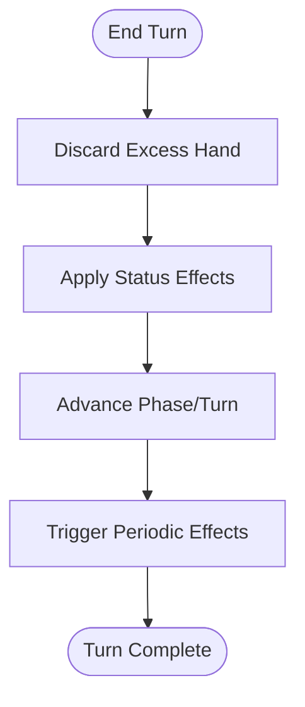

# Game State Management

<cite>
**Referenced Files in This Document**
- [game_state.py](file://simuladorMtg/src/game_state.py)
- [player.py](file://simuladorMtg/src/player.py)
- [card.py](file://simuladorMtg/src/card.py)
- [rules_engine.py](file://simuladorMtg/src/rules_engine.py)
- [simulator.py](file://simuladorMtg/src/simulator.py)
- [main.py](file://simuladorMtg/main.py)
- [test_game.py](file://simuladorMtg/test_game.py)
</cite>

## Table of Contents
1. [Introduction](#introduction)
2. [Project Structure](#project-structure)
3. [Core Components](#core-components)
4. [Architecture Overview](#architecture-overview)
5. [Detailed Component Analysis](#detailed-component-analysis)
6. [Dependency Analysis](#dependency-analysis)
7. [Performance Considerations](#performance-considerations)
8. [Troubleshooting Guide](#troubleshooting-guide)
9. [Conclusion](#conclusion)

## Introduction
This document explains the game state management system that tracks all aspects of gameplay, including zones (library, hand, battlefield, graveyard), turn phases, and resource tracking. It details how state transitions occur during phase progression, card movement between zones, and updates to game conditions. The guide also covers data structures used to maintain consistency across components, methods for querying and validating state changes, handling concurrent modifications, and performance considerations for large games.

## Project Structure
The project is organized around a core simulation loop with modular components:
- Game state orchestrates zones, players, turns, and resources.
- Player objects encapsulate per-player resources and zone contents.
- Card objects represent individual cards and their properties.
- Rules engine enforces legality of actions and state transitions.
- Simulator coordinates high-level flow and event processing.
- Main entry point initializes and runs the simulation.
- Tests validate behavior and edge cases.

**Diagram sources**
- [main.py](file://simuladorMtg/main.py)
- [simulator.py](file://simuladorMtg/src/simulator.py)
- [game_state.py](file://simuladorMtg/src/game_state.py)
- [player.py](file://simuladorMtg/src/player.py)
- [card.py](file://simuladorMtg/src/card.py)
- [rules_engine.py](file://simuladorMtg/src/rules_engine.py)
- [test_game.py](file://simuladorMtg/test_game.py)

**Section sources**
- [main.py](file://simuladorMtg/main.py)
- [simulator.py](file://simuladorMtg/src/simulator.py)
- [game_state.py](file://simuladorMtg/src/game_state.py)
- [player.py](file://simuladorMtg/src/player.py)
- [card.py](file://simuladorMtg/src/card.py)
- [rules_engine.py](file://simuladorMtg/src/rules_engine.py)
- [test_game.py](file://simuladorMtg/test_game.py)

## Core Components
- Game state: Central authority for zones, turn phases, active player, and global resources. Provides methods to query and mutate state safely.
- Player: Tracks per-player resources (e.g., mana, life), hands, libraries, battlefields, graveyards, and other zone-specific collections.
- Card: Represents a card’s identity, characteristics, and current location within a zone.
- Rules engine: Validates actions, enforces timing restrictions, and ensures legal state transitions.
- Simulator: Drives the game loop, processes events, and coordinates interactions between game state and rules.

Key responsibilities:
- Maintain consistent zone membership for each card.
- Enforce turn structure and phase transitions.
- Track and update resources deterministically.
- Provide query APIs for UI or AI consumers.
- Validate transitions before applying mutations.

**Section sources**
- [game_state.py](file://simuladorMtg/src/game_state.py)
- [player.py](file://simuladorMtg/src/player.py)
- [card.py](file://simuladorMtg/src/card.py)
- [rules_engine.py](file://simuladorMtg/src/rules_engine.py)
- [simulator.py](file://simuladorMtg/src/simulator.py)

## Architecture Overview
The architecture separates concerns into distinct modules:
- Game state owns the authoritative snapshot of the match.
- Players own their zones and resources.
- Cards are immutable identifiers with mutable state only when permitted by rules.
- Rules engine acts as a gatekeeper for all state-changing operations.
- Simulator sequences events and invokes game state and rules engine.

**Diagram sources**
- [game_state.py](file://simuladorMtg/src/game_state.py)
- [player.py](file://simuladorMtg/src/player.py)
- [card.py](file://simuladorMtg/src/card.py)
- [rules_engine.py](file://simuladorMtg/src/rules_engine.py)
- [simulator.py](file://simuladorMtg/src/simulator.py)

## Detailed Component Analysis

### Game State
Responsibilities:
- Maintains turn number, current phase, and active player.
- Manages per-player zones: library, hand, battlefield, graveyard.
- Exposes methods to move cards between zones and update resources.
- Provides validation hooks to ensure transitions comply with rules.
- Offers query interfaces for reading current state without mutation.

State transition mechanisms:
- Phase progression: advance_phase enforces ordering and triggers cleanup steps.
- Card movement: move_card validates destination legality and updates ownership/zone references.
- Resource updates: atomic increments/decrements with validation against constraints.

Querying and validation:
- get_zone returns a stable view of a zone for a given player.
- validate_transition checks action legality before mutation.
- query_resources returns current resource totals for a player.

Concurrency considerations:
- Mutations should be serialized through a single transactional path to avoid race conditions.
- Read-only queries can be performed concurrently if underlying structures support it.

**Section sources**
- [game_state.py](file://simuladorMtg/src/game_state.py)

### Player
Responsibilities:
- Owns resources such as life and mana pools.
- Manages zone collections: library, hand, battlefield, graveyard.
- Provides add/remove operations for cards within zones.
- Updates resources with bounds checking and event notifications.

Data consistency:
- Ensures a card appears in exactly one zone at any time.
- Prevents illegal moves via internal guards and external rules validation.

**Section sources**
- [player.py](file://simuladorMtg/src/player.py)

### Card
Responsibilities:
- Encapsulates card identity and characteristics.
- Tracks current zone to enable quick lookups and debugging.
- Remains largely immutable; state changes are mediated by game state and rules.

Consistency:
- Zone reference must be updated atomically with container updates.

**Section sources**
- [card.py](file://simuladorMtg/src/card.py)

### Rules Engine
Responsibilities:
- Validates casting eligibility, targeting, and timing windows.
- Enforces combat legality and step-by-step resolution.
- Applies effects deterministically based on context.

Integration:
- Called by game state before mutating zones or resources.
- Returns detailed reasons for invalid transitions to aid debugging.

**Section sources**
- [rules_engine.py](file://simuladorMtg/src/rules_engine.py)

### Simulator
Responsibilities:
- Drives the main loop and turn execution.
- Processes events and delegates to game state and rules engine.
- Notifies observers of state changes for UI or logging.

Flow control:
- Coordinates phase advancement and end-of-turn cleanup.
- Ensures deterministic order of effect resolution.

**Section sources**
- [simulator.py](file://simuladorMtg/src/simulator.py)

## Dependency Analysis
The system exhibits clear separation:
- Simulator depends on game state and rules engine.
- Game state depends on player and card models.
- Player depends on card model.
- Rules engine is independent but consulted by game state and simulator.

**Diagram sources**
- [simulator.py](file://simuladorMtg/src/simulator.py)
- [game_state.py](file://simuladorMtg/src/game_state.py)
- [player.py](file://simuladorMtg/src/player.py)
- [card.py](file://simuladorMtg/src/card.py)
- [rules_engine.py](file://simuladorMtg/src/rules_engine.py)

**Section sources**
- [simulator.py](file://simuladorMtg/src/simulator.py)
- [game_state.py](file://simuladorMtg/src/game_state.py)
- [player.py](file://simuladorMtg/src/player.py)
- [card.py](file://simuladorMtg/src/card.py)
- [rules_engine.py](file://simuladorMtg/src/rules_engine.py)

## Detailed Component Analysis

### Casting Spells: State Changes and Validation
Sequence of operations:
- Player initiates cast with a card and targets.
- Rules engine validates eligibility and timing.
- Game state moves card from hand to stack/battlefield depending on type.
- Resources are adjusted (e.g., mana cost paid).
- Effects resolve according to rules.

**Diagram sources**
- [game_state.py](file://simuladorMtg/src/game_state.py)
- [rules_engine.py](file://simuladorMtg/src/rules_engine.py)
- [player.py](file://simuladorMtg/src/player.py)
- [card.py](file://simuladorMtg/src/card.py)

**Section sources**
- [game_state.py](file://simuladorMtg/src/game_state.py)
- [rules_engine.py](file://simuladorMtg/src/rules_engine.py)
- [player.py](file://simuladorMtg/src/player.py)
- [card.py](file://simuladorMtg/src/card.py)

### Combat Resolution: Step-by-Step Flow
Combat involves multiple steps with strict ordering:
- Declare attackers and blockers.
- Deal combat damage.
- Update lifepoints and check win conditions.
- Move damaged creatures to graveyard if lethal.

**Diagram sources**
- [game_state.py](file://simuladorMtg/src/game_state.py)
- [rules_engine.py](file://simuladorMtg/src/rules_engine.py)
- [player.py](file://simuladorMtg/src/player.py)

**Section sources**
- [game_state.py](file://simuladorMtg/src/game_state.py)
- [rules_engine.py](file://simuladorMtg/src/rules_engine.py)
- [player.py](file://simuladorMtg/src/player.py)

### End-of-Turn Cleanup: Phase Transition
End-of-turn cleanup includes:
- Discard down to maximum hand size.
- Mark creatures with specific statuses.
- Advance to next phase or turn.
- Trigger periodic effects.

**Diagram sources**
- [game_state.py](file://simuladorMtg/src/game_state.py)
- [rules_engine.py](file://simuladorMtg/src/rules_engine.py)

**Section sources**
- [game_state.py](file://simuladorMtg/src/game_state.py)
- [rules_engine.py](file://simuladorMtg/src/rules_engine.py)

## Performance Considerations
- Use efficient zone representations (e.g., hash sets for uniqueness, arrays for ordered zones like library top/bottom).
- Avoid deep copies of state; prefer immutable snapshots for read-heavy operations.
- Batch resource updates to minimize validation overhead.
- Cache frequently accessed derived data (e.g., available mana, board state) and invalidate selectively.
- Limit object churn by reusing card instances where possible.
- Implement lazy evaluation for expensive computations triggered only when queried.

[No sources needed since this section provides general guidance]

## Troubleshooting Guide
Common issues and resolutions:
- Illegal card movement: Ensure move_card calls validate_transition first and that source/target zones exist.
- Resource inconsistencies: Verify resource updates are atomic and bounded; check for double-spending or negative values.
- Phase stuck: Confirm advance_phase respects ordering and triggers required cleanup steps.
- Effect resolution errors: Inspect rules engine validations and context passed to apply_effect.

Validation strategies:
- Always call validate_transition before mutating state.
- Use invariant checks after mutations to catch inconsistencies early.
- Log detailed reasons for failed validations to speed up debugging.

Concurrent modification handling:
- Serialize mutations through a single transactional path.
- Use read locks for concurrent queries if necessary.
- Prefer immutable snapshots for UI rendering to avoid lock contention.

**Section sources**
- [game_state.py](file://simuladorMtg/src/game_state.py)
- [rules_engine.py](file://simuladorMtg/src/rules_engine.py)
- [test_game.py](file://simuladorMtg/test_game.py)

## Conclusion
The game state management system centralizes control over zones, turn phases, and resources while delegating legality checks to a dedicated rules engine. Clear separation of responsibilities, robust validation, and careful concurrency handling ensure consistency and performance. By following the documented flows for casting spells, combat resolution, and end-of-turn cleanup, developers can extend and maintain the system effectively.

[No sources needed since this section summarizes without analyzing specific files]