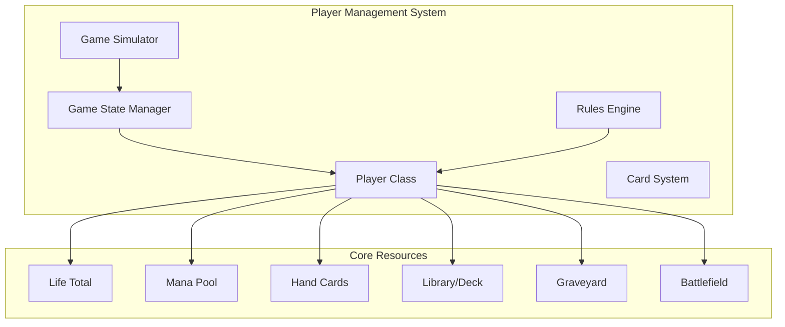
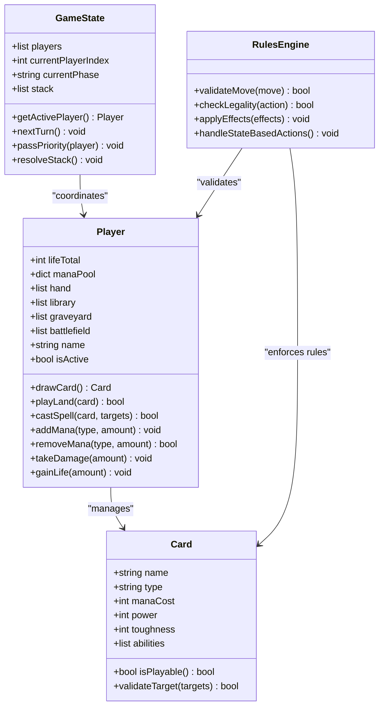
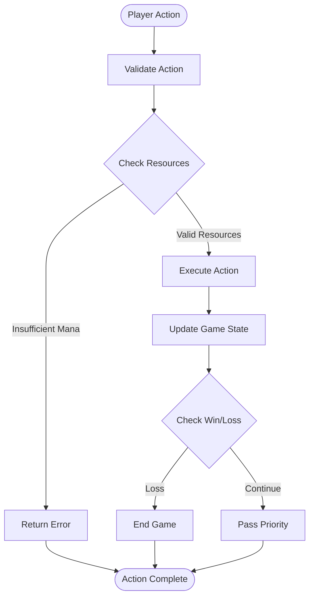
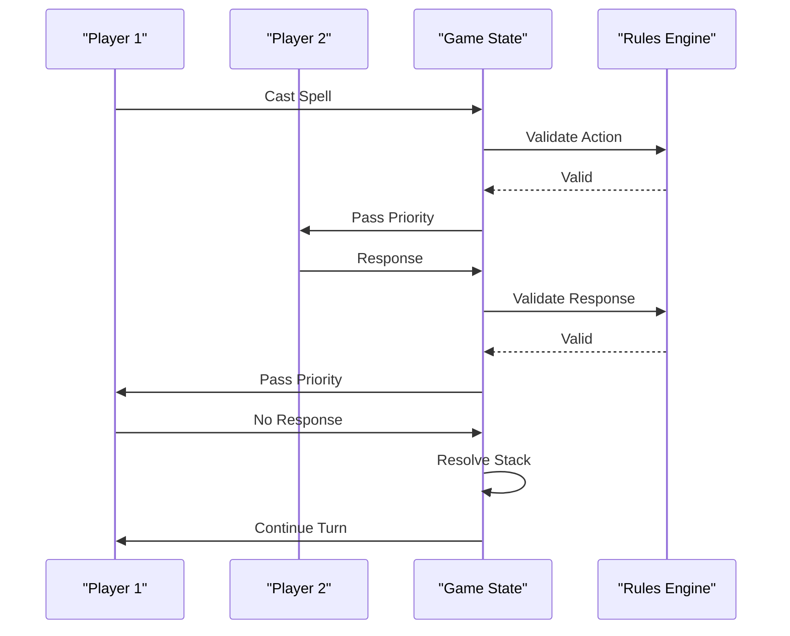
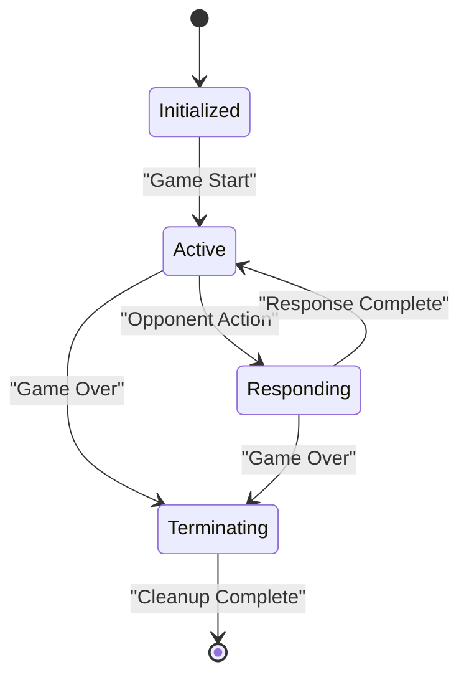
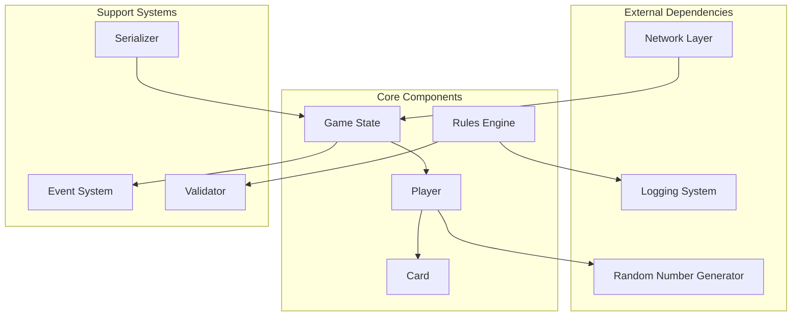

# Player Management System

<cite>
**Referenced Files in This Document**
- [player.py](file://simuladorMtg/src/player.py)
- [game_state.py](file://simuladorMtg/src/game_state.py)
- [card.py](file://simuladorMtg/src/card.py)
- [rules_engine.py](file://simuladorMtg/src/rules_engine.py)
- [simulator.py](file://simuladorMtg/src/simulator.py)
- [main.py](file://simuladorMtg/main.py)
</cite>

## Table of Contents
1. [Introduction](#introduction)
2. [Project Structure](#project-structure)
3. [Core Components](#core-components)
4. [Architecture Overview](#architecture-overview)
5. [Detailed Component Analysis](#detailed-component-analysis)
6. [Dependency Analysis](#dependency-analysis)
7. [Performance Considerations](#performance-considerations)
8. [Troubleshooting Guide](#troubleshooting-guide)
9. [Conclusion](#conclusion)
10. [Appendices](#appendices)

## Introduction

The Player Management System is a core component of the Magic: The Gathering simulator that handles all aspects of player state, resources, and interactions. This system manages player life totals, mana pools, hand cards, library (deck), graveyard, and other game zones while enforcing game rules and facilitating multiplayer gameplay.

The system supports both single-player and multiplayer scenarios, implementing proper turn order, priority passing, and inter-player interactions. It provides a robust framework for extending player functionality and implementing custom behaviors through inheritance and composition patterns.

## Project Structure

The player management system is organized within the `simuladorMtg` package with clear separation of concerns:



**Diagram sources**
- [player.py:1-50](file://simuladorMtg/src/player.py#L1-L50)
- [game_state.py:1-50](file://simuladorMtg/src/game_state.py#L1-L50)
- [card.py:1-50](file://simuladorMtg/src/card.py#L1-L50)

**Section sources**
- [player.py:1-100](file://simuladorMtg/src/player.py#L1-L100)
- [game_state.py:1-100](file://simuladorMtg/src/game_state.py#L1-L100)

## Core Components

### Player Class Architecture

The Player class serves as the central entity managing all player-specific data and operations. It implements comprehensive resource management including life totals, mana pools, card zones, and game state tracking.

#### Key Responsibilities:
- **Resource Management**: Life totals, mana pools, card counts
- **Zone Operations**: Library, hand, battlefield, graveyard management
- **Turn Coordination**: Active player status and turn phases
- **Action Validation**: Rule enforcement and move legality checking
- **Event Emission**: Game state change notifications

#### Data Structures:
- **Life Total**: Integer representing current life points
- **Mana Pool**: Dictionary mapping mana types to quantities
- **Hand**: List of cards currently held by the player
- **Library**: Ordered collection of cards in deck
- **Graveyard**: Collection of discarded/exiled cards
- **Battlefield**: Cards currently in play

**Section sources**
- [player.py:1-200](file://simuladorMtg/src/player.py#L1-L200)

### Game State Integration

The Game State manager coordinates multiple players and maintains global game information including turn order, phase tracking, and stack operations.

#### Multiplayer Support Features:
- **Turn Order Management**: Circular rotation of active players
- **Priority System**: Sequential action resolution
- **Information Visibility**: Controlled card information sharing
- **Synchronization**: Consistent state across all clients

**Section sources**
- [game_state.py:1-150](file://simuladorMtg/src/game_state.py#L1-L150)

## Architecture Overview

The player management system follows a layered architecture pattern with clear separation between data management, business logic, and presentation layers.



**Diagram sources**
- [player.py:1-300](file://simuladorMtg/src/player.py#L1-L300)
- [game_state.py:1-200](file://simuladorMtg/src/game_state.py#L1-L200)
- [card.py:1-150](file://simuladorMtg/src/card.py#L1-L150)
- [rules_engine.py:1-100](file://simuladorMtg/src/rules_engine.py#L1-L100)

## Detailed Component Analysis

### Player Resource Management

The Player class implements comprehensive resource management with methods for manipulating all game resources. Each operation includes validation and error handling to maintain game integrity.

#### Life Total Management:
- **Gain Life**: Increases player's life total with overflow protection
- **Take Damage**: Decreases life total with loss condition checking
- **Life Zero Check**: Automatic game over detection

#### Mana Pool Operations:
- **Mana Addition**: Type-specific mana pool management
- **Mana Usage**: Cost payment with automatic pool cleanup
- **Mana Types**: Support for all five colors plus generic mana

#### Card Zone Operations:
- **Drawing**: Random card selection from library
- **Playing Lands**: Land deployment with timing restrictions
- **Casting Spells**: Complex spell resolution with targeting
- **Discarding**: Hand management with forced discard effects



**Diagram sources**
- [player.py:100-250](file://simuladorMtg/src/player.py#L100-L250)
- [rules_engine.py:50-150](file://simuladorMtg/src/rules_engine.py#L50-L150)

**Section sources**
- [player.py:100-300](file://simuladorMtg/src/player.py#L100-L300)

### Multiplayer Turn Coordination

The multiplayer system implements sophisticated turn coordination with proper priority passing and inter-player communication.

#### Turn Order Management:
- **Circular Rotation**: Players take turns in fixed order
- **Phase Tracking**: Global game phases synchronized across all players
- **Stack Resolution**: Last-in-first-out action resolution

#### Priority System:
- **Sequential Passing**: Active player passes priority to next player
- **Response Window**: Players can respond to actions
- **Stack Management**: Actions resolve in reverse order



**Diagram sources**
- [game_state.py:100-200](file://simuladorMtg/src/game_state.py#L100-L200)
- [simulator.py:1-100](file://simuladorMtg/src/simulator.py#L1-L100)

**Section sources**
- [game_state.py:100-250](file://simuladorMtg/src/game_state.py#L100-L250)

### Input Validation and Error Handling

The system implements comprehensive input validation to prevent illegal moves and maintain game integrity.

#### Validation Layers:
- **Syntax Validation**: Basic parameter checking
- **Rule Validation**: Game rule compliance verification
- **State Validation**: Current game state compatibility
- **Resource Validation**: Sufficient resources check

#### Error Handling Strategies:
- **Graceful Degradation**: Partial failure handling
- **State Recovery**: Automatic rollback on errors
- **User Feedback**: Clear error messages
- **Logging**: Comprehensive error tracking

**Section sources**
- [rules_engine.py:1-200](file://simuladorMtg/src/rules_engine.py#L1-L200)

### Player Lifecycle Management

The player lifecycle encompasses initialization, active gameplay, and termination phases with proper resource cleanup and state synchronization.

#### Initialization Phase:
- **Player Creation**: Constructor with default values
- **Deck Setup**: Random shuffling and initial draw
- **Resource Allocation**: Starting life total and mana setup

#### Active Gameplay:
- **Turn Participation**: Full interaction capabilities
- **State Updates**: Real-time synchronization
- **Event Handling**: Reaction to game events

#### Termination Phase:
- **Score Calculation**: Final statistics computation
- **Resource Cleanup**: Memory and connection cleanup
- **State Persistence**: Game result saving



**Diagram sources**
- [player.py:1-100](file://simuladorMtg/src/player.py#L1-L100)
- [simulator.py:1-150](file://simuladorMtg/src/simulator.py#L1-L150)

**Section sources**
- [player.py:1-150](file://simuladorMtg/src/player.py#L1-L150)

## Dependency Analysis

The player management system has well-defined dependencies with clear separation between components.



**Diagram sources**
- [player.py:1-50](file://simuladorMtg/src/player.py#L1-L50)
- [game_state.py:1-50](file://simuladorMtg/src/game_state.py#L1-L50)
- [simulator.py:1-50](file://simuladorMtg/src/simulator.py#L1-L50)

**Section sources**
- [player.py:1-100](file://simuladorMtg/src/player.py#L1-L100)
- [game_state.py:1-100](file://simuladorMtg/src/game_state.py#L1-L100)

## Performance Considerations

The player management system is designed with performance optimization in mind, particularly for multiplayer scenarios with many concurrent players.

### Optimization Strategies:
- **Lazy Loading**: Deferred resource loading for large decks
- **Memory Management**: Efficient card object pooling
- **Concurrent Access**: Thread-safe operations for multiplayer
- **Event Batching**: Consolidated state updates

### Scalability Features:
- **Player Count Scaling**: Optimized for 2-6 player games
- **Memory Footprint**: Minimal memory usage per player
- **Network Efficiency**: Compressed state synchronization
- **CPU Utilization**: Parallel processing where possible

## Troubleshooting Guide

Common issues and their solutions in the player management system:

### Resource Management Issues:
- **Mana Pool Overflow**: Ensure proper mana type conversion
- **Card Count Mismatches**: Verify zone transitions are complete
- **Life Total Errors**: Check damage and healing calculations

### Multiplayer Problems:
- **Turn Order Conflicts**: Verify player index calculations
- **Priority Loop Detection**: Implement timeout mechanisms
- **State Desynchronization**: Force full state sync on disconnect

### Validation Failures:
- **Illegal Moves**: Review rule engine constraints
- **Invalid Targets**: Check targeting validity functions
- **Timing Restrictions**: Verify phase-based permissions

**Section sources**
- [rules_engine.py:100-200](file://simuladorMtg/src/rules_engine.py#L100-L200)
- [game_state.py:150-250](file://simuladorMtg/src/game_state.py#L150-L250)

## Conclusion

The Player Management System provides a comprehensive foundation for Magic: The Gathering gameplay simulation. Its modular design allows for easy extension and customization while maintaining strict adherence to game rules. The multiplayer support ensures fair and consistent gameplay across multiple participants.

Key strengths include robust resource management, comprehensive validation, and scalable multiplayer architecture. The system's extensibility makes it suitable for implementing custom game modes and additional mechanics beyond standard Magic rules.

Future enhancements could include advanced AI opponents, tournament mode support, and enhanced networking capabilities for online play.

## Appendices

### A. Player Operation Examples

#### Drawing Cards:
```python
# Draw a single card
card = player.draw_card()

# Draw multiple cards
cards = player.draw_cards(3)

# Draw until condition met
while not target_condition():
    card = player.draw_card()
```

#### Playing Lands:
```python
# Play a land during main phase
success = player.play_land(land_card)

# With validation
if player.can_play_land(land_card):
    player.play_land(land_card)
```

#### Casting Spells:
```python
# Cast a spell with targets
spell_result = player.cast_spell(spell_card, targets=[target1, target2])

# With mana payment
if player.has_sufficient_mana(spell_cost):
    player.pay_mana(spell_cost)
    player.cast_spell(spell_card, targets)
```

### B. Custom Player Implementation

To extend player functionality, inherit from the base Player class:

```python
class CustomPlayer(Player):
    def __init__(self, name, deck):
        super().__init__(name, deck)
        self.custom_resource = 0
    
    def custom_action(self, target):
        # Custom logic here
        pass
    
    def validate_custom_move(self, move):
        # Custom validation
        return True
```

### C. Event Handling

Players can subscribe to game events:

```python
def on_card_drawn(card):
    print(f"Player drew {card.name}")

player.subscribe_event("card_drawn", on_card_drawn)
```