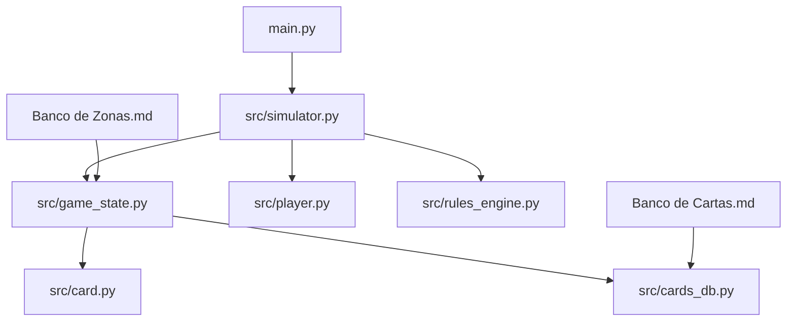
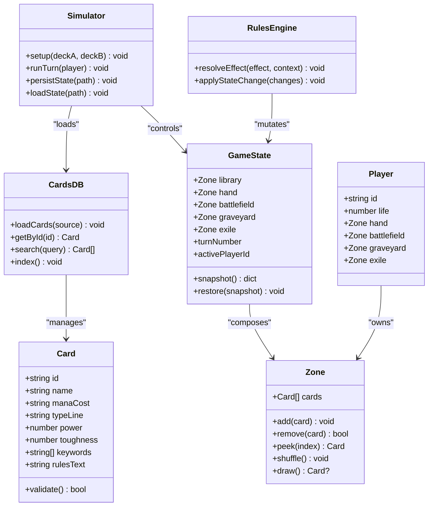
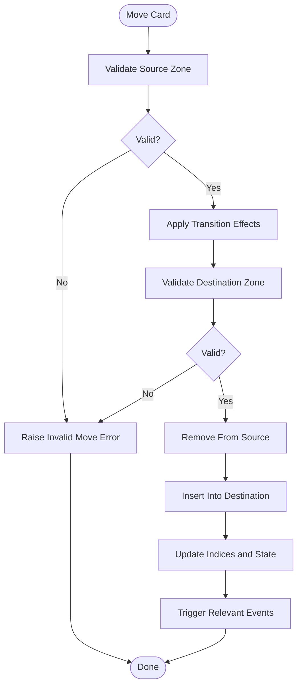
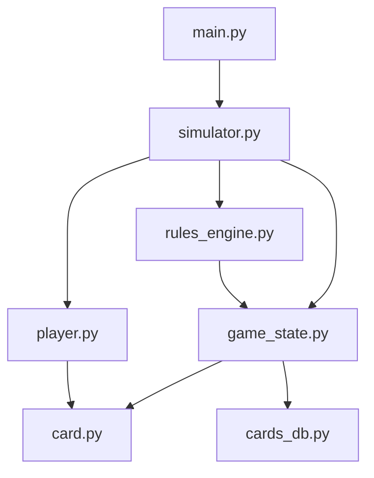

# Data Management

<cite>
**Referenced Files in This Document**
- [main.py](file://simuladorMtg/main.py)
- [card.py](file://simuladorMtg/src/card.py)
- [cards_db.py](file://simuladorMtg/src/cards_db.py)
- [game_state.py](file://simuladorMtg/src/game_state.py)
- [player.py](file://simuladorMtg/src/player.py)
- [rules_engine.py](file://simuladorMtg/src/rules_engine.py)
- [simulator.py](file://simuladorMtg/src/simulator.py)
- [Banco de Cartas.md](file://simuladorMtg/Banco de Cartas.md)
- [Banco de Zonas.md](file://simuladorMtg/Banco de Zonas.md)
- [Arquitetura.md](file://simuladorMtg/Arquitetura.md)
</cite>

## Table of Contents
1. [Introduction](#introduction)
2. [Project Structure](#project-structure)
3. [Core Components](#core-components)
4. [Architecture Overview](#architecture-overview)
5. [Detailed Component Analysis](#detailed-component-analysis)
6. [Dependency Analysis](#dependency-analysis)
7. [Performance Considerations](#performance-considerations)
8. [Troubleshooting Guide](#troubleshooting-guide)
9. [Conclusion](#conclusion)
10. [Appendices](#appendices)

## Introduction
This document explains the data management systems used by the MTG simulator. It covers the card database schema, file formats for card definitions, deck configuration structures, zone management (library, hand, battlefield, graveyard, exile), data serialization and persistence, backup strategies, validation and integrity checks, error recovery procedures, performance optimization for large datasets, and caching strategies. The goal is to provide a clear, accessible guide for developers adding cards, creating decks, and maintaining robust data pipelines.

## Project Structure
The project organizes game logic under simuladorMtg/src with supporting documentation and assets at the root. Key modules include:
- Card model and card database access
- Game state and zones
- Player representation
- Rules engine integration
- Simulator orchestration
- Markdown-based reference documents for cards and zones

**Diagram sources**
- [main.py](file://simuladorMtg/main.py)
- [simulator.py](file://simuladorMtg/src/simulator.py)
- [game_state.py](file://simuladorMtg/src/game_state.py)
- [player.py](file://simuladorMtg/src/player.py)
- [card.py](file://simuladorMtg/src/card.py)
- [cards_db.py](file://simuladorMtg/src/cards_db.py)
- [rules_engine.py](file://simuladorMtg/src/rules_engine.py)
- [Banco de Cartas.md](file://simuladorMtg/Banco de Cartas.md)
- [Banco de Zonas.md](file://simuladorMtg/Banco de Zonas.md)

**Section sources**
- [Arquitetura.md](file://simuladorMtg/Arquitetura.md)

## Core Components
- Card model: Represents a single card definition with attributes such as name, mana cost, type, power/toughness, keywords, and rules text.
- Card database: Provides lookup, filtering, and loading mechanisms for card definitions from files or in-memory stores.
- Game state: Holds the current match state including zones (library, hand, battlefield, graveyard, exile), turn structure, and active player context.
- Player: Tracks each player’s resources, life totals, and per-zone collections.
- Rules engine: Encapsulates rule interactions and effects resolution that may mutate game state and card properties.
- Simulator: Orchestrates setup, turns, and event processing while coordinating data persistence and validation.

**Section sources**
- [card.py](file://simuladorMtg/src/card.py)
- [cards_db.py](file://simuladorMtg/src/cards_db.py)
- [game_state.py](file://simuladorMtg/src/game_state.py)
- [player.py](file://simuladorMtg/src/player.py)
- [rules_engine.py](file://simuladorMtg/src/rules_engine.py)
- [simulator.py](file://simuladorMtg/src/simulator.py)

## Architecture Overview
The data management architecture separates concerns between static card definitions, dynamic game state, and orchestration. Card definitions are loaded once into an in-memory index for fast lookups. Game state maintains mutable collections per zone. The rules engine interacts with these components through well-defined interfaces. Persistence layers serialize state snapshots and backups.

**Diagram sources**
- [card.py](file://simuladorMtg/src/card.py)
- [cards_db.py](file://simuladorMtg/src/cards_db.py)
- [game_state.py](file://simuladorMtg/src/game_state.py)
- [player.py](file://simuladorMtg/src/player.py)
- [rules_engine.py](file://simuladorMtg/src/rules_engine.py)
- [simulator.py](file://simuladorMtg/src/simulator.py)

## Detailed Component Analysis

### Card Database Schema and File Formats
- Card definition fields typically include identifiers, textual descriptors, numeric attributes, and keyword arrays.
- Recommended file formats:
  - JSON: Human-readable, easy to parse, supports nested structures.
  - YAML: Compact, readable, good for hierarchical configurations.
  - CSV: Simple tabular format for bulk imports; requires careful header mapping.
- Validation rules:
  - Required fields: id, name, typeLine.
  - Numeric constraints: power and toughness must be non-negative integers when applicable.
  - Enumerations: typeLine values should match allowed sets (creature, instant, sorcery, etc.).
  - Keyword presence: keywords must be recognized by the rules engine.

Example workflow for adding a new card:
1. Create a new card entry in the card definition file following the schema.
2. Run validation to ensure required fields and constraints are satisfied.
3. Rebuild the card index in memory.
4. Verify search and lookup behavior via unit tests.

**Section sources**
- [Banco de Cartas.md](file://simuladorMtg/Banco de Cartas.md)
- [cards_db.py](file://simuladorMtg/src/cards_db.py)
- [card.py](file://simuladorMtg/src/card.py)

### Deck Configuration Structures
- Deck files define a collection of cards with counts and optional metadata (e.g., sideboard).
- Recommended structure:
  - mainDeck: array of card ids with counts.
  - sideboard: array of card ids with counts.
  - meta: author, format restrictions, notes.
- Validation:
  - Total main deck size must meet minimum requirements.
  - Sideboard size must not exceed limits.
  - All referenced card ids must exist in the card database.

Creating a custom deck:
1. Draft a deck file with valid card ids and counts.
2. Validate against format rules and card existence.
3. Load into the simulator and run a test game to confirm behavior.

**Section sources**
- [cards_db.py](file://simuladorMtg/src/cards_db.py)
- [simulator.py](file://simuladorMtg/src/simulator.py)

### Zone Management
Zones represent distinct areas where cards reside during gameplay. Each zone has specific operations:
- Library: ordered collection; supports draw, shuffle, top/bottom placement.
- Hand: unordered collection; supports add/remove, peek, discard.
- Battlefield: ordered or unordered depending on rules; supports attach/detach, targeting.
- Graveyard: unordered; supports recursion, exiling, returning to other zones.
- Exile: persistent storage; supports reanimation triggers and conditional returns.

Data flow for moving a card:
1. Identify source and destination zones.
2. Validate legality based on rules and current state.
3. Remove from source, apply any effects, insert into destination.
4. Update indices and trigger relevant events.

**Diagram sources**
- [game_state.py](file://simuladorMtg/src/game_state.py)
- [rules_engine.py](file://simuladorMtg/src/rules_engine.py)

**Section sources**
- [Banco de Zonas.md](file://simuladorMtg/Banco de Zonas.md)
- [game_state.py](file://simuladorMtg/src/game_state.py)

### Data Serialization and Persistence
- Snapshot format:
  - Include full game state: zones, players, turn number, active player.
  - Include deterministic seeds if randomness is involved.
  - Exclude transient caches to keep snapshots compact.
- Persistence mechanisms:
  - Save snapshots to disk after key actions (end of turn, major state changes).
  - Use atomic writes (write to temp file then rename) to avoid partial saves.
  - Versioned schemas to support migrations.
- Backup strategies:
  - Periodic backups with rotation policies.
  - Compressed archives for long-term storage.
  - Integrity checksums (e.g., SHA-256) for verification.

Recovery procedure:
1. Detect corruption or incomplete save.
2. Roll back to last known-good snapshot.
3. Replay committed actions since snapshot if available.
4. Log errors and notify users.

**Section sources**
- [game_state.py](file://simuladorMtg/src/game_state.py)
- [simulator.py](file://simuladorMtg/src/simulator.py)

### Data Validation, Integrity Checking, and Error Recovery
- Validation layers:
  - Schema validation for card and deck files.
  - Cross-reference checks (card ids exist, counts within limits).
  - In-game state invariants (zone sizes, legal moves).
- Integrity checks:
  - Hash-based verification of saved states.
  - Consistency checks across zones (total card counts match expectations).
- Error recovery:
  - Graceful degradation when missing assets are detected.
  - Retry mechanisms for transient failures.
  - Clear error messages with actionable guidance.

**Section sources**
- [cards_db.py](file://simuladorMtg/src/cards_db.py)
- [game_state.py](file://simuladorMtg/src/game_state.py)
- [rules_engine.py](file://simuladorMtg/src/rules_engine.py)

### Performance Optimization and Caching Strategies
- Indexing:
  - Build an in-memory index keyed by card id and common query fields.
  - Precompute derived attributes (e.g., color identity) for faster filtering.
- Caching:
  - Cache frequently accessed card objects and parsed effects.
  - Use LRU cache for expensive computations with TTL.
- Memory management:
  - Avoid deep copies; use references where safe.
  - Stream large datasets instead of loading entirely into memory.
- Concurrency:
  - Isolate read-only operations for parallelism.
  - Use locks around mutable state updates.

**Section sources**
- [cards_db.py](file://simuladorMtg/src/cards_db.py)
- [game_state.py](file://simuladorMtg/src/game_state.py)

## Dependency Analysis
The simulator orchestrates core modules with clear dependencies:
- main.py initializes the application and delegates to the simulator.
- simulator depends on game state, player, and rules engine.
- game state composes zones and references card instances.
- cards_db provides card definitions consumed by game state and players.
- rules engine mutates game state based on effects and interactions.

**Diagram sources**
- [main.py](file://simuladorMtg/main.py)
- [simulator.py](file://simuladorMtg/src/simulator.py)
- [game_state.py](file://simuladorMtg/src/game_state.py)
- [player.py](file://simuladorMtg/src/player.py)
- [rules_engine.py](file://simuladorMtg/src/rules_engine.py)
- [card.py](file://simuladorMtg/src/card.py)
- [cards_db.py](file://simuladorMtg/src/cards_db.py)

**Section sources**
- [Arquitetura.md](file://simuladorMtg/Arquitetura.md)

## Performance Considerations
- Prefer lazy loading of card assets until needed.
- Batch operations for bulk zone manipulations to reduce overhead.
- Minimize object churn by reusing temporary structures.
- Profile hot paths in rules resolution and adjust algorithms accordingly.
- Use efficient data structures (e.g., hash maps for lookups, deques for queues).

[No sources needed since this section provides general guidance]

## Troubleshooting Guide
Common issues and resolutions:
- Missing card id in deck file:
  - Validate deck against card database before loading.
  - Provide detailed error messages indicating invalid ids.
- Corrupted save file:
  - Detect checksum mismatches and fallback to last valid snapshot.
  - Log corruption details and suggest regeneration steps.
- Zone inconsistency:
  - Run integrity checks post-action to detect anomalies.
  - Rebuild zone indices from authoritative sources.

**Section sources**
- [cards_db.py](file://simuladorMtg/src/cards_db.py)
- [game_state.py](file://simuladorMtg/src/game_state.py)
- [simulator.py](file://simuladorMtg/src/simulator.py)

## Conclusion
The MTG simulator’s data management system separates static card definitions from dynamic game state, enabling robust validation, persistence, and performance optimizations. By adhering to defined schemas, implementing comprehensive validation, and employing effective caching and backup strategies, the system supports scalable gameplay and reliable data handling. Developers can extend functionality by adding new cards and decks while maintaining integrity and performance.

[No sources needed since this section summarizes without analyzing specific files]

## Appendices

### Example: Adding a New Card
Steps:
1. Add a new card entry to the card definition file following the schema.
2. Validate required fields and constraints.
3. Rebuild the card index.
4. Test lookup and usage in games.

**Section sources**
- [Banco de Cartas.md](file://simuladorMtg/Banco de Cartas.md)
- [cards_db.py](file://simuladorMtg/src/cards_db.py)

### Example: Creating a Custom Deck
Steps:
1. Draft a deck file with valid card ids and counts.
2. Validate total sizes and sideboard limits.
3. Load into the simulator and run a test game.

**Section sources**
- [cards_db.py](file://simuladorMtg/src/cards_db.py)
- [simulator.py](file://simuladorMtg/src/simulator.py)

### Example: Migrating Data Formats
Steps:
1. Define target schema version.
2. Implement migration scripts to transform existing data.
3. Validate migrated data against new schema.
4. Replace old files atomically and update version markers.

**Section sources**
- [cards_db.py](file://simuladorMtg/src/cards_db.py)
- [game_state.py](file://simuladorMtg/src/game_state.py)