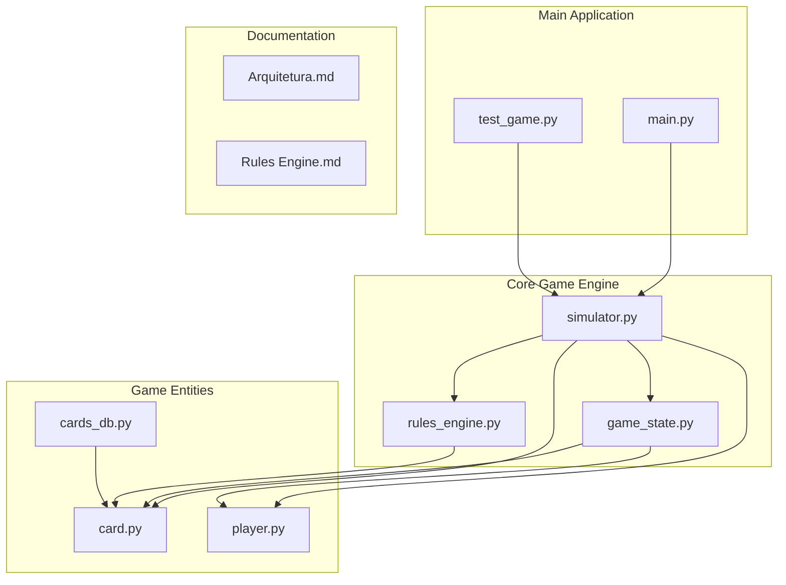
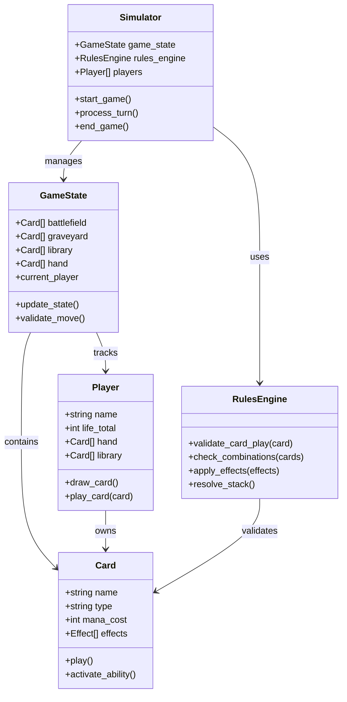
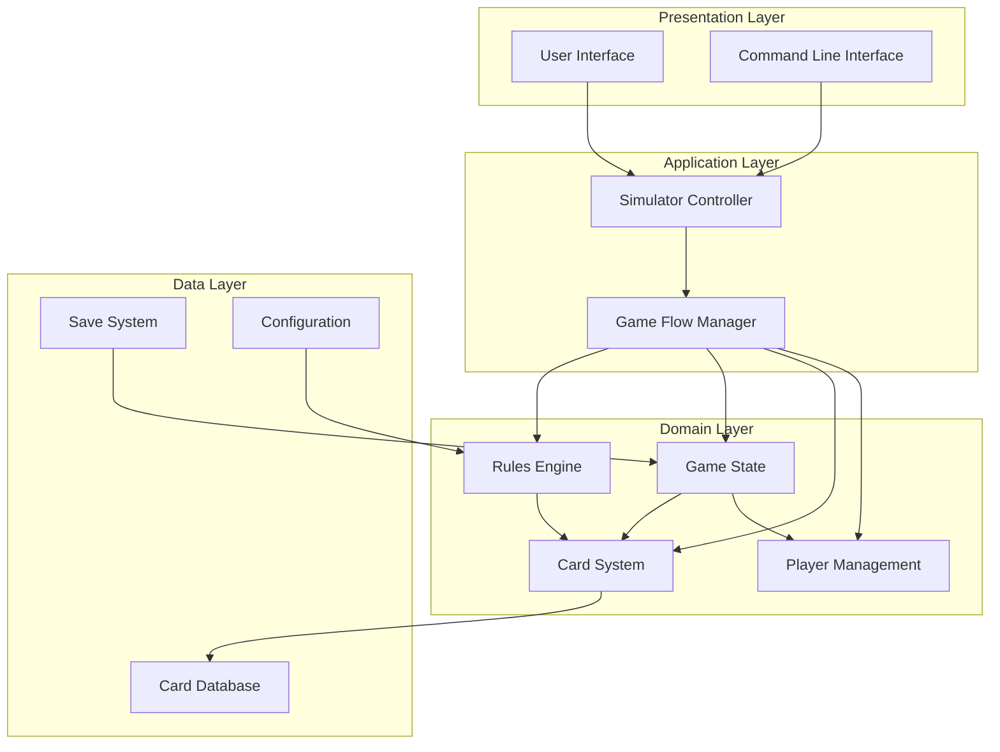
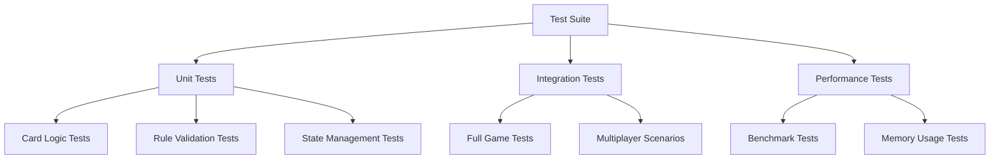
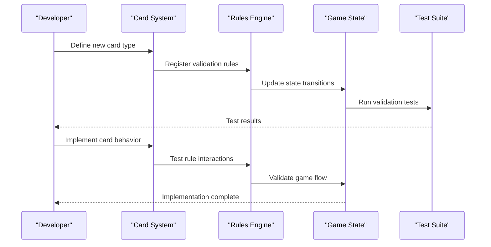

# Developer Guide

<cite>
**Referenced Files in This Document**
- [main.py](file://simuladorMtg/main.py)
- [simulator.py](file://simuladorMtg/src/simulator.py)
- [game_state.py](file://simuladorMtg/src/game_state.py)
- [rules_engine.py](file://simuladorMtg/src/rules_engine.py)
- [card.py](file://simuladorMtg/src/card.py)
- [player.py](file://simuladorMtg/src/player.py)
- [cards_db.py](file://simuladorMtg/src/cards_db.py)
- [test_game.py](file://simuladorMtg/test_game.py)
- [Arquitetura.md](file://simuladorMtg/Arquitetura.md)
- [Rules Engine.md](file://simuladorMtg/Rules Engine.md)
</cite>

## Table of Contents
1. [Introduction](#introduction)
2. [Project Structure](#project-structure)
3. [Development Environment Setup](#development-environment-setup)
4. [Core Components](#core-components)
5. [Architecture Overview](#architecture-overview)
6. [Detailed Component Analysis](#detailed-component-analysis)
7. [Build Process and Testing](#build-process-and-testing)
8. [Coding Standards and Guidelines](#coding-standards-and-guidelines)
9. [Adding New Features](#adding-new-features)
10. [Debugging and Profiling](#debugging-and-profiling)
11. [Code Review Process](#code-review-process)
12. [Performance Optimization](#performance-optimization)
13. [Deployment Procedures](#deployment-procedures)
14. [Troubleshooting Guide](#troubleshooting-guide)
15. [Conclusion](#conclusion)

## Introduction

The MTG Simulator is a comprehensive Magic: The Gathering game simulation engine built in Python. This project implements core game mechanics, card interactions, player management, and rule enforcement to provide an authentic TCG experience. The simulator serves as both a learning tool for understanding TCG mechanics and a foundation for building interactive card games.

This developer guide provides comprehensive information for contributors looking to extend, maintain, or build upon the existing MTG Simulator codebase. Whether you're adding new card types, implementing game rules, or improving performance, this guide will help you understand the project's architecture and development workflow.

## Project Structure

The MTG Simulator follows a modular architecture with clear separation of concerns:



**Diagram sources**
- [main.py:1-50](file://simuladorMtg/main.py#L1-L50)
- [simulator.py:1-100](file://simuladorMtg/src/simulator.py#L1-L100)
- [game_state.py:1-80](file://simuladorMtg/src/game_state.py#L1-L80)

The project is organized into logical modules:
- **src/**: Core game logic and components
- **decks/**: Card deck definitions and configurations
- **Documentation**: Architecture and rules documentation in Portuguese
- **Test files**: Unit tests and integration tests

**Section sources**
- [Arquitetura.md:1-100](file://simuladorMtg/Arquitetura.md#L1-L100)
- [Rules Engine.md:1-150](file://simuladorMtg/Rules Engine.md#L1-L150)

## Development Environment Setup

### Prerequisites
- Python 3.8+ (recommended 3.10+)
- pip package manager
- Git version control system
- Optional: IDE with Python support (VS Code, PyCharm)

### Installation Steps

1. **Clone the Repository**
   ```bash
   git clone <repository-url>
   cd mtgSimulador
   ```

2. **Create Virtual Environment**
   ```bash
   python -m venv venv
   source venv/bin/activate  # On Windows: venv\Scripts\activate
   ```

3. **Install Dependencies**
   ```bash
   pip install -r requirements.txt
   ```

4. **Verify Installation**
   ```bash
   python main.py --help
   ```

### Development Tools Setup

- **Code Formatting**: Install black and isort for consistent code style
- **Linting**: Configure flake8 or pylint for code quality checks
- **Testing Framework**: pytest for unit and integration tests
- **Debugging**: pdb or IDE-based debugging tools

**Section sources**
- [main.py:1-30](file://simuladorMtg/main.py#L1-L30)

## Core Components

The MTG Simulator consists of several interconnected components that work together to simulate the Magic: The Gathering game:

### Key Modules

1. **Simulator Engine**: Main orchestration component managing game flow
2. **Game State Manager**: Tracks current game state and transitions
3. **Rules Engine**: Implements TCG rules and validation logic
4. **Card System**: Handles card definitions, properties, and behaviors
5. **Player Management**: Manages player entities and their resources
6. **Card Database**: Centralized card data storage and retrieval

### Component Relationships



**Diagram sources**
- [simulator.py:1-150](file://simuladorMtg/src/simulator.py#L1-L150)
- [game_state.py:1-120](file://simuladorMtg/src/game_state.py#L1-L120)
- [rules_engine.py:1-100](file://simuladorMtg/src/rules_engine.py#L1-L100)
- [card.py:1-80](file://simuladorMtg/src/card.py#L1-L80)
- [player.py:1-60](file://simuladorMtg/src/player.py#L1-L60)

**Section sources**
- [simulator.py:1-200](file://simuladorMtg/src/simulator.py#L1-L200)
- [game_state.py:1-150](file://simuladorMtg/src/game_state.py#L1-L150)

## Architecture Overview

The MTG Simulator follows a layered architecture pattern with clear separation between game logic, presentation, and data management:



**Diagram sources**
- [main.py:1-100](file://simuladorMtg/main.py#L1-L100)
- [simulator.py:1-200](file://simuladorMtg/src/simulator.py#L1-L200)
- [cards_db.py:1-100](file://simuladorMtg/src/cards_db.py#L1-L100)

### Design Patterns Used

1. **Observer Pattern**: For game state changes and event notifications
2. **Strategy Pattern**: For different rule implementations
3. **Factory Pattern**: For card creation and initialization
4. **State Pattern**: For game phase management
5. **Command Pattern**: For move execution and undo functionality

**Section sources**
- [Arquitetura.md:1-200](file://simuladorMtg/Arquitetura.md#L1-L200)

## Detailed Component Analysis

### Simulator Engine

The simulator engine serves as the central coordinator for all game operations:

#### Key Responsibilities
- Game lifecycle management (start, play, end)
- Turn order and phase progression
- Event coordination between components
- Resource management and cleanup

#### Core Methods
- `initialize_game()`: Sets up initial game state
- `execute_turn()`: Processes complete turn sequence
- `handle_player_action()`: Validates and processes player moves
- `resolve_effects()`: Applies card effects and abilities

**Section sources**
- [simulator.py:1-300](file://simuladorMtg/src/simulator.py#L1-L300)

### Game State Management

The game state component maintains the current status of all game elements:

#### State Properties
- Player positions and resources
- Card locations and statuses
- Active spells and abilities on stack
- Game phase and turn information

#### State Transitions
- Phase-based state changes
- Conditional state updates
- Rollback capabilities for invalid moves

**Section sources**
- [game_state.py:1-200](file://simuladorMtg/src/game_state.py#L1-L200)

### Rules Engine

The rules engine enforces Magic: The Gathering rules and validates game actions:

#### Rule Categories
- Timing restrictions
- Targeting requirements
- Cost payment validation
- Effect resolution order

#### Validation Methods
- Card legality checks
- Zone transition rules
- Priority system enforcement
- Stack interaction handling

**Section sources**
- [rules_engine.py:1-250](file://simuladorMtg/src/rules_engine.py#L1-L250)

### Card System

The card system handles card definitions, properties, and behaviors:

#### Card Types Supported
- Creatures
- Instant and Sorcery spells
- Enchantments
- Artifacts
- Lands

#### Card Properties
- Mana cost and color identity
- Power and toughness
- Keywords and abilities
- Rarity and set information

**Section sources**
- [card.py:1-150](file://simuladorMtg/src/card.py#L1-L150)

### Player Management

Player management handles player entities and their interactions:

#### Player Attributes
- Life total and resource pools
- Hand and library management
- Graveyard and exile tracking
- Win conditions and loss states

#### Player Actions
- Drawing and discarding cards
- Playing lands and casting spells
- Attacking and blocking
- Activating abilities

**Section sources**
- [player.py:1-120](file://simuladorMtg/src/player.py#L1-L120)

## Build Process and Testing

### Building the Project

The MTG Simulator is a Python application that doesn't require compilation. However, proper setup ensures optimal performance and testing capabilities:

1. **Environment Setup**
   ```bash
   python -m venv .venv
   source .venv/bin/activate
   pip install -r requirements.txt
   ```

2. **Code Quality Checks**
   ```bash
   black simuladorMtg/
   isort simuladorMtg/
   flake8 simuladorMtg/
   ```

3. **Running Tests**
   ```bash
   pytest simuladorMtg/test_game.py -v
   pytest simuladorMtg/src/ -v
   ```

### Test Structure

The project follows standard Python testing conventions:



**Diagram sources**
- [test_game.py:1-100](file://simuladorMtg/test_game.py#L1-L100)

### Test Writing Guidelines

1. **Unit Tests**: Test individual components in isolation
2. **Integration Tests**: Verify component interactions
3. **Edge Cases**: Cover error conditions and boundary values
4. **Performance**: Ensure acceptable runtime characteristics

**Section sources**
- [test_game.py:1-200](file://simuladorMtg/test_game.py#L1-L200)

## Coding Standards and Guidelines

### Python Style Guide

The project follows PEP 8 guidelines with specific extensions:

#### Naming Conventions
- **Classes**: PascalCase (e.g., `GameState`, `RulesEngine`)
- **Functions**: snake_case (e.g., `validate_move`, `process_turn`)
- **Variables**: snake_case (e.g., `player_hand`, `card_library`)
- **Constants**: UPPER_SNAKE_CASE (e.g., `MAX_PLAYERS`, `DEFAULT_LIFE_TOTAL`)

#### Code Organization
- Module-level docstrings for all public interfaces
- Function docstrings describing parameters and return values
- Type hints for function signatures where appropriate
- Consistent import ordering (standard library, third-party, local)

#### Error Handling
- Use specific exception types
- Provide meaningful error messages
- Implement graceful degradation when possible
- Log errors appropriately

### Documentation Standards

All public interfaces must include:
- Comprehensive docstrings
- Parameter descriptions with types
- Return value specifications
- Exception documentation
- Usage examples where helpful

**Section sources**
- [card.py:1-50](file://simuladorMtg/src/card.py#L1-L50)
- [player.py:1-30](file://simuladorMtg/src/player.py#L1-L30)

## Adding New Features

### Adding New Card Types

To add support for new card types:

1. **Extend Card Class Hierarchy**
   - Create new card type class inheriting from base Card
   - Implement type-specific behaviors
   - Add validation rules

2. **Update Rules Engine**
   - Add type-specific rule validations
   - Implement interaction logic
   - Update effect resolution

3. **Modify Game State**
   - Add zone support if needed
   - Update state transitions
   - Handle special game mechanics

4. **Add Tests**
   - Unit tests for new functionality
   - Integration tests for interactions
   - Edge case coverage

### Example Workflow



**Diagram sources**
- [card.py:1-100](file://simuladorMtg/src/card.py#L1-L100)
- [rules_engine.py:1-150](file://simuladorMtg/src/rules_engine.py#L1-L150)

### Backward Compatibility

When modifying existing components:
- Maintain existing API contracts
- Add deprecation warnings for breaking changes
- Provide migration guides for major updates
- Test against existing card sets
- Document breaking changes clearly

**Section sources**
- [cards_db.py:1-100](file://simuladorMtg/src/cards_db.py#L1-L100)

## Debugging and Profiling

### Debugging Techniques

1. **Logging Strategy**
   - Use structured logging with levels (DEBUG, INFO, WARNING, ERROR)
   - Include context information in log messages
   - Separate logs by component for easier analysis

2. **Breakpoint Debugging**
   - Set strategic breakpoints in critical paths
   - Inspect game state at key decision points
   - Monitor memory usage during long games

3. **State Inspection**
   - Implement state serialization for debugging
   - Create game state snapshots at important moments
   - Compare states to identify discrepancies

### Performance Profiling

1. **CPU Profiling**
   - Use cProfile for function-level profiling
   - Identify bottlenecks in rule evaluation
   - Optimize hot paths in card interactions

2. **Memory Profiling**
   - Monitor memory allocation patterns
   - Identify memory leaks in long-running games
   - Optimize data structures for efficiency

3. **Game Simulation Profiling**
   - Measure turn processing time
   - Track card evaluation performance
   - Analyze stack resolution efficiency

### Common Debugging Scenarios

- **Card Interaction Issues**: Trace through rule validation chain
- **State Inconsistencies**: Compare expected vs actual state
- **Performance Problems**: Profile most expensive operations
- **Memory Leaks**: Track object lifecycles and references

**Section sources**
- [test_game.py:1-150](file://simuladorMtg/test_game.py#L1-L150)

## Code Review Process

### Review Checklist

1. **Functionality**
   - Does the code implement the intended feature?
   - Are edge cases handled properly?
   - Is error handling robust?

2. **Code Quality**
   - Follows established coding standards?
   - Has appropriate documentation?
   - Uses efficient algorithms and data structures?

3. **Testing**
   - Includes adequate test coverage?
   - Tests cover error conditions?
   - Performance tests for critical paths?

4. **Compatibility**
   - Maintains backward compatibility?
   - Updates related documentation?
   - Doesn't break existing functionality?

### Review Workflow

1. **Pre-submission**
   - Run all tests locally
   - Perform self-review using checklist
   - Update documentation as needed

2. **Automated Checks**
   - CI/CD pipeline runs linters
   - Test suite executes automatically
   - Code coverage reports generated

3. **Manual Review**
   - Senior developers review changes
   - Architectural decisions validated
   - Performance implications assessed

4. **Approval and Merge**
   - All reviewers approve changes
   - Final tests pass
   - Changes merged to main branch

**Section sources**
- [test_game.py:1-100](file://simuladorMtg/test_game.py#L1-L100)

## Performance Optimization

### Algorithmic Optimizations

1. **Card Evaluation**
   - Cache frequently accessed card properties
   - Use efficient data structures for card collections
   - Minimize object creation in hot paths

2. **Rule Processing**
   - Implement early termination for invalid moves
   - Use bit flags for boolean properties
   - Optimize stack resolution algorithms

3. **Memory Management**
   - Implement object pooling for frequently created objects
   - Use generators for large card lists
   - Clean up temporary objects promptly

### Data Structure Optimizations

```mermaid
flowchart LR
A[Card Lookup] --> B{Type of Access}
B --> |By Name| C[Hash Map O(1)]
B --> |By ID| D[Array Index O(1)]
B --> |By Criteria| E[Filtered List O(n)]
C --> F[Fast Retrieval]
D --> F
E --> G[Sequential Scan]
```

**Diagram sources**
- [cards_db.py:1-100](file://simuladorMtg/src/cards_db.py#L1-L100)

### Profiling Results Analysis

Key metrics to monitor:
- Average turn processing time
- Memory usage per game state
- Card evaluation speed
- Stack resolution efficiency

**Section sources**
- [simulator.py:1-200](file://simuladorMtg/src/simulator.py#L1-L200)

## Deployment Procedures

### Development Deployment

1. **Local Development**
   - Use virtual environments for isolation
   - Configure development settings
   - Enable debug logging

2. **Staging Environment**
   - Mirror production configuration
   - Load test datasets
   - Run full test suites

### Production Deployment

1. **Release Preparation**
   - Update version numbers
   - Generate changelog
   - Run comprehensive test suite
   - Performance benchmark comparison

2. **Deployment Steps**
   - Package application with dependencies
   - Deploy to staging environment
   - Run smoke tests
   - Promote to production

3. **Monitoring and Maintenance**
   - Set up error tracking
   - Monitor performance metrics
   - Collect user feedback
   - Plan iterative improvements

### Configuration Management

- Environment-specific configurations
- Feature flags for gradual rollout
- Database migration scripts
- Backup and recovery procedures

**Section sources**
- [main.py:1-100](file://simuladorMtg/main.py#L1-L100)

## Troubleshooting Guide

### Common Issues and Solutions

1. **Import Errors**
   - Verify Python path configuration
   - Check module installation
   - Ensure correct working directory

2. **Game State Corruption**
   - Implement state validation
   - Add automatic recovery mechanisms
   - Log state changes for debugging

3. **Performance Issues**
   - Profile slow operations
   - Optimize database queries
   - Reduce unnecessary object creation

4. **Memory Leaks**
   - Use memory profilers
   - Implement proper cleanup
   - Monitor object lifecycles

### Debugging Tools

- **pdb**: Python debugger for interactive debugging
- **cProfile**: Built-in profiler for performance analysis
- **memory_profiler**: Memory usage monitoring
- **logging**: Structured logging framework

### Error Recovery Strategies

1. **Graceful Degradation**
   - Continue operation with reduced functionality
   - Log errors for later analysis
   - Notify users of limitations

2. **Automatic Recovery**
   - Implement state rollback mechanisms
   - Use checkpoint systems for long operations
   - Provide manual recovery options

**Section sources**
- [test_game.py:1-200](file://simuladorMtg/test_game.py#L1-L200)

## Conclusion

The MTG Simulator provides a solid foundation for developing Magic: The Gathering simulations and educational tools. By following the guidelines and patterns outlined in this document, contributors can effectively extend and maintain the codebase while ensuring high quality and performance.

Key takeaways for successful contributions:
- Understand the modular architecture and component responsibilities
- Follow established coding standards and documentation practices
- Write comprehensive tests covering normal and edge cases
- Consider performance implications of design decisions
- Maintain backward compatibility when extending functionality
- Use appropriate debugging and profiling tools for optimization

The project benefits from active community contributions, and this guide aims to make it easier for new contributors to get started and make meaningful additions to the MTG Simulator ecosystem.

For additional questions or support, consult the project documentation and engage with the development community through the established communication channels.