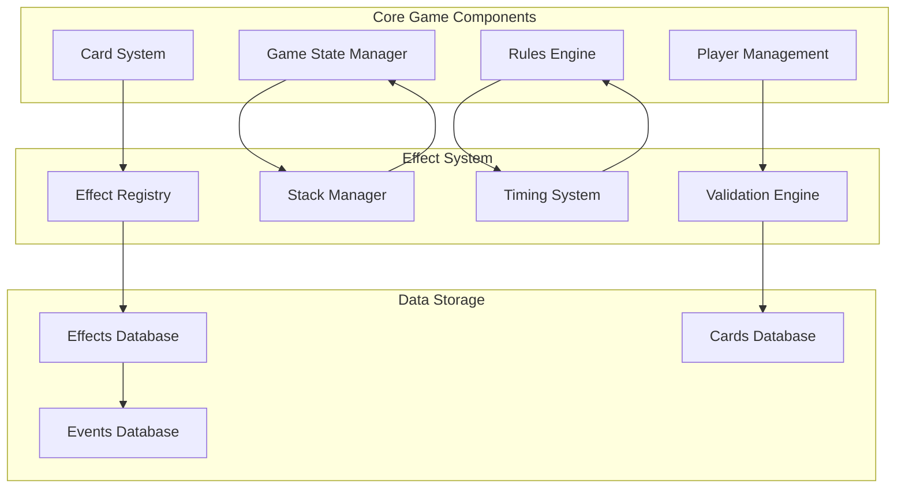
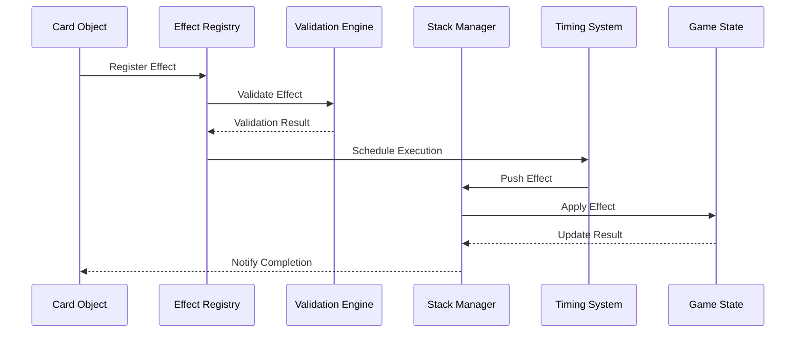
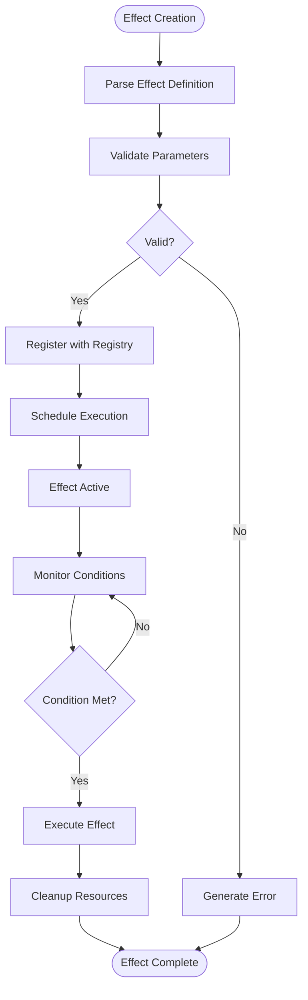
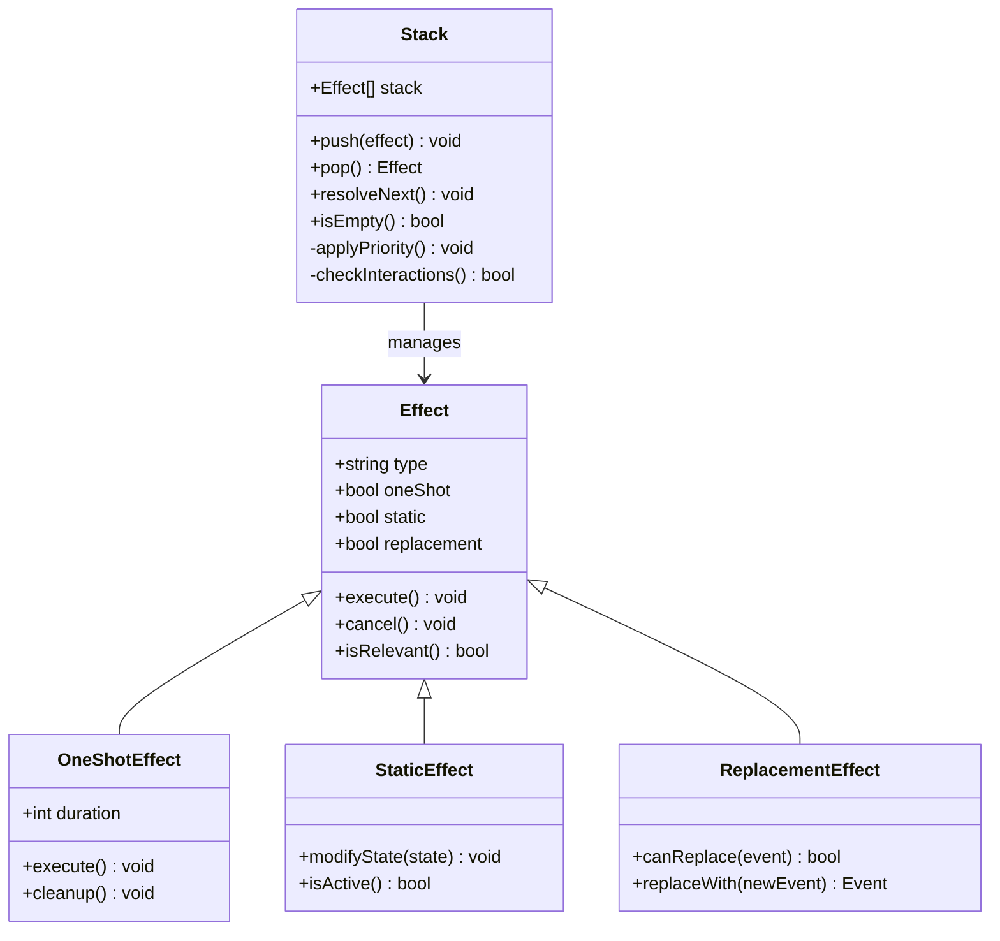
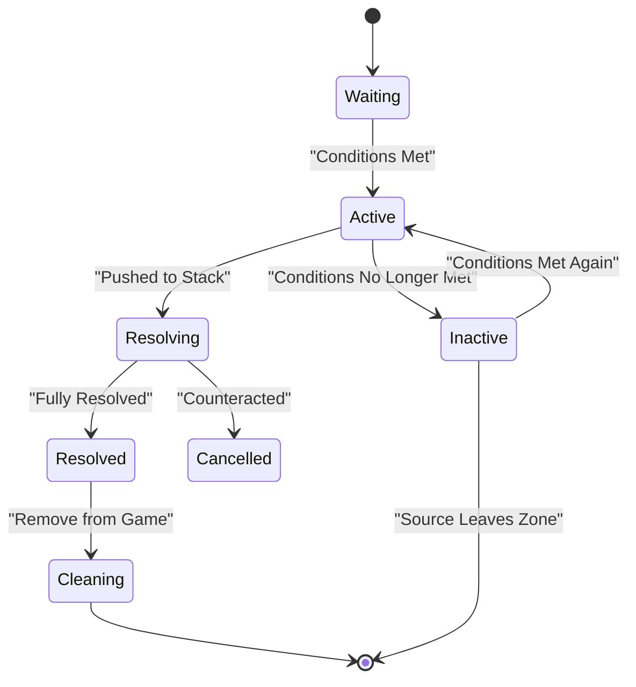
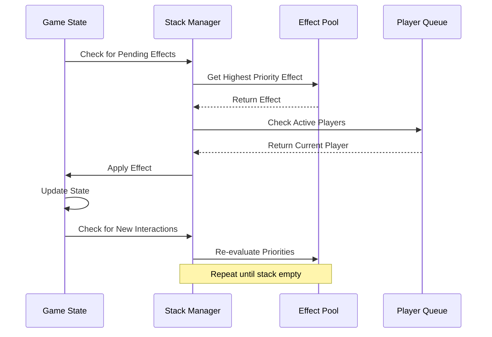
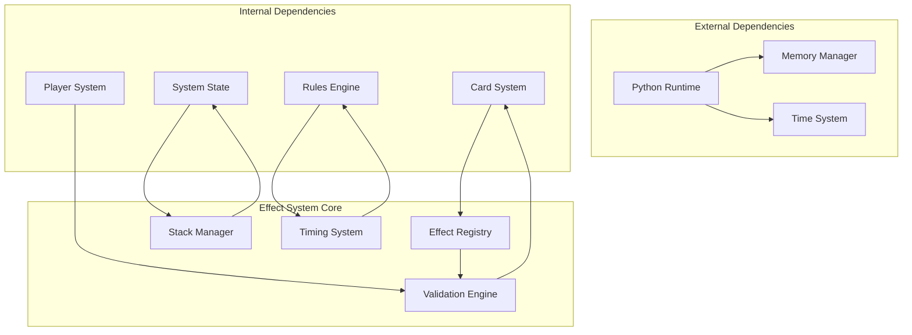

# Effect System

<cite>
**Referenced Files in This Document**
- [card.py](file://simuladorMtg/src/card.py)
- [rules_engine.py](file://simuladorMtg/src/rules_engine.py)
- [game_state.py](file://simuladorMtg/src/game_state.py)
- [player.py](file://simuladorMtg/src/player.py)
- [Banco de Efeitos.md](file://simuladorMtg/Banco de Efeitos.md)
- [Rules Engine.md](file://simuladorMtg/Rules Engine.md)
- [main.py](file://simuladorMtg/main.py)
</cite>

## Table of Contents
1. [Introduction](#introduction)
2. [Project Structure](#project-structure)
3. [Core Components](#core-components)
4. [Architecture Overview](#architecture-overview)
5. [Detailed Component Analysis](#detailed-component-analysis)
6. [Dependency Analysis](#dependency-analysis)
7. [Performance Considerations](#performance-considerations)
8. [Troubleshooting Guide](#troubleshooting-guide)
9. [Conclusion](#conclusion)

## Introduction

The MTG Simulator's effect system is a sophisticated framework that powers card abilities and game mechanics through three primary types of effects: one-shot effects (temporary actions), static effects (continuous modifications), and replacement effects (altering game rules). This system handles complex interactions between multiple effects, manages timing windows, and integrates with the stack system to ensure proper resolution order.

The effect system is fundamental to Magic: The Gathering gameplay, enabling everything from simple damage dealing to complex continuous modifications of game state. It must handle simultaneous effects, priority-based resolution, and the intricate timing rules that define how cards interact during different phases of the game.

## Project Structure

The effect system is distributed across several core components in the MTG Simulator:

**Diagram sources**
- [card.py:1-100](file://simuladorMtg/src/card.py#L1-L100)
- [game_state.py:1-100](file://simuladorMtg/src/game_state.py#L1-L100)
- [rules_engine.py:1-100](file://simuladorMtg/src/rules_engine.py#L1-L100)

**Section sources**
- [card.py:1-50](file://simuladorMtg/src/card.py#L1-L50)
- [game_state.py:1-50](file://simuladorMtg/src/game_state.py#L1-L50)
- [rules_engine.py:1-50](file://simuladorMtg/src/rules_engine.py#L1-L50)

## Core Components

### One-Shot Effects
One-shot effects are temporary actions that occur immediately when triggered or activated. They execute once and then cease to exist. Examples include damage dealing, card drawing, and creature destruction.

### Static Effects
Static effects provide continuous modifications to game state while the source card remains in play. These effects are always active and don't use the stack. Examples include power/toughness modifications, keyword abilities, and zone restrictions.

### Replacement Effects
Replacement effects alter how events would occur by replacing them with alternative outcomes. These effects check for potential events and can modify their behavior before they happen. Examples include prevention effects, replacement of damage, and alternative costs.

**Section sources**
- [Banco de Efeitos.md:1-200](file://simuladorMtg/Banco de Efeitos.md#L1-L200)
- [Rules Engine.md:1-150](file://simuladorMtg/Rules Engine.md#L1-L150)

## Architecture Overview

The effect system follows a layered architecture that separates concerns between effect definition, registration, validation, and execution:

**Diagram sources**
- [rules_engine.py:1-200](file://simuladorMtg/src/rules_engine.py#L1-L200)
- [game_state.py:1-200](file://simuladorMtg/src/game_state.py#L1-L200)

## Detailed Component Analysis

### Effect Registration and Validation

The effect registration system handles the lifecycle of effects from creation to cleanup:

**Diagram sources**
- [rules_engine.py:100-300](file://simuladorMtg/src/rules_engine.py#L100-L300)
- [card.py:50-150](file://simuladorMtg/src/card.py#L50-L150)

### Stack Integration and Resolution Order

The stack system ensures proper ordering of effect resolution:

**Diagram sources**
- [rules_engine.py:200-400](file://simuladorMtg/src/rules_engine.py#L200-L400)
- [game_state.py:100-250](file://simuladorMtg/src/game_state.py#L100-L250)

### Timing Windows and Priority System

The timing system manages when effects can be applied:

**Diagram sources**
- [rules_engine.py:300-500](file://simuladorMtg/src/rules_engine.py#L300-L500)
- [player.py:1-100](file://simuladorMtg/src/player.py#L1-L100)

### Complex Interaction Handling

The system handles complex interactions between multiple effects through a priority-based resolution system:

**Diagram sources**
- [rules_engine.py:400-600](file://simuladorMtg/src/rules_engine.py#L400-L600)
- [game_state.py:200-400](file://simuladorMtg/src/game_state.py#L200-L400)

## Dependency Analysis

The effect system has well-defined dependencies between components:

**Diagram sources**
- [main.py:1-100](file://simuladorMtg/main.py#L1-L100)
- [card.py:1-100](file://simuladorMtg/src/card.py#L1-L100)
- [game_state.py:1-100](file://simuladorMtg/src/game_state.py#L1-L100)

**Section sources**
- [Rules Engine.md:100-300](file://simuladorMtg/Rules Engine.md#L100-L300)
- [Banco de Efeitos.md:100-300](file://simuladorMtg/Banco de Efeitos.md#L100-L300)

## Performance Considerations

### Continuous Effects Optimization
Continuous effects require efficient evaluation strategies to minimize performance impact:

- **Lazy Evaluation**: Only recalculate effect values when queried
- **Incremental Updates**: Update only affected game state portions
- **Caching**: Cache frequently accessed effect results
- **Batch Processing**: Process multiple effects together when possible

### Temporary Effects Memory Management
Temporary effects need careful memory management to prevent leaks:

- **Reference Counting**: Track effect usage across multiple objects
- **Automatic Cleanup**: Remove effects when conditions no longer met
- **Weak References**: Use weak references to avoid circular dependencies
- **Pooling**: Reuse effect objects when appropriate

### Stack Performance
The stack system must handle large numbers of effects efficiently:

- **Priority Queues**: Use heap-based priority queues for O(log n) operations
- **Efficient Searching**: Optimize effect lookup by type and relevance
- **Memory Allocation**: Minimize object creation during high-frequency operations

## Troubleshooting Guide

### Common Effect Issues

#### Effect Not Applying
Check the following:
- Effect registration completeness
- Parameter validation success
- Timing window availability
- Player priority status

#### Incorrect Resolution Order
Verify:
- Stack push order correctness
- Priority assignment accuracy
- Dependency resolution timing
- Interaction handling logic

#### Memory Leaks
Investigate:
- Effect cleanup procedures
- Reference cycle detection
- Resource deallocation timing
- Garbage collection triggers

#### Performance Bottlenecks
Optimize by:
- Profiling effect evaluation frequency
- Identifying expensive calculations
- Implementing caching strategies
- Reducing unnecessary recalculations

**Section sources**
- [Rules Engine.md:200-400](file://simuladorMtg/Rules Engine.md#L200-L400)
- [Banco de Efeitos.md:200-400](file://simuladorMtg/Banco de Efeitos.md#L200-L400)

## Conclusion

The MTG Simulator's effect system provides a robust foundation for implementing complex card interactions and game mechanics. Through its three-tiered approach of one-shot, static, and replacement effects, it captures the full complexity of Magic: The Gathering gameplay while maintaining performance and reliability.

The system's modular design allows for easy extension and modification, making it suitable for both current card implementations and future expansions. The integration with the stack system ensures proper resolution order, while the timing system handles the intricate rules of when effects can be applied.

Future enhancements could include more sophisticated interaction handling, improved performance optimization, and additional effect types to support new card mechanics. The current architecture provides a solid foundation for these improvements while maintaining backward compatibility with existing effect implementations.