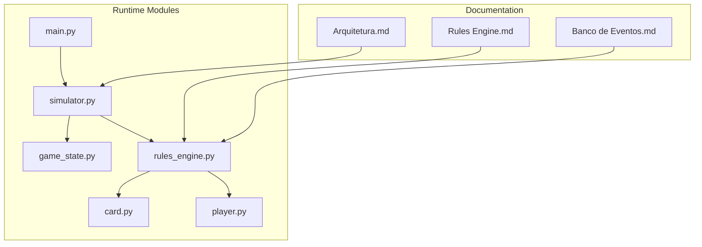
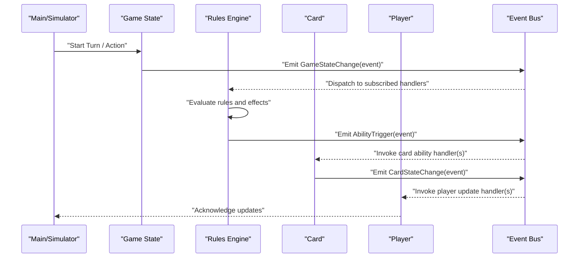
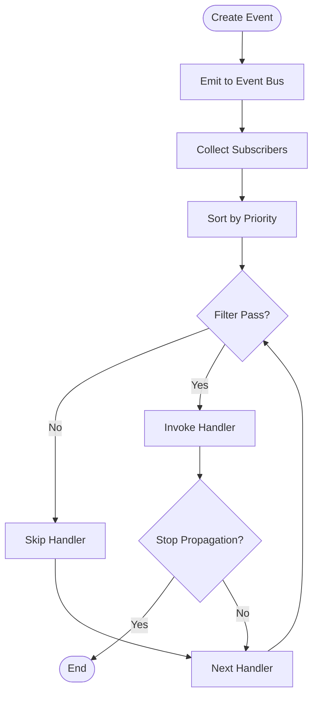
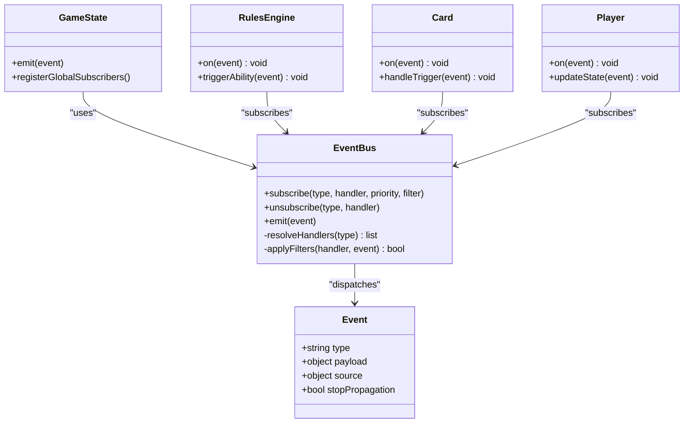
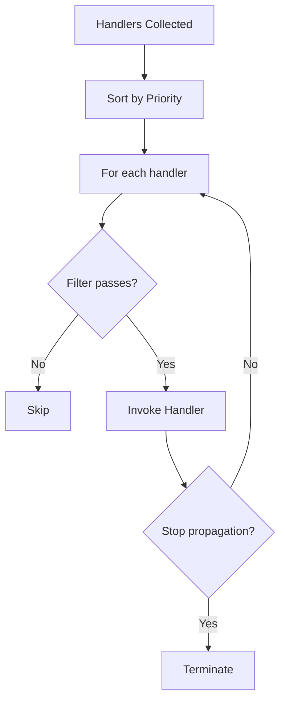
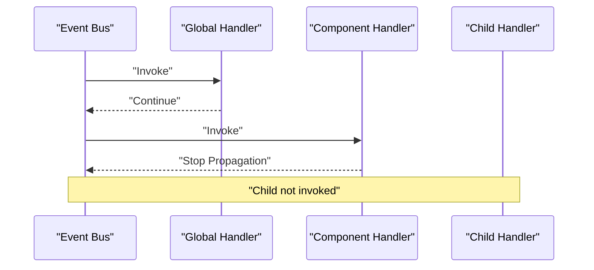
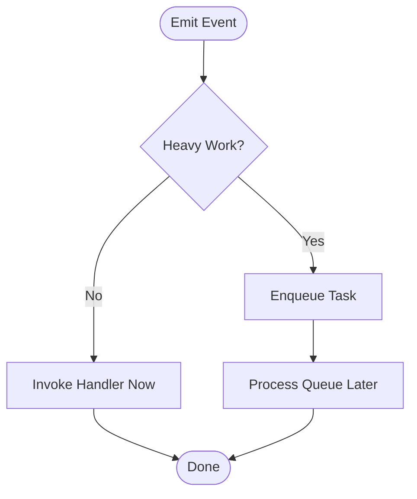
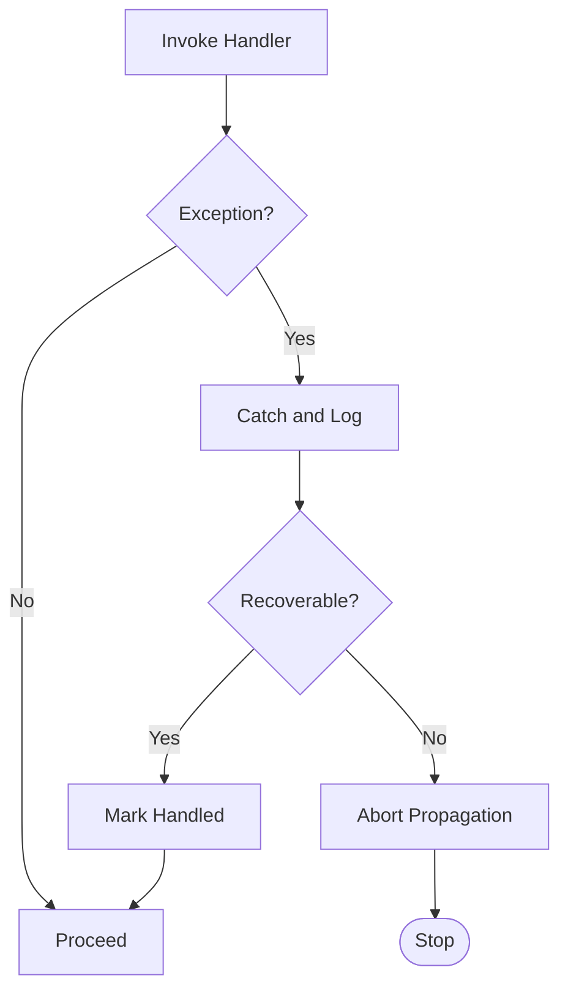
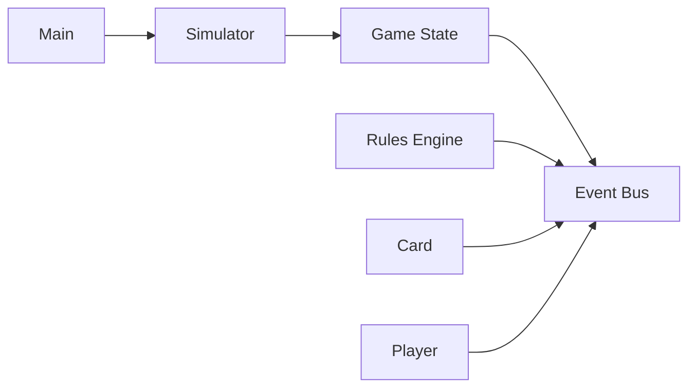

# Event Propagation System

<cite>
**Referenced Files in This Document**
- [Banco de Eventos.md](file://Banco%20de%20Eventos.md)
- [Rules Engine.md](file://Rules%20Engine.md)
- [Arquitetura.md](file://Arquitetura.md)
- [simulator.py](file://simuladorMtg/src/simulator.py)
- [game_state.py](file://simuladorMtg/src/game_state.py)
- [rules_engine.py](file://simuladorMtg/src/rules_engine.py)
- [card.py](file://simuladorMtg/src/card.py)
- [player.py](file://simuladorMtg/src/player.py)
- [main.py](file://simuladorMtg/main.py)
</cite>

## Table of Contents
1. [Introduction](#introduction)
2. [Project Structure](#project-structure)
3. [Core Components](#core-components)
4. [Architecture Overview](#architecture-overview)
5. [Detailed Component Analysis](#detailed-component-analysis)
6. [Dependency Analysis](#dependency-analysis)
7. [Performance Considerations](#performance-considerations)
8. [Troubleshooting Guide](#troubleshooting-guide)
9. [Conclusion](#conclusion)

## Introduction
This document explains the event propagation system used by the MTG simulator. It covers how events are created, registered, and dispatched across components; how priority and filtering work; and how the observer pattern enables triggered abilities, state change notifications, and inter-component communication. It also provides guidance on event bubbling, stopping propagation, asynchronous processing, performance for high-frequency events, and memory management for listeners.

## Project Structure
The event system spans documentation and code:
- Documentation files define event types, rules engine behavior, and architecture context.
- Python modules implement the runtime: game state, rules engine, card/player entities, and the main simulation loop.

**Diagram sources**
- [Banco de Eventos.md](file://Banco%20de%20Eventos.md)
- [Rules Engine.md](file://Rules%20Engine.md)
- [Arquitetura.md](file://Arquitetura.md)
- [simulator.py](file://simuladorMtg/src/simulator.py)
- [game_state.py](file://simuladorMtg/src/game_state.py)
- [rules_engine.py](file://simuladorMtg/src/rules_engine.py)
- [card.py](file://simuladorMtg/src/card.py)
- [player.py](file://simuladorMtg/src/player.py)
- [main.py](file://simuladorMtg/main.py)

**Section sources**
- [Banco de Eventos.md](file://Banco%20de%20Eventos.md)
- [Rules Engine.md](file://Rules%20Engine.md)
- [Arquitetura.md](file://Arquitetura.md)
- [simulator.py](file://simuladorMtg/src/simulator.py)
- [game_state.py](file://simuladorMtg/src/game_state.py)
- [rules_engine.py](file://simuladorMtg/src/rules_engine.py)
- [card.py](file://simuladorMtg/src/card.py)
- [player.py](file://simuladorMtg/src/player.py)
- [main.py](file://simuladorMtg/main.py)

## Core Components
- Event Registry: Central store of event handlers with metadata (priority, filters).
- Event Bus/Dispatcher: Creates events, resolves matching handlers, applies priority and filters, and invokes handlers.
- Game State: Emits lifecycle and state-change events; owns global event registry.
- Rules Engine: Consumes events to apply game logic and may emit new events.
- Card and Player: Register component-specific handlers for ability triggers and player actions.
- Simulator/Main: Orchestrates tick or turn loops, dispatching events and handling errors.

Key responsibilities:
- Creation: Construct typed events with payload and source context.
- Registration: Subscribe handlers with optional priority and filter predicates.
- Dispatch: Resolve eligible handlers, sort by priority, apply filters, and invoke.
- Cleanup: Unsubscribe handlers to prevent leaks.

**Section sources**
- [Banco de Eventos.md](file://Banco%20de%20Eventos.md)
- [Rules Engine.md](file://Rules%20Engine.md)
- [game_state.py](file://simuladorMtg/src/game_state.py)
- [rules_engine.py](file://simuladorMtg/src/rules_engine.py)
- [card.py](file://simuladorMtg/src/card.py)
- [player.py](file://simuladorMtg/src/player.py)
- [simulator.py](file://simuladorMtg/src/simulator.py)

## Architecture Overview
The event system follows an observer pattern with a central dispatcher. Components subscribe to events they care about. The dispatcher ensures deterministic ordering via priorities and supports filtering to reduce unnecessary handler invocations.

**Diagram sources**
- [simulator.py](file://simuladorMtg/src/simulator.py)
- [game_state.py](file://simuladorMtg/src/game_state.py)
- [rules_engine.py](file://simuladorMtg/src/rules_engine.py)
- [card.py](file://simuladorMtg/src/card.py)
- [player.py](file://simuladorMtg/src/player.py)

## Detailed Component Analysis

### Event Lifecycle: Creation to Cleanup
- Creation: Events are constructed with a type, payload, and optional source/context.
- Registration: Handlers register with the bus using a subscription API that accepts priority and filter functions.
- Dispatch: The bus collects all subscribers for an event type, sorts by priority, evaluates filters, and calls handlers in order.
- Bubbling and Stopping: Handlers can signal whether to continue bubbling to higher-level handlers or stop propagation.
- Cleanup: Subscriptions are removed when components are destroyed or no longer need to listen.

**Diagram sources**
- [game_state.py](file://simuladorMtg/src/game_state.py)
- [rules_engine.py](file://simuladorMtg/src/rules_engine.py)
- [card.py](file://simuladorMtg/src/card.py)
- [player.py](file://simuladorMtg/src/player.py)

**Section sources**
- [Banco de Eventos.md](file://Banco%20de%20Eventos.md)
- [Rules Engine.md](file://Rules%20Engine.md)

### Event Types and Categories
- Game State Events: Turn start/end, phase changes, zone transitions.
- Ability Trigger Events: Abilities that respond to specific conditions.
- Player Action Events: Choices, payments, targeting decisions.
- Card State Events: Changes to card properties, counters, status.
- System Events: Errors, logging, diagnostics.

These categories guide where to subscribe and what payloads to expect.

**Section sources**
- [Banco de Eventos.md](file://Banco%20de%20Eventos.md)

### Observer Pattern Implementation
- Subscription Model: Components call a subscribe method with event type, handler function, optional priority, and optional filter predicate.
- Handler Invocation: The dispatcher iterates through sorted handlers, applies filters, and executes handlers synchronously unless explicitly queued.
- Context Passing: Events carry contextual data (source object, target, stack info) enabling precise filtering and safe updates.

**Diagram sources**
- [game_state.py](file://simuladorMtg/src/game_state.py)
- [rules_engine.py](file://simuladorMtg/src/rules_engine.py)
- [card.py](file://simuladorMtg/src/card.py)
- [player.py](file://simuladorMtg/src/player.py)

**Section sources**
- [game_state.py](file://simuladorMtg/src/game_state.py)
- [rules_engine.py](file://simuladorMtg/src/rules_engine.py)
- [card.py](file://simuladorMtg/src/card.py)
- [player.py](file://simuladorMtg/src/player.py)

### Priority Handling and Filtering
- Priority: Handlers are ordered by numeric priority; lower values execute first. This allows core systems to run before UI or logging layers.
- Filtering: Each handler can declare a filter predicate that inspects the event payload and source to decide if it should run. Filters reduce overhead by avoiding unnecessary handler execution.
- Selection Strategy: The dispatcher collects all subscribers for an event type, sorts by priority, then applies filters sequentially.

**Diagram sources**
- [rules_engine.py](file://simuladorMtg/src/rules_engine.py)
- [game_state.py](file://simuladorMtg/src/game_state.py)

**Section sources**
- [Rules Engine.md](file://Rules%20Engine.md)
- [Banco de Eventos.md](file://Banco%20de%20Eventos.md)

### Event Bubbling and Stopping Propagation
- Bubbling: Handlers can be organized hierarchically (e.g., global, component-scoped). After a handler runs, control may bubble up to parent scopes.
- Stopping Propagation: A handler can set a flag to halt further bubbling, preventing downstream handlers from executing. This is useful for finalizing state or short-circuiting chains.

**Diagram sources**
- [game_state.py](file://simuladorMtg/src/game_state.py)
- [rules_engine.py](file://simuladorMtg/src/rules_engine.py)

**Section sources**
- [Banco de Eventos.md](file://Banco%20de%20Eventos.md)

### Asynchronous Event Processing
- Synchronous Dispatch: Default path invokes handlers immediately within the same call stack to maintain consistency and atomicity.
- Async Queuing: For heavy or blocking operations, handlers can enqueue tasks to a background queue processed after the current event completes. This avoids stalls during high-frequency events.
- Backpressure: The queue should enforce limits and drop or delay low-priority events under load.

**Diagram sources**
- [simulator.py](file://simuladorMtg/src/simulator.py)
- [rules_engine.py](file://simuladorMtg/src/rules_engine.py)

**Section sources**
- [Rules Engine.md](file://Rules%20Engine.md)

### Error Handling Strategies
- Isolation: Wrap handler invocation in try/catch to isolate failures per handler without aborting the entire dispatch.
- Reporting: Log errors with full event context (type, payload, source) to aid debugging.
- Recovery: Optionally allow handlers to mark the event as handled and suppress further propagation.
- Diagnostics: Provide diagnostic events for error tracking and metrics collection.

**Diagram sources**
- [rules_engine.py](file://simuladorMtg/src/rules_engine.py)
- [game_state.py](file://simuladorMtg/src/game_state.py)

**Section sources**
- [Banco de Eventos.md](file://Banco%20de%20Eventos.md)

### Concrete Examples of Patterns
- Event Registration Patterns:
  - Global listener: Subscribe at game initialization for system-wide events.
  - Component-scoped listener: Subscribe when a card enters play; unsubscribe when it leaves.
  - Conditional listener: Use filter predicates to match specific payloads.
- Custom Event Handlers:
  - Implement a handler that inspects event payload and source to decide action.
  - Return or set flags to indicate stop propagation or handled status.
- Asynchronous Processing:
  - Enqueue long-running computations off the critical path.
  - Ensure idempotency and consistent state transitions.

[No sources needed since this section provides general guidance]

## Dependency Analysis
The event system couples components through subscriptions rather than direct references, improving modularity. However, careful design is required to avoid circular dependencies and ensure correct initialization order.

**Diagram sources**
- [game_state.py](file://simuladorMtg/src/game_state.py)
- [rules_engine.py](file://simuladorMtg/src/rules_engine.py)
- [card.py](file://simuladorMtg/src/card.py)
- [player.py](file://simuladorMtg/src/player.py)
- [simulator.py](file://simuladorMtg/src/simulator.py)
- [main.py](file://simuladorMtg/main.py)

**Section sources**
- [Arquitetura.md](file://Arquitetura.md)
- [simulator.py](file://simuladorMtg/src/simulator.py)
- [game_state.py](file://simuladorMtg/src/game_state.py)
- [rules_engine.py](file://simuladorMtg/src/rules_engine.py)
- [card.py](file://simuladorMtg/src/card.py)
- [player.py](file://simuladorMtg/src/player.py)
- [main.py](file://simuladorMtg/main.py)

## Performance Considerations
- High-Frequency Events:
  - Prefer lightweight handlers; defer heavy work to async queues.
  - Use efficient filters to minimize handler invocations.
  - Batch similar events when possible to reduce dispatch overhead.
- Memory Management:
  - Always unsubscribe handlers when components are destroyed.
  - Avoid capturing large objects in closures; use weak references where appropriate.
  - Periodically audit active subscriptions to detect leaks.
- Ordering and Determinism:
  - Maintain stable priority ordering to ensure reproducible behavior.
  - Avoid mutating shared state unpredictably within handlers.

[No sources needed since this section provides general guidance]

## Troubleshooting Guide
- Symptoms:
  - Handlers not firing: Check subscription registration, event type names, and filters.
  - Unexpected order: Verify priority values and sorting logic.
  - Performance drops: Identify heavy handlers and move them to async queues.
  - Memory growth: Audit subscriptions and ensure cleanup paths are executed.
- Debugging Steps:
  - Enable diagnostic events to log dispatch sequences.
  - Inspect event payloads and sources for correctness.
  - Temporarily disable handlers to isolate problematic ones.
- Common Fixes:
  - Correct event type strings and payload structures.
  - Adjust priorities to achieve desired execution order.
  - Add explicit unsubscribe calls in teardown routines.

**Section sources**
- [Rules Engine.md](file://Rules%20Engine.md)
- [Banco de Eventos.md](file://Banco%20de%20Eventos.md)

## Conclusion
The event propagation system provides a flexible, decoupled mechanism for inter-component communication in the MTG simulator. By leveraging priorities, filters, and optional asynchronous processing, it supports complex interactions such as triggered abilities and state change notifications while maintaining performance and determinism. Proper subscription management and error isolation are essential to keep the system robust and scalable.