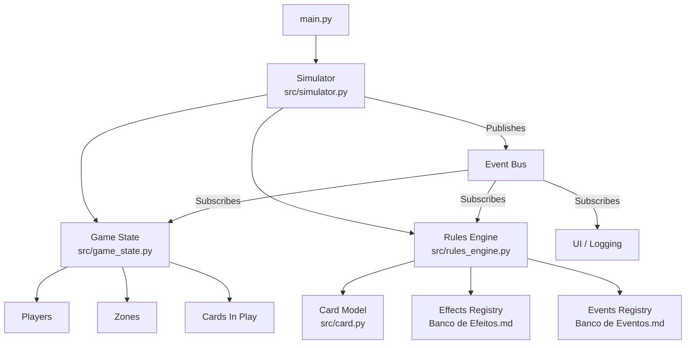
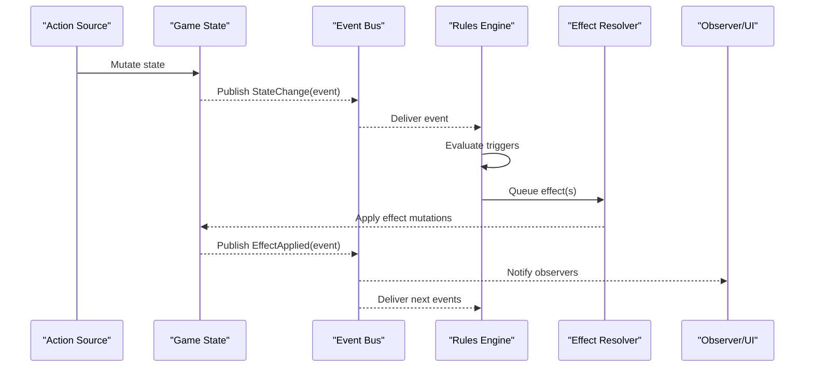
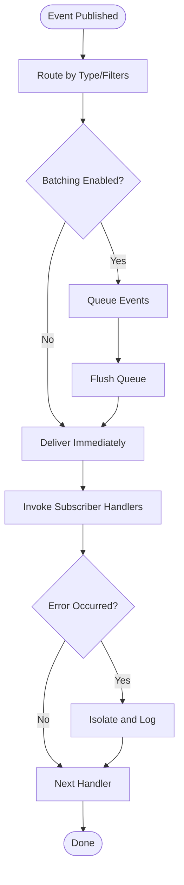
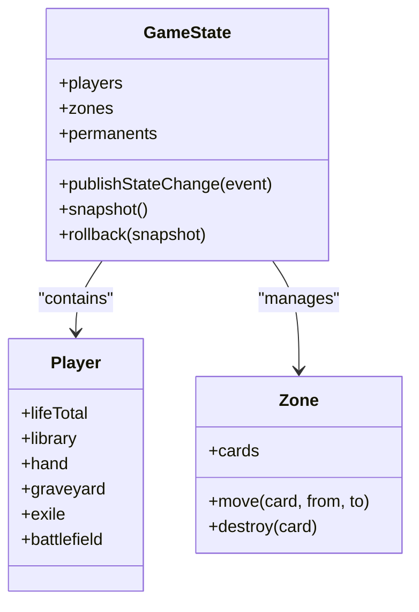
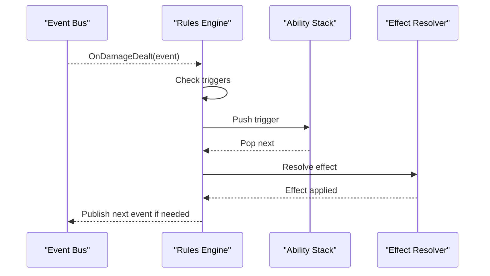
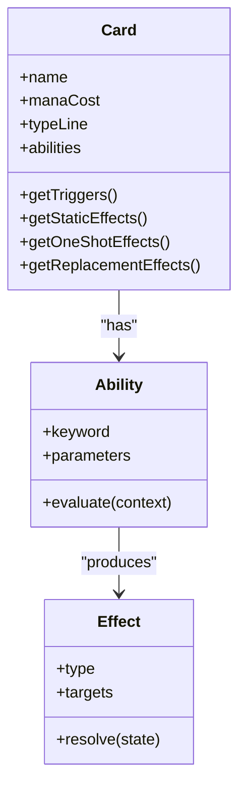
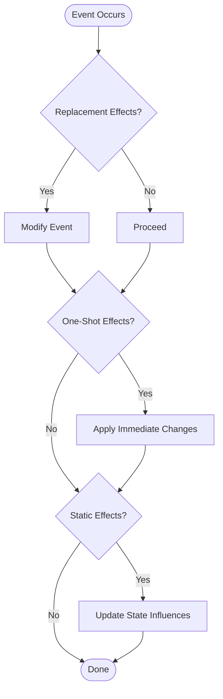
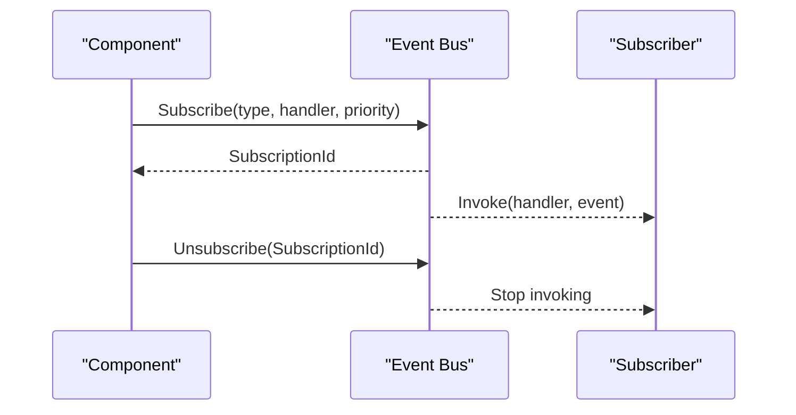
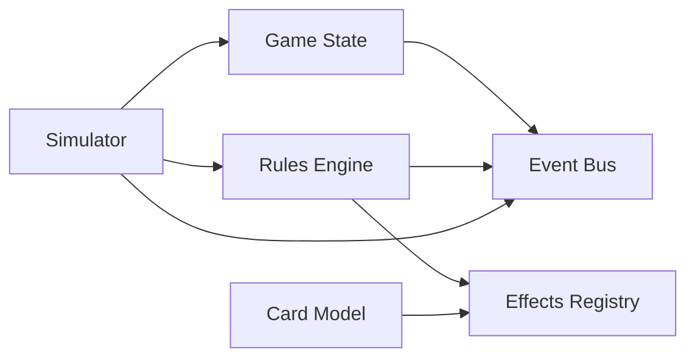

# Event System

<cite>
**Referenced Files in This Document**
- [main.py](file://simuladorMtg/main.py)
- [src/simulator.py](file://simuladorMtg/src/simulator.py)
- [src/game_state.py](file://simuladorMtg/src/game_state.py)
- [src/rules_engine.py](file://simuladorMtg/src/rules_engine.py)
- [src/card.py](file://simuladorMtg/src/card.py)
- [Banco de Eventos.md](file://simuladorMtg/Banco de Eventos.md)
- [Banco de Efeitos.md](file://simuladorMtg/Banco de Efeitos.md)
- [Arquitetura.md](file://simuladorMtg/Arquitetura.md)
</cite>

## Table of Contents
1. [Introduction](#introduction)
2. [Project Structure](#project-structure)
3. [Core Components](#core-components)
4. [Architecture Overview](#architecture-overview)
5. [Detailed Component Analysis](#detailed-component-analysis)
6. [Dependency Analysis](#dependency-analysis)
7. [Performance Considerations](#performance-considerations)
8. [Troubleshooting Guide](#troubleshooting-guide)
9. [Conclusion](#conclusion)
10. [Appendices](#appendices)

## Introduction
This document explains the event-driven architecture of the MTG simulator, focusing on:
- Event propagation for triggered abilities and state change notifications
- Inter-component communication via events
- The effect system for card abilities (one-shot, static, replacement effects)
- Event registration, dispatch, and cleanup
- Implementing custom events, handling asynchronous operations, and debugging flows
- Performance considerations for high-frequency events and memory management strategies

The goal is to make the event system understandable for both new contributors and experienced developers while providing actionable guidance for extending and optimizing it.

## Project Structure
At a high level, the simulator centers around a game loop that coordinates players, cards, rules, and effects through an event bus. Events represent changes or actions (e.g., damage dealt, zone transitions), which are propagated to subscribers such as the rules engine and effect handlers. Effects modify game state and may generate further events, forming a reactive chain.

**Diagram sources**
- [main.py:1-200](file://simuladorMtg/main.py#L1-L200)
- [src/simulator.py:1-200](file://simuladorMtg/src/simulator.py#L1-L200)
- [src/game_state.py:1-200](file://simuladorMtg/src/game_state.py#L1-L200)
- [src/rules_engine.py:1-200](file://simuladorMtg/src/rules_engine.py#L1-L200)
- [src/card.py:1-200](file://simuladorMtg/src/card.py#L1-L200)
- [Banco de Eventos.md:1-200](file://simuladorMtg/Banco de Eventos.md#L1-L200)
- [Banco de Efeitos.md:1-200](file://simuladorMtg/Banco de Efeitos.md#L1-L200)

**Section sources**
- [Arquitetura.md:1-200](file://simuladorMtg/Arquitetura.md#L1-L200)
- [Banco de Eventos.md:1-200](file://simuladorMtg/Banco de Eventos.md#L1-L200)
- [Banco de Efeitos.md:1-200](file://simuladorMtg/Banco de Efeitos.md#L1-L200)

## Core Components
- Event Bus: Central dispatcher that routes events to registered subscribers. Supports typed events, priority ordering, and lifecycle hooks.
- Game State: Holds mutable game data (players, zones, permanents). Emits state-change events when modified.
- Rules Engine: Subscribes to events, evaluates triggers, resolves effects, and enforces game rules.
- Card Model: Encapsulates card metadata, abilities, and effect definitions. Provides capability descriptors for the rules engine.
- Effects Registry: Catalog of one-shot, static, and replacement effects with parameters and targets.
- Simulator: Orchestrates turns, phases, and action resolution; publishes domain events and drives the event loop.

Key responsibilities:
- Event registration and subscription management
- Event creation and payload typing
- Dispatch order and batching
- Effect evaluation and resolution
- Cleanup and resource release

**Section sources**
- [src/simulator.py:1-200](file://simuladorMtg/src/simulator.py#L1-L200)
- [src/game_state.py:1-200](file://simuladorMtg/src/game_state.py#L1-L200)
- [src/rules_engine.py:1-200](file://simuladorMtg/src/rules_engine.py#L1-L200)
- [src/card.py:1-200](file://simuladorMtg/src/card.py#L1-L200)
- [Banco de Efeitos.md:1-200](file://simuladorMtg/Banco de Efeitos.md#L1-L200)
- [Banco de Eventos.md:1-200](file://simuladorMtg/Banco de Eventos.md#L1-L200)

## Architecture Overview
The event-driven architecture follows a publish-subscribe pattern with clear separation between producers (game state, actions) and consumers (rules engine, effects, logging/UI). Events carry structured payloads describing what changed and why. The rules engine subscribes to relevant events, computes triggers, and queues effect resolutions. Effects may mutate state and emit new events, creating a controlled cascade.

**Diagram sources**
- [src/simulator.py:1-200](file://simuladorMtg/src/simulator.py#L1-L200)
- [src/game_state.py:1-200](file://simuladorMtg/src/game_state.py#L1-L200)
- [src/rules_engine.py:1-200](file://simuladorMtg/src/rules_engine.py#L1-L200)
- [Banco de Efeitos.md:1-200](file://simuladorMtg/Banco de Efeitos.md#L1-L200)
- [Banco de Eventos.md:1-200](file://simuladorMtg/Banco de Eventos.md#L1-L200)

## Detailed Component Analysis

### Event Bus and Propagation
Responsibilities:
- Typed event registration and subscription
- Priority-based delivery and ordered dispatch
- Batching and throttling for high-frequency events
- Lifecycle hooks for setup and teardown

Propagation flow:
- Producers create and publish events with payloads
- Bus routes events to subscribers based on type and filters
- Subscribers process events synchronously unless explicitly async
- Errors are isolated per subscriber to prevent cascading failures

**Diagram sources**
- [src/simulator.py:1-200](file://simuladorMtg/src/simulator.py#L1-L200)
- [Banco de Eventos.md:1-200](file://simuladorMtg/Banco de Eventos.md#L1-L200)

**Section sources**
- [src/simulator.py:1-200](file://simuladorMtg/src/simulator.py#L1-L200)
- [Banco de Eventos.md:1-200](file://simuladorMtg/Banco de Eventos.md#L1-L200)

### Game State and State Change Notifications
Responsibilities:
- Maintain authoritative game state
- Emit standardized state-change events upon mutation
- Provide snapshots for rollback and debugging

Notification strategy:
- Atomic mutations wrapped in transaction-like blocks
- Events include before/after context where applicable
- Observers receive consistent views without partial updates

**Diagram sources**
- [src/game_state.py:1-200](file://simuladorMtg/src/game_state.py#L1-L200)

**Section sources**
- [src/game_state.py:1-200](file://simuladorMtg/src/game_state.py#L1-L200)

### Rules Engine and Triggered Abilities
Responsibilities:
- Subscribe to relevant events
- Evaluate triggers against current state
- Queue and resolve ability effects in correct order
- Enforce timing and priority rules

Trigger evaluation:
- Match event types and conditions
- Compute priority and stack interactions
- Resolve one-shot and replacement effects first
- Chain subsequent events as needed

**Diagram sources**
- [src/rules_engine.py:1-200](file://simuladorMtg/src/rules_engine.py#L1-L200)
- [Banco de Efeitos.md:1-200](file://simuladorMtg/Banco de Efeitos.md#L1-L200)

**Section sources**
- [src/rules_engine.py:1-200](file://simuladorMtg/src/rules_engine.py#L1-L200)
- [Banco de Efeitos.md:1-200](file://simuladorMtg/Banco de Efeitos.md#L1-L200)

### Card Model and Ability Descriptors
Responsibilities:
- Define card metadata and abilities
- Expose capability descriptors for rule evaluation
- Link to effect definitions in the registry

Abilities:
- Static abilities influence continuous game state
- Triggered abilities respond to events
- One-shot effects apply immediate changes
- Replacement effects alter how events occur

**Diagram sources**
- [src/card.py:1-200](file://simuladorMtg/src/card.py#L1-L200)
- [Banco de Efeitos.md:1-200](file://simuladorMtg/Banco de Efeitos.md#L1-L200)

**Section sources**
- [src/card.py:1-200](file://simuladorMtg/src/card.py#L1-L200)
- [Banco de Efeitos.md:1-200](file://simuladorMtg/Banco de Efeitos.md#L1-L200)

### Effects System: One-Shot, Static, and Replacement
- One-shot effects: Immediate changes like dealing damage or drawing cards. Evaluated during resolution and do not persist.
- Static effects: Continuous influences like power/toughness modifiers or zone restrictions. Evaluated whenever state is queried.
- Replacement effects: Alter how events happen (e.g., replacing damage with life loss). Evaluated before the original event occurs.

Resolution order:
1. Replacement effects modify incoming events
2. One-shot effects apply immediate changes
3. Static effects influence ongoing evaluations

**Diagram sources**
- [Banco de Efeitos.md:1-200](file://simuladorMtg/Banco de Efeitos.md#L1-L200)

**Section sources**
- [Banco de Efeitos.md:1-200](file://simuladorMtg/Banco de Efeitos.md#L1-L200)

### Event Registration, Dispatch, and Cleanup
Registration:
- Subscribe by event type and optional filters
- Specify handler priority and async behavior
- Support temporary subscriptions scoped to turns or actions

Dispatch:
- Ordered delivery respecting priorities
- Batching for performance under load
- Error isolation per handler

Cleanup:
- Automatic unsubscription on component teardown
- Explicit unsubscribe for long-lived handlers
- Clear event queues and timers

**Diagram sources**
- [src/simulator.py:1-200](file://simuladorMtg/src/simulator.py#L1-L200)
- [Banco de Eventos.md:1-200](file://simuladorMtg/Banco de Eventos.md#L1-L200)

**Section sources**
- [src/simulator.py:1-200](file://simuladorMtg/src/simulator.py#L1-L200)
- [Banco de Eventos.md:1-200](file://simuladorMtg/Banco de Eventos.md#L1-L200)

### Custom Events and Asynchronous Operations
Custom events:
- Define event schema with required fields
- Register event type with the bus
- Publish from producers with validated payloads

Asynchronous handling:
- Use async handlers for I/O-bound tasks
- Ensure deterministic ordering where required
- Avoid blocking the main event loop

Best practices:
- Keep handlers idempotent
- Use timeouts and retries for external calls
- Log context for debugging

**Section sources**
- [Banco de Eventos.md:1-200](file://simuladorMtg/Banco de Eventos.md#L1-L200)
- [src/simulator.py:1-200](file://simuladorMtg/src/simulator.py#L1-L200)

### Debugging Event Flows
Techniques:
- Enable verbose event logging with timestamps
- Trace event chains across components
- Snapshot state before and after critical events
- Use filters to isolate specific event types

Tools:
- Event replay for reproducing issues
- Metrics collection for hot paths
- Visual timeline of event sequences

**Section sources**
- [src/simulator.py:1-200](file://simuladorMtg/src/simulator.py#L1-L200)
- [Banco de Eventos.md:1-200](file://simuladorMtg/Banco de Eventos.md#L1-L200)

## Dependency Analysis
Components interact through well-defined interfaces:
- Game State depends on no core modules but emits events
- Rules Engine depends on Event Bus and Effects Registry
- Card Model depends on Effect definitions
- Simulator orchestrates all components

**Diagram sources**
- [src/game_state.py:1-200](file://simuladorMtg/src/game_state.py#L1-L200)
- [src/rules_engine.py:1-200](file://simuladorMtg/src/rules_engine.py#L1-L200)
- [src/card.py:1-200](file://simuladorMtg/src/card.py#L1-L200)
- [src/simulator.py:1-200](file://simuladorMtg/src/simulator.py#L1-L200)
- [Banco de Efeitos.md:1-200](file://simuladorMtg/Banco de Efeitos.md#L1-L200)

**Section sources**
- [Arquitetura.md:1-200](file://simuladorMtg/Arquitetura.md#L1-L200)

## Performance Considerations
High-frequency events:
- Use batching to reduce dispatch overhead
- Employ object pooling for event instances
- Minimize allocations in hot paths

Memory management:
- Avoid retaining large payloads in subscribers
- Implement weak references for long-lived subscriptions
- Clear event queues during phase transitions

Optimization strategies:
- Filter events early to reduce processing
- Cache computed values for static effects
- Parallelize independent effect resolutions where safe

[No sources needed since this section provides general guidance]

## Troubleshooting Guide
Common issues:
- Missing event subscriptions causing silent failures
- Circular event loops leading to stack overflows
- Memory leaks from unclosed subscriptions
- Incorrect effect resolution order breaking game logic

Debug steps:
- Verify event types and payloads match schemas
- Inspect subscription lists for duplicates
- Add logging at event boundaries
- Use state snapshots to identify divergence

Recovery:
- Graceful degradation for failed handlers
- Rollback state on critical errors
- Restart event loop with clean state

**Section sources**
- [src/simulator.py:1-200](file://simuladorMtg/src/simulator.py#L1-L200)
- [Banco de Eventos.md:1-200](file://simuladorMtg/Banco de Eventos.md#L1-L200)

## Conclusion
The event-driven architecture enables flexible, scalable simulation of Magic: The Gathering mechanics. By separating concerns between state, rules, and effects, and using a robust event bus, the system supports complex interactions while maintaining clarity and testability. Following the guidelines in this document will help extend and optimize the event system effectively.

[No sources needed since this section summarizes without analyzing specific files]

## Appendices

### Appendix A: Event Types Reference
- Damage events: deal damage, prevent damage, life gain/loss
- Zone events: move cards, destroy cards, exile cards
- Trigger events: combat damage, end step, draw step
- Effect events: one-shot application, static influence, replacement modification

**Section sources**
- [Banco de Eventos.md:1-200](file://simuladorMtg/Banco de Eventos.md#L1-L200)

### Appendix B: Effect Definitions Reference
- One-shot effects: immediate changes with targets
- Static effects: continuous influences with scopes
- Replacement effects: event modifications with conditions

**Section sources**
- [Banco de Efeitos.md:1-200](file://simuladorMtg/Banco de Efeitos.md#L1-L200)