# Extension and Customization

<cite>
**Referenced Files in This Document**
- [main.py](file://simuladorMtg/main.py)
- [simulator.py](file://simuladorMtg/src/simulator.py)
- [card.py](file://simuladorMtg/src/card.py)
- [rules_engine.py](file://simuladorMtg/src/rules_engine.py)
- [game_state.py](file://simuladorMtg/src/game_state.py)
- [player.py](file://simuladorMtg/src/player.py)
- [cards_db.py](file://simuladorMtg/src/cards_db.py)
- [Arquitetura.md](file://simuladorMtg/Arquitetura.md)
- [Banco de Ações.md](file://simuladorMtg/Banco de Ações.md)
- [Banco de Cartas.md](file://simuladorMtg/Banco de Cartas.md)
- [Banco de Efeitos.md](file://simuladorMtg/Banco de Efeitos.md)
- [Banco de Eventos.md](file://simuladorMtg/Banco de Eventos.md)
- [Banco de Mecânicas.md](file://simuladorMtg/Banco de Mecânicas.md)
- [Banco de Palavras-chave.md](file://simuladorMtg/Banco de Palavras-chave.md)
- [Banco de Regras.md](file://simuladorMtg/Banco de Regras.md)
- [Banco de Zonas.md](file://simuladorMtg/Banco de Zonas.md)
- [Rules Engine.md](file://simuladorMtg/Rules Engine.md)
- [inicio.md](file://simuladorMtg/inicio.md)
- [test_game.py](file://simuladorMtg/test_game.py)
</cite>

## Table of Contents
1. [Introduction](#introduction)
2. [Project Structure](#project-structure)
3. [Core Components](#core-components)
4. [Architecture Overview](#architecture-overview)
5. [Detailed Component Analysis](#detailed-component-analysis)
6. [Plugin Architecture](#plugin-architecture)
7. [Keyword Ability System](#keyword-ability-system)
8. [Custom Card Types](#custom-card-types)
9. [Action Definition Patterns](#action-definition-patterns)
10. [Extension Hooks](#extension-hooks)
11. [Third-Party Integration](#third-party-integration)
12. [Themed Expansions](#themed-expansions)
13. [Best Practices](#best-practices)
14. [Performance Considerations](#performance-considerations)
15. [Debugging Techniques](#debugging-techniques)
16. [Conclusion](#conclusion)

## Introduction

The MTG Simulator is a comprehensive Magic: The Gathering game engine designed with extensibility as a core principle. This document provides detailed guidance for extending and customizing the simulator through its plugin architecture, keyword ability system, and various extension points. Whether you're adding new card types, implementing custom effects, or creating themed expansions, this guide will help you understand the system's architecture and best practices for maintaining compatibility and performance.

The simulator follows a modular design pattern that separates core game logic from extensible components, allowing developers to add functionality without modifying the base codebase. This approach ensures stability while enabling rich customization possibilities.

## Project Structure

The MTG Simulator follows a well-organized directory structure that separates concerns and promotes maintainability:

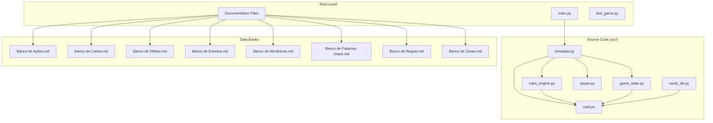

**Diagram sources**
- [main.py](file://simuladorMtg/main.py)
- [simulator.py](file://simuladorMtg/src/simulator.py)
- [card.py](file://simuladorMtg/src/card.py)
- [rules_engine.py](file://simuladorMtg/src/rules_engine.py)

**Section sources**
- [Arquitetura.md](file://simuladorMtg/Arquitetura.md)
- [inicio.md](file://simuladorMtg/inicio.md)

## Core Components

The MTG Simulator consists of several core components that work together to provide a complete game simulation experience:

### Card System
The card system forms the foundation of the simulator, providing a flexible framework for representing different card types and their behaviors. Cards are defined with properties, abilities, and interaction rules that can be extended through the plugin system.

### Rules Engine
The rules engine implements the core Magic: The Gathering rules, including turn structure, priority system, stack management, and state-based actions. It provides hooks for custom rule implementations and validation.

### Game State Management
Game state management handles the current game state, player information, zone contents, and game history. It maintains consistency across all game operations and provides snapshot capabilities for undo/redo functionality.

### Player System
The player system manages player resources, hand management, deck construction, and AI decision-making. It supports multiple players with different control schemes and skill levels.

**Section sources**
- [card.py](file://simuladorMtg/src/card.py)
- [rules_engine.py](file://simuladorMtg/src/rules_engine.py)
- [game_state.py](file://simuladorMtg/src/game_state.py)
- [player.py](file://simuladorMtg/src/player.py)

## Architecture Overview

The MTG Simulator follows a layered architecture pattern that separates concerns and enables easy extension:

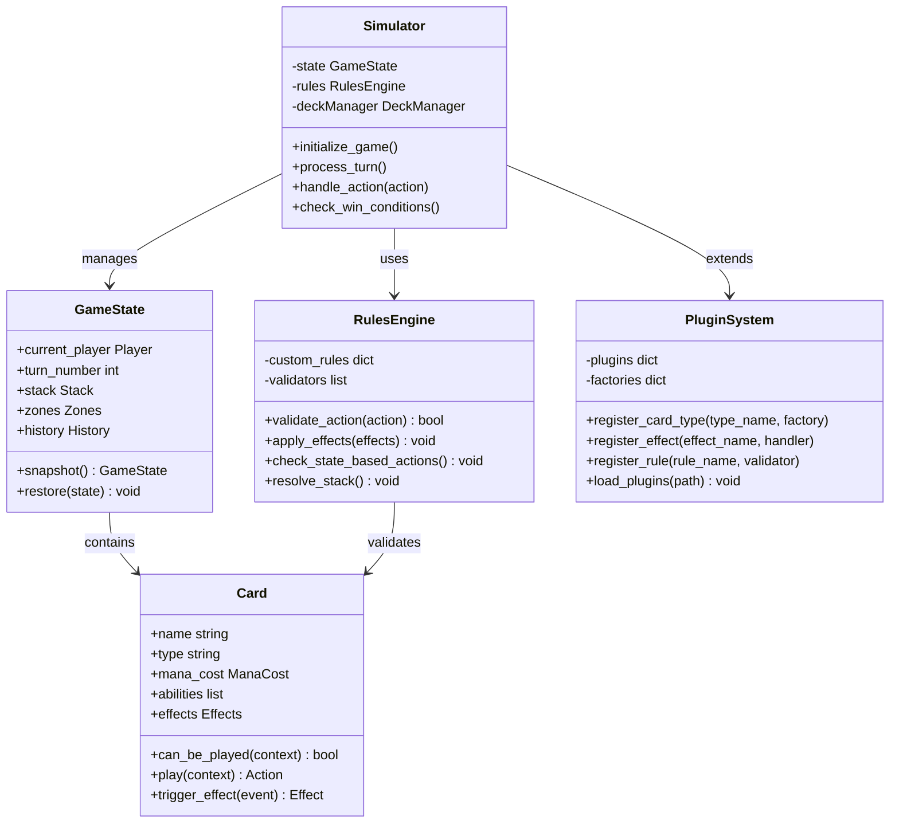

**Diagram sources**
- [simulator.py](file://simuladorMtg/src/simulator.py)
- [game_state.py](file://simuladorMtg/src/game_state.py)
- [rules_engine.py](file://simuladorMtg/src/rules_engine.py)
- [card.py](file://simuladorMtg/src/card.py)

## Detailed Component Analysis

### Card Type System

The card type system provides a flexible framework for defining different card categories and their specific behaviors:

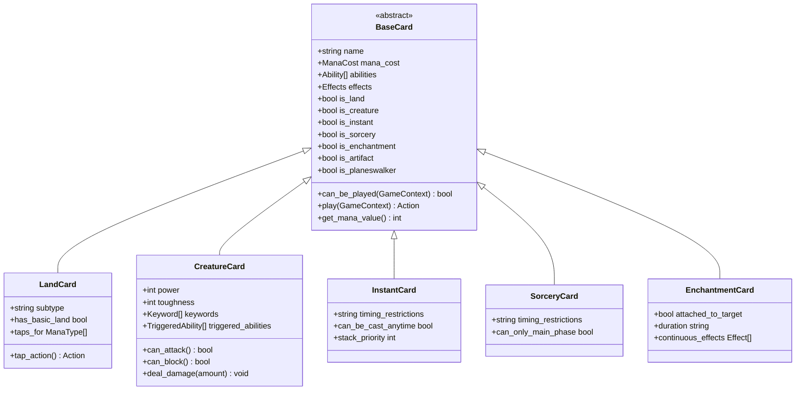

**Diagram sources**
- [card.py](file://simuladorMtg/src/card.py)

### Rules Engine Extensions

The rules engine supports custom rule implementations through a hook system:

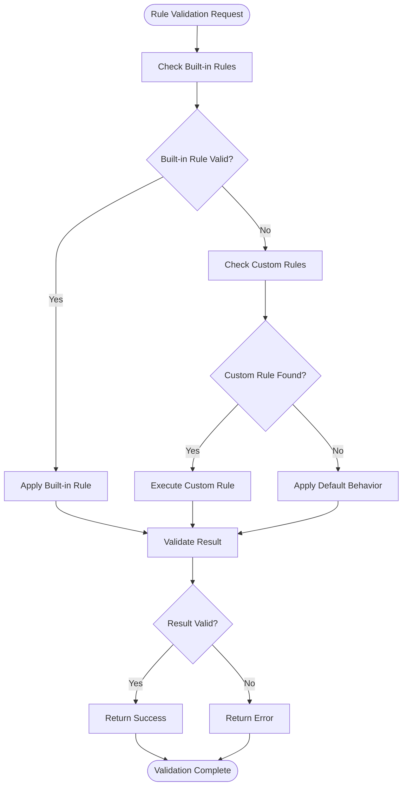

**Diagram sources**
- [rules_engine.py](file://simuladorMtg/src/rules_engine.py)

**Section sources**
- [card.py](file://simuladorMtg/src/card.py)
- [rules_engine.py](file://simuladorMtg/src/rules_engine.py)

## Plugin Architecture

The MTG Simulator implements a robust plugin architecture that allows developers to extend functionality without modifying core code:

### Plugin Registration System

Plugins can register new card types, effects, rules, and behaviors through a centralized registration system:

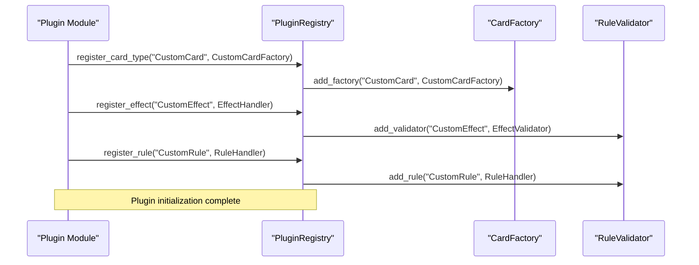

**Diagram sources**
- [simulator.py](file://simuladorMtg/src/simulator.py)

### Plugin Lifecycle Management

The plugin system manages the complete lifecycle of extensions:

| Phase | Description | Hook Points |
|-------|-------------|-------------|
| Initialization | Plugin loading and dependency resolution | `on_load()`, `on_dependencies_resolved()` |
| Registration | Registering new types, effects, and rules | `register_extensions()` |
| Runtime | Active plugin during game execution | `pre_game_start()`, `post_game_end()` |
| Cleanup | Resource cleanup and state restoration | `on_unload()` |

### Plugin Configuration

Plugins can define configuration options that affect their behavior:

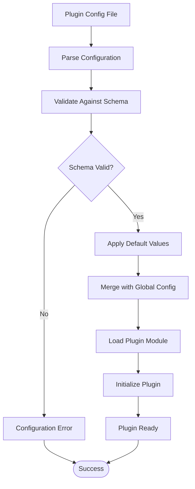

**Diagram sources**
- [simulator.py](file://simuladorMtg/src/simulator.py)

**Section sources**
- [simulator.py](file://simuladorMtg/src/simulator.py)

## Keyword Ability System

The keyword ability system provides reusable mechanics that can be applied to multiple card types:

### Keyword Definition Framework

Keywords are defined as reusable ability templates that encapsulate complex game logic:

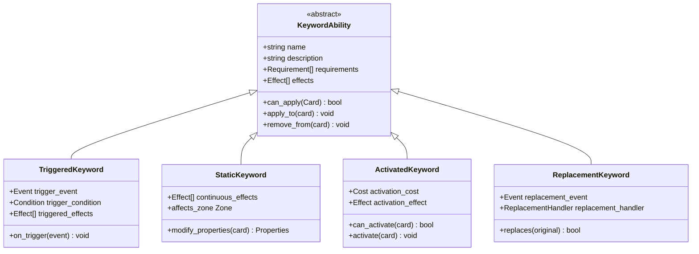

**Diagram sources**
- [Banco de Palavras-chave.md](file://simuladorMtg/Banco de Palavras-chave.md)

### Implementing Custom Keywords

To create a custom keyword ability, follow these steps:

1. **Define the Keyword Class**: Create a new class that inherits from the appropriate keyword base class
2. **Implement Core Logic**: Override methods to define the keyword's behavior
3. **Register the Keyword**: Add the keyword to the registry with proper metadata
4. **Test Thoroughly**: Ensure the keyword works correctly in all scenarios

### Keyword Composition

Keywords can be composed to create complex interactions:

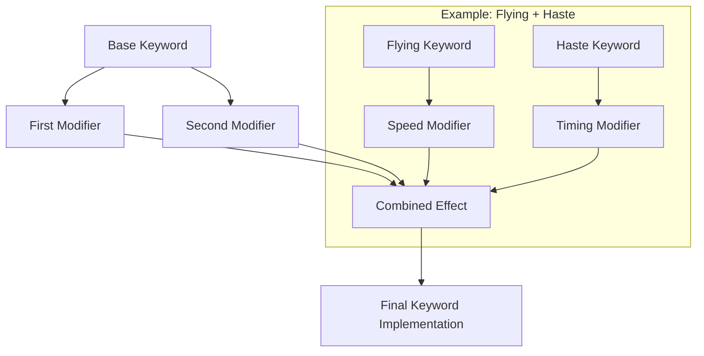

**Diagram sources**
- [Banco de Palavras-chave.md](file://simuladorMtg/Banco de Palavras-chave.md)

**Section sources**
- [Banco de Palavras-chave.md](file://simuladorMtg/Banco de Palavras-chave.md)

## Custom Card Types

Extending the card type system allows for new categories of cards with unique behaviors:

### Card Type Factory Pattern

The card type system uses a factory pattern for creating instances of different card types:

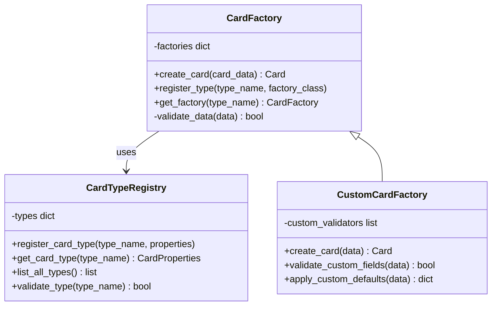

**Diagram sources**
- [card.py](file://simuladorMtg/src/card.py)

### Creating New Card Types

To implement a new card type:

1. **Define Card Properties**: Specify required fields, optional fields, and validation rules
2. **Create Card Class**: Implement the card-specific behavior and methods
3. **Register Card Type**: Add the type to the registry with factory and validators
4. **Update Rules**: Modify rules engine to handle the new card type appropriately

### Card Data Schema

Each card type has a specific data schema that defines its structure:

| Field Category | Required Fields | Optional Fields | Validation Rules |
|----------------|----------------|-----------------|------------------|
| Basic Info | name, type, mana_cost | flavor_text, artist | name uniqueness, type validity |
| Combat Stats | power, toughness | defender, vigilance | numeric ranges |
| Abilities | abilities | triggered_abilities | syntax validation |
| Rarity | rarity | collector_number | predefined values |

**Section sources**
- [card.py](file://simuladorMtg/src/card.py)
- [Banco de Cartas.md](file://simuladorMtg/Banco de Cartas.md)

## Action Definition Patterns

Actions represent game events that change the game state. The action system provides a structured way to define and process game actions:

### Action Framework

Actions follow a consistent pattern for definition and execution:

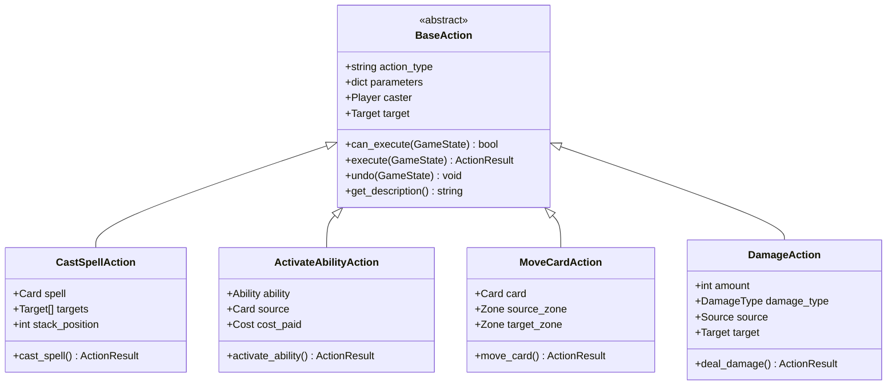

**Diagram sources**
- [Banco de Ações.md](file://simuladorMtg/Banco de Ações.md)

### Action Validation and Execution

Actions undergo a multi-stage validation and execution process:

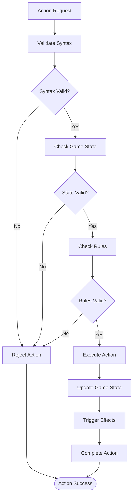

**Diagram sources**
- [rules_engine.py](file://simuladorMtg/src/rules_engine.py)

**Section sources**
- [Banco de Ações.md](file://simuladorMtg/Banco de Ações.md)
- [rules_engine.py](file://simuladorMtg/src/rules_engine.py)

## Extension Hooks

The MTG Simulator provides numerous extension points for customizing behavior:

### Event System

Events allow plugins to respond to game state changes:

| Event Type | Trigger Point | Available Data | Use Cases |
|------------|---------------|----------------|-----------|
| CardPlayed | Card enters battlefield | Card, Controller, Zone | Counters, triggers |
| SpellCast | Spell goes on stack | Spell, Targets, Stack Position | Counterspells, responses |
| DamageDealt | Damage is dealt | Source, Target, Amount, Type | Life gain, death triggers |
| TurnStart | New turn begins | Current Player, Turn Number | Maintenance effects |
| GameEnd | Game ends | Winner, Loser, Duration | Statistics, logging |

### Hook Registration

Hooks can be registered at different stages of the game lifecycle:

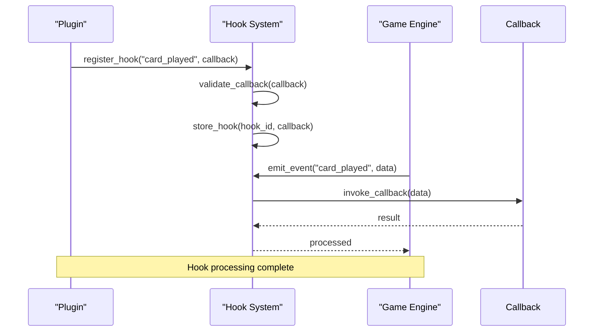

**Diagram sources**
- [game_state.py](file://simuladorMtg/src/game_state.py)

### Configuration Hooks

Plugins can modify game configuration dynamically:

- **Rule Modifications**: Override default rule behaviors
- **UI Customization**: Change interface elements and displays
- **AI Behavior**: Customize computer opponent strategies
- **Statistics Collection**: Track and analyze game metrics

**Section sources**
- [game_state.py](file://simuladorMtg/src/game_state.py)
- [Banco de Eventos.md](file://simuladorMtg/Banco de Eventos.md)

## Third-Party Integration

The MTG Simulator supports integration with external card databases and services:

### Database Adapter Pattern

Database adapters provide a unified interface for different card data sources:

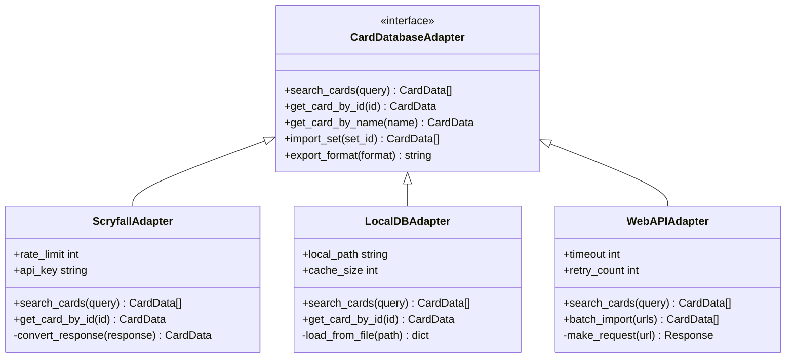

**Diagram sources**
- [cards_db.py](file://simuladorMtg/src/cards_db.py)

### Import/Export Formats

The system supports multiple card data formats:

| Format | Extension | Features | Use Cases |
|--------|-----------|----------|-----------|
| JSON | .json | Full metadata, images | Web APIs, modern systems |
| CSV | .csv | Basic card info | Spreadsheets, simple imports |
| XML | .xml | Structured data, schemas | Enterprise systems |
| YAML | .yaml | Human-readable, comments | Configuration files |
| MTGO | .txt | Magic Online format | Legacy compatibility |

### Synchronization Strategies

Multiple strategies exist for keeping card data synchronized:

1. **Manual Import**: User-initiated updates with full control
2. **Scheduled Sync**: Automatic periodic updates
3. **On-Demand Fetch**: Real-time fetching when needed
4. **Delta Updates**: Only fetch changed cards

**Section sources**
- [cards_db.py](file://simuladorMtg/src/cards_db.py)
- [Banco de Cartas.md](file://simuladorMtg/Banco de Cartas.md)

## Themed Expansions

Creating themed expansions involves organizing content around specific themes or settings:

### Expansion Framework

The expansion framework provides structure for organizing related content:

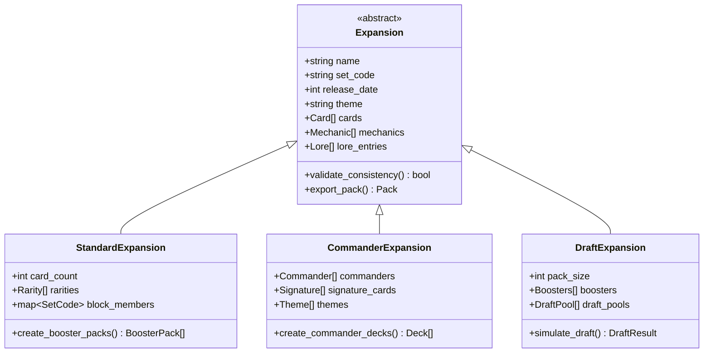

**Diagram sources**
- [Banco de Cartas.md](file://simuladorMtg/Banco de Cartas.md)

### Content Organization

Themed expansions organize content through multiple dimensions:

- **Card Sets**: Groupings of related cards with common mechanics
- **Mechanics**: New rules and abilities specific to the theme
- **Lore**: Story elements and world-building content
- **Artwork**: Visual theming and illustration styles
- **Audio**: Sound effects and music themes

### Distribution Formats

Expansions can be distributed in various formats:

| Format | Platform | Features | Installation |
|--------|----------|----------|--------------|
| Package | Desktop App | Full features, offline | Click-to-install |
| Web Module | Browser | Cloud sync, multiplayer | URL-based loading |
| Mobile Plugin | Mobile Apps | Touch optimization | App store distribution |
| API Service | External Systems | Programmatic access | API key authentication |

**Section sources**
- [Banco de Cartas.md](file://simuladorMtg/Banco de Cartas.md)

## Best Practices

Following established best practices ensures high-quality, maintainable extensions:

### Code Organization

Organize extension code following these principles:

- **Modularity**: Keep related functionality in cohesive modules
- **Separation of Concerns**: Separate business logic from presentation
- **Dependency Injection**: Use interfaces for loose coupling
- **Configuration Over Code**: Make behavior configurable rather than hardcoded

### Testing Strategies

Implement comprehensive testing for extensions:

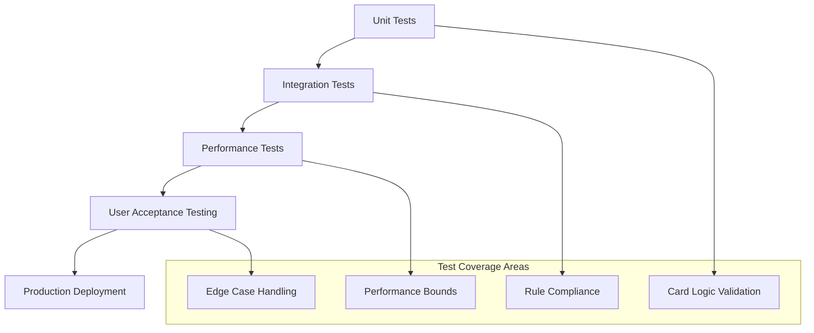

**Diagram sources**
- [test_game.py](file://simuladorMtg/test_game.py)

### Versioning and Compatibility

Maintain backward compatibility through careful versioning:

| Version Type | Purpose | Breaking Changes | Migration Strategy |
|--------------|---------|------------------|-------------------|
| Major | Significant feature additions | Yes | Manual migration required |
| Minor | New features, no breaking changes | No | Automatic upgrade |
| Patch | Bug fixes, security updates | No | Automatic update |
| Beta | Pre-release testing | Possible | Opt-in testing |

### Documentation Standards

Follow consistent documentation practices:

- **API Documentation**: Comprehensive function and class documentation
- **Usage Examples**: Practical examples for common use cases
- **Migration Guides**: Step-by-step upgrade instructions
- **Troubleshooting**: Common issues and solutions

**Section sources**
- [test_game.py](file://simuladorMtg/test_game.py)

## Performance Considerations

Optimizing extension performance is crucial for smooth gameplay:

### Memory Management

Efficient memory usage prevents performance degradation:

- **Object Pooling**: Reuse expensive objects instead of creating new ones
- **Lazy Loading**: Load resources only when needed
- **Garbage Collection**: Minimize object creation in hot paths
- **Memory Leaks**: Monitor and prevent resource leaks

### Computational Efficiency

Optimize algorithmic complexity:

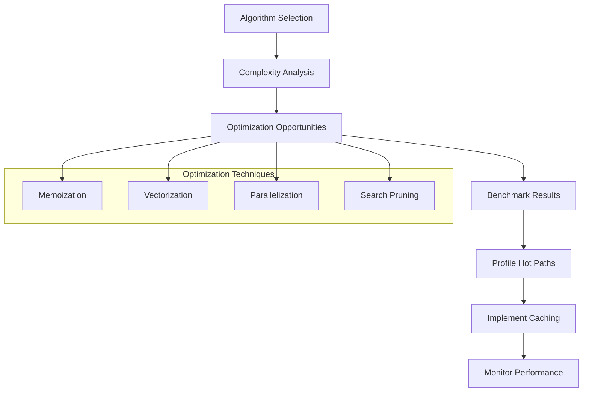

**Diagram sources**
- [rules_engine.py](file://simuladorMtg/src/rules_engine.py)

### Scalability Considerations

Design extensions for scalability:

- **Concurrent Processing**: Handle multiple game states simultaneously
- **Distributed Computing**: Spread load across multiple processors
- **Caching Strategies**: Intelligent caching for frequently accessed data
- **Resource Limits**: Prevent resource exhaustion under load

### Monitoring and Profiling

Implement comprehensive monitoring:

| Metric | Measurement | Threshold | Alert Level |
|--------|-------------|-----------|-------------|
| CPU Usage | Process time per action | >10ms | Warning |
| Memory Usage | Heap allocation rate | >100MB/s | Critical |
| GC Pressure | Garbage collection frequency | >10/sec | Warning |
| Network Latency | API response times | >500ms | Critical |
| Disk I/O | Read/write operations | >1000/sec | Warning |

**Section sources**
- [rules_engine.py](file://simuladorMtg/src/rules_engine.py)

## Debugging Techniques

Effective debugging is essential for developing and maintaining extensions:

### Logging Framework

Implement structured logging throughout extensions:

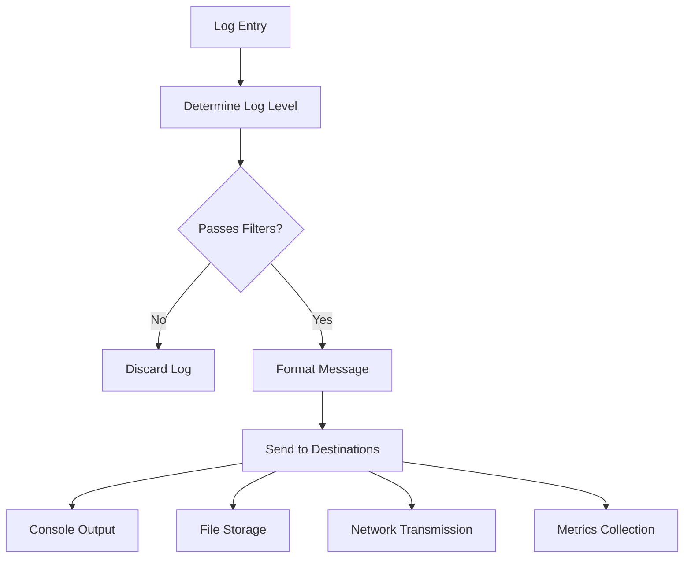

**Diagram sources**
- [game_state.py](file://simuladorMtg/src/game_state.py)

### Debug Tools

Utilize built-in debugging capabilities:

- **Interactive Debugger**: Step-through code execution
- **State Inspection**: Examine game state at any point
- **Action Replay**: Replay specific game sequences
- **Performance Profiling**: Identify bottlenecks and inefficiencies

### Common Issues and Solutions

Address frequent debugging challenges:

| Issue Category | Symptoms | Diagnostic Tools | Resolution Steps |
|----------------|----------|------------------|------------------|
| Memory Leaks | Increasing memory usage | Memory profilers, leak detectors | Identify unclosed resources, fix cleanup |
| Performance Issues | Slow gameplay | CPU profilers, bottleneck analysis | Optimize algorithms, reduce allocations |
| Rule Violations | Unexpected behavior | Rule validators, state checkers | Fix logic errors, add validation |
| Integration Problems | API failures | Network monitors, error logs | Handle timeouts, implement retries |

### Testing Utilities

Use specialized testing tools for extensions:

- **Mock Objects**: Simulate external dependencies
- **Test Databases**: Isolated data environments
- **Scenario Builders**: Construct complex test cases
- **Regression Tests**: Prevent future breakages

**Section sources**
- [game_state.py](file://simuladorMtg/src/game_state.py)
- [test_game.py](file://simuladorMtg/test_game.py)

## Conclusion

The MTG Simulator provides a robust foundation for extending and customizing Magic: The Gathering gameplay through its comprehensive plugin architecture, keyword ability system, and extensive extension points. By following the patterns and best practices outlined in this document, developers can create sophisticated customizations that maintain compatibility while adding rich new features.

Key takeaways for successful extension development:

- **Leverage the Plugin Architecture**: Use the established registration and lifecycle systems
- **Implement Robust Testing**: Cover all edge cases and integration scenarios
- **Prioritize Performance**: Design for scalability and efficient resource usage
- **Maintain Compatibility**: Follow versioning guidelines and migration strategies
- **Document Thoroughly**: Provide clear documentation for users and maintainers

The modular design of the MTG Simulator ensures that extensions can be developed, tested, and deployed independently while maintaining the integrity and stability of the core system. With careful attention to the patterns and practices described here, developers can create compelling custom content that enhances the gaming experience while preserving the reliability and performance that players expect.