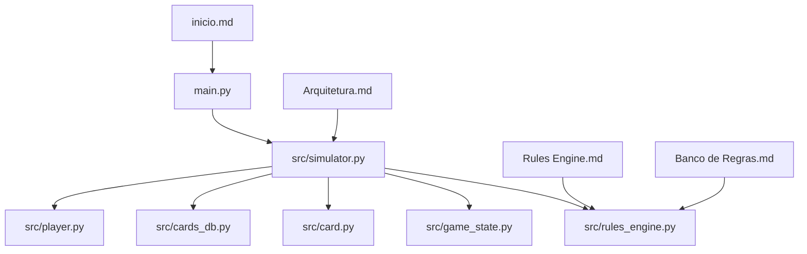
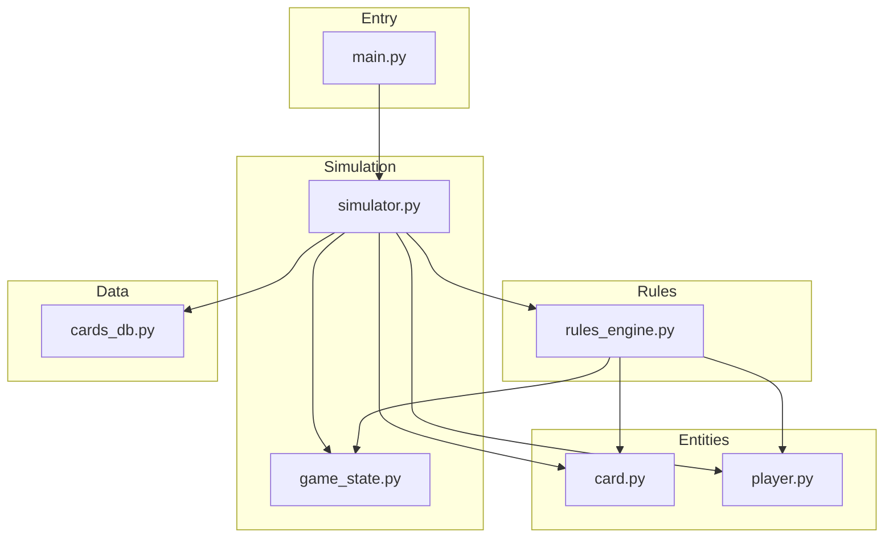
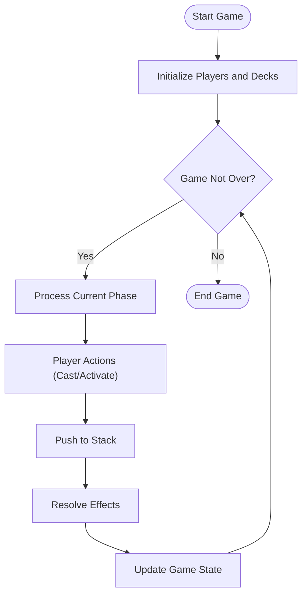
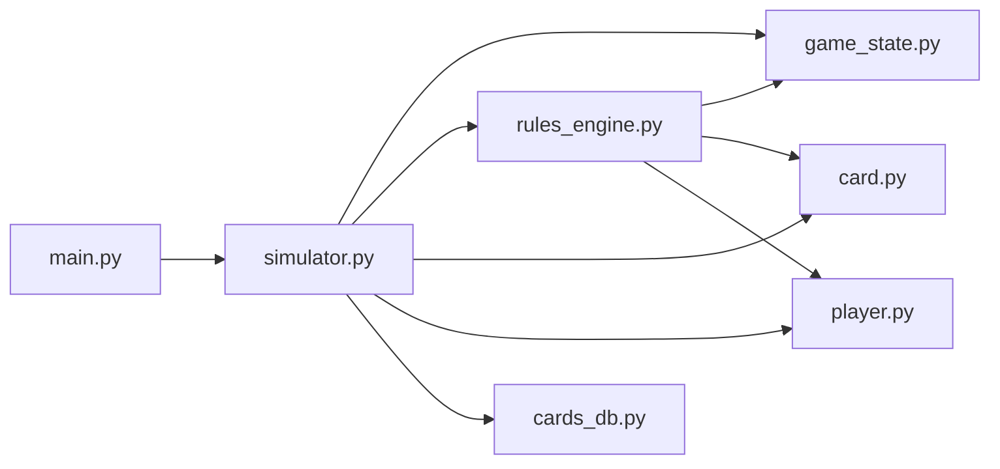

# Project Overview

<cite>
**Referenced Files in This Document**
- [main.py](file://simuladorMtg/main.py)
- [simulator.py](file://simuladorMtg/src/simulator.py)
- [game_state.py](file://simuladorMtg/src/game_state.py)
- [rules_engine.py](file://simuladorMtg/src/rules_engine.py)
- [card.py](file://simuladorMtg/src/card.py)
- [cards_db.py](file://simuladorMtg/src/cards_db.py)
- [player.py](file://simuladorMtg/src/player.py)
- [Arquitetura.md](file://simuladorMtg/Arquitetura.md)
- [Rules Engine.md](file://simuladorMtg/Rules Engine.md)
- [Banco de Regras.md](file://simuladorMtg/Banco de Regras.md)
- [inicio.md](file://simuladorMtg/inicio.md)
</cite>

## Table of Contents
1. [Introduction](#introduction)
2. [Project Structure](#project-structure)
3. [Core Components](#core-components)
4. [Architecture Overview](#architecture-overview)
5. [Detailed Component Analysis](#detailed-component-analysis)
6. [Dependency Analysis](#dependency-analysis)
7. [Performance Considerations](#performance-considerations)
8. [Troubleshooting Guide](#troubleshooting-guide)
9. [Conclusion](#conclusion)

## Introduction
MTG Simulator is a Python-based simulator for Magic: The Gathering that models official rules, card interactions, and game flow without external dependencies. It focuses on correctness and clarity by separating concerns into modular components: cards, players, zones, effects, events, and a rules engine that enforces state transitions. The project emphasizes a data-driven approach to card behavior and rule enforcement, enabling both beginners to learn MTG mechanics and experienced developers to extend or test complex interactions.

Key goals:
- Simulate official MTG rules with high fidelity using pure Python.
- Provide a clean, modular architecture for cards, states, and rules.
- Offer practical examples and entry points to run games and explore mechanics.
- Maintain readability and extensibility through clear separation of concerns.

[No sources needed since this section provides general guidance]

## Project Structure
The repository organizes code under simuladorMtg with a src package containing core modules and documentation files describing architecture, rules, and databases (cards, effects, events, mechanics, keywords, zones). The main entry point initializes the simulation environment and drives gameplay.

**Diagram sources**
- [main.py](file://simuladorMtg/main.py)
- [simulator.py](file://simuladorMtg/src/simulator.py)
- [game_state.py](file://simuladorMtg/src/game_state.py)
- [rules_engine.py](file://simuladorMtg/src/rules_engine.py)
- [card.py](file://simuladorMtg/src/card.py)
- [cards_db.py](file://simuladorMtg/src/cards_db.py)
- [player.py](file://simuladorMtg/src/player.py)
- [Arquitetura.md](file://simuladorMtg/Arquitetura.md)
- [Rules Engine.md](file://simuladorMtg/Rules Engine.md)
- [Banco de Regras.md](file://simuladorMtg/Banco de Regras.md)
- [inicio.md](file://simuladorMtg/inicio.md)

**Section sources**
- [Arquitetura.md](file://simuladorMtg/Arquitetura.md)
- [inicio.md](file://simuladorMtg/inicio.md)

## Core Components
- Cards: Represent individual MTG cards with properties such as mana cost, types, abilities, and behaviors.
- Players: Model each participant’s resources, hand, library, graveyard, battlefield, and decision-making.
- Game State: Tracks the current phase, turn structure, stack, priority, and zone contents.
- Rules Engine: Enforces official MTG rules, resolves spells and abilities, manages the stack, and applies effects.
- Simulator: Orchestrates turns, phases, and player actions; coordinates between state, rules, and entities.
- Card Database: Provides definitions and metadata for cards used in simulations.

These components follow a modular design pattern where each module has a single responsibility and communicates via well-defined interfaces. The rules engine centralizes rule enforcement, while the simulator handles control flow and event sequencing.

**Section sources**
- [card.py](file://simuladorMtg/src/card.py)
- [player.py](file://simuladorMtg/src/player.py)
- [game_state.py](file://simuladorMtg/src/game_state.py)
- [rules_engine.py](file://simuladorMtg/src/rules_engine.py)
- [simulator.py](file://simuladorMtg/src/simulator.py)
- [cards_db.py](file://simuladorMtg/src/cards_db.py)

## Architecture Overview
The system uses a layered architecture:
- Entry Layer: main.py initializes the environment and starts the simulation loop.
- Simulation Layer: simulator.py manages turn/phase progression and player actions.
- State Layer: game_state.py maintains mutable game state and zone structures.
- Rules Layer: rules_engine.py implements rule checks, stack resolution, and effect application.
- Entity Layer: card.py and player.py define game entities and their capabilities.
- Data Layer: cards_db.py supplies card definitions and metadata.

**Diagram sources**
- [main.py](file://simuladorMtg/main.py)
- [simulator.py](file://simuladorMtg/src/simulator.py)
- [game_state.py](file://simuladorMtg/src/game_state.py)
- [rules_engine.py](file://simuladorMtg/src/rules_engine.py)
- [card.py](file://simuladorMtg/src/card.py)
- [player.py](file://simuladorMtg/src/player.py)
- [cards_db.py](file://simuladorMtg/src/cards_db.py)

## Detailed Component Analysis

### Entry Point and Main Flow
- main.py serves as the application entry point, initializing the simulator and starting the game loop. It sets up the environment, loads necessary data, and delegates control to the simulator.
- The main flow typically involves creating a game instance, configuring players and decks, then invoking the simulation loop to process turns until a win condition is met.

Practical example:
- Run the simulator from the command line to start a two-player game, observe turn progression, and interact with the stack and battlefield.

**Section sources**
- [main.py](file://simuladorMtg/main.py)
- [inicio.md](file://simuladorMtg/inicio.md)

### Simulator Orchestration
- simulator.py coordinates turn and phase transitions, processes player actions, and invokes the rules engine to validate moves and resolve effects.
- It maintains the sequence of events, ensuring that priority and stack operations occur in the correct order per MTG rules.

Key responsibilities:
- Turn management (phases, steps, priority).
- Action dispatching (casting spells, activating abilities).
- Event sequencing and logging for debugging.

**Section sources**
- [simulator.py](file://simuladorMtg/src/simulator.py)

### Game State Management
- game_state.py tracks the global state including phases, turns, stack, zones (library, hand, battlefield, graveyard, exile), and counters.
- It exposes methods to query and mutate state safely, ensuring consistency across operations.

Important aspects:
- Zone transitions (e.g., moving cards from library to battlefield).
- Stack operations (pushing/resolving objects).
- Win/loss conditions evaluation.

**Section sources**
- [game_state.py](file://simuladorMtg/src/game_state.py)

### Rules Engine
- rules_engine.py implements official MTG rules, including legality checks, targeting, stack resolution, and effect application.
- It enforces timing restrictions, priority handling, and interaction ordering.

Core features:
- Spell and ability legality validation.
- Stack resolution with layered effects.
- Rule-based decisions (e.g., combat damage assignment, replacement effects).

**Section sources**
- [rules_engine.py](file://simuladorMtg/src/rules_engine.py)
- [Rules Engine.md](file://simuladorMtg/Rules Engine.md)
- [Banco de Regras.md](file://simuladorMtg/Banco de Regras.md)

### Cards and Player Entities
- card.py defines card attributes and behaviors, including mana cost, types, keywords, and ability implementations.
- player.py models each participant’s resources, deck composition, and decision logic.

Design patterns:
- Cards encapsulate behavior via methods or effect descriptors.
- Players manage hands and libraries, and respond to game events.

**Section sources**
- [card.py](file://simuladorMtg/src/card.py)
- [player.py](file://simuladorMtg/src/player.py)

### Card Database
- cards_db.py provides structured definitions for cards, enabling reuse and consistency across simulations.
- It acts as a centralized registry for card metadata and effect templates.

Usage:
- Load predefined decks or construct custom lists from the database.
- Extend with new cards by adding entries following the established schema.

**Section sources**
- [cards_db.py](file://simuladorMtg/src/cards_db.py)

### Conceptual Overview
For beginners, think of the simulator as a digital tabletop:
- You have two players, each with a deck, hand, and battlefield.
- Turns proceed through phases (untap, upkeep, draw, main, combat, second main, end).
- Spells and abilities go onto the stack and resolve according to rules.
- Zones track where cards are located at any time.

[No sources needed since this diagram shows conceptual workflow, not actual code structure]

## Dependency Analysis
The simulator relies on clear internal dependencies:
- main.py depends on simulator.py to drive the game.
- simulator.py depends on game_state.py, rules_engine.py, card.py, player.py, and cards_db.py.
- rules_engine.py depends on game_state.py and entity definitions to enforce rules.

**Diagram sources**
- [main.py](file://simuladorMtg/main.py)
- [simulator.py](file://simuladorMtg/src/simulator.py)
- [game_state.py](file://simuladorMtg/src/game_state.py)
- [rules_engine.py](file://simuladorMtg/src/rules_engine.py)
- [card.py](file://simuladorMtg/src/card.py)
- [player.py](file://simuladorMtg/src/player.py)
- [cards_db.py](file://simuladorMtg/src/cards_db.py)

**Section sources**
- [Arquitetura.md](file://simuladorMtg/Arquitetura.md)

## Performance Considerations
- Pure Python implementation avoids external overhead but may be slower than compiled languages; optimize hot paths in the rules engine and state updates.
- Use efficient data structures for zones and stacks (lists, dictionaries) to minimize lookup costs.
- Avoid deep recursion in effect resolution; prefer iterative approaches where possible.
- Cache frequently accessed card metadata to reduce repeated parsing or lookups.

[No sources needed since this section provides general guidance]

## Troubleshooting Guide
Common issues and resolutions:
- Illegal moves: Ensure rules engine validations are invoked before state mutations. Check targeting legality and timing restrictions.
- Stack corruption: Verify push/pop operations maintain LIFO order; log stack contents during resolution.
- State inconsistencies: Validate zone transitions and counters after each action; use assertions in development builds.
- Missing card definitions: Confirm entries exist in the card database and match expected schemas.

Debugging tips:
- Enable verbose logging in the simulator to trace actions and stack operations.
- Isolate problematic interactions by running minimal scenarios with known inputs.

**Section sources**
- [rules_engine.py](file://simuladorMtg/src/rules_engine.py)
- [game_state.py](file://simuladorMtg/src/game_state.py)
- [simulator.py](file://simuladorMtg/src/simulator.py)

## Conclusion
MTG Simulator delivers a faithful, modular implementation of Magic: The Gathering rules using pure Python. Its architecture separates concerns across simulation orchestration, state management, rule enforcement, and entity modeling. Beginners can learn core mechanics through interactive play, while advanced users can extend card definitions and rule behaviors. The clear entry points and documented design make it accessible for both learning and development.

[No sources needed since this section summarizes without analyzing specific files]