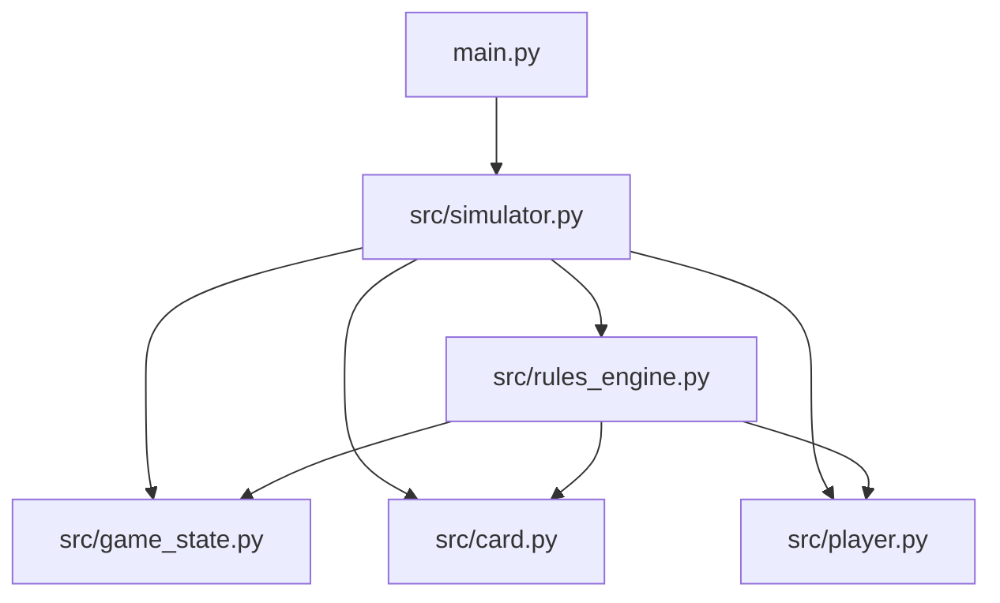
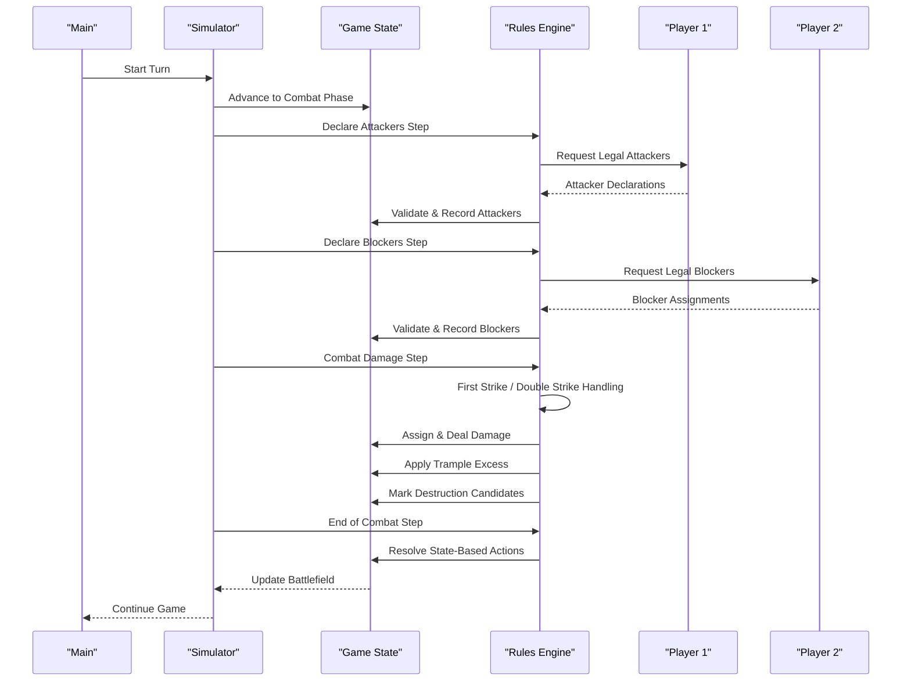
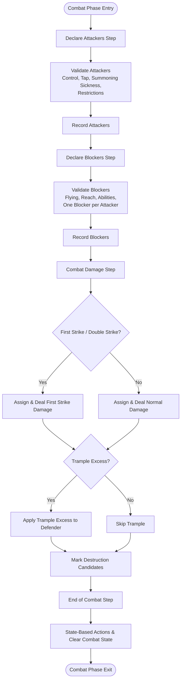
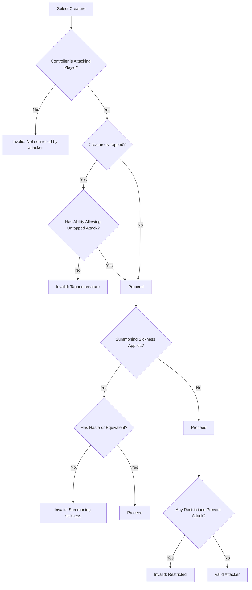
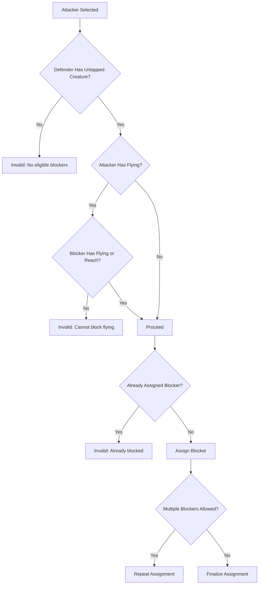
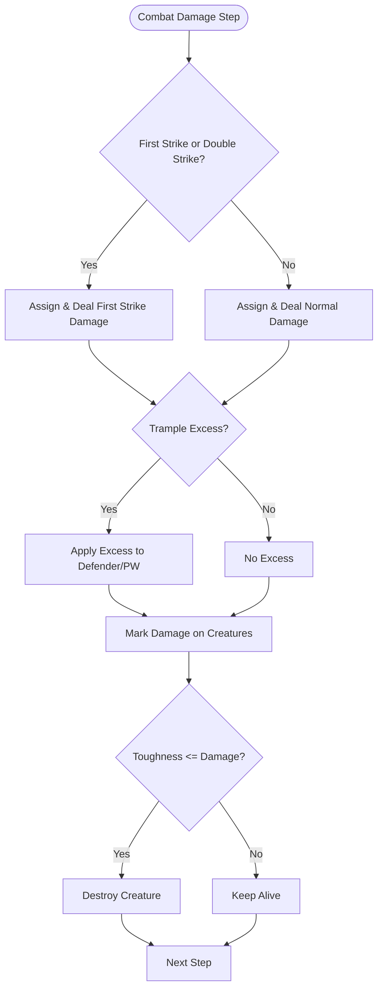
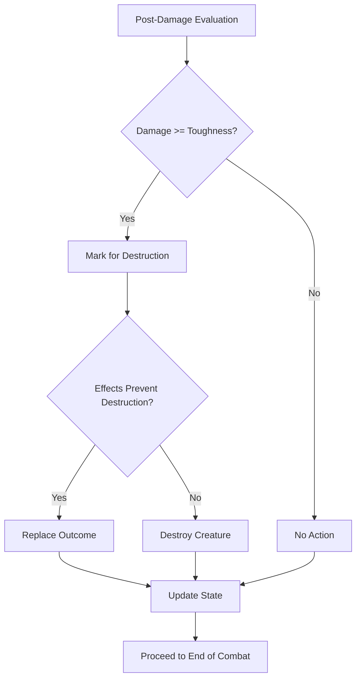
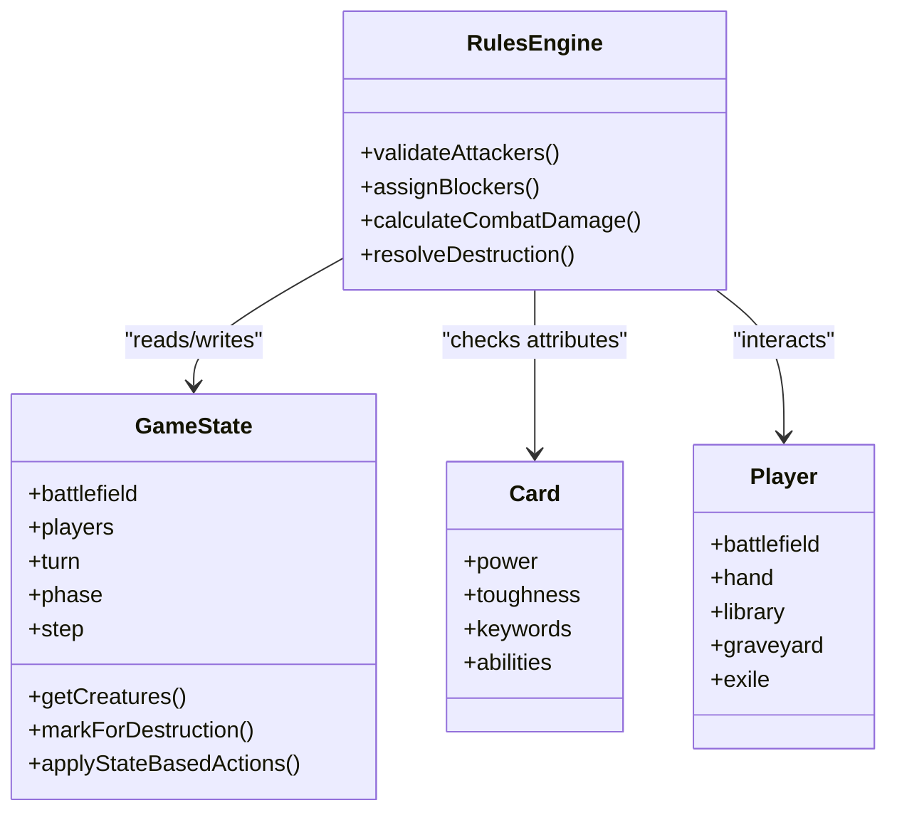
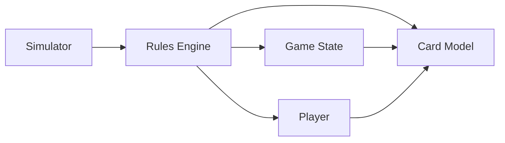

# Combat System

<cite>
**Referenced Files in This Document**
- [main.py](file://simuladorMtg/main.py)
- [simulator.py](file://simuladorMtg/src/simulator.py)
- [game_state.py](file://simuladorMtg/src/game_state.py)
- [rules_engine.py](file://simuladorMtg/src/rules_engine.py)
- [card.py](file://simuladorMtg/src/card.py)
- [player.py](file://simuladorMtg/src/player.py)
- [Banco de Regras.md](file://simuladorMtg/Banco de Regras.md)
- [Banco de Mecânicas.md](file://simuladorMtg/Banco de Mecânicas.md)
- [Arquitetura.md](file://simuladorMtg/Arquitetura.md)
</cite>

## Table of Contents
1. [Introduction](#introduction)
2. [Project Structure](#project-structure)
3. [Core Components](#core-components)
4. [Architecture Overview](#architecture-overview)
5. [Detailed Component Analysis](#detailed-component-analysis)
6. [Dependency Analysis](#dependency-analysis)
7. [Performance Considerations](#performance-considerations)
8. [Troubleshooting Guide](#troubleshooting-guide)
9. [Conclusion](#conclusion)

## Introduction
This document explains the Magic: The Gathering combat system implementation within the simulator. It covers the full combat phase structure (declare attackers, declare blockers, combat damage, and end of combat), the rules engine for attacker validation and blocker assignment, combat damage calculation with trample and first strike mechanics, and destruction resolution. It also provides examples of complex combat scenarios involving flying creatures, double strike, and protection abilities, and discusses how combat interacts with game state management, error handling for invalid actions, and performance considerations during combat resolution.

## Project Structure
The combat system is implemented across a small set of core modules that manage game state, card definitions, player interactions, and the rules engine. The main entry point orchestrates gameplay and invokes the simulator to execute phases and steps, while the rules engine enforces combat legality and processes combat events.

**Diagram sources**
- [main.py](file://simuladorMtg/main.py)
- [simulator.py](file://simuladorMtg/src/simulator.py)
- [game_state.py](file://simuladorMtg/src/game_state.py)
- [rules_engine.py](file://simuladorMtg/src/rules_engine.py)
- [player.py](file://simuladorMtg/src/player.py)
- [card.py](file://simuladorMtg/src/card.py)

**Section sources**
- [Arquitetura.md](file://simuladorMtg/Arquitetura.md)

## Core Components
- Game State: Tracks zones, permanents, players, turn structure, and phase/step progression. It maintains the stack and priority where relevant, and exposes methods to query and mutate the battlefield for combat.
- Rules Engine: Encapsulates combat legality checks and processing logic, including attacker declaration validation, blocker assignment constraints, damage assignment order, and resolution of effects like trample and first strike.
- Card Model: Defines creature attributes such as power/toughness, keywords (flying, first strike, double strike, trample, protection), and other characteristics required by combat rules.
- Player: Represents each player’s resources, hand, library, graveyard, exile, and battlefield; tracks which creatures are declared as attackers or blockers.
- Simulator: Drives the game loop, advances turns and phases, and delegates combat steps to the rules engine.

Key responsibilities:
- Declare Attackers step: Validate legal attackers based on controller control, summoning sickness, tap status, and restrictions; record attacker declarations.
- Declare Blockers step: Validate legal blockers considering defender’s creatures, abilities like flying, reach, and restrictions; assign blockers to attackers.
- Combat Damage step: Compute and assign damage using power, modifiers, and keywords; handle first strike and double strike sub-steps; apply trample excess damage.
- End of Combat step: Resolve state-based actions, mark creatures as untapped, clear combat assignments, and finalize destructions.

**Section sources**
- [game_state.py](file://simuladorMtg/src/game_state.py)
- [rules_engine.py](file://simuladorMtg/src/rules_engine.py)
- [card.py](file://simuladorMtg/src/card.py)
- [player.py](file://simuladorMtg/src/player.py)
- [simulator.py](file://simuladorMtg/src/simulator.py)

## Architecture Overview
Combat resolution follows a strict sequence enforced by the simulator and validated by the rules engine. The flow below maps to actual components and their interactions.

**Diagram sources**
- [simulator.py](file://simuladorMtg/src/simulator.py)
- [game_state.py](file://simuladorMtg/src/game_state.py)
- [rules_engine.py](file://simuladorMtg/src/rules_engine.py)
- [player.py](file://simuladorMtg/src/player.py)

## Detailed Component Analysis

### Combat Phase Flow
The combat phase is divided into discrete steps. Each step has specific inputs and outputs, and the rules engine ensures legality before committing changes to game state.

**Diagram sources**
- [rules_engine.py](file://simuladorMtg/src/rules_engine.py)
- [game_state.py](file://simuladorMtg/src/game_state.py)

**Section sources**
- [rules_engine.py](file://simuladorMtg/src/rules_engine.py)
- [game_state.py](file://simuladorMtg/src/game_state.py)

### Attacker Declaration Validation
Legal attackers must satisfy multiple conditions:
- Controlled by the declaring player
- Not tapped unless an ability allows otherwise
- Not prevented from attacking by restrictions or effects
- No summoning sickness if the creature cannot attack without additional abilities
- Respect any “can’t attack” or “must attack” constraints

Validation returns either a list of valid attackers or an error indicating why a chosen creature cannot be declared.

**Diagram sources**
- [rules_engine.py](file://simuladorMtg/src/rules_engine.py)
- [card.py](file://simuladorMtg/src/card.py)

**Section sources**
- [rules_engine.py](file://simuladorMtg/src/rules_engine.py)
- [card.py](file://simuladorMtg/src/card.py)

### Blocker Assignment Logic
Blocker assignment enforces:
- Only defending player’s untapped creatures can block
- Flying requires blocking creature to have flying or reach
- One-to-one assignment unless abilities allow multiple blockers
- Blocking legality checked against current attacker properties and abilities
- Once assigned, blockers cannot be reassigned unless explicitly allowed

**Diagram sources**
- [rules_engine.py](file://simuladorMtg/src/rules_engine.py)
- [card.py](file://simuladorMtg/src/card.py)

**Section sources**
- [rules_engine.py](file://simuladorMtg/src/rules_engine.py)
- [card.py](file://simuladorMtg/src/card.py)

### Combat Damage Calculation
Combat damage uses power and toughness, modified by effects and keywords:
- First strike deals damage earlier than normal damage
- Double strike deals damage in both first strike and normal steps
- Trample allows excess damage to be assigned to the defending player or planeswalker when the blocker would be destroyed
- Protection prevents damage from sources with certain qualities (e.g., color, type)

**Diagram sources**
- [rules_engine.py](file://simuladorMtg/src/rules_engine.py)
- [card.py](file://simuladorMtg/src/card.py)

**Section sources**
- [rules_engine.py](file://simuladorMtg/src/rules_engine.py)
- [card.py](file://simuladorMtg/src/card.py)

### Destruction Resolution
After damage assignment, state-based actions evaluate whether creatures should be destroyed:
- If damage equals or exceeds toughness, the creature is marked for destruction
- Effects may prevent destruction or replace it with other outcomes
- Destruction occurs after all damage is dealt and before the end of combat cleanup

**Diagram sources**
- [rules_engine.py](file://simuladorMtg/src/rules_engine.py)
- [game_state.py](file://simuladorMtg/src/game_state.py)

**Section sources**
- [rules_engine.py](file://simuladorMtg/src/rules_engine.py)
- [game_state.py](file://simuladorMtg/src/game_state.py)

### Complex Combat Scenarios

#### Flying Creatures
- Attackers with flying require blockers with flying or reach.
- Non-flying creatures cannot block flying attackers unless they have reach.
- Example: A flying creature attacks; only creatures with flying or reach can be assigned as blockers.

#### Double Strike
- A creature with double strike deals damage in both the first strike and normal damage steps.
- First strike damage is applied before normal damage; trample excess applies in each step independently.
- Example: A double striker blocks a non-double striker; first strike damage may destroy the blocker, then normal damage is not needed.

#### Protection Abilities
- Protection prevents damage from sources with specified qualities (e.g., color, type).
- If an attacker has protection, damage from the protected source is prevented.
- Example: A red creature with protection from blue cannot be damaged by a blue spell or creature with matching qualities.

These scenarios rely on keyword checks and damage prevention logic implemented in the rules engine and card model.

**Section sources**
- [rules_engine.py](file://simuladorMtg/src/rules_engine.py)
- [card.py](file://simuladorMtg/src/card.py)

### Interaction Between Combat Rules and Game State Management
- The rules engine queries game state to determine legality and mutates it only after validation.
- Game state tracks battlefield composition, zone transitions, and combat assignments.
- Errors raised by the rules engine are propagated back to the simulator, which halts invalid actions and preserves consistency.

**Diagram sources**
- [game_state.py](file://simuladorMtg/src/game_state.py)
- [rules_engine.py](file://simuladorMtg/src/rules_engine.py)
- [card.py](file://simuladorMtg/src/card.py)
- [player.py](file://simuladorMtg/src/player.py)

**Section sources**
- [game_state.py](file://simuladorMtg/src/game_state.py)
- [rules_engine.py](file://simuladorMtg/src/rules_engine.py)
- [card.py](file://simuladorMtg/src/card.py)
- [player.py](file://simuladorMtg/src/player.py)

## Dependency Analysis
The combat system exhibits clear separation of concerns:
- Simulator drives phase progression and delegates to the rules engine.
- Rules engine depends on card definitions and player/battlefield state.
- Game state centralizes battlefield and zone data, ensuring consistent updates.

**Diagram sources**
- [simulator.py](file://simuladorMtg/src/simulator.py)
- [rules_engine.py](file://simuladorMtg/src/rules_engine.py)
- [game_state.py](file://simuladorMtg/src/game_state.py)
- [card.py](file://simuladorMtg/src/card.py)
- [player.py](file://simuladorMtg/src/player.py)

**Section sources**
- [simulator.py](file://simuladorMtg/src/simulator.py)
- [rules_engine.py](file://simuladorMtg/src/rules_engine.py)
- [game_state.py](file://simuladorMtg/src/game_state.py)
- [card.py](file://simuladorMtg/src/card.py)
- [player.py](file://simuladorMtg/src/player.py)

## Performance Considerations
- Minimize repeated queries by caching battlefield snapshots during a single combat step.
- Use efficient keyword lookups (e.g., sets for flying/reach) to speed up blocker validation.
- Batch destruction evaluations to avoid multiple passes over the battlefield.
- Avoid deep recursion in damage assignment; prefer iterative algorithms for assigning excess trample damage.
- Separate read-only checks from write operations to reduce contention and ensure deterministic ordering.

[No sources needed since this section provides general guidance]

## Troubleshooting Guide
Common issues and resolutions:
- Invalid attacker declaration: Ensure the creature is controlled by the attacking player, untapped, and not restricted by effects or summoning sickness.
- Illegal blocker assignment: Verify the blocker has flying or reach against flying attackers and is untapped.
- Unexpected destruction: Check damage totals versus toughness and confirm no protective or replacement effects are active.
- Trample misassignment: Confirm that sufficient damage is assigned to the blocker before excess is routed to the defender or planeswalker.

Error handling strategy:
- The rules engine raises descriptive errors for illegal actions; the simulator catches these and halts the step until corrected.
- Game state remains unchanged until validation succeeds, preserving consistency.

**Section sources**
- [rules_engine.py](file://simuladorMtg/src/rules_engine.py)
- [game_state.py](file://simuladorMtg/src/game_state.py)

## Conclusion
The combat system implementation adheres closely to Magic: The Gathering rules through a structured phase-driven approach enforced by the simulator and validated by the rules engine. By separating concerns between game state, card models, and rules logic, the system supports complex interactions such as flying, double strike, trample, and protection. Proper error handling and performance optimizations ensure reliable and efficient combat resolution.

[No sources needed since this section summarizes without analyzing specific files]