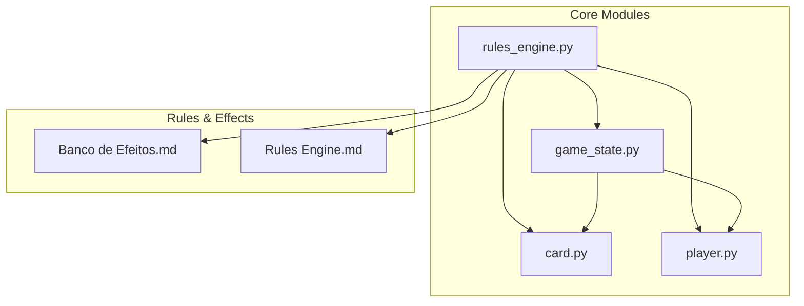
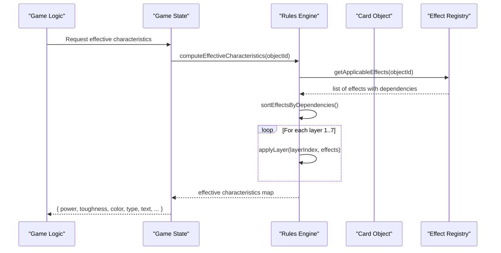
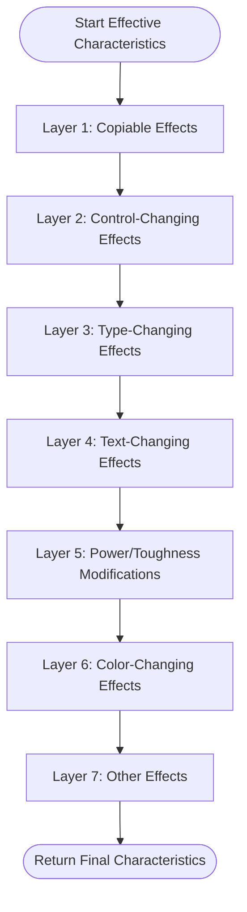
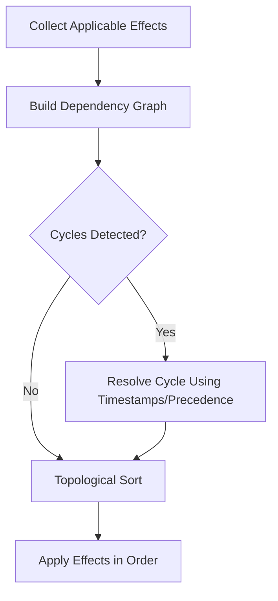
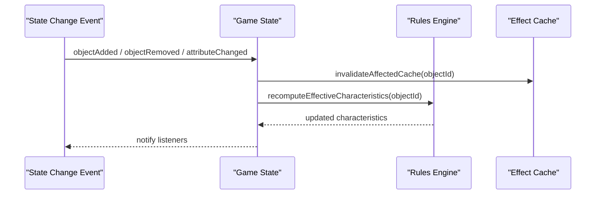
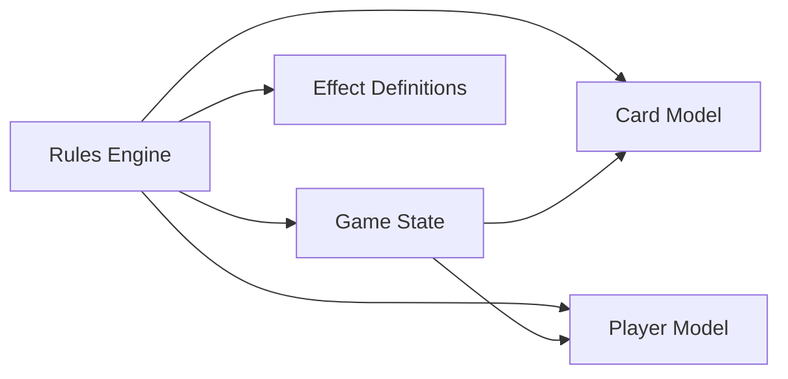

# Continuous Effects and Layering

<cite>
**Referenced Files in This Document**
- [game_state.py](file://simuladorMtg/src/game_state.py)
- [rules_engine.py](file://simuladorMtg/src/rules_engine.py)
- [card.py](file://simuladorMtg/src/card.py)
- [player.py](file://simuladorMtg/src/player.py)
- [Banco de Efeitos.md](file://simuladorMtg/Banco de Efeitos.md)
- [Rules Engine.md](file://simuladorMtg/Rules Engine.md)
</cite>

## Table of Contents
1. [Introduction](#introduction)
2. [Project Structure](#project-structure)
3. [Core Components](#core-components)
4. [Architecture Overview](#architecture-overview)
5. [Detailed Component Analysis](#detailed-component-analysis)
6. [Dependency Analysis](#dependency-analysis)
7. [Performance Considerations](#performance-considerations)
8. [Troubleshooting Guide](#troubleshooting-guide)
9. [Conclusion](#conclusion)

## Introduction
This document explains the continuous effects and layering system implemented in the MTG simulator. It covers how the seven layers of Magic: The Gathering continuous effects are applied, how dependencies between effects are tracked, and how real-time updates occur when game state changes. It also provides concrete examples such as equipment bonuses, enchantment effects, and counters affecting creature characteristics, along with performance considerations and caching strategies for frequently accessed properties.

## Project Structure
The implementation is primarily located under the src directory, with supporting rules and effect definitions in markdown files. Key modules include:
- Game state management and object lifecycle
- Rules engine for applying continuous effects and resolving interactions
- Card model and attributes
- Player model and ownership/control logic
- Effect definitions and rule references

**Diagram sources**
- [game_state.py](file://simuladorMtg/src/game_state.py)
- [rules_engine.py](file://simuladorMtg/src/rules_engine.py)
- [card.py](file://simuladorMtg/src/card.py)
- [player.py](file://simuladorMtg/src/player.py)
- [Banco de Efeitos.md](file://simuladorMtg/Banco de Efeitos.md)
- [Rules Engine.md](file://simuladorMtg/Rules Engine.md)

**Section sources**
- [game_state.py](file://simuladorMtg/src/game_state.py)
- [rules_engine.py](file://simuladorMtg/src/rules_engine.py)
- [card.py](file://simuladorMtg/src/card.py)
- [player.py](file://simuladorMtg/src/player.py)
- [Banco de Efeitos.md](file://simuladorMtg/Banco de Efeitos.md)
- [Rules Engine.md](file://simuladorMtg/Rules Engine.md)

## Core Components
- Game State: Tracks objects, zones, players, and the set of active continuous effects. It exposes methods to query current characteristics after applying layers.
- Rules Engine: Implements the layer calculation algorithm, dependency resolution, and event-driven updates when objects enter/leave play or change attributes.
- Card Model: Represents cards and their base characteristics (power, toughness, colors, types, text). It may store modifiers and counters that interact with continuous effects.
- Player Model: Holds control and ownership information, which influences control-changing effects and other player-dependent interactions.

Key responsibilities:
- Maintain a registry of continuous effects and their applicability
- Compute effective characteristics per object by applying layers in order
- Track dependencies among effects to ensure correct evaluation order
- Invalidate caches on state changes and recompute only affected parts

**Section sources**
- [game_state.py](file://simuladorMtg/src/game_state.py)
- [rules_engine.py](file://simuladorMtg/src/rules_engine.py)
- [card.py](file://simuladorMtg/src/card.py)
- [player.py](file://simuladorMtg/src/player.py)

## Architecture Overview
The continuous effects system follows a layered approach where each layer applies specific transformations to object characteristics. The rules engine computes effective values by iterating through layers, collecting applicable effects, ordering them by dependency, and then applying them in sequence.

**Diagram sources**
- [rules_engine.py](file://simuladorMtg/src/rules_engine.py)
- [game_state.py](file://simuladorMtg/src/game_state.py)
- [card.py](file://simuladorMtg/src/card.py)

## Detailed Component Analysis

### Seven Layers of Continuous Effects
The system implements the standard seven-layer framework used in Magic: The Gathering. Each layer transforms specific aspects of an object’s characteristics.

- Layer 1: Copiable effects
  - Applies copying effects that alter identity or characteristics based on other objects.
- Layer 2: Control-changing effects
  - Changes who controls an object; can affect abilities and interactions dependent on controller.
- Layer 3: Type-changing effects
  - Modifies card types, subtypes, and supertypes.
- Layer 4: Text-changing effects
  - Alters ability text, keywords, and rules text.
- Layer 5: Power/toughness modifications
  - Adds or sets power and toughness via +X/+Y, static abilities, and counters.
- Layer 6: Color-changing effects
  - Changes object color(s), influencing interactions like “white” spells or abilities.
- Layer 7: Other effects
  - Miscellaneous continuous effects not covered by previous layers.

**Diagram sources**
- [rules_engine.py](file://simuladorMtg/src/rules_engine.py)
- [Banco de Efeitos.md](file://simuladorMtg/Banco de Efeitos.md)

**Section sources**
- [rules_engine.py](file://simuladorMtg/src/rules_engine.py)
- [Banco de Efeitos.md](file://simuladorMtg/Banco de Efeitos.md)

### Dependency Tracking Between Effects
Continuous effects may depend on other effects or objects. The rules engine builds a dependency graph and sorts effects topologically to ensure correct application order.

**Diagram sources**
- [rules_engine.py](file://simuladorMtg/src/rules_engine.py)

**Section sources**
- [rules_engine.py](file://simuladorMtg/src/rules_engine.py)

### Real-Time Updates When Game State Changes
When objects enter or leave play, or when attributes change, the system invalidates cached characteristics and recomputes only the affected objects.

**Diagram sources**
- [game_state.py](file://simuladorMtg/src/game_state.py)
- [rules_engine.py](file://simuladorMtg/src/rules_engine.py)

**Section sources**
- [game_state.py](file://simuladorMtg/src/game_state.py)
- [rules_engine.py](file://simuladorMtg/src/rules_engine.py)

### Concrete Examples of Complex Interactions
- Equipment Bonuses:
  - An equipped creature receives power/toughness modifications from the equipment’s static ability. These are applied in Layer 5 after type and text changes. If the equipment leaves, the bonus is removed and characteristics revert accordingly.
- Enchantment Effects:
  - An enchantment granting +1/+0 and changing creature type is processed in Layer 3 (type change) and Layer 5 (+1/+0 modification). If multiple enchantments grant conflicting type changes, layering and dependency resolution determine the final type.
- Counters:
  - +1/+1 counters modify power/toughness in Layer 5. Counters added or removed trigger cache invalidation and recalculation of effective characteristics.

These scenarios rely on the layered application and dependency tracking to produce consistent results across complex interactions.

**Section sources**
- [rules_engine.py](file://simuladorMtg/src/rules_engine.py)
- [Banco de Efeitos.md](file://simuladorMtg/Banco de Efeitos.md)

## Dependency Analysis
The continuous effects system has clear separation of concerns:
- Game State manages object lifecycles and triggers recomputation
- Rules Engine encapsulates layering and dependency resolution
- Card and Player models provide base data and context
- Markdown files define effect behaviors and rule references

**Diagram sources**
- [rules_engine.py](file://simuladorMtg/src/rules_engine.py)
- [game_state.py](file://simuladorMtg/src/game_state.py)
- [card.py](file://simuladorMtg/src/card.py)
- [player.py](file://simuladorMtg/src/player.py)
- [Banco de Efeitos.md](file://simuladorMtg/Banco de Efeitos.md)

**Section sources**
- [rules_engine.py](file://simuladorMtg/src/rules_engine.py)
- [game_state.py](file://simuladorMtg/src/game_state.py)
- [card.py](file://simuladorMtg/src/card.py)
- [player.py](file://simuladorMtg/src/player.py)
- [Banco de Efeitos.md](file://simuladorMtg/Banco de Efeitos.md)

## Performance Considerations
- Incremental Recomputation:
  - Only recompute characteristics for objects whose applicable effects changed. Avoid full recalculations across all objects.
- Caching Strategies:
  - Cache effective characteristics keyed by object ID and effect snapshot version. Invalidate on relevant events (enter/leave play, attribute changes).
- Dependency Graph Optimization:
  - Use efficient graph traversal and memoization for sorting and applying effects. Detect cycles early and resolve using deterministic precedence.
- Batch Updates:
  - Group multiple state changes into a single update cycle to minimize repeated recomputation.
- Memory Management:
  - Prune stale effect entries and avoid retaining references to removed objects.

[No sources needed since this section provides general guidance]

## Troubleshooting Guide
Common issues and resolutions:
- Incorrect characteristic values:
  - Verify layer order and dependency sorting. Check if applicable effects are correctly identified for the object.
- Stale cached values:
  - Ensure cache invalidation occurs on every relevant state change. Confirm cache key includes effect snapshot version.
- Unexpected behavior with equipment/enchantments:
  - Inspect whether type-changing and power/toughness modifications are applied in the correct layers. Validate that removal of attachments triggers proper rollback.
- Counters not reflected:
  - Confirm counters are included in Layer 5 calculations and that adding/removing counters triggers recomputation.

**Section sources**
- [rules_engine.py](file://simuladorMtg/src/rules_engine.py)
- [game_state.py](file://simuladorMtg/src/game_state.py)

## Conclusion
The continuous effects and layering system in the MTG simulator adheres to the standard seven-layer framework, with robust dependency tracking and real-time updates. By separating concerns between game state, rules engine, and object models, the system achieves clarity and maintainability. Performance optimizations such as incremental recomputation and caching ensure responsiveness even with complex interactions like equipment, enchantments, and counters.

[No sources needed since this section summarizes without analyzing specific files]