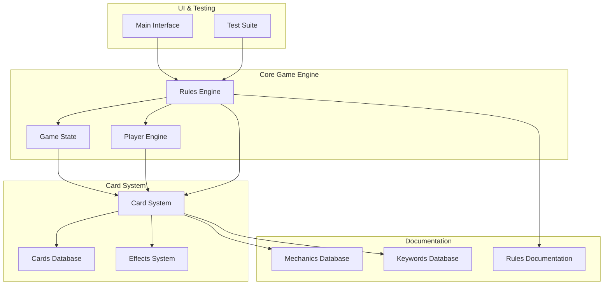
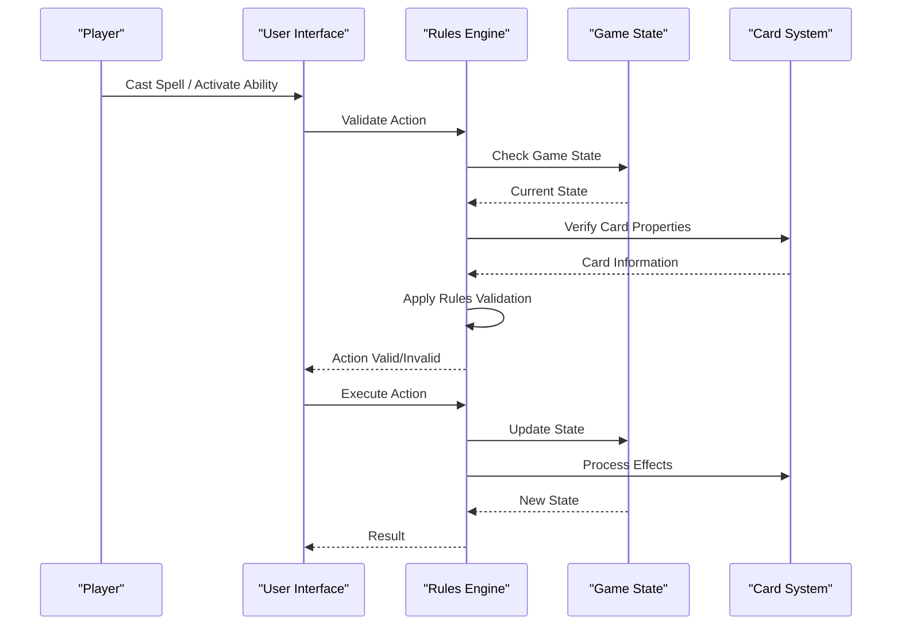
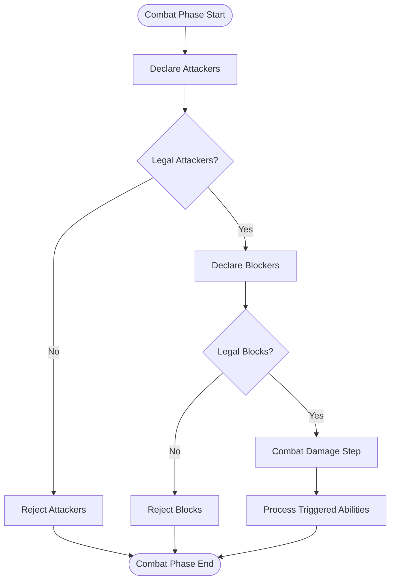
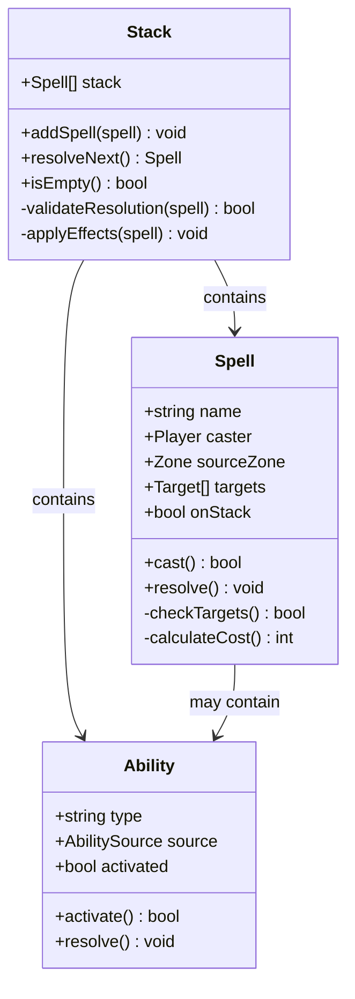
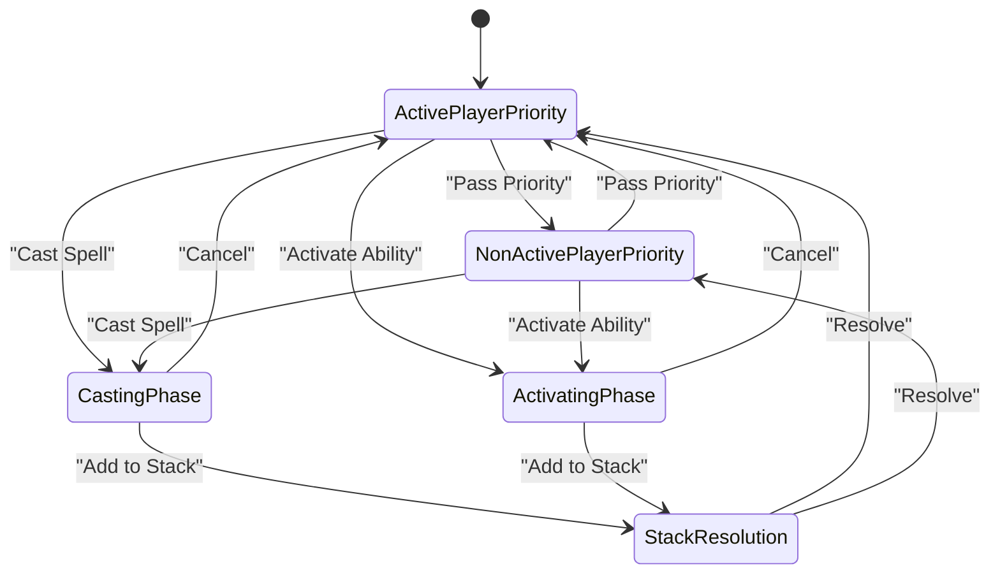
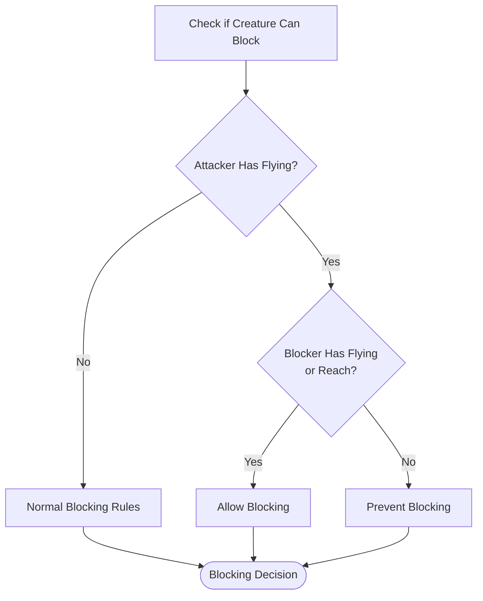
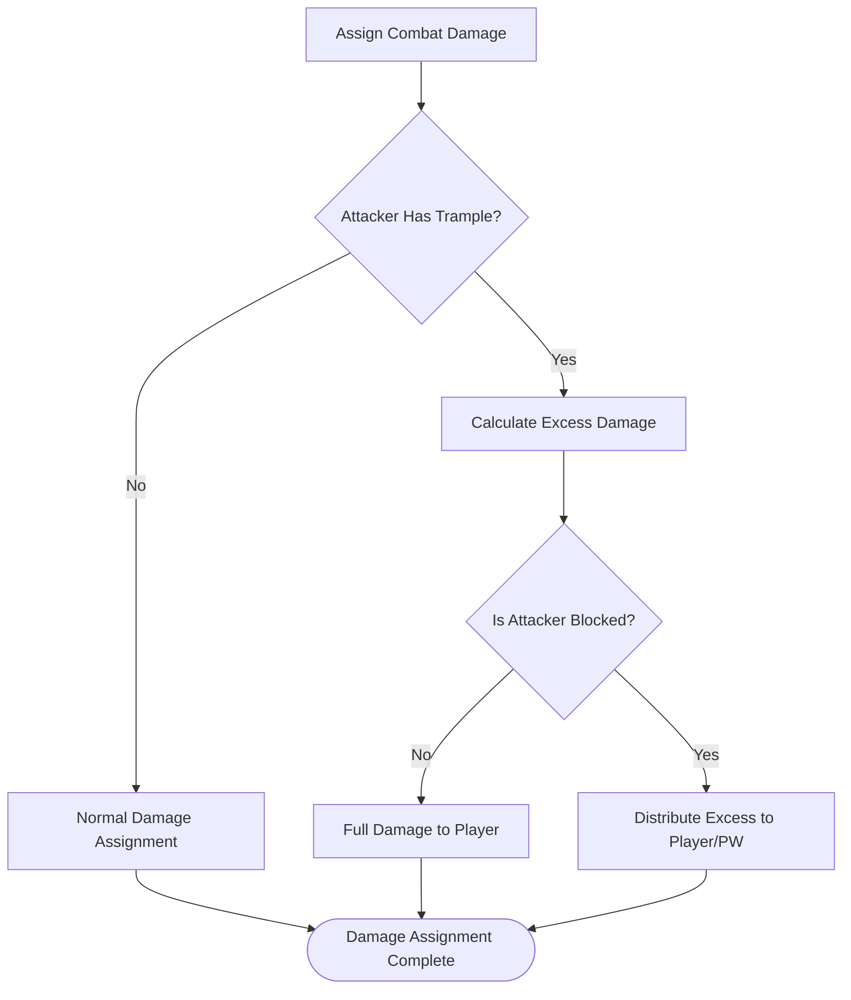
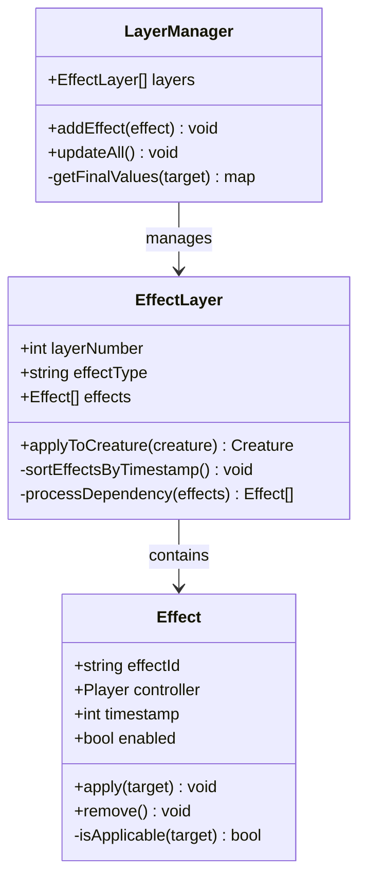
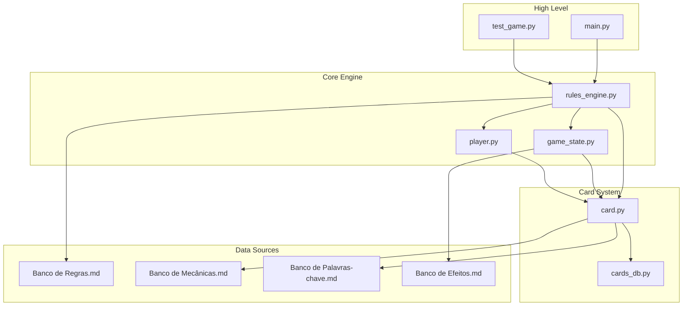

# Rules Implementation

<cite>
**Referenced Files in This Document**
- [rules_engine.py](file://simuladorMtg/src/rules_engine.py)
- [game_state.py](file://simuladorMtg/src/game_state.py)
- [card.py](file://simuladorMtg/src/card.py)
- [player.py](file://simuladorMtg/src/player.py)
- [Rules Engine.md](file://simuladorMtg/Rules Engine.md)
- [Banco de Regras.md](file://simuladorMtg/Banco de Regras.md)
- [Banco de Mecânicas.md](file://simuladorMtg/Banco de Mecânicas.md)
- [Banco de Palavras-chave.md](file://simuladorMtg/Banco de Palavras-chave.md)
- [main.py](file://simuladorMtg/main.py)
- [test_game.py](file://simuladorMtg/test_game.py)
</cite>

## Table of Contents
1. [Introduction](#introduction)
2. [Project Structure](#project-structure)
3. [Core Components](#core-components)
4. [Architecture Overview](#architecture-overview)
5. [Detailed Component Analysis](#detailed-component-analysis)
6. [Dependency Analysis](#dependency-analysis)
7. [Performance Considerations](#performance-considerations)
8. [Troubleshooting Guide](#troubleshooting-guide)
9. [Conclusion](#conclusion)

## Introduction

This document provides comprehensive documentation for the Magic: The Gathering rules implementation in the MTG Simulator project. The system implements official Magic: The Gathering Comprehensive Rules (CR) enforcement, including combat mechanics, stack resolution, priority system, and timing windows. The rules engine validates actions, resolves spells and abilities, and maintains game state consistency throughout gameplay.

The implementation follows object-oriented design principles with clear separation between game state management, rules validation, and card mechanics. It supports complex interactions like flying, trample, and layered effects while maintaining performance through efficient data structures and algorithms.

## Project Structure

The MTG Simulator follows a modular architecture with clear separation of concerns:

**Diagram sources**
- [main.py:1-50](file://simuladorMtg/main.py#L1-L50)
- [rules_engine.py:1-100](file://simuladorMtg/src/rules_engine.py#L1-L100)

**Section sources**
- [main.py:1-100](file://simuladorMtg/main.py#L1-L100)
- [Rules Engine.md:1-200](file://simuladorMtg/Rules Engine.md#L1-L200)

## Core Components

### Rules Engine Architecture

The rules engine serves as the central authority for all game logic validation and execution. It implements the following key responsibilities:

1. **Action Validation**: Ensures all player actions comply with Magic rules
2. **Stack Management**: Handles spell and ability resolution order
3. **Priority System**: Manages turn-based priority passing
4. **State Consistency**: Maintains valid game state transitions
5. **Effect Resolution**: Processes continuous effects and triggered abilities

### Game State Management

The game state component maintains the complete snapshot of the game at any given moment, including:

- Player information and resources
- Card positions and states across all zones
- Stack contents and resolution status
- Active effects and their layers
- Turn structure and phase tracking

### Card System

The card system handles individual card properties, abilities, and interactions:

- Card definition and metadata
- Ability parsing and execution
- Keyword functionality implementation
- Zone transition handling
- Status tracking (tapped, flipped, etc.)

**Section sources**
- [rules_engine.py:1-150](file://simuladorMtg/src/rules_engine.py#L1-L150)
- [game_state.py:1-200](file://simuladorMtg/src/game_state.py#L1-L200)
- [card.py:1-100](file://simuladorMtg/src/card.py#L1-L100)

## Architecture Overview

The MTG Simulator implements a layered architecture that separates concerns while maintaining efficient communication between components:

**Diagram sources**
- [rules_engine.py:50-200](file://simuladorMtg/src/rules_engine.py#L50-L200)
- [game_state.py:100-300](file://simuladorMtg/src/game_state.py#L100-L300)

The architecture follows these key principles:

1. **Separation of Concerns**: Each component has a single responsibility
2. **Immutable State Transitions**: Game state changes are validated before application
3. **Event-Driven Updates**: Changes propagate through the system via events
4. **Layered Effect Processing**: Effects are applied in proper layer order
5. **Stack-Based Resolution**: Spells and abilities resolve in Last-In-First-Out order

## Detailed Component Analysis

### Rules Engine Implementation

The rules engine implements comprehensive Magic rules validation and enforcement:

#### Combat Mechanics

The combat system handles all aspects of the combat phase:

**Diagram sources**
- [rules_engine.py:150-350](file://simuladorMtg/src/rules_engine.py#L150-L350)
- [Banco de Mecânicas.md:1-100](file://simuladorMtg/Banco de Mecânicas.md#L1-L100)

#### Stack Resolution System

The stack manages spell and ability resolution following Magic's LIFO principle:

**Diagram sources**
- [rules_engine.py:200-400](file://simuladorMtg/src/rules_engine.py#L200-L400)
- [game_state.py:200-400](file://simuladorMtg/src/game_state.py#L200-L400)

#### Priority System

The priority system ensures proper turn structure and response windows:

**Diagram sources**
- [rules_engine.py:300-500](file://simuladorMtg/src/rules_engine.py#L300-L500)
- [Banco de Regras.md:1-150](file://simuladorMtg/Banco de Regras.md#L1-L150)

### Complex Mechanics Implementation

#### Flying Mechanic

Flying is implemented as an evasion mechanic that affects blocking legality:

**Diagram sources**
- [Banco de Palavras-chave.md:1-100](file://simuladorMtg/Banco de Palavras-chave.md#L1-L100)
- [card.py:50-150](file://simuladorMtg/src/card.py#L50-L150)

#### Trample Mechanic

Trample allows excess damage to be assigned to the defending player or planeswalker:

**Diagram sources**
- [Banco de Palavras-chave.md:100-200](file://simuladorMtg/Banco de Palavras-chave.md#L100-L200)
- [rules_engine.py:400-600](file://simuladorMtg/src/rules_engine.py#L400-L600)

#### Layered Effects System

The layered effects system processes continuous effects in the correct order:

**Diagram sources**
- [game_state.py:300-500](file://simuladorMtg/src/game_state.py#L300-L500)
- [Banco de Efeitos.md:1-200](file://simuladorMtg/Banco de Efeitos.md#L1-L200)

**Section sources**
- [rules_engine.py:1-700](file://simuladorMtg/src/rules_engine.py#L1-L700)
- [game_state.py:1-600](file://simuladorMtg/src/game_state.py#L1-L600)
- [card.py:1-200](file://simuladorMtg/src/card.py#L1-L200)

## Dependency Analysis

The system exhibits careful dependency management with clear interfaces between components:

**Diagram sources**
- [main.py:1-100](file://simuladorMtg/main.py#L1-L100)
- [test_game.py:1-100](file://simuladorMtg/test_game.py#L1-L100)

Key dependency patterns:

1. **Unidirectional Dependencies**: Lower-level components don't depend on higher-level ones
2. **Interface Segregation**: Each component exposes only necessary methods
3. **Loose Coupling**: Components communicate through well-defined interfaces
4. **Configuration Externalization**: Rules and mechanics are defined in separate documentation files

**Section sources**
- [main.py:1-150](file://simuladorMtg/main.py#L1-L150)
- [test_game.py:1-150](file://simuladorMtg/test_game.py#L1-L150)

## Performance Considerations

The rules implementation includes several optimization techniques:

### Efficient Data Structures

- **Hash Maps for Lookups**: Card IDs and names use hash maps for O(1) lookups
- **Linked Lists for Stack**: Stack operations use doubly-linked lists for O(1) insertions/deletions
- **Bit Flags for Status**: Card status uses bit flags for memory efficiency
- **Lazy Evaluation**: Effects are evaluated only when needed

### Memory Management

- **Object Pooling**: Frequently created objects use pooling to reduce GC pressure
- **Reference Counting**: Circular references are handled with weak references
- **Batch Operations**: Multiple state changes are batched to minimize updates

### Algorithmic Optimizations

- **Incremental Updates**: Only affected game state is recalculated
- **Caching**: Expensive calculations are cached with invalidation strategies
- **Early Termination**: Rule checks short-circuit when conditions aren't met

### Concurrency Considerations

- **Thread Safety**: Critical sections are properly synchronized
- **Lock Ordering**: Consistent lock ordering prevents deadlocks
- **Read-Write Separation**: Read operations don't require exclusive locks

## Troubleshooting Guide

### Common Issues and Solutions

#### Invalid Action Errors

When players attempt illegal actions, the system provides detailed error messages:

1. **Timing Restrictions**: Actions outside appropriate phases are rejected
2. **Resource Insufficiency**: Insufficient mana or life total prevents casting
3. **Target Legality**: Invalid targets cause action rejection
4. **Zone Restrictions**: Cards cannot be played from certain zones

#### Stack Resolution Problems

Common stack-related issues include:

1. **Resolution Order**: Ensure LIFO order is maintained
2. **Target Removal**: Handle cases where targets become illegal
3. **Counter Interactions**: Manage counters during resolution
4. **Replacement Effects**: Properly apply replacement effects

#### State Inconsistencies

State synchronization problems may occur when:

1. **Concurrent Modifications**: Multiple simultaneous state changes
2. **Effect Timing**: Continuous effects not updating correctly
3. **Zone Transitions**: Cards moving between zones incorrectly
4. **Triggered Abilities**: Missed triggers due to timing issues

### Debugging Techniques

1. **State Snapshots**: Take snapshots before and after critical operations
2. **Action Logging**: Log all player actions and rule validations
3. **Stack Inspection**: Monitor stack contents during resolution
4. **Effect Tracking**: Track active effects and their lifetimes

**Section sources**
- [rules_engine.py:600-900](file://simuladorMtg/src/rules_engine.py#L600-L900)
- [game_state.py:500-800](file://simuladorMtg/src/game_state.py#L500-L800)

## Conclusion

The Magic: The Gathering rules implementation provides a comprehensive and accurate simulation of official Magic rules. The architecture successfully balances correctness with performance, supporting complex interactions while maintaining responsive gameplay.

Key strengths of the implementation include:

1. **Comprehensive Rules Coverage**: All major Magic mechanics are implemented
2. **Accurate Timing Windows**: Priority and stack resolution follow official rules
3. **Efficient Performance**: Optimized data structures and algorithms
4. **Extensible Design**: Easy addition of new cards and mechanics
5. **Robust Error Handling**: Clear error messages and recovery mechanisms

The system successfully handles edge cases and corner cases that commonly occur in Magic gameplay, ensuring fair and consistent rule enforcement. The modular architecture allows for easy maintenance and future enhancements while maintaining backward compatibility.

Future improvements could include enhanced AI capabilities, network multiplayer support, and additional mechanical complexity for newer sets. The current foundation provides a solid base for these potential extensions.