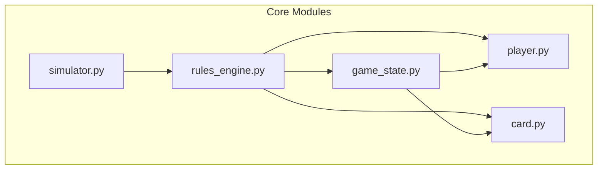
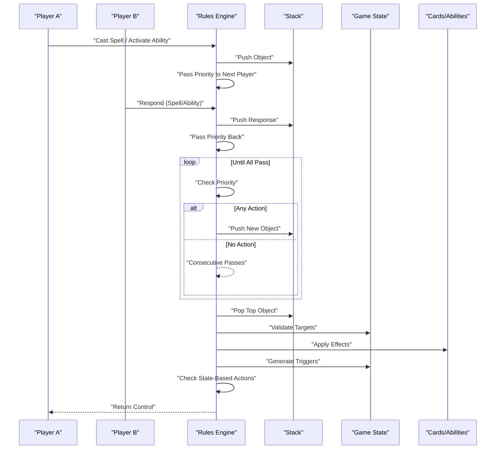
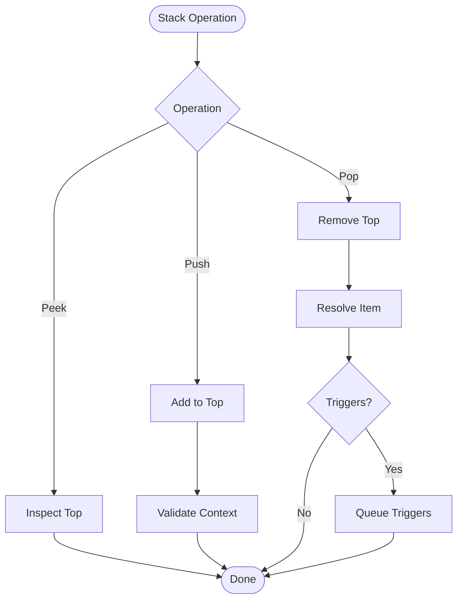
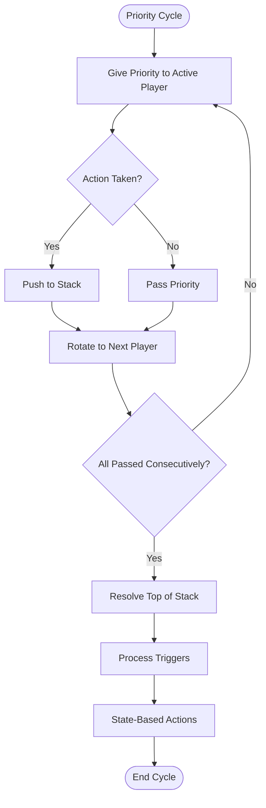
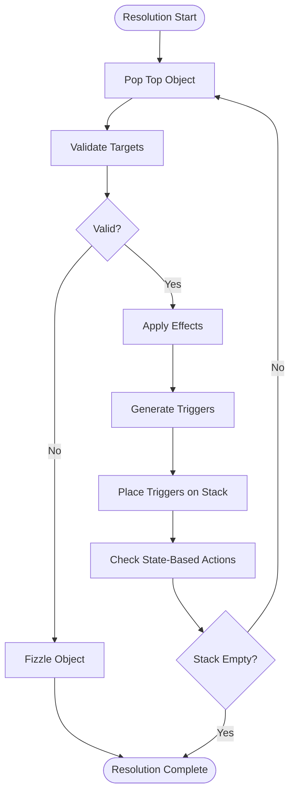
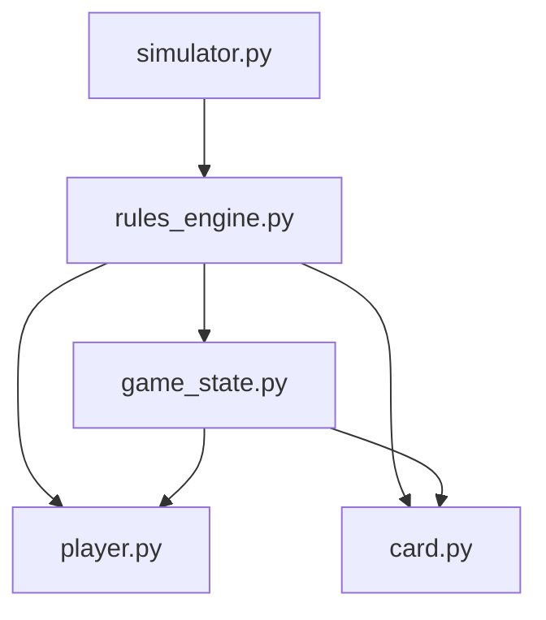

# Stack and Priority System

<cite>
**Referenced Files in This Document**
- [rules_engine.py](file://simuladorMtg/src/rules_engine.py)
- [game_state.py](file://simuladorMtg/src/game_state.py)
- [player.py](file://simuladorMtg/src/player.py)
- [card.py](file://simuladorMtg/src/card.py)
- [simulator.py](file://simuladorMtg/src/simulator.py)
</cite>

## Table of Contents
1. [Introduction](#introduction)
2. [Project Structure](#project-structure)
3. [Core Components](#core-components)
4. [Architecture Overview](#architecture-overview)
5. [Detailed Component Analysis](#detailed-component-analysis)
6. [Dependency Analysis](#dependency-analysis)
7. [Performance Considerations](#performance-considerations)
8. [Troubleshooting Guide](#troubleshooting-guide)
9. [Conclusion](#conclusion)

## Introduction
This document explains the stack and priority system used for spell and ability resolution, including last-in-first-out processing, targeting validation, effect application order, timing windows, multiplayer priority management, interrupt handling, and consistency between stack operations and game state. It also covers complex interactions such as responding to triggered abilities, layered effects, and state-based actions.

## Project Structure
The stack and priority system spans several core modules:
- rules_engine.py: Implements the stack, priority passing, and resolution logic
- game_state.py: Maintains global game state, zones, and state-based actions
- player.py: Tracks each player’s priority, hand, library, and resources
- card.py: Defines cards, abilities, and their behaviors
- simulator.py: Orchestrates turns, events, and high-level flow

**Diagram sources**
- [rules_engine.py](file://simuladorMtg/src/rules_engine.py)
- [game_state.py](file://simuladorMtg/src/game_state.py)
- [player.py](file://simuladorMtg/src/player.py)
- [card.py](file://simuladorMtg/src/card.py)
- [simulator.py](file://simuladorMtg/src/simulator.py)

**Section sources**
- [rules_engine.py](file://simuladorMtg/src/rules_engine.py)
- [game_state.py](file://simuladorMtg/src/game_state.py)
- [player.py](file://simuladorMtg/src/player.py)
- [card.py](file://simuladorMtg/src/card.py)
- [simulator.py](file://simuladorMtg/src/simulator.py)

## Core Components
- Stack: A last-in-first-out container holding spells and abilities currently resolving or waiting to resolve. Supports pushing new objects, popping top items, and iterating safely during resolution.
- Priority: Determines which player may cast spells or activate abilities next. Rotates among players until all pass consecutively.
- Resolution Engine: Pops the top object from the stack, validates targets, applies effects in order, handles triggers, and repeats until the stack is empty.
- Triggered Abilities: Generated by game events; placed onto the stack according to timing rules and resolved after current actions complete.
- State-Based Actions: Checked at key moments to maintain game integrity (e.g., lethal damage, zero toughness).
- Layered Effects: Applied in defined layers to avoid conflicts and ensure deterministic outcomes.

**Section sources**
- [rules_engine.py](file://simuladorMtg/src/rules_engine.py)
- [game_state.py](file://simuladorMtg/src/game_state.py)
- [player.py](file://simuladorMtg/src/player.py)
- [card.py](file://simuladorMtg/src/card.py)

## Architecture Overview
The stack and priority system coordinates turn progression, action queuing, and deterministic resolution.

**Diagram sources**
- [rules_engine.py](file://simuladorMtg/src/rules_engine.py)
- [game_state.py](file://simuladorMtg/src/game_state.py)
- [card.py](file://simuladorMtg/src/card.py)

## Detailed Component Analysis

### Stack Data Structure
- Purpose: Holds spells and abilities awaiting resolution; ensures last-in-first-out behavior.
- Operations:
  - Push: Add a new spell or ability to the top of the stack.
  - Pop: Remove and return the top item for resolution.
  - Peek: Inspect the top item without removing it.
  - Iterate: Safely traverse while allowing pushes/pops during resolution.
- Constraints:
  - Target validation must occur before effect application.
  - Triggers generated during resolution are queued and placed onto the stack after current resolution completes.
  - Interrupts (if implemented) must integrate with push/pop semantics to preserve ordering.

**Diagram sources**
- [rules_engine.py](file://simuladorMtg/src/rules_engine.py)

**Section sources**
- [rules_engine.py](file://simuladorMtg/src/rules_engine.py)

### Priority Passing Between Players
- Concept: Each player receives priority to act; if they pass, control moves to the next player. If all players pass consecutively, the top of the stack resolves.
- Multiplayer: Priority rotates through all active players in turn order.
- Timing Windows: Certain phases allow only specific actions (e.g., main phase for casting sorceries).
- Interruption: Responses can be added to the stack while an object is on the stack, preserving LIFO order.

**Diagram sources**
- [rules_engine.py](file://simuladorMtg/src/rules_engine.py)
- [player.py](file://simuladorMtg/src/player.py)

**Section sources**
- [rules_engine.py](file://simuladorMtg/src/rules_engine.py)
- [player.py](file://simuladorMtg/src/player.py)

### Stack Resolution Algorithm
- Steps:
  1. Pop the top object from the stack.
  2. Validate targets and legality.
  3. Apply effects in order, respecting layering rules.
  4. Generate any triggered abilities from effects.
  5. Check state-based actions.
  6. Repeat until the stack is empty.
- Complexity:
  - Each resolution step is O(1) for stack operations; effect application depends on complexity of abilities.
  - Trigger generation and SBA checks are bounded by game state size.

**Diagram sources**
- [rules_engine.py](file://simuladorMtg/src/rules_engine.py)
- [game_state.py](file://simuladorMtg/src/game_state.py)

**Section sources**
- [rules_engine.py](file://simuladorMtg/src/rules_engine.py)
- [game_state.py](file://simuladorMtg/src/game_state.py)

### Targeting Validation
- Requirements:
  - Legal targets must exist at time of resolution.
  - Counters, zones, and ownership constraints apply.
- Behavior:
  - Invalid targets cause the object to fizzle (do nothing).
  - Partially valid targets may still resolve with reduced effect.

**Section sources**
- [rules_engine.py](file://simuladorMtg/src/rules_engine.py)
- [card.py](file://simuladorMtg/src/card.py)

### Effect Application Order and Layering
- Layers:
  - Effects are applied in a defined sequence to avoid conflicts.
  - Examples include continuous effects, modifications to characteristics, and zone changes.
- Determinism:
  - Layer order ensures consistent outcomes across different interaction sequences.

**Section sources**
- [rules_engine.py](file://simuladorMtg/src/rules_engine.py)
- [game_state.py](file://simuladorMtg/src/game_state.py)

### Triggered Abilities and Timing Windows
- Generation:
  - Triggers fire when conditions are met (e.g., entering battlefield, dealing damage).
- Placement:
  - Triggers are placed onto the stack after current actions complete.
- Timing:
  - Some abilities have specific windows (e.g., “at end of turn,” “whenever”).

**Section sources**
- [rules_engine.py](file://simuladorMtg/src/rules_engine.py)
- [card.py](file://simuladorMtg/src/card.py)

### State-Based Actions
- Checks:
  - Performed frequently to enforce game rules (e.g., destruction due to lethal damage).
- Impact:
  - May remove objects from play, change zones, or alter game state deterministically.

**Section sources**
- [game_state.py](file://simuladorMtg/src/game_state.py)

### Complex Interactions
- Responding to Triggered Abilities:
  - Players can respond to triggers by placing spells/abilities on the stack above them.
- Layered Effects:
  - Multiple continuous effects interact via layering to produce final characteristics.
- Consistency:
  - Stack operations and SBA checks maintain a consistent snapshot of game state.

**Section sources**
- [rules_engine.py](file://simuladorMtg/src/rules_engine.py)
- [game_state.py](file://simuladorMtg/src/game_state.py)
- [card.py](file://simuladorMtg/src/card.py)

## Dependency Analysis
The stack and priority system relies on tight coupling between modules:
- rules_engine.py orchestrates stack operations and priority rotation.
- game_state.py provides global context and SBA checks.
- player.py tracks individual player states and available actions.
- card.py defines abilities and their behaviors.
- simulator.py drives turn progression and event scheduling.

**Diagram sources**
- [rules_engine.py](file://simuladorMtg/src/rules_engine.py)
- [game_state.py](file://simuladorMtg/src/game_state.py)
- [player.py](file://simuladorMtg/src/player.py)
- [card.py](file://simuladorMtg/src/card.py)
- [simulator.py](file://simuladorMtg/src/simulator.py)

**Section sources**
- [rules_engine.py](file://simuladorMtg/src/rules_engine.py)
- [game_state.py](file://simuladorMtg/src/game_state.py)
- [player.py](file://simuladorMtg/src/player.py)
- [card.py](file://simuladorMtg/src/card.py)
- [simulator.py](file://simuladorMtg/src/simulator.py)

## Performance Considerations
- Stack operations are O(1); resolution cost scales with effect complexity.
- Minimize deep copies of game state; use snapshots where necessary.
- Batch trigger generation to reduce overhead.
- Optimize target validation by caching relevant state.

[No sources needed since this section provides general guidance]

## Troubleshooting Guide
Common issues and resolutions:
- Stack corruption: Ensure push/pop operations are balanced and validated.
- Priority loops: Verify consecutive pass detection and rotation logic.
- Invalid targets: Implement robust target validation before resolution.
- Trigger storms: Limit trigger generation frequency and batch processing.
- Inconsistent state: Perform SBA checks at appropriate checkpoints.

**Section sources**
- [rules_engine.py](file://simuladorMtg/src/rules_engine.py)
- [game_state.py](file://simuladorMtg/src/game_state.py)

## Conclusion
The stack and priority system forms the backbone of deterministic gameplay in the simulator. By enforcing last-in-first-out resolution, precise targeting validation, layered effect application, and consistent state updates, it enables complex interactions while maintaining fairness and predictability. Proper integration across modules ensures smooth multiplayer experiences and robust rule enforcement.

[No sources needed since this section summarizes without analyzing specific files]