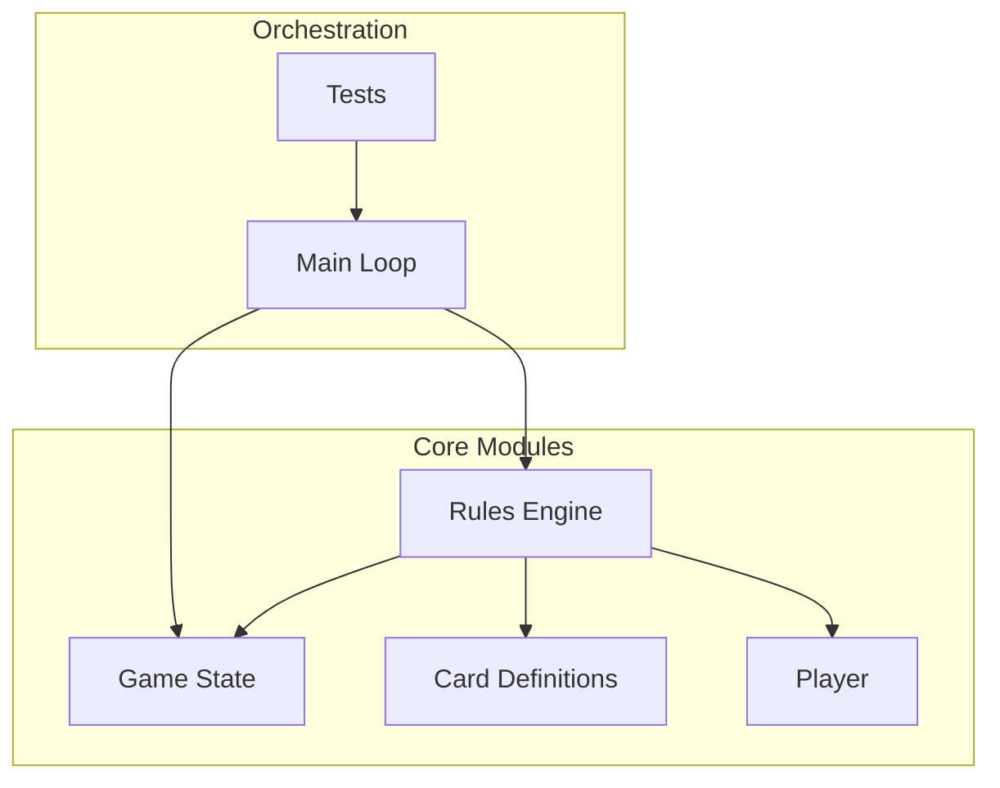
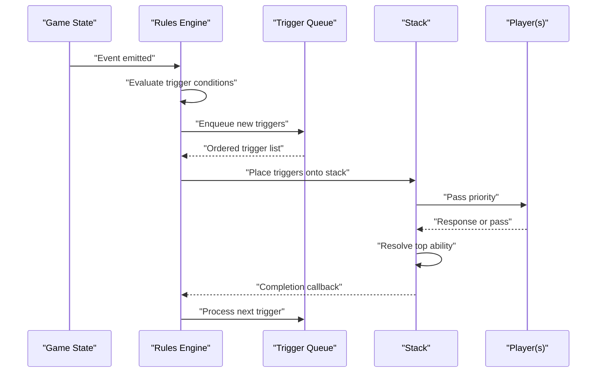
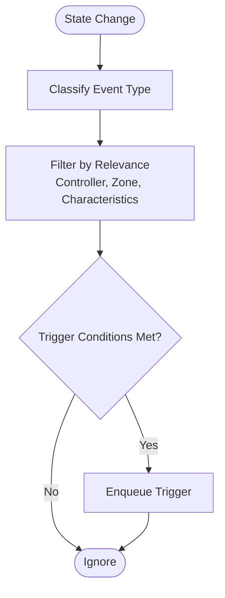
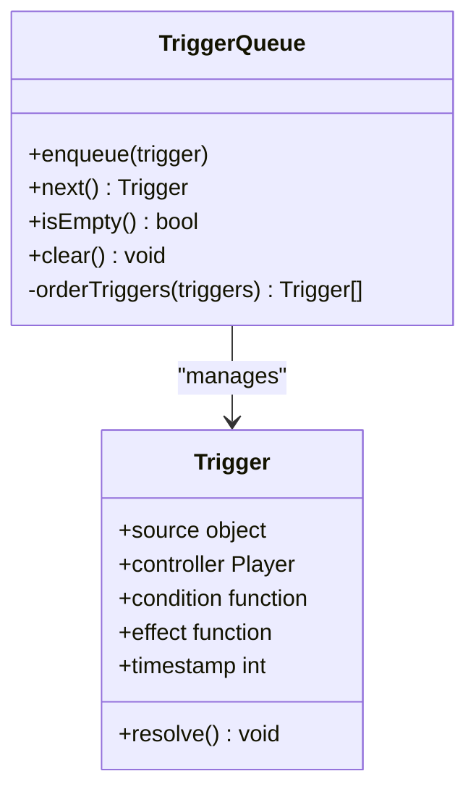
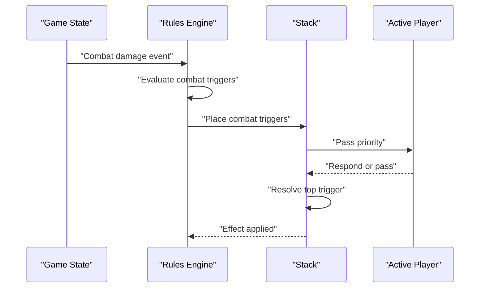
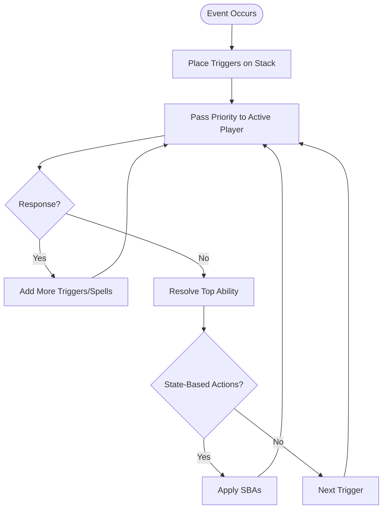
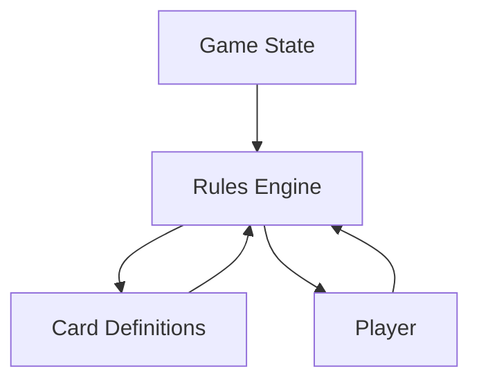

# Triggered Abilities System

<cite>
**Referenced Files in This Document**
- [rules_engine.py](file://simuladorMtg/src/rules_engine.py)
- [game_state.py](file://simuladorMtg/src/game_state.py)
- [card.py](file://simuladorMtg/src/card.py)
- [player.py](file://simuladorMtg/src/player.py)
- [main.py](file://simuladorMtg/main.py)
- [test_game.py](file://simuladorMtg/test_game.py)
</cite>

## Table of Contents
1. [Introduction](#introduction)
2. [Project Structure](#project-structure)
3. [Core Components](#core-components)
4. [Architecture Overview](#architecture-overview)
5. [Detailed Component Analysis](#detailed-component-analysis)
6. [Dependency Analysis](#dependency-analysis)
7. [Performance Considerations](#performance-considerations)
8. [Troubleshooting Guide](#troubleshooting-guide)
9. [Conclusion](#conclusion)

## Introduction
This document explains the triggered abilities system used by the simulator, focusing on how game state changes are detected, how triggers are queued and resolved, and how different trigger types behave. It also covers interactions with the stack and priority handling, plus performance considerations for monitoring large game states.

## Project Structure
The triggered abilities system is implemented across several core modules that coordinate event detection, ability management, and resolution timing:
- Game state holds the authoritative snapshot of the game and exposes change notifications.
- Rules engine centralizes rule processing, including trigger detection and resolution.
- Card definitions include ability metadata and trigger conditions.
- Player objects manage per-player queues and priorities during resolution.
- Main loop orchestrates turns and phases, driving state transitions that may produce triggers.
- Tests validate behavior across complex scenarios.

[No sources needed since this diagram shows conceptual workflow, not actual code structure]

## Core Components
- Event Detection: Monitors specific game state changes (e.g., creatures dying, combat damage dealt, intervals passing).
- Trigger Queue: Collects newly created triggered abilities in a deterministic order.
- Resolution Timing: Applies timing rules per trigger type and integrates with the stack and priority system.
- Stack Integration: Triggers are placed onto the stack and resolve according to MTG-like ordering and priority.
- Performance Monitoring: Efficiently tracks relevant events without scanning entire game state each turn.

Key responsibilities:
- Detecting precise events and filtering by controller, zone, and object properties.
- Ordering triggers consistently (APNAP, then timestamp/stack order).
- Resolving triggers while respecting continuous effects and state-based actions.
- Supporting multiple trigger types with distinct timing windows.

**Section sources**
- [rules_engine.py](file://simuladorMtg/src/rules_engine.py)
- [game_state.py](file://simuladorMtg/src/game_state.py)
- [card.py](file://simuladorMtg/src/card.py)
- [player.py](file://simuladorMtg/src/player.py)

## Architecture Overview
The system follows an event-driven architecture:
- Game state emits events upon mutations.
- Rules engine subscribes to these events, evaluates trigger conditions, and enqueues triggers.
- A dedicated resolution phase processes the trigger queue, placing abilities onto the stack and resolving them with proper priority handling.
- Continuous effects are re-evaluated at appropriate times to ensure correct behavior.

**Diagram sources**
- [rules_engine.py](file://simuladorMtg/src/rules_engine.py)
- [game_state.py](file://simuladorMtg/src/game_state.py)

## Detailed Component Analysis

### Event Detection Mechanism
- Monitors discrete state changes such as:
  - Objects moving between zones (e.g., graveyard entry, exile, battlefield).
  - Damage events (combat and non-combat).
  - Death and destruction events.
  - Phase and step transitions.
  - Interval ticks for periodic triggers.
- Filters events by relevance:
  - Controller ownership.
  - Object types and characteristics.
  - Zone-specific constraints.
- Uses efficient indexing to avoid full scans:
  - Per-zone lists.
  - Characteristic indexes (type, color, power/toughness).
  - Event-specific watchers.

**Section sources**
- [game_state.py](file://simuladorMtg/src/game_state.py)
- [rules_engine.py](file://simuladorMtg/src/rules_engine.py)

### Ability Queue Management
- Creation Order:
  - Deterministic ordering based on active player first (AP), then non-active player (NP).
  - Within each player, order by timestamp or stack insertion order.
- Priority Handling:
  - After placing triggers, priority passes to players who may respond.
  - Responses can add more triggers, which are interleaved correctly.
- Resolution:
  - Top-of-stack resolves first; last-in-first-out within same layer.
  - Continuous effects rechecked before resolution steps where necessary.

**Diagram sources**
- [rules_engine.py](file://simuladorMtg/src/rules_engine.py)
- [player.py](file://simuladorMtg/src/player.py)

**Section sources**
- [rules_engine.py](file://simuladorMtg/src/rules_engine.py)
- [player.py](file://simuladorMtg/src/player.py)

### Resolution Timing and Trigger Types
- Whenever triggers:
  - Fire whenever their condition occurs; added to the stack immediately after the event completes.
  - Example: "Whenever a creature dies, draw a card."
- When triggers:
  - Similar to whenever but often tied to specific events like combat damage or spell resolution.
  - Example: "When this creature deals combat damage, destroy target blocker."
- At triggers:
  - Fire at defined game steps/phases (beginning, upkeep, end).
  - Example: "At the beginning of your upkeep, draw a card."
- Continuous triggers:
  - Always-on conditions that modify behavior or provide ongoing effects.
  - Evaluated continuously or at key moments to maintain correctness.

Timing rules:
- APNAP order ensures fairness and determinism.
- Same-controller triggers resolve in reverse order of creation.
- Interleaving with responses maintains stack integrity.

**Section sources**
- [rules_engine.py](file://simuladorMtg/src/rules_engine.py)
- [card.py](file://simuladorMtg/src/card.py)

### Complex Trigger Examples
- Death Triggers:
  - Detect object leaving battlefield to graveyard.
  - Resolve effects like drawing cards or creating tokens.
  - Ensure state-based actions do not interfere prematurely.
- Combat Triggers:
  - Fire upon damage assignment or combat damage events.
  - Handle blockers, trample, and double strike nuances.
  - Respect priority for responses like removal or counterspells.
- Interval-Based Triggers:
  - Tick-based or phase-based triggers.
  - Must be scheduled reliably across turns and phases.
  - Avoid drift due to skipped turns or phase changes.

**Diagram sources**
- [rules_engine.py](file://simuladorMtg/src/rules_engine.py)
- [game_state.py](file://simuladorMtg/src/game_state.py)

**Section sources**
- [rules_engine.py](file://simuladorMtg/src/rules_engine.py)
- [card.py](file://simuladorMtg/src/card.py)

### Interaction with the Stack and Priority
- Placement:
  - Triggers are placed onto the stack after the triggering event finishes.
  - Order determined by APNAP and creation timestamp.
- Priority:
  - Active player receives priority first; they may cast spells or activate abilities.
  - Non-active player gets priority next; responses can chain additional triggers.
- Resolution:
  - Last-in-first-out; topmost ability resolves completely before the next.
  - State-based actions checked at appropriate points to prevent invalid states.

**Section sources**
- [rules_engine.py](file://simuladorMtg/src/rules_engine.py)
- [player.py](file://simuladorMtg/src/player.py)

## Dependency Analysis
- Game State depends on:
  - Zone definitions and object lifecycles.
  - Event emission hooks for all mutable aspects.
- Rules Engine depends on:
  - Card definitions for ability metadata.
  - Player objects for priority and control.
  - Stack abstraction for ordered resolution.
- Cards depend on:
  - Rules engine for effect execution.
  - Game state for querying current context.

**Diagram sources**
- [game_state.py](file://simuladorMtg/src/game_state.py)
- [rules_engine.py](file://simuladorMtg/src/rules_engine.py)
- [card.py](file://simuladorMtg/src/card.py)
- [player.py](file://simuladorMtg/src/player.py)

**Section sources**
- [game_state.py](file://simuladorMtg/src/game_state.py)
- [rules_engine.py](file://simuladorMtg/src/rules_engine.py)
- [card.py](file://simuladorMtg/src/card.py)
- [player.py](file://simuladorMtg/src/player.py)

## Performance Considerations
- Event Indexing:
  - Maintain per-zone and per-characteristic indexes to quickly find relevant objects.
  - Use event-specific watchers to avoid scanning unrelated areas.
- Batch Processing:
  - Group state changes into batches to minimize repeated evaluations.
  - Defer expensive checks until necessary.
- Lazy Evaluation:
  - Evaluate trigger conditions lazily to reduce overhead.
  - Cache results where safe and valid.
- Memory Management:
  - Clean up resolved triggers promptly.
  - Avoid retaining references to removed objects.

[No sources needed since this section provides general guidance]

## Troubleshooting Guide
Common issues and resolutions:
- Missed Triggers:
  - Verify event emission paths and watcher registration.
  - Ensure filters match expected controller and zone.
- Incorrect Order:
  - Confirm APNAP ordering and timestamp consistency.
  - Check for unintended modifications to creation order.
- Stack Corruption:
  - Validate placement and resolution logic.
  - Ensure priority passes occur at correct boundaries.
- Performance Regression:
  - Profile event handlers and condition evaluations.
  - Introduce caching or batching where applicable.

**Section sources**
- [rules_engine.py](file://simuladorMtg/src/rules_engine.py)
- [game_state.py](file://simuladorMtg/src/game_state.py)
- [test_game.py](file://simuladorMtg/test_game.py)

## Conclusion
The triggered abilities system combines robust event detection, deterministic queue management, and precise resolution timing to emulate MTG mechanics accurately. By leveraging efficient indexing, careful priority handling, and clear separation of concerns, the system scales well even with large game states. Proper testing and profiling ensure reliability and performance under complex scenarios.

[No sources needed since this section summarizes without analyzing specific files]