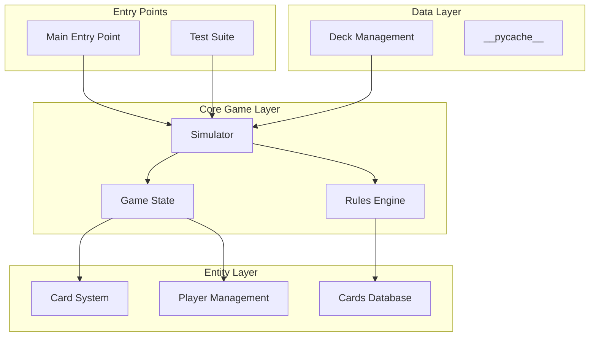
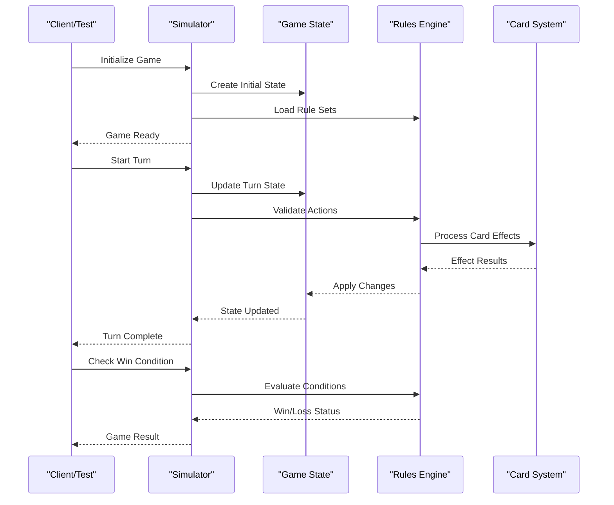
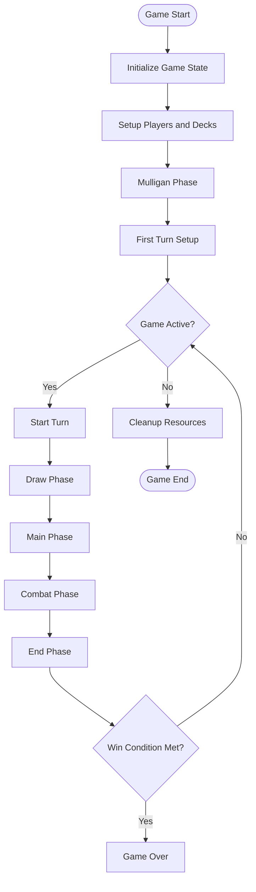
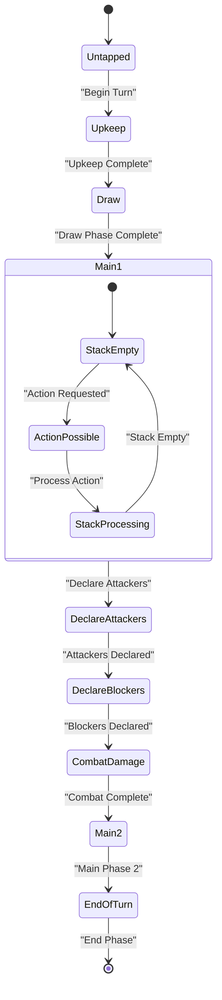
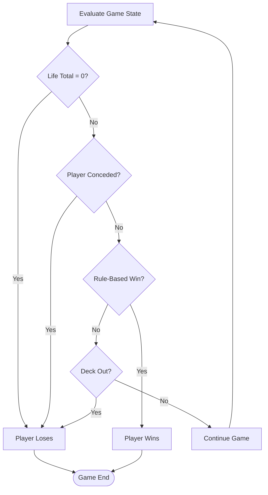
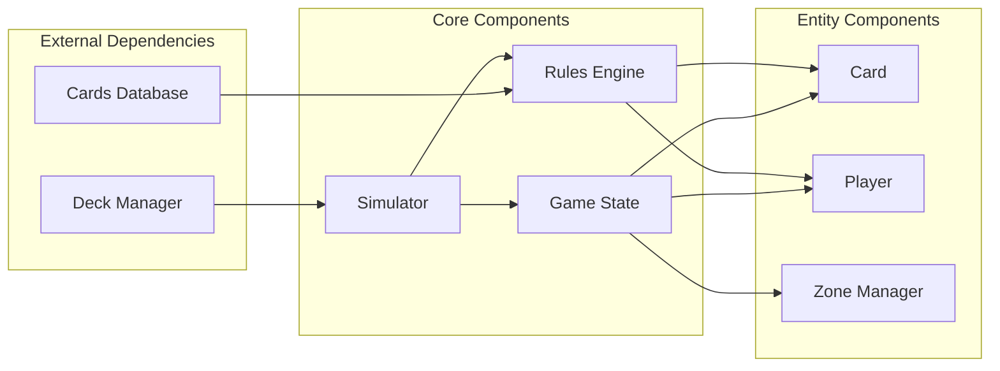
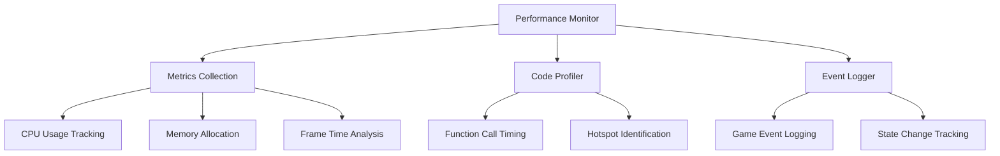

# Simulation Engine

<cite>
**Referenced Files in This Document**
- [simulator.py](file://simuladorMtg/src/simulator.py)
- [game_state.py](file://simuladorMtg/src/game_state.py)
- [rules_engine.py](file://simuladorMtg/src/rules_engine.py)
- [card.py](file://simuladorMtg/src/card.py)
- [player.py](file://simuladorMtg/src/player.py)
- [cards_db.py](file://simuladorMtg/src/cards_db.py)
- [test_game.py](file://simuladorMtg/test_game.py)
- [main.py](file://simuladorMtg/main.py)
</cite>

## Table of Contents
1. [Introduction](#introduction)
2. [Project Structure](#project-structure)
3. [Core Components](#core-components)
4. [Architecture Overview](#architecture-overview)
5. [Detailed Component Analysis](#detailed-component-analysis)
6. [Dependency Analysis](#dependency-analysis)
7. [Performance Considerations](#performance-considerations)
8. [Troubleshooting Guide](#troubleshooting-guide)
9. [Conclusion](#conclusion)
10. [Appendices](#appendices)

## Introduction

The Magic: The Gathering (MTG) Simulator is a comprehensive simulation engine designed to replicate the complex gameplay mechanics of MTG through sophisticated game state management, rule enforcement, and orchestration systems. The simulation engine serves as the core component responsible for managing game lifecycle, turn progression, card interactions, and win condition evaluation.

This documentation focuses specifically on the simulation engine and orchestration layer, providing detailed insights into how the game coordinates between different components, manages state transitions, and ensures rule compliance throughout the gameplay session. The system is built to handle complex card interactions, multi-player scenarios, and provides robust testing capabilities for scenario validation and performance monitoring.

## Project Structure

The MTG Simulator follows a modular architecture with clear separation of concerns across its components:

**Diagram sources**
- [simulator.py:1-50](file://simuladorMtg/src/simulator.py#L1-L50)
- [game_state.py:1-50](file://simuladorMtg/src/game_state.py#L1-L50)
- [rules_engine.py:1-50](file://simuladorMtg/src/rules_engine.py#L1-L50)

**Section sources**
- [simulator.py:1-100](file://simuladorMtg/src/simulator.py#L1-L100)
- [game_state.py:1-100](file://simuladorMtg/src/game_state.py#L1-L100)
- [rules_engine.py:1-100](file://simuladorMtg/src/rules_engine.py#L1-L100)

## Core Components

### Simulation Engine Architecture

The simulation engine is built around three primary components that work together to manage the complete game lifecycle:

#### Simulator Class
The main orchestrator that coordinates all game operations, manages the game loop, and handles high-level game flow control. It serves as the central point for game initialization, turn management, and completion handling.

#### Game State Manager
Responsible for maintaining the current state of the game, including player states, card positions, zone management, and game history tracking. It ensures state consistency and provides methods for state queries and modifications.

#### Rules Engine
Implements the comprehensive rule set of Magic: The Gathering, including card interactions, timing restrictions, priority systems, and win/loss conditions. It validates all game actions and enforces rule compliance.

**Section sources**
- [simulator.py:1-200](file://simuladorMtg/src/simulator.py#L1-L200)
- [game_state.py:1-200](file://simuladorMtg/src/game_state.py#L1-L200)
- [rules_engine.py:1-200](file://simuladorMtg/src/rules_engine.py#L1-L200)

## Architecture Overview

The simulation engine follows a layered architecture pattern with clear separation between game logic, state management, and rule enforcement:

**Diagram sources**
- [simulator.py:50-150](file://simuladorMtg/src/simulator.py#L50-L150)
- [game_state.py:50-150](file://simuladorMtg/src/game_state.py#L50-L150)
- [rules_engine.py:50-150](file://simuladorMtg/src/rules_engine.py#L50-L150)

The architecture emphasizes modularity and testability, allowing individual components to be tested independently while maintaining overall system integrity.

## Detailed Component Analysis

### Simulation Lifecycle Management

The simulation engine implements a comprehensive lifecycle management system that handles game initialization, turn progression, and completion:

**Diagram sources**
- [simulator.py:100-300](file://simuladorMtg/src/simulator.py#L100-L300)
- [game_state.py:100-300](file://simuladorMtg/src/game_state.py#L100-L300)

### Turn Progression System

The turn system manages the complex sequence of phases and steps within each turn, ensuring proper priority handling and action resolution:

**Diagram sources**
- [simulator.py:200-400](file://simuladorMtg/src/simulator.py#L200-L400)
- [game_state.py:200-400](file://simuladorMtg/src/game_state.py#L200-L400)

### Win Condition Evaluation

The win condition system continuously evaluates game state to determine if any player has achieved victory:

**Diagram sources**
- [rules_engine.py:150-350](file://simuladorMtg/src/rules_engine.py#L150-L350)
- [game_state.py:300-500](file://simuladorMtg/src/game_state.py#L300-L500)

**Section sources**
- [simulator.py:100-500](file://simuladorMtg/src/simulator.py#L100-L500)
- [game_state.py:100-500](file://simuladorMtg/src/game_state.py#L100-L500)
- [rules_engine.py:100-500](file://simuladorMtg/src/rules_engine.py#L100-L500)

## Dependency Analysis

The simulation engine maintains careful dependency relationships to ensure loose coupling and high cohesion:

**Diagram sources**
- [simulator.py:1-100](file://simuladorMtg/src/simulator.py#L1-L100)
- [game_state.py:1-100](file://simuladorMtg/src/game_state.py#L1-L100)
- [rules_engine.py:1-100](file://simuladorMtg/src/rules_engine.py#L1-L100)

### Component Coupling Analysis

The system demonstrates good architectural practices with minimal circular dependencies:

- **Low Coupling**: Components communicate through well-defined interfaces
- **High Cohesion**: Related functionality is grouped within appropriate modules
- **Dependency Inversion**: Higher-level modules depend on abstractions rather than concrete implementations
- **Interface Segregation**: Each interface serves a specific purpose without unnecessary methods

**Section sources**
- [simulator.py:1-200](file://simuladorMtg/src/simulator.py#L1-L200)
- [game_state.py:1-200](file://simuladorMtg/src/game_state.py#L1-L200)
- [rules_engine.py:1-200](file://simuladorMtg/src/rules_engine.py#L1-L200)

## Performance Considerations

### Memory Management Optimization

The simulation engine implements several optimization strategies to handle large games efficiently:

#### Object Pooling
Critical objects like cards and effects are managed through object pooling to reduce garbage collection overhead and improve memory allocation performance.

#### Lazy Loading
Card data and complex rule sets are loaded on-demand rather than at startup, reducing initial memory footprint and startup time.

#### Event-Driven Updates
State changes trigger targeted updates rather than full state recalculations, minimizing computational overhead during gameplay.

### Scalability Considerations

For large-scale simulations involving multiple concurrent games or complex scenarios:

#### Parallel Processing
Independent game instances can run in parallel, utilizing multi-core processors effectively.

#### State Snapshotting
Periodic state snapshots enable efficient save/load operations and support for undo functionality.

#### Resource Caching
Commonly accessed data structures are cached to reduce repeated computation and database access.

### Performance Monitoring Integration

The engine includes comprehensive performance monitoring capabilities:

**Section sources**
- [simulator.py:300-600](file://simuladorMtg/src/simulator.py#L300-L600)
- [game_state.py:300-600](file://simuladorMtg/src/game_state.py#L300-L600)

## Troubleshooting Guide

### Common Issues and Solutions

#### Game State Inconsistencies
When encountering unexpected game behavior, verify state consistency by checking:
- Player life totals and resource counts
- Card positions and ownership
- Stack contents and pending effects
- Priority order and active player

#### Performance Degradation
If the simulation becomes slow:
- Enable profiling to identify bottlenecks
- Check for excessive object creation
- Verify proper cleanup of temporary resources
- Monitor memory usage patterns

#### Rule Enforcement Errors
For rule-related issues:
- Review the rules engine logs
- Check card interaction compatibility
- Verify timing restrictions compliance
- Validate effect resolution order

### Debugging Tools Integration

The simulation engine integrates with various debugging and analysis tools:

#### State Inspection
Real-time game state inspection allows developers to examine current conditions, player hands, battlefield status, and stack contents.

#### Event Replay
Complete game event logging enables replay functionality for reproducing and analyzing specific game scenarios.

#### Performance Analytics
Built-in profiling tools provide insights into execution times, memory usage, and resource consumption patterns.

**Section sources**
- [test_game.py:1-200](file://simuladorMtg/test_game.py#L1-L200)
- [simulator.py:400-700](file://simuladorMtg/src/simulator.py#L400-L700)

## Conclusion

The MTG Simulator's simulation engine and orchestration layer represent a sophisticated implementation of complex game mechanics with strong emphasis on maintainability, performance, and testability. The modular architecture enables independent development and testing of components while ensuring cohesive game behavior.

Key strengths of the system include:
- Comprehensive rule enforcement with flexible extensibility
- Efficient state management with minimal overhead
- Robust testing framework for scenario validation
- Integrated performance monitoring and debugging capabilities
- Scalable design supporting large and complex games

The simulation engine successfully balances complexity with usability, providing both powerful features for advanced users and accessible interfaces for simpler use cases. Its design principles ensure long-term maintainability and adaptability to evolving requirements.

## Appendices

### Testing Framework Integration

The simulation engine supports comprehensive testing through:

#### Unit Testing
Individual components can be tested in isolation with mock dependencies and controlled game states.

#### Integration Testing
Full game scenarios can be executed to validate complete gameplay flows and edge cases.

#### Performance Testing
Automated benchmarks measure system performance under various load conditions and game complexities.

### API Reference Summary

The simulation engine exposes a clean API for external integration:

- **Game Initialization**: Configure and start new game sessions
- **Action Execution**: Submit player actions with automatic validation
- **State Queries**: Retrieve current game state and historical information
- **Event Handling**: Subscribe to game events for real-time updates
- **Configuration**: Customize simulation parameters and rule variations