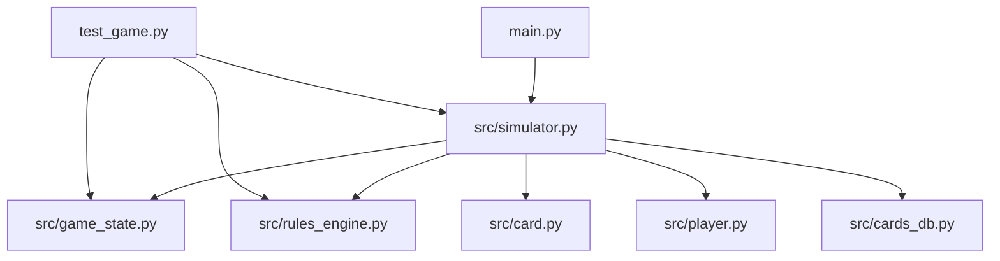
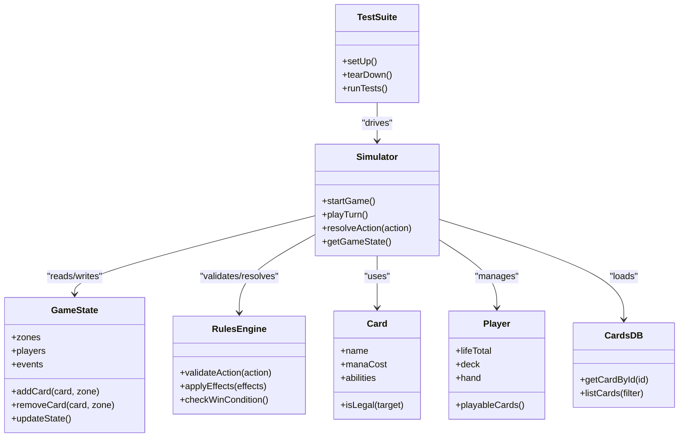
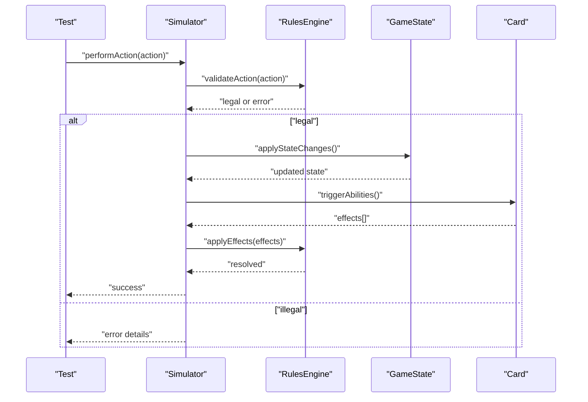
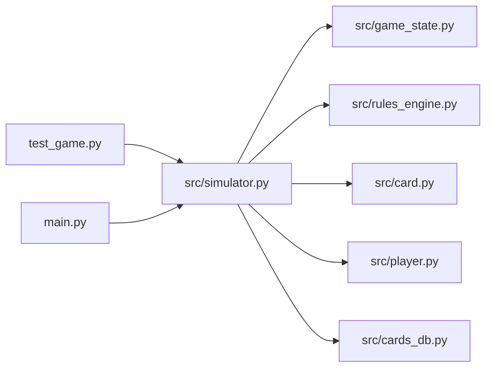

# Testing and Validation

<cite>
**Referenced Files in This Document**
- [test_game.py](file://simuladorMtg/test_game.py)
- [main.py](file://simuladorMtg/main.py)
- [src/simulator.py](file://simuladorMtg/src/simulator.py)
- [src/game_state.py](file://simuladorMtg/src/game_state.py)
- [src/rules_engine.py](file://simuladorMtg/src/rules_engine.py)
- [src/card.py](file://simuladorMtg/src/card.py)
- [src/player.py](file://simuladorMtg/src/player.py)
- [src/cards_db.py](file://simuladorMtg/src/cards_db.py)
</cite>

## Table of Contents
1. [Introduction](#introduction)
2. [Project Structure](#project-structure)
3. [Core Components](#core-components)
4. [Architecture Overview](#architecture-overview)
5. [Detailed Component Analysis](#detailed-component-analysis)
6. [Dependency Analysis](#dependency-analysis)
7. [Performance Considerations](#performance-considerations)
8. [Troubleshooting Guide](#troubleshooting-guide)
9. [Conclusion](#conclusion)
10. [Appendices](#appendices)

## Introduction
This document explains the testing framework and validation systems for the MTG simulator. It covers how to create test scenarios, assert game state correctness, and run automated tests across unit, integration, and end-to-end levels. It also provides guidance on mocking components, validating complex rule interactions, performance and stress testing, continuous integration setup, debugging failing tests, and managing test data.

## Project Structure
The repository contains a single Python test file at the project root and core simulation logic under src/. The main entry point is provided by main.py, while the simulation engine, game state, rules engine, card definitions, player model, and card database live under src/.

**Diagram sources**
- [test_game.py:1-200](file://simuladorMtg/test_game.py#L1-L200)
- [main.py:1-200](file://simuladorMtg/main.py#L1-L200)
- [src/simulator.py:1-200](file://simuladorMtg/src/simulator.py#L1-L200)
- [src/game_state.py:1-200](file://simuladorMtg/src/game_state.py#L1-L200)
- [src/rules_engine.py:1-200](file://simuladorMtg/src/rules_engine.py#L1-L200)
- [src/card.py:1-200](file://simuladorMtg/src/card.py#L1-L200)
- [src/player.py:1-200](file://simuladorMtg/src/player.py#L1-L200)
- [src/cards_db.py:1-200](file://simuladorMtg/src/cards_db.py#L1-L200)

**Section sources**
- [test_game.py:1-200](file://simuladorMtg/test_game.py#L1-L200)
- [main.py:1-200](file://simuladorMtg/main.py#L1-L200)
- [src/simulator.py:1-200](file://simuladorMtg/src/simulator.py#L1-L200)
- [src/game_state.py:1-200](file://simuladorMtg/src/game_state.py#L1-L200)
- [src/rules_engine.py:1-200](file://simuladorMtg/src/rules_engine.py#L1-L200)
- [src/card.py:1-200](file://simuladorMtg/src/card.py#L1-L200)
- [src/player.py:1-200](file://simuladorMtg/src/player.py#L1-L200)
- [src/cards_db.py:1-200](file://simuladorMtg/src/cards_db.py#L1-L200)

## Core Components
- Test runner and scenario authoring are centered around the test file, which exercises the simulator through structured test cases.
- The simulator orchestrates turns, phases, and actions, delegating to the game state and rules engine.
- Game state tracks zones, players, cards, and lifecycle events.
- Rules engine validates legality of actions and resolves effects.
- Card and player models define attributes and behaviors used during gameplay.
- Cards database provides canonical card definitions consumed by the simulator and tests.

Key responsibilities:
- Unit tests validate isolated behavior of cards, players, and rules.
- Integration tests verify interactions between simulator, game state, and rules engine.
- End-to-end tests simulate full matches or long sequences of turns to ensure consistency.

**Section sources**
- [test_game.py:1-200](file://simuladorMtg/test_game.py#L1-L200)
- [src/simulator.py:1-200](file://simuladorMtg/src/simulator.py#L1-L200)
- [src/game_state.py:1-200](file://simuladorMtg/src/game_state.py#L1-L200)
- [src/rules_engine.py:1-200](file://simuladorMtg/src/rules_engine.py#L1-L200)
- [src/card.py:1-200](file://simuladorMtg/src/card.py#L1-L200)
- [src/player.py:1-200](file://simuladorMtg/src/player.py#L1-L200)
- [src/cards_db.py:1-200](file://simuladorMtg/src/cards_db.py#L1-L200)

## Architecture Overview
The testing architecture layers isolate concerns and provide clear extension points:

**Diagram sources**
- [test_game.py:1-200](file://simuladorMtg/test_game.py#L1-L200)
- [src/simulator.py:1-200](file://simuladorMtg/src/simulator.py#L1-L200)
- [src/game_state.py:1-200](file://simuladorMtg/src/game_state.py#L1-L200)
- [src/rules_engine.py:1-200](file://simuladorMtg/src/rules_engine.py#L1-L200)
- [src/card.py:1-200](file://simuladorMtg/src/card.py#L1-L200)
- [src/player.py:1-200](file://simuladorMtg/src/player.py#L1-L200)
- [src/cards_db.py:1-200](file://simuladorMtg/src/cards_db.py#L1-L200)

## Detailed Component Analysis

### Test Scenario Creation Process
- Organize tests by feature (e.g., card abilities, phase transitions, win conditions).
- Use a consistent setup pattern to initialize the simulator with deterministic decks and starting states.
- Define explicit preconditions before each action to keep tests readable and maintainable.
- Prefer small, focused scenarios that exercise one rule interaction per test.

Recommended structure:
- Setup: construct simulator, load cards from database, set initial life totals and hands.
- Act: invoke specific actions (cast spells, activate abilities, declare attackers).
- Assert: check game state changes, event logs, and win/loss conditions.

**Section sources**
- [test_game.py:1-200](file://simuladorMtg/test_game.py#L1-L200)

### Assertion Methods for Game State Validation
- Validate zone contents: ensure cards moved correctly between deck, hand, battlefield, graveyard, exile.
- Validate player state: confirm life totals, resources, and available actions.
- Validate event logs: assert expected sequence of events for complex chains.
- Validate win/loss: check terminal conditions after critical actions.

Best practices:
- Use descriptive assertions tied to game concepts (e.g., “creature should be tapped”, “opponent life reduced by X”).
- Group related assertions into helper methods to reduce duplication.
- Snapshot relevant state slices for diff-friendly failures.

**Section sources**
- [test_game.py:1-200](file://simuladorMtg/test_game.py#L1-L200)
- [src/game_state.py:1-200](file://simuladorMtg/src/game_state.py#L1-L200)

### Automated Testing Procedures
- Run unit tests frequently to catch regressions early.
- Execute integration suites after changes to core modules (simulator, rules engine).
- Schedule end-to-end suites nightly to validate long-running scenarios.
- Parameterize tests to cover multiple card combinations and edge cases.

Execution tips:
- Isolate network and I/O; mock external dependencies if any.
- Seed randomness deterministically for reproducible results.
- Fail fast on assertion errors and collect detailed diagnostics.

**Section sources**
- [test_game.py:1-200](file://simuladorMtg/test_game.py#L1-L200)

### Unit Testing Strategies for Individual Components
- Card tests: verify legality checks, targeting constraints, and ability triggers.
- Player tests: validate resource management, hand limits, and discard logic.
- Rules engine tests: assert action legality and effect resolution order.
- Game state tests: ensure zone transitions and object lifecycles are correct.

Mocking approach:
- Replace heavy or non-deterministic parts with lightweight stubs.
- Keep mocks minimal and focused on the behavior under test.

**Section sources**
- [src/card.py:1-200](file://simuladorMtg/src/card.py#L1-L200)
- [src/player.py:1-200](file://simuladorMtg/src/player.py#L1-L200)
- [src/rules_engine.py:1-200](file://simuladorMtg/src/rules_engine.py#L1-L200)
- [src/game_state.py:1-200](file://simuladorMtg/src/game_state.py#L1-L200)

### Integration Testing for System Interactions
- Verify simulator orchestrates phases, turns, and actions correctly with real game state and rules engine.
- Validate cross-component contracts: e.g., simulator must respect rules engine legality checks.
- Exercise multi-step chains: combat, stack resolution, triggered abilities.

Validation checklist:
- Action legality enforced by rules engine.
- Game state updates reflect all side effects.
- Event ordering matches expected resolution order.

**Section sources**
- [src/simulator.py:1-200](file://simuladorMtg/src/simulator.py#L1-L200)
- [src/game_state.py:1-200](file://simuladorMtg/src/game_state.py#L1-L200)
- [src/rules_engine.py:1-200](file://simuladorMtg/src/rules_engine.py#L1-L200)

### End-to-End Testing for Complete Gameplay Scenarios
- Simulate full matches from start to finish using realistic decks.
- Validate final outcomes against known results or statistical expectations.
- Ensure no memory leaks or state corruption over long runs.

Scenario design:
- Construct balanced decks from cards database.
- Drive actions via scripted sequences or AI agents.
- Capture and analyze key metrics (turn length, mana curve, card advantage).

**Section sources**
- [src/simulator.py:1-200](file://simuladorMtg/src/simulator.py#L1-L200)
- [src/cards_db.py:1-200](file://simuladorMtg/src/cards_db.py#L1-L200)

### Writing Test Cases: Concrete Examples
- Single-card ability: cast a spell, verify target selection, resolve effects, assert state changes.
- Combat interaction: declare attackers/blockers, calculate damage, update life totals and card zones.
- Win condition: reduce opponent life to zero or force library draw, assert match ends.

Example patterns:
- Arrange: build minimal game state with required cards and zones.
- Act: perform targeted action(s).
- Assert: verify exact state deltas and event log entries.

**Section sources**
- [test_game.py:1-200](file://simuladorMtg/test_game.py#L1-L200)

### Mocking Game Components
- Mock cards database to return controlled sets of cards for repeatable tests.
- Stub random elements (dice rolls, shuffles) with deterministic values.
- Intercept expensive operations (I/O, networking) with in-memory substitutes.

Guidelines:
- Keep mocks close to interfaces used by production code.
- Avoid over-mocking; prefer thin wrappers when possible.

**Section sources**
- [src/cards_db.py:1-200](file://simuladorMtg/src/cards_db.py#L1-L200)
- [src/simulator.py:1-200](file://simuladorMtg/src/simulator.py#L1-L200)

### Validating Complex Rule Interactions
- Chain multiple triggers and responses to ensure correct priority and resolution order.
- Validate layered effects and replacement effects.
- Confirm that illegal actions are rejected with informative errors.

Flow of a typical chain:

**Diagram sources**
- [src/simulator.py:1-200](file://simuladorMtg/src/simulator.py#L1-L200)
- [src/rules_engine.py:1-200](file://simuladorMtg/src/rules_engine.py#L1-L200)
- [src/game_state.py:1-200](file://simuladorMtg/src/game_state.py#L1-L200)
- [src/card.py:1-200](file://simuladorMtg/src/card.py#L1-L200)

**Section sources**
- [src/simulator.py:1-200](file://simuladorMtg/src/simulator.py#L1-L200)
- [src/rules_engine.py:1-200](file://simuladorMtg/src/rules_engine.py#L1-L200)
- [src/game_state.py:1-200](file://simuladorMtg/src/game_state.py#L1-L200)
- [src/card.py:1-200](file://simuladorMtg/src/card.py#L1-L200)

## Dependency Analysis
The test suite depends on the simulator, which composes game state, rules engine, card definitions, player model, and cards database. Clear boundaries help isolate failures and enable targeted mocking.

**Diagram sources**
- [test_game.py:1-200](file://simuladorMtg/test_game.py#L1-L200)
- [src/simulator.py:1-200](file://simuladorMtg/src/simulator.py#L1-L200)
- [src/game_state.py:1-200](file://simuladorMtg/src/game_state.py#L1-L200)
- [src/rules_engine.py:1-200](file://simuladorMtg/src/rules_engine.py#L1-L200)
- [src/card.py:1-200](file://simuladorMtg/src/card.py#L1-L200)
- [src/player.py:1-200](file://simuladorMtg/src/player.py#L1-L200)
- [src/cards_db.py:1-200](file://simuladorMtg/src/cards_db.py#L1-L200)
- [main.py:1-200](file://simuladorMtg/main.py#L1-L200)

**Section sources**
- [test_game.py:1-200](file://simuladorMtg/test_game.py#L1-L200)
- [src/simulator.py:1-200](file://simuladorMtg/src/simulator.py#L1-L200)
- [src/game_state.py:1-200](file://simuladorMtg/src/game_state.py#L1-L200)
- [src/rules_engine.py:1-200](file://simuladorMtg/src/rules_engine.py#L1-L200)
- [src/card.py:1-200](file://simuladorMtg/src/card.py#L1-L200)
- [src/player.py:1-200](file://simuladorMtg/src/player.py#L1-L200)
- [src/cards_db.py:1-200](file://simuladorMtg/src/cards_db.py#L1-L200)
- [main.py:1-200](file://simuladorMtg/main.py#L1-L200)

## Performance Considerations
- Profile hot paths in rules engine and game state updates to identify bottlenecks.
- Use synthetic datasets to simulate large boards and many simultaneous triggers.
- Measure memory usage over long simulations to detect leaks.
- Cache immutable card metadata and avoid repeated lookups.

Stress testing approaches:
- Run thousands of short games to validate stability and convergence.
- Increase board complexity gradually to find scaling limits.
- Monitor CPU and memory profiles under load.

[No sources needed since this section provides general guidance]

## Troubleshooting Guide
Common issues and remedies:
- Flaky tests due to randomness: seed RNG deterministically and record seeds.
- Misordered events: print or log event queues and priorities for inspection.
- Incorrect state transitions: snapshot before/after snapshots and diff zones.
- Slow tests: isolate heavy computations and use smaller decks for unit tests.

Debugging techniques:
- Enable verbose logging for actions and effects.
- Add step-by-step execution hooks to pause and inspect state.
- Use focused assertions to narrow down failing components quickly.

**Section sources**
- [test_game.py:1-200](file://simuladorMtg/test_game.py#L1-L200)
- [src/simulator.py:1-200](file://simuladorMtg/src/simulator.py#L1-L200)
- [src/game_state.py:1-200](file://simuladorMtg/src/game_state.py#L1-L200)
- [src/rules_engine.py:1-200](file://simuladorMtg/src/rules_engine.py#L1-L200)

## Conclusion
A robust testing strategy for the MTG simulator combines well-structured unit, integration, and end-to-end tests with strong assertions and effective mocking. By isolating components, validating rule interactions rigorously, and adopting performance and stress testing practices, you can maintain correctness and reliability across complex gameplay scenarios. Continuous integration ensures that regressions are caught early and quality remains high.

[No sources needed since this section summarizes without analyzing specific files]

## Appendices

### Appendix A: Example Test Case Patterns
- Spell casting and resolution
- Combat math and damage assignment
- Triggered ability chains
- Win/loss condition verification

**Section sources**
- [test_game.py:1-200](file://simuladorMtg/test_game.py#L1-L200)

### Appendix B: Continuous Integration Setup
- Configure CI to run unit tests on every commit and integration/e2e suites on merges.
- Cache dependencies and card databases to speed up builds.
- Publish test reports and artifacts for review.

[No sources needed since this section provides general guidance]

### Appendix C: Test Data Management
- Maintain canonical card sets in the cards database for reproducibility.
- Version control test fixtures and decks separately from source code.
- Provide utilities to generate randomized but deterministic test scenarios.

**Section sources**
- [src/cards_db.py:1-200](file://simuladorMtg/src/cards_db.py#L1-L200)